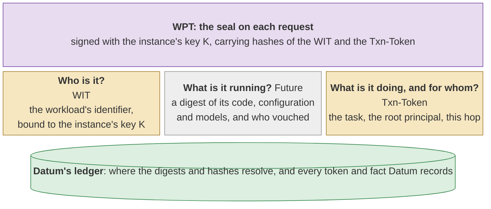
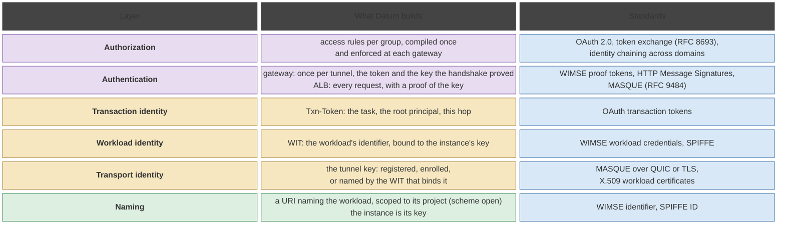

<!-- omit from toc -->
# Data-plane workload identity framework

A framework for Identity and AuthN/Z across the dataplane, and mapped to the framing in 
standards. **It is a framework, not a design:** each Datum service instantiates it in its 
own design, as Datum Connections does in [`Connections-IAM.md`](Connections-IAM.md). The framework establishes
common terminology for concepts to avoid conflicts across different service implementations.

<!-- omit from toc -->
## Contents

- [Three kinds of identity](#three-kinds-of-identity)
- [The identity record](#the-identity-record)
- [Mapping to the standards](#mapping-to-the-standards)
- [Additional implications beyond the existing standards](#additional-implications-beyond-the-existing-standards)
- [Related documents](#related-documents)

---

## Three kinds of identity

Datum knows a workload by up to three kinds of identity, each answering one question:
- **Transport identity, which endpoint?** The tunnel key, proven by the handshake.
- **Workload identity, who is it?** A token naming the workload, bound to that key. The instance is the key.
- **Transaction identity, what is it doing and for whom?** A token naming the task and its root principal.

## The identity record

The IETF WIMSE WG provides a [framework for AI agent identity](https://www.ietf.org/archive/id/draft-ietf-wimse-aims-00.html), which can be leveraged here: a 
Workload Identity Token (WIT), a transaction token (Txn-Token), and a Workload Proof Token (WPT) that 
binds both to each request with the instance's key. Each is issued by a different party, on its own schedule.

## Mapping to the standards

The IETF's AI identity management draft (AIMS, `draft-ietf-wimse-aims-00`) treats an agent as a workload
and layers existing standards. This Datum framework builds on this:

## Additional implications beyond the existing standards

AIMS does not cover attaching at the network layer, or a gateway that enforces access.

## Related documents

- [`Connections-IAM.md`](Connections-IAM.md): how Datum Connections instantiates the framework, in stages.
- `Workload-identity-attributes.md`: Examples of how the framework can be instantiated in different scenarios and mappings to existing standards and initiatives.
