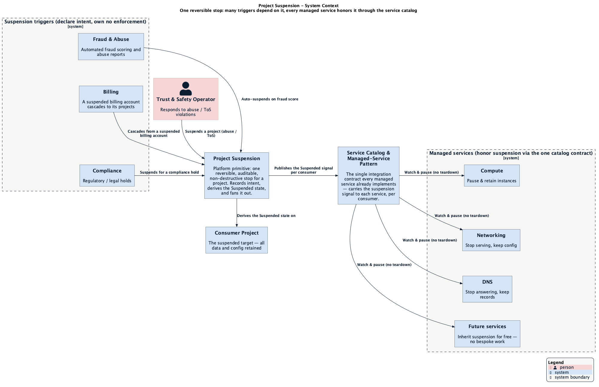
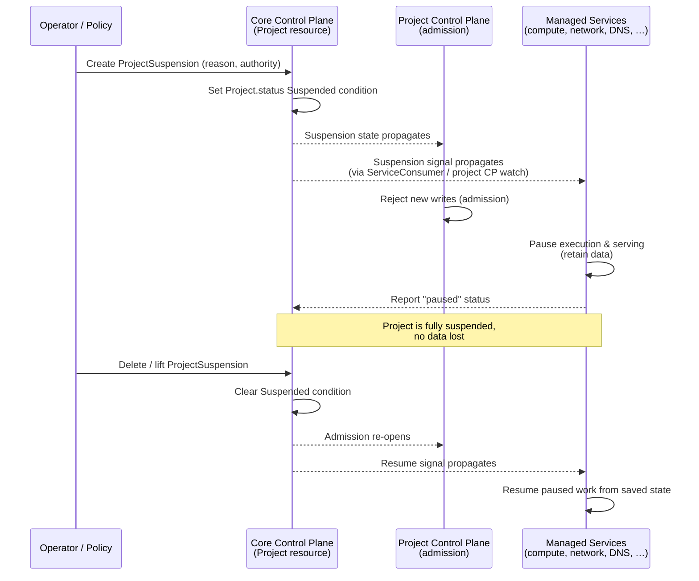
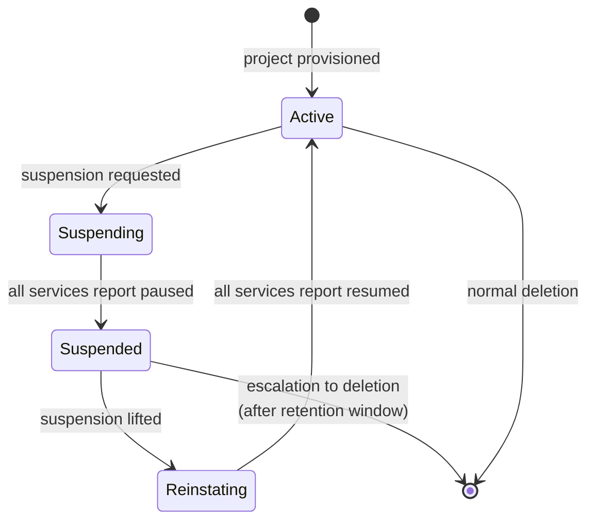
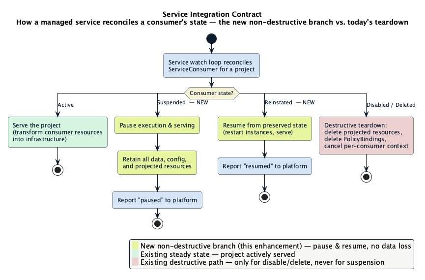
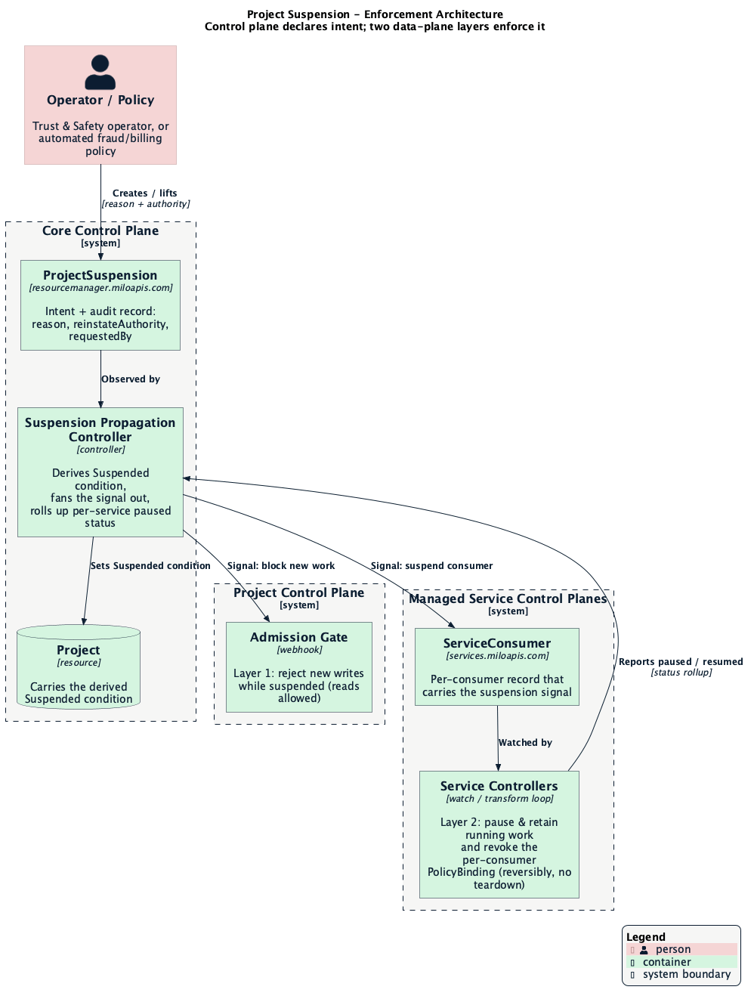

<!-- omit from toc -->
# Project Suspension & Lifecycle Controls

Tracking issue:
[datum-cloud/enhancements#800](https://github.com/datum-cloud/enhancements/issues/800)

- [Summary](#summary)
- [Motivation](#motivation)
  - [Goals](#goals)
  - [Non-Goals](#non-goals)
- [Proposal](#proposal)
  - [What suspension does](#what-suspension-does)
  - [How suspension works](#how-suspension-works)
  - [The lifecycle state machine](#the-lifecycle-state-machine)
  - [User Stories](#user-stories)
  - [The activity and control-plane event experience](#the-activity-and-control-plane-event-experience)
  - [Notes, Constraints, and Caveats](#notes-constraints-and-caveats)
  - [Risks and Mitigations](#risks-and-mitigations)
- [Service Integration Contract](#service-integration-contract)
  - [What the platform provides](#what-the-platform-provides)
  - [What a service must do](#what-a-service-must-do)
  - [The shared non-destructive pause primitive](#the-shared-non-destructive-pause-primitive)
  - [Integration reference: managed services and the catalog](#integration-reference-managed-services-and-the-catalog)
  - [Making suspension observable (activities and events)](#making-suspension-observable-activities-and-events)
- [Design Details](#design-details)
  - [Where the state lives](#where-the-state-lives)
  - [How the state propagates](#how-the-state-propagates)
  - [Enforcement layers](#enforcement-layers)
  - [Reinstatement and reversibility](#reinstatement-and-reversibility)
  - [Prior art: Google Cloud service infrastructure](#prior-art-google-cloud-service-infrastructure)
- [Production Readiness Review Questionnaire](#production-readiness-review-questionnaire)
- [Implementation History](#implementation-history)
- [Drawbacks](#drawbacks)
- [Alternatives](#alternatives)
- [Infrastructure Needed](#infrastructure-needed)

## Summary

Milo can disable a *user* and delete a *workload*, but it has no reversible way
to stop a **project**. Today the only lever available to a trust-and-safety
operator responding to abuse is to delete the offending workloads — a
destructive action that permanently loses the customer's state and cannot be
undone if the customer was wrongly flagged.

**Project suspension** is a reversible, non-destructive control that *pauses*
everything a project is running — instances, served traffic, and live access —
without deleting any data, and *resumes* it intact when the project is
reinstated. Suspension is a first-class state on the Project
resource. It is declared once in the control plane and honored everywhere: new
work is blocked at admission, running work is paused (not destroyed) by the
services that own it, and reinstatement restores the project to exactly where it
left off.

The core design principle, borrowed from how Milo already handles user
deactivation and billing-account suspension, is **"suspension is never
deletion."** A suspended project retains all of its resources and configuration;
only their *execution* is paused. This gives Datum a safe, proportionate abuse
response and gives wrongly-flagged customers a clean path back.

## Motivation

Trust, safety, and abuse prevention are launch blockers for Datum's compute
offering. When a project is used for abuse — cryptomining, malware or phishing
hosting, leaked-credential exploitation — Datum needs to stop the activity *now*,
while
preserving the ability to fully reverse the action if the signal was wrong.

The problem is that Milo has reversible-stop primitives at every layer *except*
the project:

| Layer | Reversible stop today? | Primitive |
| --- | --- | --- |
| User | Yes | `UserDeactivation` (iam), `PlatformAccess` `Suspended` state |
| Billing account | Yes | Account `Suspended` state, preserves project bindings |
| Workload / instance | No (delete only) | none — deletion is destructive |
| **Project** | **No** | **none — this enhancement** |

Deleting workloads to stop abuse has three unacceptable properties: it is
**destructive** (the customer's data and configuration are gone), it is
**irreversible** (a wrongly-flagged customer cannot be made whole), and it is
**incomplete** (it addresses running compute but says nothing about the project's
networking, DNS, or other enabled services). A reversible project-level
control fixes all three.

### Goals

- Add a **reversible, non-destructive suspension state** to the Project resource,
  with a clear `Active ⇄ Suspended` lifecycle and a full audit trail.
- **Block all new work** in a suspended project (no new resources, no
  configuration changes) via admission.
- **Pause all running work** — compute instances and served traffic — through a
  service-integration contract, without deleting data.
- Define a **single integration contract** that every managed service uses to
  honor suspension, so behavior is uniform across compute, networking, DNS, and
  future services.
- Support distinct **suspension reasons** (abuse, billing, compliance,
  administrative) with the correct **reinstatement authority** for each.
- Provide **operator controls and a runbook** for suspend and reinstate, with an
  appeal path for wrongly-flagged customers.

### Non-Goals

- **Detecting** abuse. Suspension is the *enforcement* primitive; the
  signals that trigger it (fraud scoring, abuse reports, billing
  delinquency) are owned by
  [fraud-and-abuse](../fraud-and-abuse/README.md),
  [billing](../billing/README.md), and future detection work
  ([#505](https://github.com/datum-cloud/enhancements/issues/505),
  [#536](https://github.com/datum-cloud/enhancements/issues/536)).
- Defining the **per-resource-type pause mechanics** for compute (how a specific
  instance snapshots and suspends its memory/disk state). That is the separate
  compute *instance snapshot & suspend/resume* work; project suspension *depends
  on* that primitive and defines the project-level orchestration around it. See
  [The shared non-destructive pause primitive](#the-shared-non-destructive-pause-primitive).
- Suspending individual **users** or **billing accounts** — those primitives
  already exist and are complementary.
- **Provider-initiated, service-scoped suspension** — a provider pausing one
  consumer's access to just its own service, without touching the whole project.
  That capability reuses the same engagement-library pause hooks this enhancement
  defines, but it is a service-catalog concern (its intent and API live entirely
  in `services.miloapis.com` and never touch the `Project`), so it is left to a
  future service-catalog enhancement. This document covers *project*-scoped
  suspension only.
- **Throttling** or **soft-limiting** a project (a degraded-but-running state).
  Suspension is a hard, binary pause. Graduated responses are a possible future
  extension, noted in [Alternatives](#alternatives).

## Proposal

Project suspension is deliberately a **platform primitive**, not a feature of any
one service. Several independent policies need to stop a project *now* and
reversibly — a trust-and-safety operator acting on an abuse report, the
fraud-and-abuse system crossing a score threshold, billing cascading from a
suspended account, a compliance hold — and none of them should build or own that
stop themselves. They declare intent against one primitive; it derives a single
`Suspended` state and fans that signal out to every managed service through the
one integration contract the service catalog already defines. A new service
inherits suspension by implementing that contract — no bespoke per-service
teardown, and no N×M web of per-trigger, per-service integrations.



### What suspension does

Project suspension is a switch an operator (or an automated policy) can flip on a
project. When flipped **on**:

1. **The project freezes.** No one can create new resources or change existing
   configuration in the project. The project's control plane accepts reads but
   rejects writes.
2. **Everything running stops — but nothing is deleted.** Compute instances are
   paused and published endpoints stop serving. Disks, configuration, IP allocations,
   DNS records, and enabled-service state all remain in place.
3. **The customer is told why, and how to appeal.** Suspension records a reason
   and notifies the project's owners, with a path to request review.

When flipped **off** (reinstatement):

1. **The project unfreezes** and accepts writes again.
2. **Everything resumes** from where it left off — instances start from their
   preserved state and endpoints serve again.
3. **The full history** of who suspended and reinstated the project, when, and
   why, is retained for audit and appeal.

The essential invariant is **reversibility**: at no point during suspension is
customer state destroyed, so reinstatement always returns the project to a
working condition.

### How suspension works

Suspension follows the pattern Google Cloud pioneered and that Milo already uses
internally: **the control plane declares intent; the data plane enforces it.**



The operator or an automated policy records the **intent** to suspend on the
Project. A controller derives a `Suspended` state on the Project and propagates
it outward. Two independent enforcement layers then act on that single signal
(detailed in [Enforcement layers](#enforcement-layers)):

- **Admission** blocks new writes in the project's control plane.
- **Managed services** pause the running work they own for the project — stopping
  execution and serving while retaining all data.

No single component has to know about all of the others. Each observes the
project's suspension state and does its part — the same loosely-coupled,
watch-and-reconcile model Milo uses everywhere else.

### The lifecycle state machine



`Suspending` and `Reinstating` are transitional: the project is not fully paused
(or fully resumed) until every integrating service has confirmed it has done its
part. This mirrors how the Project `Ready` condition already gates on downstream
readiness today. A suspended project that is never reinstated eventually
escalates to deletion after a defined retention window (see
[Reinstatement and reversibility](#reinstatement-and-reversibility)); that is the
*only* path from suspension to data loss, and it is deliberate, time-boxed, and
auditable.

### User Stories

**Story 1 — Trust & safety operator stops active abuse.**
As a trust-and-safety operator, I receive a confirmed abuse report that a project
is hosting a phishing site. I suspend the project. Within seconds its served
endpoints stop responding and its compute instances are paused, halting the
abuse. No customer data is deleted. *Experience:* one action stops the harm and
is fully reversible if the report turns out to be mistaken.

**Story 2 — Automated policy suspends on a high fraud score.**
As the fraud-and-abuse system, when a project crosses an enforcement threshold in
`AUTO` mode, I create a project suspension automatically — the project-level
analog of the `UserDeactivation` I already create for users. *Experience:*
enforcement is automatic, proportionate, and consistent with how user-level
enforcement already works.

**Story 3 — Wrongly-flagged customer is reinstated intact.**
As a customer whose project was suspended in error, I appeal. After review, an
operator reinstates the project. My instances resume from where they were paused,
my endpoints serve again, and I have lost nothing. *Experience:* a false positive
costs me downtime, not my data.

**Story 4 — Billing-driven suspension with customer-owned recovery.**
As the billing system, when an account is severely delinquent I suspend its
projects with reason `Billing`. *Experience:* unlike an abuse suspension (which
only an operator can lift after review), the customer can lift a billing
suspension themselves by resolving the payment issue.

**Story 5 — Service implementer honors suspension uniformly.**
As the owner of a managed service (e.g. the DNS service), I integrate once
against the platform's suspension contract. When a consumer project is suspended,
my controller pauses what I serve for that project and retains its configuration;
when it is reinstated, I resume. *Experience:* I write suspension handling once
and it works for every project, using the same watch loop I already run.

**Story 6 — Consumer sees, in plain English, what happened and what to do.**
As a project member, when my project is suspended I see an activity in my
project's timeline — "Project acme-prod was suspended — reason: abuse. Learn how
to appeal." — and, as each service confirms it has paused, follow-on activities
("Compute paused 12 instances", "DNS stopped serving acme-prod") that reassure me
nothing was deleted. On reinstatement I see "Project acme-prod was reinstated"
and the per-service "resumed" entries as my work comes back. *Experience:* I am
never left guessing what state my project is in or why.

**Story 7 — Service provider observes and audits its own conformance.**
As the owner of a managed service, I can watch the control-plane event and
activity streams to confirm that every suspended consumer of my service actually
got paused, spot any `PauseFailed`, and see resume progress on reinstatement.
*Experience:* I can prove my service honored suspension without building bespoke
telemetry.

### The activity and control-plane event experience

Suspension and reinstatement are significant, customer-affecting transitions, so
both **consumers** and **service providers** must be able to see them clearly and
in real time. Milo already has the primitives for this, and suspension uses them
rather than inventing a new notification path. Three
complementary layers of record exist, and suspension uses all three:

| Layer | What it is | Primary audience | Nature |
| --- | --- | --- | --- |
| **Activity feed** (`activity.miloapis.com`) | Plain-English, per-project timeline derived from audit + Kubernetes Events via `ActivityPolicy` rules | Consumers and providers (portal, `kubectl activity`, MCP) | Human-readable, project-scoped via `tenant`, best-effort, ~30–60 day retention |
| **Control-plane Events** (Kubernetes Events, queried via `EventQuery`) | Machine-readable `reason`s emitted by controllers as they act (`Suspended`, `Reinstated`, per-service `ProjectPaused`/`ProjectResumed`/`PauseFailed`) | Providers, automation | Short-lived, exact, drives the activity feed |
| **Audit log** (`AuditLogQuery`) | Authoritative record of the API writes that drove suspension (who created/lifted the `ProjectSuspension`) | Compliance, security, appeals | System of record, unlimited/tiered retention |

The **authoritative** signals remain the `ProjectSuspension` resource, the
`Project` `Suspended` condition, and per-service status — the activity feed is a
derived, best-effort *narrative* layered on top, not the source of truth. That
distinction matters for appeals and enforcement, where the resource and audit log
govern.

**Consumer perspective.** A consumer experiences suspension as a legible sequence
of events scoped to their project:

- The suspension itself appears as an activity carrying the reason *category* and
  how to appeal — enough to know what happened and what to do, without exposing
  internal detail. Suspension is triggered by an operator or policy *writing* a
  `ProjectSuspension`, so the audit route still captures the full internal record —
  the acting identity and any case notes — but that record serves operators,
  compliance, and appeals review; it is not published verbatim to the consumer's
  timeline.
- As each managed service confirms it has paused the project's work, system-sourced
  activities and control-plane Events appear, giving the consumer a live picture
  of what the pause actually did — and confirmation that resources were retained,
  not deleted.
- Reinstatement produces the mirror sequence: a "reinstated" activity followed by
  per-service "resumed" entries as work comes back online.
- Consumers reach all of this through the tools they already use: the live
  **watch feed** for real time, historical **`ActivityQuery`** (filter by
  resource, actor, `changeSource`, or time range; full-text search), and the raw
  control-plane Events and authoritative audit trail when a machine-readable or
  compliance-grade view is needed (e.g. supporting an appeal).

**Service provider perspective.** A provider integrating a managed service needs
both to *know* which consumer projects are suspended and to make its own
pause/resume actions *observable*:

- The suspension signal arrives on the `ServiceConsumer` record the provider
  already reconciles (see [Service Integration Contract](#service-integration-contract)) —
  no new watch is required to learn a consumer is suspended.
- As the provider's controllers pause and resume, they emit Kubernetes Events on
  those records with standardized `reason`s. These become queryable control-plane
  Events immediately and, via an `ActivityPolicy`, plain-English activities — so
  the provider's part of the story is visible to the consumer and auditable by the
  provider without bespoke telemetry.
- **Attribution note:** controller-emitted Events render as *system*-sourced with
  a controller actor, which is correct for automated pause/resume mechanics. Human
  attribution for the suspension *decision* flows through the audit route on the
  `ProjectSuspension` write, not through the per-service Events.

### Notes, Constraints, and Caveats

- **Suspension is orthogonal to service enablement.** A suspended project keeps
  its enabled services (its
  `ServiceEntitlement`s); those services simply
  stop *serving*. This is intentionally different from *disabling* a service,
  which today tears the service's resources down. Suspension must **not** reuse
  the destructive disable/teardown path.
- **Suspension is project-scoped and coarse by design.** It pauses the entire
  project and is triggered by an operator or platform policy. Pausing one
  consumer's access to a single service (a provider-initiated, service-scoped
  suspension) reuses the same pause hooks but is out of scope here — see
  [Non-Goals](#non-goals). Pausing an individual *resource* is a service-level
  concern, not a suspension concern.
- **Show the consumer the reason, not the internals.** The consumer-facing signal
  is the suspension `reason` *category* (`Abuse`, `Billing`, `Compliance`,
  `Administrative`) plus how to resolve or appeal it. The internal fields on a
  `ProjectSuspension` — the acting operator's identity (`requestedBy`), free-text
  operator notes (`description`), and the underlying detection signals (fraud
  scores, abuse-report IDs) — are for operators, compliance, and appeals review.
  They stay on the resource and in the audit log, not on the consumer's activity
  feed. Suspension is agnostic to those signals (see [Non-Goals](#non-goals)), and
  its consumer-facing surface stays deliberately minimal.
- **Billing-account suspension cascades to its projects.** A billing account
  already has its own `Suspended` state, and a billing-account binding records
  which account is responsible for each project. When an account is suspended for
  delinquency, the billing system fans out over its active bindings and creates
  one suspension (`reason: Billing`, `reinstateAuthority: Consumer`) per bound
  project — the same trigger-then-enforce split used for abuse. Project
  suspension is what gives billing-account suspension real teeth: today a
  suspended account
  keeps its bindings but has no way to actually pause the projects' workloads.
  Billing owns the account-to-project mapping and does the fan-out; suspension
  does not watch billing accounts itself, so the two stay cleanly separated.
- **The pause must be genuinely non-destructive.** Any service that cannot pause
  without data loss (e.g. because it lacks a snapshot/suspend capability yet)
  must degrade to the least-destructive option available and clearly report that
  it could not fully honor the non-destructive contract, rather than silently
  deleting.
- **Reinstatement is not guaranteed to be instantaneous.** Resuming paused
  compute may take time (restoring from snapshots, rescheduling). The contract
  guarantees *eventual, lossless* resume, not zero-latency resume.

### Risks and Mitigations

| Risk | Impact | Mitigation |
| --- | --- | --- |
| A service honors suspension by **deleting** instead of pausing | Customer data lost; reversibility broken | The integration contract mandates non-destructive pause; conformance is tested (suspend → reinstate → verify state preserved); services that cannot pause must report non-conformance, not delete. |
| Suspension signal **fails to propagate** to a service | Abuse continues on that service | Each service reports a per-service paused status back to the Project; the project is not marked fully `Suspended` until all report paused; unreported services raise an operator alert. |
| **Wrongful suspension** of a legitimate project | Customer outage | Reversibility invariant + appeal path + full audit trail; billing suspensions are customer-remediable; abuse suspensions require explicit operator reinstatement (no premature auto-reinstate, matching the fraud-and-abuse asymmetric-reinstatement principle). |
| Suspension **overloads** the existing `Ready` condition | Coarse, ambiguous behavior; accidental teardown | Suspension is a **distinct, explicit** signal, not a `Ready=False` flip, so it does not collide with provisioning/readiness semantics or the multicluster disengage-and-teardown path. |
| Reinstatement **partially fails** (some services resume, some don't) | Project in an inconsistent state | `Reinstating` is transitional and gates on all-services-resumed; partial resume is surfaced to operators and is retried, not treated as complete. |
| Indefinite suspension **hoards resources** | Cost, capacity | Time-boxed retention window with escalation to deletion, clearly communicated and auditable. |

## Service Integration Contract

This is the heart of the enhancement. Suspension only works if every managed
service honors it consistently. This section describes what a service must do;
the API specifics are sketched in [Design Details](#design-details).

### What the platform provides

1. **A single, observable suspension signal.** The platform exposes the
   project's suspension state where each service already watches. For services
   built on the managed-service pattern,
   this is a suspension indicator on the per-consumer record the service already
   reconciles (the catalog's
   `ServiceConsumer`) and/or a condition on the
   project's control plane. A service does not need any new watch — the signal
   arrives on a resource it already reconciles.
2. **Transitional states** (`Suspending` / `Reinstating`) so services have a
   well-defined window to act and the platform can wait for confirmation.
3. **A status channel** for services to report that they have paused (or
   resumed) the project's work, so the platform can compute an accurate,
   aggregate project state.
4. **A shared pause library hook.** The consumer-engagement library that managed
   services already use (`pkg/multicluster-runtime/consumer` in the
   service-catalog) gains **Suspend/Resume hooks** alongside its existing
   Teardown hook — so honoring suspension is a small, well-defined addition to
   an integration services already have.
5. **A first-party activity story for the state change.** The platform ships the
   `ActivityPolicy` that turns `ProjectSuspension` writes and the `Project`
   `Suspended`/`Reinstated` transitions into plain-English activities, so
   suspend/reinstate read cleanly for every project with no per-service work. The
   platform also defines the standardized event `reason`s services use (see
   below), so activities and automation can match them reliably.

### What a service must do

When a consumer project transitions to **suspended**, the service must:

- **Stop serving and stop executing** the project's work — pause instances and
  stop answering on published endpoints.
- **Retain everything.** Keep all data, disks, configuration, allocations, and
  projected resources. Do **not** invoke the destructive teardown path used for
  service *disable*.
- **Report paused.** Signal back that it has paused the project's work, and emit a
  control-plane Event (`reason: ProjectPaused`, or `PauseFailed` if it could not
  fully honor the non-destructive contract) so the transition is observable.

When the project is **reinstated**, the service must:

- **Resume from the preserved state** — restart paused instances and resume
  serving.
- **Report resumed** and emit a control-plane Event (`reason: ProjectResumed`).

This is deliberately the *inverse* of today's behavior. Currently, when a
consumer's entitlement becomes non-`Active`, the catalog's projection and
engagement logic **tear the service's resources down** (delete projected
bindings, cancel the per-consumer context, delete labeled resources). Suspension
introduces a **non-destructive branch**: a suspended consumer keeps its projected
resources but stops them from doing work.



### The shared non-destructive pause primitive

Project suspension does not, by itself, define how a compute instance preserves
its in-memory and disk state while paused. That mechanism — snapshot, suspend,
resume — is a **shared pause primitive** built once for compute and relied on by
project suspension.

The division of responsibility is:

- **The compute pause primitive** answers: *how does one instance suspend and
  later resume without losing state?*
- **Project suspension** answers: *how is that primitive triggered for every
  instance in a project at once, in a reversible, auditable, cross-service way,
  and how do non-compute services participate?*

Project suspension therefore **depends on** the instance pause primitive for the
compute portion and should be sequenced with it. For services that
have no long-running execution to snapshot (e.g. DNS, published endpoints), the
"pause" is simply ceasing to serve while retaining configuration, which needs no
new primitive.

### Integration reference: managed services and the catalog

The managed-service pattern already
establishes that every managed service:

- exposes a **consumer-facing resource** in the project control plane and real
  **infrastructure resources** in its own service control plane;
- runs **cross-control-plane controllers** that *watch* consumer resources,
  *transform* them into infrastructure, and *write status back*;
- grants **per-consumer isolation** through per-consumer `PolicyBinding`s, where
  "disable service = delete PolicyBinding = immediate access loss."

Suspension slots directly into this model:

- The **watch loop** that already reconciles per-consumer resources is where the
  service observes the suspension signal.
- The catalog's per-consumer engagement library gains the Suspend/Resume hooks
  so the transform/status loop has a defined, non-destructive path for a
  suspended consumer — pause execution and serving, retain everything — distinct
  from the existing destructive teardown (which deletes the consumer's projected
  resources and `PolicyBinding`s).

### Making suspension observable (activities and events)

Honoring suspension includes making it *visible*, and the mechanism is the same
one every Milo feature uses for its timeline (see
[The activity and control-plane event experience](#the-activity-and-control-plane-event-experience)).
Milo's activity service does not accept emitted activities directly — it derives
plain-English activities from two inputs (the kube-apiserver audit stream and
Kubernetes Events) by matching them against `ActivityPolicy` rules. Suspension
uses both inputs, split cleanly by responsibility:

- **The platform owns the project-level story.** It ships a first-party
  `ActivityPolicy` for `ProjectSuspension` (audit route — captures the human
  operator or the policy that acted, and the reason) and for the `Project`
  `Suspended`/`Reinstated` transitions. Every project gets legible suspend and
  reinstate activities for free.
- **Each service owns its own pause/resume story.** As a service pauses or
  resumes a consumer, its controller emits Kubernetes Events on the record it
  reconciles, using the standardized `reason`s (`ProjectPaused`,
  `ProjectResumed`, `PauseFailed`). Those Events are immediately queryable as
  control-plane Events (`EventQuery`), and the service contributes an
  `ActivityPolicy` (or event rules) so they also render as plain-English
  activities — the same way the service would surface activities for any of its
  other resources.

This split keeps ownership clean: the platform guarantees a legible
suspend/reinstate story for every project with no per-service work, and each
service adds the per-service pause/resume detail on top. Attribution (why the
per-service entries are system-sourced while the suspension decision is
human-attributed) and the authoritative-vs-derived distinction are covered in
[The activity and control-plane event experience](#the-activity-and-control-plane-event-experience).

## Design Details

> [!NOTE]
> This section sketches the API and mechanics at the altitude needed to validate
> the proposal. Concrete field-level API definitions will be refined in
> follow-up PRs as this enhancement moves toward `implementable`.

### Where the state lives

Suspension state could live on the `Project` itself or reuse Milo's existing
`PlatformAccess` `Suspended` state. `PlatformAccess` already has a reversible
`Suspended` state, but it is
**user-scoped** (at most one per user) and its enforcement is **external** (the
auth provider revokes sessions). It is the right *pattern* but the wrong *scope*
and *enforcement point* for projects. Project suspension therefore lives on the
**Project**, in the `resourcemanager.miloapis.com` group.

Following the house pattern used by `UserDeactivation` (a distinct
enforcement-action resource whose presence derives a state on the `User`), and
the derived-resource pattern used by
[compliance](../compliance/README.md), suspension is modeled as:

- A **`ProjectSuspension`** resource (the intent/record) capturing:
  - `projectRef` — the suspended project;
  - `reason` — `Abuse` | `Billing` | `Compliance` | `Administrative` (the one field
    surfaced to the consumer, as a category);
  - `reinstateAuthority` — who may lift it (`Operator` for abuse/compliance,
    `Consumer` for billing);
  - `requestedBy`, `description`, timestamps — **operator-facing**: the acting
    identity and free-text notes may reference internal case IDs or detection
    signals, so they stay on the resource and in the audit log rather than on the
    consumer's activity feed.
- A derived **`Suspended` condition** (and transitional reasons `Suspending` /
  `Reinstating`) on `Project.status`, set by a controller that observes
  `ProjectSuspension` resources. This is the signal everything else keys off.

Presence of an active `ProjectSuspension` suspends the project; lifting or
deleting it (per `reinstateAuthority`) reinstates it. A project can carry **more
than one** `ProjectSuspension` at once — for example a `Billing` suspension and an
`Abuse` suspension applied by different authorities. The project stays suspended
while *any* is active and is reinstated only when *all* are lifted, each by its
own `reinstateAuthority`; resolving the billing hold does not lift the abuse
suspension. The records and their history are retained for audit and appeal even
after reinstatement — matching the "deactivation is never deletion" and
full-audit-trail principles from fraud-and-abuse.

```yaml
apiVersion: resourcemanager.miloapis.com/v1alpha1
kind: ProjectSuspension
metadata:
  name: abuse-2026-07-13-phishing
spec:
  projectRef:
    name: acme-prod
  reason: Abuse
  reinstateAuthority: Operator
  # operator-facing — surfaced to operators, compliance, and appeals review,
  # not published to the consumer's activity timeline.
  requestedBy: trust-and-safety@datum.net
  description: "Confirmed phishing site; abuse report #12345"
status:
  phase: Active            # Active | Lifted
  conditions:
    - type: Ready
      status: "True"
      reason: Suspended
```

### How the state propagates

Milo's control planes are layered: a **core** control plane (Project,
Organization, IAM), **per-project** control planes (consumer-facing resources),
and **per-service** control planes (a managed service's infrastructure).

The `Suspended` condition is set on the Project in the core control plane. It
must reach two places:

1. **The project's own control plane**, so admission can reject writes there.
2. **Each managed service**, via the per-consumer record it already reconciles.
   In the catalog model, this is the `ServiceConsumer` in the provider's control
   plane; the platform propagates a suspension indicator onto it so the service's
   existing watch loop observes it without new plumbing.

For a project-wide suspension the platform's propagation controller stamps the
suspension indicator on every `ServiceConsumer` in the project, and each service's
existing watch loop reacts. Because the signal simply lands on the
`ServiceConsumer`, the same landing point could later carry a provider-written,
service-scoped suspension — the out-of-scope capability noted in
[Non-Goals](#non-goals) — without changing how services react.

The propagation controller and the aggregate rollup (waiting for every service to
report paused before marking the project fully `Suspended`) are new components.
Importantly, suspension is a **distinct signal from
`Ready`** — it must not be implemented by flipping the project's `Ready`
condition to `False`, because that path already means "not provisioned" and
triggers the multicluster provider to *disengage and tear down* controllers for
the project, which is both coarse and semantically wrong for a reversible pause.

### Enforcement layers

Suspension is enforced at two independent layers, each observing the same
state:



1. **Admission (block new work).** The project control plane rejects create and
   update operations while the project is suspended (reads still allowed). This
   is the Milo-native analog of Google's per-request admission check: the control
   plane declares intent, and a gate refuses to persist new work that violates
   it. Deny responses carry a typed reason so clients can surface "this project
   is suspended."
2. **Managed services (pause running work).** Each service pauses execution and
   serving for the project per the
   [Service Integration Contract](#service-integration-contract), retaining data.
   A paused project runs no code and serves no traffic, so it can no longer act.
   (Permanently deleting a service's per-consumer `PolicyBinding`s is the
   *destructive disable* path, which suspension deliberately does not use.)

### Reinstatement and reversibility

- **Reversibility is the core invariant.** Suspension only ever flips control
  state and pauses execution; it never deletes customer data. Every enforcement
  layer must have a symmetric resume.
- **Reinstatement authority depends on reason.** Abuse and compliance suspensions
  are **operator-gated** — a human must review and lift them, and an improving
  signal never auto-reinstates (matching fraud-and-abuse's asymmetric
  reinstatement, which avoids prematurely un-suspending a bad actor). Billing
  suspensions are **customer-remediable** — resolving the payment issue lifts
  them.
- **Escalation to deletion is the only destructive path.** A project left
  suspended beyond a defined retention window escalates to normal (reversible,
  time-boxed) deletion. This bounds resource hoarding while keeping the
  suspension itself non-destructive. The window and its notifications must be
  explicit and auditable.

### Prior art: Google Cloud service infrastructure

Google Cloud solves this exact problem, and its model directly informs this
design. The mapping:

| Google Cloud | Mechanism | Project suspension |
| --- | --- | --- |
| Resource Manager project lifecycle | Declarative project state; suspension enforced *on top of* state | First-class `Suspended` condition on the Project (cleaner than GCP's implicit approach) |
| Project suspension (abuse/ToS) | Workloads shut down, access revoked, resources **retained**; reversible via appeal | Non-destructive pause + operator-gated reinstatement + appeal path |
| **Service Control `Check`** | Every request checks consumer/billing/abuse/enablement status before executing | Admission gate blocks writes in a suspended project; services consult suspension state before serving |
| Control-plane intent vs data-plane enforcement | State stored centrally; enforced per-request + by async reconcilers | Project declares `Suspended`; admission and services enforce independently |
| Suspension reasons (abuse vs billing) | Different triggers, different reinstate owners | `reason` + `reinstateAuthority` fields |
| Compute suspend/stop/delete ladder | Graded reversibility; suspend retains RAM + disk | Depend on the compute instance pause primitive for lossless compute pause |
| Deletion recovery window | 30-day `DELETE_REQUESTED` + undelete | Time-boxed retention before suspension escalates to deletion |

The central lesson Datum adopts: **the control plane declares intent (the project
is suspended) and the data plane enforces it (services refuse to serve, admission
refuses to write).** This keeps the state flip non-destructive and therefore
reversible.

## Production Readiness Review Questionnaire

> [!NOTE]
> To be completed as this enhancement moves toward `implementable`. Initial
> notes below.

**Feature Enablement and Rollback.** Suspension is introduced behind a feature
gate. With the gate off, the `ProjectSuspension` API and enforcement are inert
and no project can be suspended — a pure superset of today's behavior. Rollback
is safe: disabling the gate stops new suspensions; already-suspended projects
should be reinstated before disablement.

**Monitoring Requirements.** Operators determine suspension is in use via a
metric counting active `ProjectSuspension` resources by reason. A suspended
project is observable via the `Suspended` condition on `Project.status` and via
per-service paused-status reports. Consumers and providers observe the transition
through the [activity feed and control-plane Events](#the-activity-and-control-plane-event-experience)
(standardized `reason`s: `Suspended`, `Reinstated`, `ProjectPaused`,
`ProjectResumed`, `PauseFailed`), with the audit log as the authoritative record.
Key SLIs: time-to-fully-suspended (all services report paused),
time-to-fully-reinstated, count of services failing to report paused/resumed, and
count of `PauseFailed` events.

**Dependencies.** Depends on the compute **instance snapshot/suspend/resume**
primitive for lossless compute pause; on the
service-catalog consumer-engagement library for
the Suspend/Resume hooks; and on the
managed-service pattern watch/transform
loops in each integrating service. The **activity service**
(`activity.miloapis.com`) is a soft dependency for the human-readable timeline:
suspend/reinstate and per-service pause/resume are surfaced through its
`ActivityPolicy` mechanism, but because the activity feed is a derived,
best-effort layer, its unavailability degrades visibility only — it never affects
enforcement, which is governed by the `ProjectSuspension` resource, the `Project`
condition, and the audit log.

**Scalability.** Introduces one new API type (`ProjectSuspension`, expected to be
low-cardinality) and a derived condition on Project. Propagation adds watches on
the per-consumer records services already reconcile; suspension events are rare
relative to normal reconciliation traffic.

**Troubleshooting.** If a service fails to pause, the project remains in
`Suspending` and the un-paused service is surfaced for operator action. If the
API server is unavailable, existing suspensions remain enforced (the state is
already persisted and observed); new suspensions cannot be created until it
recovers.

## Implementation History

- 2026-07-13: Initial draft (`provisional`) created from issue
  [#800](https://github.com/datum-cloud/enhancements/issues/800), incorporating a
  survey of Milo's Project/PlatformAccess/UserDeactivation primitives, the
  service-catalog enablement and engagement model, the managed-service pattern,
  and Google Cloud's service-infrastructure/resource-manager suspension model.
- 2026-07-13: Added the consumer/provider activity and control-plane event
  experience, based on a survey of the activity service (`activity.miloapis.com`),
  its `ActivityPolicy`-driven audit/event pipeline, and its per-project timeline.
- 2026-07-14: Scoped provider-initiated, service-scoped suspension *out* of this
  document. It reuses the same engagement-library pause hooks, but its intent and
  API live entirely in `services.miloapis.com` and never touch the `Project`, so
  it belongs to a future service-catalog enhancement; this document now covers
  project-scoped suspension only.
- 2026-07-14: Clarified the billing-account relationship — a suspended billing
  account fans out to a per-project suspension over its bindings, and a project
  may carry multiple concurrent suspensions that each lift by their own
  authority.

## Drawbacks

- It adds a new, powerful, customer-affecting control surface that must be
  operated carefully; a wrongful or buggy suspension causes a customer outage.
  This is mitigated by strict reversibility, an appeal path, and audit, but the
  blast radius is real.
- It requires **every** managed service to implement a non-destructive pause
  path. A service that integrates incompletely creates an enforcement gap
  (abuse continues there) or a reversibility gap (it deletes instead of pauses).
  This is the main implementation cost and the main correctness risk.
- The compute portion is blocked on the compute instance pause primitive, so
  full project suspension cannot land before that primitive exists.

## Alternatives

- **Keep using workload deletion.** Rejected: destructive, irreversible, and
  incomplete — the very problem suspension exists to solve.
- **Extend `PlatformAccess` to project scope.** Rejected as the home for the
  state: `PlatformAccess` is user-scoped and externally enforced (auth provider);
  projects need control-plane-native enforcement (admission + services). We reuse
  its reversible-state *pattern* but not its resource or scope.
- **Overload the Project `Ready` condition.** Rejected: `Ready=False` already
  means "not provisioned" and triggers coarse disengage-and-teardown of
  controllers; suspension needs a distinct, explicit signal.
- **Throttle instead of pause (a degraded-but-running state).** Deferred: a
  graduated response (rate-limit, quota-clamp) is valuable for some abuse and
  billing cases, but the launch-blocking need is a hard, reversible stop.
  Throttling can layer on later using the same state machine.
- **Enforce only at admission (block new work, leave running work alone).**
  Rejected: does not stop active abuse (a phishing site keeps serving). Running
  work must be paused, which requires the service-integration contract.

## Infrastructure Needed

- No new external infrastructure. The enhancement adds a `ProjectSuspension` API
  type and a suspension-propagation controller to Milo's existing control planes,
  and Suspend/Resume hooks to the existing service-catalog consumer-engagement
  library. Each integrating managed service extends its existing controllers with
  a non-destructive pause/resume path.
- A first-party `ActivityPolicy` (on `activity.miloapis.com`) for
  `ProjectSuspension` and the `Project` suspend/reinstate transitions, shipped
  with the platform; each managed service contributes an `ActivityPolicy` (or
  event rules) for its own `ProjectPaused`/`ProjectResumed`/`PauseFailed` Events.
