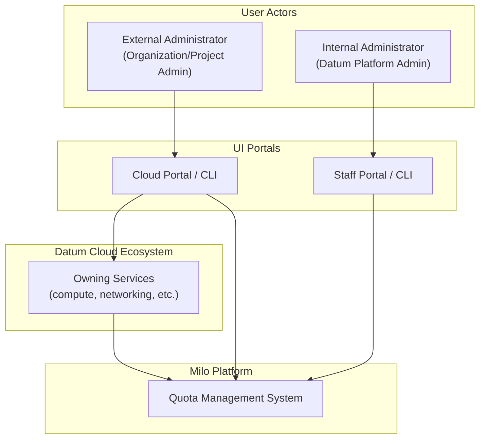
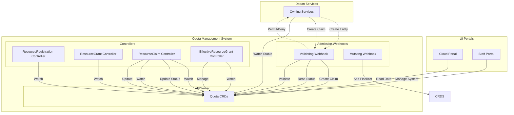
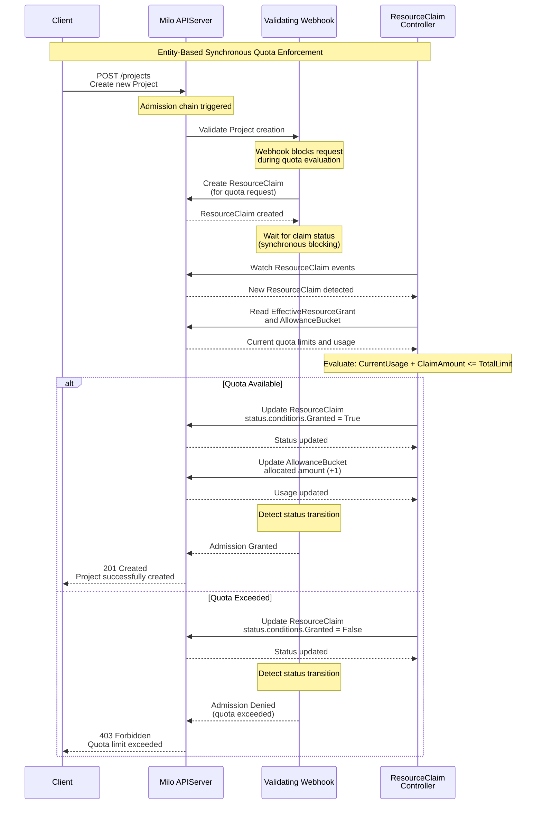
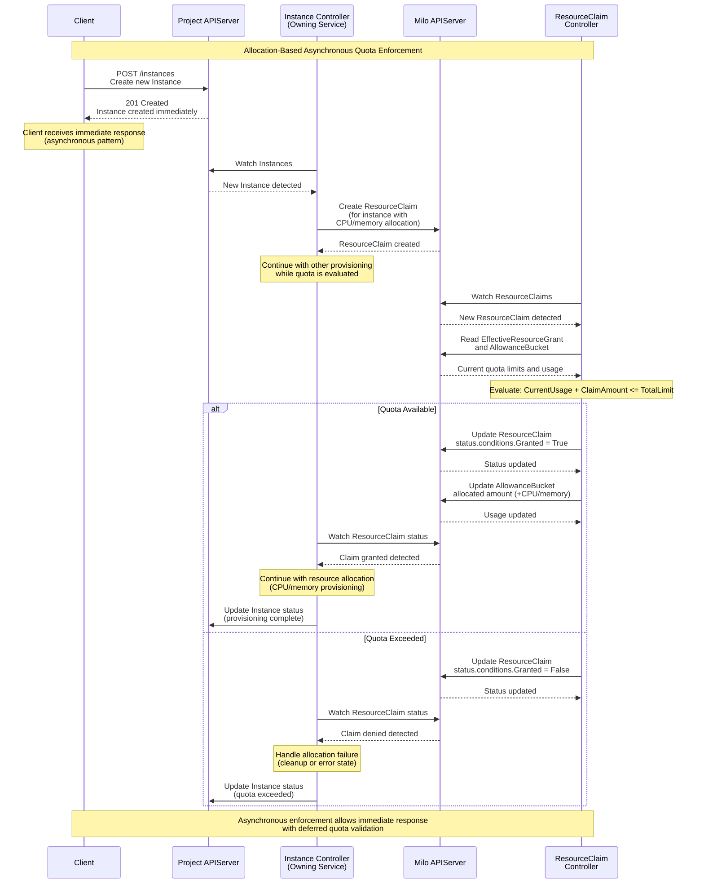

# Quota Management Enhancement Proposal


## Table of Contents

- [Quota Management](#quota-management)
  - [Glossary of Terminology](#glossary-of-terminology)
  - [Summary](#summary)
  - [Motivation](#motivation)
    - [Goals](#goals)
    - [Non-Goals](#non-goals)
  - [Proposal](#proposal)
    - [System Capabilities and Success
      Criteria](#system-capabilities-and-success-criteria)
    - [Key Components](#key-components)
    - [Implementation Phases](#implementation-phases)
    - [User Stories](#user-stories)
      - [Story 1: Quota Visibility for External
        Administrators](#story-1-quota-visibility-for-external-administrators)
      - [Story 2: Quota Increase Requests](#story-2-quota-increase-requests)
      - [Story 3: Platform-wide Quota
        Management](#story-3-platform-wide-quota-management)
      - [Story 4: Resource Type
        Registration](#story-4-resource-type-registration)
    - [Risks and Mitigations](#risks-and-mitigations)
      - [Risk: Quota System Unavailability Blocks Resource
        Allocation](#risk-quota-system-unavailability-blocks-resource-allocation)
  - [Design Details](#design-details)
    - [Quota Enforcement Patterns](#quota-enforcement-patterns)
      - [Entity-Based Enforcement (Synchronous Claim
        Decisions)](#entity-based-enforcement-synchronous-claim-decisions)
      - [Allocation-Based Enforcement (Asynchronous Claim
        Decisions)](#allocation-based-enforcement-asynchronous-claim-decisions)
    - [Kubernetes Resource Quota
      Limitations](#kubernetes-resource-quota-limitations)
    - [Custom Resource Definitions](#custom-resource-definitions)
      - [`ResourceRegistration`](#resourceregistration)
      - [`ResourceGrant`](#resourcegrant)
      - [`ResourceClaim`](#resourceclaim)
      - [`EffectiveResourceGrant`](#effectiveresourcegrant)
      - [`AllowanceBucket`](#allowancebucket)
    - [Quota Operator Implementation](#quota-operator-implementation)
      - [ResourceRegistration Controller](#resourceregistration-controller)
      - [ResourceGrant Controller](#resourcegrant-controller)
      - [ResourceClaim Controller](#resourceclaim-controller)
      - [EffectiveResourceGrant Controller](#effectiveresourcegrant-controller)
    - [Admission Webhooks](#admission-webhooks)
  - [System Architecture Diagrams](#system-architecture-diagrams)
    - [Static Structure: System Context and
      Components](#static-structure-system-context-and-components)
      - [C1 Diagram - System Context](#c1-diagram---system-context)
      - [C2 Diagram - Containers/Components](#c2-diagram---containerscomponents)
  - [Open Questions](#open-questions)
  - [Production Readiness Review
    Questionnaire](#production-readiness-review-questionnaire)
    - [Feature Enablement and Rollback](#feature-enablement-and-rollback)
      - [How can this feature be enabled / disabled in a live
        cluster?](#how-can-this-feature-be-enabled--disabled-in-a-live-cluster)
      - [Does enabling the feature change any default
        behavior?](#does-enabling-the-feature-change-any-default-behavior)
      - [Can the feature be disabled once it has been enabled (i.e. can we roll
        back the
        enablement)?](#can-the-feature-be-disabled-once-it-has-been-enabled-ie-can-we-roll-back-the-enablement)
      - [What happens if we reenable the feature if it was previously rolled
        back?](#what-happens-if-we-reenable-the-feature-if-it-was-previously-rolled-back)
      - [Are there any tests for feature
        enablement/disablement?](#are-there-any-tests-for-feature-enablementdisablement)
    - [Rollout, Upgrade and Rollback
      Planning](#rollout-upgrade-and-rollback-planning)
      - [How can a rollout or rollback fail? Can it impact already running
        workloads?](#how-can-a-rollout-or-rollback-fail-can-it-impact-already-running-workloads)
      - [What specific metrics should inform a
        rollback?](#what-specific-metrics-should-inform-a-rollback)
      - [Were upgrade and rollback tested? Was the upgrade-> downgrade-> upgrade
        path
        tested?](#were-upgrade-and-rollback-tested-was-the-upgrade--downgrade--upgrade-path-tested)
      - [Is the rollout accompanied by any deprecations and/or removals of
        features, APIs, fields of API types, flags,
        etc.?](#is-the-rollout-accompanied-by-any-deprecations-andor-removals-of-features-apis-fields-of-api-types-flags-etc)
    - [Monitoring Requirements](#monitoring-requirements)
      - [How can an operator determine if the feature is in use by
        workloads?](#how-can-an-operator-determine-if-the-feature-is-in-use-by-workloads)
      - [How can someone using this feature know that it is working for their
        instance?](#how-can-someone-using-this-feature-know-that-it-is-working-for-their-instance)
      - [What are the reasonable SLOs (Service Level Objectives) for the
        enhancement?](#what-are-the-reasonable-slos-service-level-objectives-for-the-enhancement)
      - [What are the SLIs (Service Level Indicators) an operator can use to
        determine the health of the
        service?](#what-are-the-slis-service-level-indicators-an-operator-can-use-to-determine-the-health-of-the-service)
      - [Are there any missing metrics that would be useful to have to improve
        observability of this
        feature?](#are-there-any-missing-metrics-that-would-be-useful-to-have-to-improve-observability-of-this-feature)
    - [Dependencies](#dependencies)
    - [Scalability](#scalability)
      - [Will enabling / using this feature result in any new API
        calls?](#will-enabling--using-this-feature-result-in-any-new-api-calls)
      - [Will enabling / using this feature result in introducing new API
        types?](#will-enabling--using-this-feature-result-in-introducing-new-api-types)
      - [Will enabling / using this feature result in any new calls to the cloud
        provider?](#will-enabling--using-this-feature-result-in-any-new-calls-to-the-cloud-provider)
      - [Will enabling / using this feature result in increasing size or count
        of the existing API
        objects?](#will-enabling--using-this-feature-result-in-increasing-size-or-count-of-the-existing-api-objects)
      - [Will enabling / using this feature result in increasing time taken by
        any operations covered by existing
        SLIs/SLOs?](#will-enabling--using-this-feature-result-in-increasing-time-taken-by-any-operations-covered-by-existing-slisslos)
      - [Will enabling / using this feature result in non-negligible increase of
        resource usage in any
        components?](#will-enabling--using-this-feature-result-in-non-negligible-increase-of-resource-usage-in-any-components)
      - [Can enabling / using this feature result in resource exhaustion of some
        node resources (PIDs, sockets, inodes,
        etc.)?](#can-enabling--using-this-feature-result-in-resource-exhaustion-of-some-node-resources-pids-sockets-inodes-etc)
    - [Troubleshooting](#troubleshooting)
      - [How does this feature react if the APIServer is
        unavailable?](#how-does-this-feature-react-if-the-apiserver-is-unavailable)
      - [What are other known failure
        modes?](#what-are-other-known-failure-modes)
      - [What steps should be taken if SLOs are not being met to determine the
        problem?](#what-steps-should-be-taken-if-slos-are-not-being-met-to-determine-the-problem)
  - [Implementation History](#implementation-history)
  - [Drawbacks](#drawbacks)
  - [Alternatives](#alternatives)
  - [Infrastructure Needed (Optional)](#infrastructure-needed-optional)

## Glossary of Key Terminology

- **Quota System**: A centralized service within Milo that consists of the
  different components that work together to provide quota management, tracking,
  enforcement, and usage accounting capabilities.

- **Owning Service(s)**: Datum Cloud services that integrate with the quota
  management system to enable quota enforcement on their resources.

- **Quota Allowance**: The *specific amount* of a resource that an individual
  `ResourceGrant` contributes toward the total effective quota limit. Multiple
  allowances from different grants are *additive*.

- **Total Effective Quota Limit**: The *calculated maximum amount* of a resource
  that can be allocated or provisioned, determined by **summing all applicable
  `ResourceGrant` allowances** for a specific resource type and dimension
  combination within a namespace. This is stored as
  `EffectiveResourceGrant.status.totalLimit`.

- **Quota Claim**: The amount *attempting to be claimed* by an owning service
  when provisioning or allocating resources, submitted via `ResourceClaim`
  objects.

- **AllowanceBucket**: A CRD that serves as the **single source of truth** for
  quota usage accounting, tracking allocated amounts for specific resource type
  and dimension combinations.

- **EffectiveResourceGrant**: A CRD that provides a **pre-calculated, aggregated
  view** of quota information, combining total limits from multiple
  `ResourceGrant`s and usage data from owned `AllowanceBucket`s.

- **Internal Administrators**: Administrators responsible for the overall
  management and operation of the Datum Cloud and Milo platforms as a whole
  (Datum employees).

- **External Administrators**: Administrators responsible for the management of
  resources used by their specific organization and the projects within it.

## Summary

This enhancement proposes the architecture and implementation of a centralized
system within [Milo](https://github.com/datum-cloud/milo) that provides quota
management functionality to both internal and external administrators of Datum
Cloud.

## Motivation

There is currently no existing mechanism that provides the ability to manage,
track, and enforce total effective quota limits on resources consumed by
organizations and projects within Datum Cloud. The implementation of this system
will provide significant operational and technical value, including:

1. **Platform Stability and Reliability** through the prevention of resource
   exhaustion scenarios through accidental or intentional overuse of resources.
2. **Capacity Planning** through clear visibility into total effective quota
   limits and accurate accounting of resources usage.
3. **Financial Protection** through prevention of scenarios that would lead to
   significant and unexpected cost increases of running infrastructure.

The functionality provided through this enhancement will strengthen overall
confidence in the platform as organizations and projects scale to meet their
specific business needs.

### Goals

- Provide clear system context and architectural approach for the system that
  Datum Cloud services will integrate with to manage quotas and enforce limits
  on resource provisioning and allocation
- Define APIs that enable quota management functionality for both internal and
  external administrators within the appropriate scope. See the [System
  Capabilities and Success Criteria](#system-capabilities-and-success-criteria)
  section for specific details of what these APIs provide for different
  administrator types.
- Enable integration by owning services as part of their provisioning and
  allocation workflows without requiring domain-specific business logic changes.

### Non-Goals

- Provide architectural or implementation specifics of the metering and billing
  systems that the quota system will be used by Milo in the future
- Support consumer tier enforcement (e.g., free vs. paid tiers) through
  configurable quotas
- Create a default grant for projects/organizations when they are initially
  created (future enhancement)
- Define the future Milo Service Catalog and service registration (distinct from
  the service resource type registration specific to quota management)
- Define the exact user interface (UI) mockups or user experience (UX) flows for
  managing or viewing quotas, beyond the scope of the phase one release
- Define how alerts can be created and sent to internal and external
  administrators to inform them when quota limits are near exhaustion

## Proposal

This enhancement proposes implementing quota management capabilities using the
Kubernetes [operator
pattern](https://kubernetes.io/docs/concepts/extend-kubernetes/operator/),
aligning with established standards and approaches used within the Datum Cloud
and Milo platforms.

### System Capabilities and Success Criteria

The quota management system delivers valuable system capabilities that will also
serve as success criteria for the enhancement when implemented:

**For Internal Administrators (platform-wide):**
- Register owning service resource types and dimensional constraints with the
  quota system
- View and manage total effective quota limits and grants for any and all
  organizations and their projects
- View accurate accounting of resource usage across the entire platform

**For External Administrators (specific to their organization and projects):**
- View total effective quota limits and accurate usage accounting against those
  limits
- Request changes to their limits
- Receive clear feedback when quota limits will be exceeded by new claim
  attempts

**For Owning Services:**
- Integrate with the quota management system without needing domain-specific
  business logic changes
- Leverage standardized patterns for quota claim/release workflows
- Benefit from multiple enforcement patterns for claim evaluation, depending on
  the type of the resource registration
- Automatically provision default total effective quota limits and claims when
  new projects/organizations are created, removing the need to immediately
  create grants during initial project and organization setup.

### Key Components

The quota management system is built on three core architectural components:

1. **Custom Resource Definitions (CRDs)**: Declares the specification of new
   quota related custom resources and their exposed APIs.
2. **Quota Operator**: Orchestrates quota management through a set of dedicated
   controllers based using the [Kubernetes
   operator-pattern](https://kubernetes.io/docs/concepts/extend-kubernetes/operator/)
3. **Admission Webhooks**: Provides validating and mutating webhooks that ensure
   data integrity through CRD spec validation and finalizer injection

*Note: Detailed specifications for each component are provided in the **[Design
Details](##design-details)** section.*

### Implementation Phases

To deliver a functional MVP while maintaining long-term architectural vision and
backwards compatibility, the quota management system will be implemented in two
initial phases:

**Phase One (Initial MVP):**
- Complete CRD definitions with full dimensional field support for forward
  compatibility
- Core controller logic for quota tracking and usage accounting
- Basic dimensional constraint support using [Kubernetes Label
  Selectors](https://kubernetes.io/docs/reference/kubernetes-api/common-definitions/label-selector/#LabelSelector).
  Dimension fields will be supported but initially used only for simple use
  cases, deferring constraints such as location and instance type.
- Entity and Allocation enforcement patterns
- Self-contained validation within the quota system (cross-system validation
  deferred)

**Phase Two (Future Enhancement):**
- Enhanced dimensional constraint logic for complex multi-dimensional resource
  scenarios, including location and instance type specifics
- Advanced UI features for quota visualization at specific dimensional levels  
- Performance optimizations for high-dimensional quota calculations

This phased approach ensures rapid delivery of core quota functionality while
using forward thinking architectural planning for the support of future phase
functionality.

### User Stories

To provide concrete examples of how the system will be used, the following user
stories are proposed. These stories are non-exhaustive, but are intended to
provide a clear understanding of the system and its capabilities at a high level
for the various personas involved.

#### Story 1: Quota Visibility for External Administrators
As an **external administrator**, I should be able to view my active quota
limits, accurate usage accounting, and previously granted claims for all
resources in my organization and projects via the Datum Cloud Portal, so that I
can understand my available capacity and track resource consumption against set
limits.

#### Story 2: Quota Increase Requests  
As an **external administrator**, I should be able to request quota increases
for my organization and projects through an established internal process, so
that I can scale my total effective quota limits to meet growing business needs.

#### Story 3: Platform-wide quota management
As an **internal administrator**, I should be able to view and manage total
effective quota limits for all organizations and projects across the platform
through the Staff Portal, so that I can ensure optimal and fair-usage of
resource consumption across infrastructure and maintain overall platform
stability.

#### Story 4: Resource Type Registration
As an **internal administrator**, I should be able to register new quotable
resource types, so that existing and new owning services can quickly begin to
leverage quota management capabilities without extensive custom business logic
changes.

### Risks and Mitigations

Various risks must be taken into account for the proposed implementation of the
quota management system, so there are clear mitigation steps if they arise.
These risks are non-exhaustive, but cover the main risks and their mitigation
steps.

Along with specific mitigation steps, best practices will be enforced by code
reviewers based on their knowledge of the Datum Cloud and Milo ecosystems and
existing standards and patterns.

#### Risk: Quota System Unavailability Impacting Full or Partial Provisioning

**Consequence**: If parts of the quota system become unavailable, or fail, it
will affect resource operations depending on which type of enforcement pattern
is being used.

- **Entity-based Enforcement**: Requests to create entites will be completely
  blocked until the quota system recovers. Due to being synchronous enforcement,
  API requests will be blocked from proceeding without the response from the
  quota system.

- **Allocation-based Enforcement**: Requests to create allocation type resources
  will initially succeed, but additional downstream provisioning will either be
  delayed or fail, depending on how the client handles the failure, due to the
  claim remaining in a pending state until the system is back online and fully
  working. 

##### Mitigations (High-Level):
- **High System Availability:** The primary mitigation is to ensure the quota
  system is designed for high availability to minimize potential downtime,
  taking advantage of Kubernetes auto-healing capabilities and the replication
  of key components. Rolling deployments will also help prevent system
  unavilability when new deployments fail.
- **System Resilience and Recovery:** The system and its components will be
  designed to be resilient, with retry mechanisms in place. Upon restoration of
  the system's full health, the quota operator controllers will work to
  reconcile desired cluster state with the current state. For example, detecting
  claims in a pending state and re-processing them.
- **System Monitoring and Observability:** Existing logging and monitoring
  tooling will be included to ensure any abnormal functionality is immediately
  known to internal administrators, and made available to organizations through
  appropriate error codes and messages in failed responses. A service health
  page that can be publically viewed would provide trust and full transparency
  into system health. Overall unavailability, or the increase in error rate and
  latency beyond acceptable levels, are key areas to carefully monitor. All of
  these mitigations ensure rapid intervention to fix the root cause of the
  issue.
- **Emergency Bypass (Break-Glass Procedure):** For extreme, prolonged outages
  of the core quota enforcement workflow, a well-documented, audited, and
  IAM-controlled procedure should allow **internal administrators only** to
  temporarily bypass quota checks. This is a last-resort measure.

#### Risk: Concurrent Quota Claims May Cause Over-allocation

**Consequence**: Multiple claims being processed simultaneously against the same
quota limits could result in temporary over-allocation if not properly
synchronized.

**Mitigations**:
- **Optimistic Locking:** Controllers use observed generation optimistic locking
  to prevent race conditions during quota updates
- **Atomic Operations:**: `AllowanceBucket` updates use atomic
  increment/decrement operations
- **Retry Logic:**: Controllers implement an exponential backoff retry mechanism
  when encountering resource version conflicts
- **Eventual Consistency:**: The system will detect and correct over-allocation
  scenarios during reconciliation loops

---

## Design Details

This section provides detailed specifications for each system component and
describes the key architectural patterns that enable cross-namespace quota
enforcement and integration by owning services.

### Quota Enforcement Patterns

The quota management system uses two specific enforcement patterns, depending on
the `type` defined in the `ResourceRegistration` spec that is tied to the claim
(`Allocation` or `Entity` for the phase one release).

#### Entity-Based Enforcement (Synchronous Claim Decisions)

For entity-based claims, a synchronous enforcement mechanism is used leveraging
a validating admission webhook, which blocks the API request during claim
evaluation until a decision is made.

Using the creation of a `Project` as an example:

1. **Initial Event**: A client sends a request for the creation of a new
    `Project` to the Milo APIServer, initiating the workflow.
2. **Claim Creation**: The APIServer invokes the validating webhook as part of
    the admission chain. The webhook creates a `ResourceClaim` in the cluster
    and blocks the request while it waits for the claim's `status` field to be
    updated.
3. **Claim Detection**: The `ResourceClaim` controller (watching claims) detects
    the new object and begins reconciliation. 
4. **Claim Evaluation**: The controller evaluates the claim against the
   configured quota limit and current usage before updating the claim's `status`
   once a decision is made.
5. **Webhook Decision**: When the webhook detects the transitioned claim
   `status` it proceeds to return the decision to the APIServer.
6. **Final Outcome**: If the claim was granted, the `Project` is created and the
   success is returned to the client. If the claim was denied, the `Project` is
   not created, and the rejection is returned to the client.

#### Allocation-Based Enforcement (Asynchronous Claim Decisions)

For allocation-based claims, an asynchronous approach is used with deferred
enforcement. For example, attempting to create a new `Instance` with specific
memory and CPU. The owning service controller does not block the request by
waiting for a synchronous response before proceeding with initial provisioning.

1. **Initial Event**: A client sends a request for the creation of an `Instance`
  with specific CPU and memory allocations to the Project APIServer, and the
  `Instance` is immediately created and persisted.
2. **Claim Creation**: The `Instance` controller detects the new object and
   creates a new `ResourceClaim` to claim required resources from the available
   remaining quota.
3. **Claim Detection**: The `ResourceClaim` controller (watching claims) detects
    the new object and begins reconciliation. 
3. **Claim Evaluation**: The controller evaluates the claim against the
   configured quota limit and current usage.
4. **Controller Decision**: The claim remains in a pending state until the
   controller updates it once a decision is made.
5. **Final Outcome**: Once the status of the claim transitions to a terminal
   state, the `Instance` controller either continues with allocating
   memory and CPU to the `Instance` (claim granted) or handles the failure
   (claim denied), and returns the response to the client.

### Kubernetes Resource Quota Limitations 

The quota system is designed to solve the namespace-based limitations of
[Kubernetes Resource
Quotas](https://kubernetes.io/docs/concepts/policy/resource-quotas/) through a
**project or organization scoped approach**, enabling cluster-wide quota
management:

- **Project-level namespaces**: Enable the definition of quota grants and claims
  for the entire project, regardless of the number of isolated namespaces within
  the cluster (e.g., max CPU cores for a specific instance type within the
  specified project).
- **Organization-level namespaces**: Enable the definition of quota grants and
  claims for the organization (e.g., max projects and max collaborators per
  organization) but *do not handle project-level resource provisioning or
  allocation quotas at the organizational-level* (e.g., max CPU cores or max
  allocated memory allowed across the *entire organization*).

This enables multi-organization quota management where high level *business
boundaries* (projects/organizations) are used for cluster-scoped quota
capabilities.

### Custom Resource Definitions

Five main CRDs will be created as core components of the quota system. Each CRD
includes examples for **both** enforcement patterns:

- `ResourceRegistration` - Defines quotable resource types
- `ResourceGrant` - Sets quota allowances per scope  
- `ResourceClaim` - Requests quota allocation
- `EffectiveResourceGrant` - System-managed aggregated quota summary for client
  conveniance
- `AllowanceBucket` - System-managed usage tracking

**Note**: Each CRD section includes both **Entity** (synchronous) and
**Allocation** (asynchronous) examples to demonstrate the two enforcement
patterns.

#### `ResourceRegistration`

The `ResourceRegistration` CRD gives internal administrators the ability to
define and register specific resource types and dimensions directly through the
quota system's resource registration API. This is the initial step of the end to
end quota management workflow, and ensures that the system is aware of which
resource types are allowed to be managed by quotas.

**Note on ownerRef field**: The `ownerRef` field identifies which owning service
and resource type responsible for creating `ResourceClaim` objects for this
resource type. In Phase 1, this serves as documentation, while cross-system
validation will be deferred until a centralized service registry is available.

**Example 1: Entity Type ResourceRegistration (Synchronous Enforcement)**

```yaml
apiGroup: quota.miloapis.com
kind: ResourceRegistration
metadata:
  # <service-name>-<parent-resource-name>-<resource-name>-registration
  name: resourcemanager-organization-projects-registration
spec:
  # Reference to the owning service  that will create claims for the type being registered.
  # Refer to note in CRD description regarding phase 1 approach
  ownerRef:
    apiGroup: compute.datumapis.com
    kind: Project
  # - "Entity": Declares a new resource entity (e.g., Instance, Project) 
  #   that must be counted for quota.
  # - "Allocation": Declares a resource unit (e.g., CPU, memory, storage) 
  #   that can be reserved or consumed within a parent entity.
  # - "Feature": Declares feature flags (future enhancement)
  type: "Entity"
  # Fully qualified name of the resource type being registered, as defined by the owning service.
  # This field is used in the matching pattern to locate associated ResourceGrants and ResourceClaims
  resourceTypeName: "resourcemanager.miloapis.com/project"
  # Description of the quota limit for the resource type
  description: "Number of projects that can be created within an organization."
  # The base unit of measurement for the resource
  baseUnit: "projects"
  # The unit of measurement UI will display to users
  displayUnit: "projects"
  # Defines how to convert between the base unit and the display unit to instruct Cloud and Staff portals on display
  # Formula: baseUnit * unitConversionFactor = displayUnit
  unitConversionFactor: 1.0
  # Dimensions that can be used in ResourceGrant selectors
  # for this resource type. These should be fully qualified resource type names
  # from the owning service's API group.
  # Note: dimensions are not used in the initial release to reduce complexity as stated previously in this document
  dimensions: []
status:
  # The specific revision of the ResourceRegistration.
  observedGeneration: 1
  # Standard kubernetes approach to represent the state of a resource.
  conditions:
    - type: "Active"
      status: "True"
      lastTransitionTime: "2023-01-01T12:00:00Z"
      reason: "RegistrationActive"
      message: "The registration is active and ready for grant creation and claim requests."
```

**Example 2: Allocation Type ResourceRegistration (Asynchronous Enforcement)**

```yaml
apiGroup: quota.miloapis.com
kind: ResourceRegistration
metadata:
  name: compute-instances-cpu-registration
spec:
  ownerRef:
    apiGroup: compute.datumapis.com
    kind: Instance
  type: "Allocation"
  resourceTypeName: "compute.datumapis.com/instances/cpu"
  description: "Number of CPU cores that can be allocated to compute instances."
  baseUnit: "millicores"
  displayUnit: "cores"
  unitConversionFactor: 0.001
  dimensions:
    - "compute.datumapis.com/instanceType"
status:
  # The specific revision of the ResourceRegistration.
  observedGeneration: 1
  # Standard kubernetes approach to represent the state of a resource.
  conditions:
    - type: "Active"
      status: "True"
      lastTransitionTime: "2023-01-01T12:00:00Z"
      reason: "RegistrationActive"
      message: "The registration is active and ready for grant creation and claim requests."
```

#### `ResourceGrant`

The `ResourceGrant` CRD is how administrators set quota allowances for a
specific scope, referencing the owning service resource types and dimensions
defined by a `ResourceRegistration`. 

Multiple `ResourceGrant`s can exist for the same resource type with a namespace,
as each grant contributes allowances that are *additive* to determine the total
effective quota limit.

**Dimension Matching**: The `dimensionSelector` field uses the [Kubernetes
LabelSelector](https://kubernetes.io/docs/reference/kubernetes-api/common-definitions/label-selector/#LabelSelector)
type (`metav1.LabelSelector`), supporting both `matchLabels` and
`matchExpressions` for querying resources. This enables the quota controllers to
leverage Kubernetes' upstream label evaluation libraries
(`k8s.io/apimachinery/pkg/labels`) for established matching logic. The
systemevaluates `ResourceClaim` dimensions against `ResourceGrant` dimension
selectors to determine which grants apply to specific requests.

**Example 1: Entity Type ResourceGrant (Synchronous Enforcement)**

```yaml
apiGroup: quota.miloapis.com
kind: ResourceGrant
metadata:
  name: org-abc-default-project-count-quota
  # Refers to the org or project the grant applies to and *not*
  # traditional kubernetes namespaces.
  namespace: org-abc
spec:
  # Reference to the organization this grant applies to
  ownerRef:
    apiGroup: resourcemanager.miloapis.com
    kind: Organization
    name: org-abc
    uid: "550e8400-e29b-41d4-a716-446655440000"

  # List of allowances this grant contains
  allowances:
    # Maximum number of projects allowed in this organization
    # resourceTypeName used in matching pattern expressions and labels to locate associated EffectiveResourceGrants
    - resourceTypeName: "resourcemanager.miloapis.com/project"
      # Amount of the resource type being granted (base and display units and conversion 
      # factor are already defined in through the registration)
      amount: 10
      # No dimensions for this example as it is organization based
      dimensionSelector: {}

status:
  # The specific revision of the ResourceGrant
  observedGeneration: 1
  # Standard kubernetes approach to represent the state of a resource
  conditions:
    - type: "Active"
      status: "True"
      lastTransitionTime: "2023-01-01T12:00:00Z"
      reason: "GrantActivated"
      message: "The grant has been successfully activated and will now be taken into account when evaluating future claims."
```

**Example 2: Allocation Type ResourceGrant (Asynchronous Enforcement)**

```yaml
apiGroup: quota.miloapis.com
kind: ResourceGrant
metadata:
  name: proj-abc-grant-121-instance-allocation
  namespace: proj-abc
spec:
  ownerRef:
    apiGroup: resourcemanager.miloapis.com
    kind: Project
    name: proj-abc
    uid: "550e8400-e29b-41d4-a716-446655440000"

  allowances:
    # Max instances for the project
    - resourceTypeName: "compute.datumapis.com/instance"
      amount: 100
      dimensionSelector: {}

    # Compute instance CPUs - base allowance for *all* locations
    - resourceTypeName: "compute.datumapis.com/instances/cpu"
      amount: 100000
      dimensionSelector:
        matchExpressions: 
          - key: "networking.datumapis.com/location"
            operator: "Exists"

    # Additional CPU allowance for *only* the DLS location
    - resourceTypeName: "compute.datumapis.com/instances/cpu"
      amount: 500000
      dimensionSelector:
        matchLabels:
          "networking.datumapis.com/location": "DLS"

    # Compute instance memory allocation for multiple specific network locations
    - resourceTypeName: "compute.datumapis.com/instances/memoryAllocated"
      amount: 50000
      dimensionSelector:
        matchExpressions:
          - key: "networking.datumapis.com/location"
            operator: "In"
            values:
              - "DFW"
              - "LHR"
status:
  observedGeneration: 1
  conditions:
    - type: "Active"
      status: "True"
      lastTransitionTime: "2023-01-01T12:00:00Z"
      reason: "GrantActivated"
      message: "The grant has been successfully activated and will now be taken into account when evaluating future claims."
```

#### `ResourceClaim`

The `ResourceClaim` CRD represents a request by an owning service to claim
additional quota within a specific namespace (e.g. project or organization).

**Example 1: Entity Type ResourceClaim (Synchronous Enforcement)**

```yaml
apiGroup: quota.miloapis.com
kind: ResourceClaim
metadata:
  name: org-abc-proj-xyz-entity-claim
  # Must match the namespace of applicable ResourceGrants for this claim
  # and is used in the matching pattern to locate associated EffectiveResourceGrants
  namespace: org-abc
  finalizers:
    - "quota.miloapis.com/resource-claim-cleanup"
spec:
  # Reference to the organization this claim is for
  ownerRef:
    apiGroup: resourcemanager.miloapis.com
    kind: Organization
    name: org-abc
    uid: "550e8400-e29b-41d4-a716-446655440000"
  requests:
    # Project entity count (must reference an active ResourceRegistration)
    - resourceTypeName: "resourcemanager.miloapis.com/project"
      amount: 1
      dimensions: {}

status:
  observedGeneration: 1
  conditions:
    - type: "Granted"
      status: "True"
      lastTransitionTime: "2023-01-01T12:00:00Z"
      reason: "QuotaAvailable"
      message: "Claim was granted due to quota availability."
```

**Example 2: Allocation Type ResourceClaim (Asynchronous Enforcement)**

```yaml
apiGroup: quota.miloapis.com
kind: ResourceClaim
metadata:
  name: proj-abc-instance-cpu-claim-abc123
  # Must match the namespace of applicable ResourceGrants for this claim.
  namespace: proj-abc
  finalizers:
    - "quota.miloapis.com/resource-claim-cleanup"
spec:
  # Reference to the resource this claim is for (used by finalizer logic for quota cleanup)
  ownerRef:
    apiGroup: compute.datumapis.com
    kind: Instance
    name: instance-abc123
    uid: "550e8400-e29b-41d4-a716-446655440000"
  # What quota requests are defined by this claim?
  requests:
    # CPU cores being claimed for instance (must reference an active ResourceRegistration)
    - resourceTypeName: "compute.datumapis.com/instances/cpu"
      amount: 8000
      dimensions:
        "networking.datumapis.com/location": "DFW"
        "compute.datumapis.com/instanceType": "d1-standard-2"

    # Base memory allocation (no dimensions)
    - resourceTypeName: "compute.datumapis.com/instances/memoryAllocated"
      amount: 68719476736
      dimensions: {}

    # Additional memory allocation with specific dimensions
    - resourceTypeName: "compute.datumapis.com/instances/memoryAllocated"
      amount: 34359738368
      dimensions:
        "networking.datumapis.com/location": "DFW"
        "compute.datumapis.com/instanceType": "d1-standard-2"

status:
  observedGeneration: 1
  conditions:
    - type: "Granted"
      status: "True"
      lastTransitionTime: "2023-01-01T12:00:00Z"
      reason: "QuotaAvailable"
      message: "Claim was granted due to quota availability."
```

#### `EffectiveResourceGrant`

The `EffectiveResourceGrant` CRD provides **high-level quota details** and
serves as an optimized view for UI consumption. It provides pre-calculated
values that summarize quota allowances from all relevant `ResourceGrant`
objects, usage data from owned `AllowanceBucket` objects, and the available
amount that can still be claimed.

**Example 1: Entity Type EffectiveResourceGrant (Synchronous Enforcement)**

```yaml
apiGroup: quota.miloapis.com
kind: EffectiveResourceGrant 
metadata:
  # namespace-resourcetype-effective
  name: org-abc-project-effective
  # used in the matching pattern for ResourceGrant and ResourceClaim objects
  namespace: org-abc
  # Labels to help in querying this custom resource
  labels:
    resourceTypeName: "resourcemanager.miloapis.com/project"
spec:
  # The resource type this effective grant aggregates quota information for
  resourceTypeName: "resourcemanager.miloapis.com/project"
status:
  # The specific revision of the EffectiveResourceGrant
  observedGeneration: 1
  # Total effective quota limit from all applicable ResourceGrants for this resource type
  totalLimit: 10
  # Total allocated usage across all AllowanceBucket resources for this resource type,
  # representing the count of created entities
  totalAllocated: 3
  # Available quota (totalLimit - totalAllocated)
  available: 7
  # References to AllowanceBuckets used to calculate totalAllocated
  # For Entity types with no dimensions, typically only one bucket exists
  allowanceBucketRefs:
    - name: "bucket-org-abc-project-hash789"
      observedGeneration: 1
      allocated: 3
```

**Example 2: Allocation Type EffectiveResourceGrant (Asynchronous Enforcement)**

```yaml
apiGroup: quota.miloapis.com
kind: EffectiveResourceGrant 
metadata:
  name: proj-abc-compute-cpu-effective
  namespace: proj-abc
  labels:
    resourceTypeName: "compute.datumapis.com/instances/cpu"
spec:
  resourceTypeName: "compute.datumapis.com/instances/cpu"
status:
  observedGeneration: 1
  totalLimit: 120000
  totalAllocated: 30000
  available: 90000
  allowanceBucketRefs:
    - name: "bucket-proj-abc-cpu-dfw-hash123"
      observedGeneration: 2
      allocated: 8000
    - name: "bucket-proj-abc-cpu-lhr-hash456"
      observedGeneration: 1
      allocated: 22000
```

#### `AllowanceBucket`

The `AllowanceBucket` CRD provides **the single source of truth** for usage
accounting for specific resource and dimension combinations.

**Each `AllowanceBucket` is owned by an `EffectiveResourceGrant`**, specified
through the spec `ownerRef` field.

The `EffectiveResourceGrant` Controller manages these buckets by watching
`ResourceClaim` lifecycle events and updating allocation tracking as they are
granted or released, ensuring that `AllowanceBucket.status.allocated` remains
the authoritative source of truth for quota consumption without requiring
re-reconciliation of all existing claims. It also watches `ResourceGrants` to
determine the `totalLimit` through the summation of active grants.

**Example 1: Entity Type AllowanceBucket (Synchronous Enforcement)**

```yaml
apiGroup: quota.miloapis.com
kind: AllowanceBucket
metadata:
  # Generated by EffectiveResourceGrant controller, providing a deterministic name for the bucket 
  # based on what it specifically is tracking, with extremely minimal chance of hash collisions based
  # on the selection of algo e.g. sha256("org-abc" + "resourcemanager.miloapis.com/project" + "")
  name: <hash of namespace + resourceTypeName + serialized dimensions>
  namespace: org-abc
spec:
  ownerRef:
    apiGroup: resourcemanager.miloapis.com
    resource: Project
    name: proj-abc
  # The resource type this bucket tracks quota usage for
  resourceTypeName: "resourcemanager.miloapis.com/project"
  dimensions: {}
status:
  # The specific revision of the AllowanceBucket
  observedGeneration: 1
  # Amount of quota currently allocated/used in this bucket
  # For Entity types, this represents the count of created entities
  allocated: 3
  # References to ResourceGrants that contribute allowances to this bucket
  contributingGrantRefs:
    - name: "org-abc-default-project-count-quota"
      observedGeneration: 1
```

**Example 2: Allocation Type AllowanceBucket (Asynchronous Enforcement)**

```yaml
apiGroup: quota.miloapis.com
kind: AllowanceBucket
metadata:
  name: <hash of namespace + resourceTypeName + serialized dimensions>
  namespace: proj-abc
spec:
  ownerRef:
    apiGroup: resourcemanager.miloapis.com
    resource: Project
    name: proj-abc
  resourceTypeName: "compute.datumapis.com/instances/cpu"
  dimensions:
    "networking.datumapis.com/location": "DFW"
status:
  observedGeneration: 1
  allocated: 8000
  contributingGrantRefs:
    - name: "default-grant"
      observedGeneration: 1
    - name: "additional-grant-1"
      observedGeneration: 3
    - name: "additional-grant-2"
      observedGeneration: 1
```

### Quota Operator Implementation

The `quota-operator` is a multi-controller operator that serves as the core
orchestration component of the quota management system, which each controller
maintaining separate responsibilities and reconciliation logic. The
`quota-operator` follows the standard [Kubernetes controller
pattern](https://kubernetes.io/docs/concepts/architecture/controller/).

**Validation Strategy**: All validation is handled by admission webhooks, not
controller reconciliation logic. Controllers assume they are working with valid
resources to ensure focus on business logic implementation.

**Dimension Evaluation**: Controllers use Kubernetes' upstream label selector
libraries (`k8s.io/apimachinery/pkg/labels`) to evaluate
`ResourceGrant.dimensionSelector` against `ResourceClaim.dimensions`.

#### ResourceRegistration Controller

**Watches `ResourceRegistration` objects**

**Reconciliation Logic**:
1. Sets `status.conditions.Active` to `True` when the registration is ready for
   grant creation and claim requests
2. Updates `status.observedGeneration` to track the current spec revision

#### ResourceGrant Controller

**Watches `ResourceGrant` objects**

**Reconciliation Logic**:
1. Sets `status.conditions.Active` to `True` when the grant is ready for use in
   quota calculations
2. Updates `status.observedGeneration` to track the current spec revision

#### ResourceClaim Controller

**Watches `ResourceClaim` objects**

**Reconciliation Logic**:
1. Reads relevant `EffectiveResourceGrant` objects by namespace and
   `resourceTypeName` matching to determine current usage and total effective
   quota limit (which the `EffectiveResourceGrant` controller calculates based
   on `AllowanceBuckets`)
2. For *each claim request*, matches the request's `dimensions` against
   applicable `ResourceGrant` allowances using label selector logic:
   - Empty `dimensionSelector` (`{}`) matches all claims for that resource type
   - Non-empty `dimensionSelector` applies standard Kubernetes `LabelSelector`
     matching
   - Only matching grants contribute allowances toward the total effective quota
     limit
3. Evaluates if `CurrentUsage + ClaimAmount <= TotalEffectiveQuota` for matching
   grants
4. Sets `ResourceClaim.status.conditions.Granted` to `True` or `False` based on
   quota availability
5. Updates `status.observedGeneration` to track the current spec revision
6. When a `ResourceClaim` is deleted, decrements allocated amounts in
   corresponding `AllowanceBucket` objects before removing finalizer

#### EffectiveResourceGrant Controller

**Watches *both* `ResourceGrant` *and* `ResourceClaim` objects**

**Reconciliation Logic depends on which type of object was changed**

**For `ResourceGrant` Changes:**
1. For *each allowance* in the grant, uses namespace + `resourceTypeName`
   matching to find existing `EffectiveResourceGrant` objects, or creates new
   ones if none exist
2. Aggregates allowances from all active `ResourceGrant` objects via the same
   matching pattern in step 1 to determine which claims qualify for each grant
   allowance based on their `dimensionSelector`s in order to calculate the
   `totalLimit`. 
3. Updates `EffectiveResourceGrant.status.totalLimit` and recalculates
   `available` quota

**For `ResourceClaim` Changes:**
1. For *each request* in the claim, uses a hash of `namespace` +
   `resourceTypeName` + serialized `dimensions` to find existing
   `AllowanceBucket` objects. If none exist, the controller will create new ones
   *after* the creation of the owning `EffectiveResourceGrant`
2. Updates `AllowanceBucket.status.allocated` based on whether the claim was
   granted and is now active, or if the claim was deleted
3. Sums usage data from all owned `AllowanceBucket` objects to calculate the
   accurate `totalAllocated` amount
4. Updates `EffectiveResourceGrant.status.totalAllocated` and recalculates
   `available` quota

### Admission Webhooks

The quota management system uses admission webhooks to handle validation,
mutation, and quota enforcement, with different behaviors depending on the
resource registration type (Entity vs Allocation).

#### Entity Type Webhook (Synchronous Quota Enforcement)

**For Entity-type resources (e.g., Projects, Users):**

**Validating Webhook Responsibilities**:
- **Inline Quota Enforcement**: Creates persistent `ResourceClaim` objects in
  the APIServer and synchronously watches their status within the defined
  webhook timeout limit
- **Synchronous Decision**: Grants or denies the entity creation based on quota
  availability returned by the `ResourceClaim` controller
- **Standard Validation**: Validates references, required fields, and ensures
  accurate formatting

**Mutating Webhook Responsibilities**:
- **Finalizer Injection**: Adds finalizers to all incoming
  `ResourceClaim`s created by validating webhook to ensure cleanup
  when claims are deleted, requiring the release of their claimed quotas

#### Allocation Type Webhook (Standard Validation Only)

**For Allocation-type resources (e.g., CPU, Memory):**

**Validating Webhook Responsibilities**:
- **Resource Registration Validation**: Ensures `resourceTypeName` values in
  `ResourceGrant` and `ResourceClaim` objects reference active
  `ResourceRegistration` objects within the quota system
- **Cross-Reference Validation**: For Phase 1, validates `ownerRef` field format
  and syntax **only**. Cross-system validation of actual resource existence is
  deferred to Phase 2 since resources are internally managed
- **Required Field Validation**: Ensures all required fields are present and
  properly formatted
- **Dimension Validation**: Validates :
  - Dimensions used in grants and claims are defined in the corresponding
    `ResourceRegistration.dimensions`
  - `ResourceGrant.dimensionSelector` and `ResourceClaim.dimensions` conform to
    valid Kubernetes `LabelSelector` type syntax to allow accurate
    implementation

**Mutating Webhook Responsibilities**:
- **Finalizer Injection**: Adds finalizers to all incoming
  `ResourceClaim`s created by the owning service controller to ensure cleanup
  when claims are deleted, requiring the release of their claimed quotas

#### Webhook Configuration

**Failure Policy**: Both validating and mutating webhooks are configured with
`failurePolicy: Fail` to ensure system consistency over availability. This
prevents quota enforcement bypass during webhook outages. For example, if the
webhooks are unavailable and quota enforcement can be bypassed, an external
administrator or bad actor could create a large number of claims that would
never be enforced by the limits, overloading the system. 

## System Architecture Diagrams

### System Context and Components

#### C1 Diagram - System Context



#### C2 Diagram - Containers/Components


### Sequence Diagrams

#### Entity-based Synchronous Enforcement



#### Allocation-based Asynchronous Enforcement



---

## Open Questions

1. **Default Quota Grants and Claims**: What should the default total effective
   quota limits be for new project and organization resources?

---

## Production Readiness Review Questionnaire

<!--

Production readiness reviews are intended to ensure that features are observable,
scalable and supportable; can be safely operated in production environments, and
can be disabled or rolled back in the event they cause increased failures in
production.

See more in the PRR Enhancement at https://git.k8s.io/enhancements/keps/sig-architecture/1194-prod-readiness.

The production readiness review questionnaire must be completed and approved
for the Enhancement to move to `implementable` status and be included in the release.
-->

### Feature Enablement and Rollback

<!--
This section must be completed when targeting alpha to a release.
-->

#### How can this feature be enabled / disabled in a live cluster?

<!--
Pick one of these and delete the rest.
-->

- [ ] Feature gate
  - Feature gate name:
  - Components depending on the feature gate:
- [ ] Other
  - Describe the mechanism:
  - Will enabling / disabling the feature require downtime of the control plane?
  - Will enabling / disabling the feature require downtime or reprovisioning of
    a node?

#### Does enabling the feature change any default behavior?

<!--
Any change of default behavior may be surprising to users or break existing
automations, so be extremely careful here.
-->

#### Can the feature be disabled once it has been enabled (i.e. can we roll back the enablement)?

<!--
Describe the consequences on existing workloads (e.g., if this is a runtime
feature, can it break the existing applications?).

Feature gates are typically disabled by setting the flag to `false` and
restarting the component. No other changes should be necessary to disable the
feature.
-->

#### What happens if we reenable the feature if it was previously rolled back?

#### Are there any tests for feature enablement/disablement?

### Rollout, Upgrade and Rollback Planning

<!--
This section must be completed when targeting beta to a release.
-->

#### How can a rollout or rollback fail? Can it impact already running workloads?

<!--
Try to be as paranoid as possible - e.g., what if some components will restart
mid-rollout?

Be sure to consider highly-available clusters, where, for example,
feature flags will be enabled on some servers and not others during the
rollout. Similarly, consider large clusters and how enablement/disablement
will rollout across nodes.
-->

#### What specific metrics should inform a rollback?

<!--
What signals should users be paying attention to when the feature is young
that might indicate a serious problem?
-->

#### Were upgrade and rollback tested? Was the upgrade-> downgrade-> upgrade path tested?

<!--
Describe manual testing that was done and the outcomes.
Longer term, we may want to require automated upgrade/rollback tests, but we
are missing a bunch of machinery and tooling and can't do that now.
-->

#### Is the rollout accompanied by any deprecations and/or removals of features, APIs, fields of API types, flags, etc.?

<!--
Even if applying deprecation policies, they may still surprise some users.
-->

### Monitoring Requirements

<!--
This section must be completed when targeting beta to a release.

For GA, this section is required: approvers should be able to confirm the
previous answers based on experience in the field.
-->

#### How can an operator determine if the feature is in use by workloads?

<!--
Ideally, this should be a metric. Operations against the API (e.g., checking if
there are objects with field X set) may be a last resort. Avoid logs or events
for this purpose.
-->

#### How can someone using this feature know that it is working for their instance?

<!--
For instance, if this is an instance-related feature, it should be possible to
determine if the feature is functioning properly for each individual instance.
Pick one more of these and delete the rest.
Please describe all items visible to end users below with sufficient detail so
that they can verify correct enablement and operation of this feature.
Recall that end users cannot usually observe component logs or access metrics.
-->

- [ ] Events
  - Event Reason:
- [ ] API .status
  - Condition name:
  - Other field:
- [ ] Other (treat as last resort)
  - Details:

#### What are the reasonable SLOs (Service Level Objectives) for the enhancement?

<!--
This is your opportunity to define what "normal" quality of service looks like
for a feature.

It's impossible to provide comprehensive guidance, but at the very
high level (needs more precise definitions) those may be things like:
  - per-day percentage of API calls finishing with 5XX errors <= 1%
  - 99% percentile over day of absolute value from (job creation time minus expected
    job creation time) for cron job <= 10%
  - 99.9% of /health requests per day finish with 200 code

These goals will help you determine what you need to measure (SLIs) in the next
question.
-->

#### What are the SLIs (Service Level Indicators) an operator can use to determine the health of the service?

<!--
Pick one more of these and delete the rest.
-->

- [ ] Metrics
  - Metric name:
  - [Optional] Aggregation method:
  - Components exposing the metric:
- [ ] Other (treat as last resort)
  - Details:

#### Are there any missing metrics that would be useful to have to improve observability of this feature?

### Dependencies

- **Owning Services**: The quota system is inherently dependent on the various
  owning services that integrate with it for quota management functionality. The
  controllers for these services are responsible for creating, watching, and
  deleting `ResourceClaim` objects in response to their resource lifecycles.

### Scalability

#### Will enabling / using this feature result in any new API calls?

Yes, it will. The Cloud and Staff Portals will make new API calls (CRUD
operations) to quota controllers for:

1. Resource type registration (Staff Portal)
2. Grant creation (Staff and Cloud Portals)
3. Retrieving quota information to display (Staff and Cloud Portals)

No requests will be made to claim resources, as that is an implementation detail
of the owning services the portals use for existing provisioning workflows.

#### Will enabling / using this feature result in introducing new API types?

Yes. This feature is centered around the introduction of five new (CRD), which
create new API types:

- `ResourceRegistration`
- `ResourceGrant`
- `ResourceClaim`
- `EffectiveResourceGrant`
- `AllowanceBucket`

#### Will enabling / using this feature result in any new API calls to the cloud provider?

No. This enhancement operates entirely within the Datum Cloud and Milo platforms
and does not need to communicate directly with cloud providers for
infrastructure provisioning. (currently GCP; future: AWS, alt-clouds, etc).

#### Will enabling / using this feature result in increasing size or count of the existing API objects?

Yes, it will increase the number of API objects in the quota system, but not
within the owning services. Each quota operator controller will be creating new
CRD objects and storing them in the APIServer.

#### Will enabling / using this feature result in increasing time taken by any operations covered by existing SLIs/SLOs?

Yes, slightly, with specific latency determined by the enforcement approach
(sync vs async). Admission Webhooks will also add a near-negligable increase in
latency.

#### Will enabling / using this feature result in non-negligible increase of resource usage in any components?

Yes, an increase in memory usage will occur as Datum Cloud and Milo are
leveraged by more organizations, and as these organizations scale their
infrastructure based on business growth. 

These are the components that will use and require the most memory when the
quota system is implemented:

- **Milo APIServer**: Storing objects for the five new CRD types.
- **Quota Controllers**: Maintaining in-memory caches of the resources they
  watch and the cross-controller references between them.
- **EffectiveResourceGrant Controller**: Aggregating data from N
  `AllowanceBucket`s will require additional memory as bucket counts and
  dimensions are added over time.

Due to this increased resource usage, extensive load testing will be done using
[k6](https://k6.io/) to ensure scalability of the system

#### Can enabling / using this feature result in resource exhaustion of some node resources (PIDs, sockets, inodes, etc.)?

<!--
Focus not just on happy cases, but primarily on more pathological cases.
-->

### Troubleshooting

<!--
This section must be completed when targeting beta to a release.

For GA, this section is required: approvers should be able to confirm the
previous answers based on experience in the field.

The Troubleshooting section currently serves the `Playbook` role. We may consider
splitting it into a dedicated `Playbook` document (potentially with some monitoring
details). For now, we leave it here.
-->

#### How does this feature react if the APIServer is unavailable?

If the APIServer is unavailable, the quota system cannot function properly,
either fully failing or causing data integrity issues, depending on enforcement
policy:
- **Entity-based enforcement**: All entity creation requests will fail (by
  design with `failurePolicy: Fail`) due to synchronous enforcement
- **Allocation-based enforcement**: New claims cannot be created, but existing
  workloads continue running
- **Controller reconciliation**: All quota controllers stop processing until
  APIServer recovery

#### What are other known failure modes?

**Controller Pod Crashes**: 
- Detection: Missing expected controller metrics, pending `ResourceClaim`
  objects beyond normal time limits
- Mitigations: Standard Kubernetes restart policies, health checks, and
  multi-replica deployments. Alerts that notify abnormal error rate or
  significantly increased latency
<!--
For each of them, fill in the following information by copying the below template:
  - [Failure mode brief description]
    - Detection: How can it be detected via metrics? Stated another way:
      how can an operator troubleshoot without logging into a master or worker node?
    - Mitigations: What can be done to stop the bleeding, especially for already
      running user workloads?
    - Diagnostics: What are the useful log messages and their required logging
      levels that could help debug the issue?
      Not required until feature graduated to beta.
    - Testing: Are there any tests for failure mode? If not, describe why.
-->

#### What steps should be taken if SLOs are not being met to determine the problem?

---

## Implementation History

<!--
Major milestones in the lifecycle of a Enhancement should be tracked in this section.
Major milestones might include:
- the `Summary` and `Motivation` sections being merged, signaling acceptance
- the `Proposal` section being merged, signaling agreement on a proposed design
- the date implementation started
- the first release where an initial version of the Enhancement was available
- the version where the Enhancement graduated to general availability
- when the Enhancement was retired or superseded
-->

**Phased Implementation Decision**: Based on delivery requirements for the
initial release, the implementation has been planned in two main phases:

Phase 1 focuses on core quota enforcement capabilities, deferring most
dimensional constraint logic to Phase 2. 

The architecture and implementation proposed in this document includes examples
with dimensional capabilities to ensure forward compatibility and demonstrate
the full system potential. Phase 1 will implement basic dimensional support for
simple use cases, with enhanced multi-dimensional logic deferred to Phase 2.

## Drawbacks

<!--
Why should this Enhancement _not_ be implemented?
-->

## Alternatives

<!--
What other approaches did you consider, and why did you rule them out? These do
not need to be as detailed as the proposal, but should include enough
information to express the idea and why it was not acceptable.
-->

## Infrastructure Needed (Optional)

<!--
Use this section if you need things from another party. Examples include a
new repos, external services, compute infrastructure.
-->