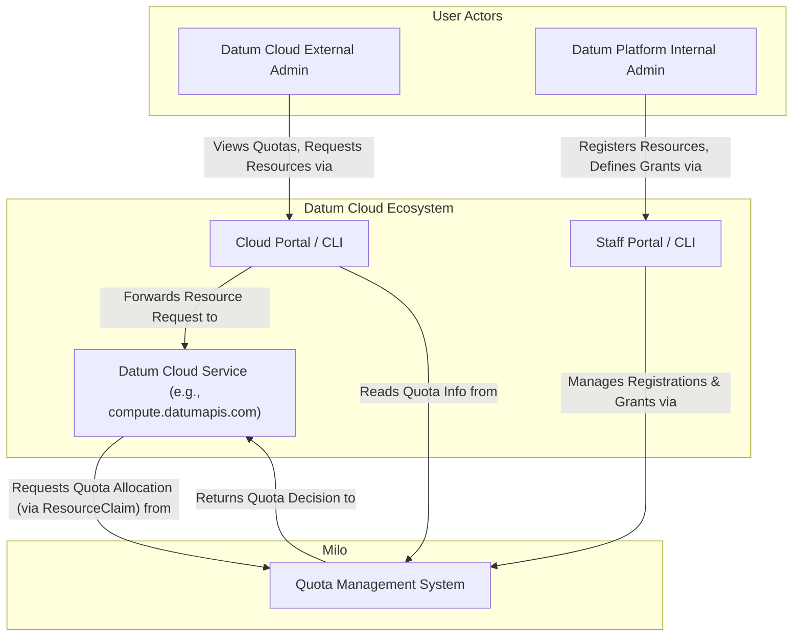

# Quota Management


## Table of Contents

- [Quota Management](#quota-management)
  - [Glossary of Terminology](#glossary-of-terminology)
  - [Summary](#summary)
  - [Motivation](#motivation)
    - [Goals](#goals)
    - [Non-Goals](#non-goals)
  - [Proposal](#proposal)
    - [System Capabilities and Success
      Criteria](#system-capabilities-and-success-criteria)
    - [Key Components](#key-components)
    - [User Stories](#user-stories)
      - [Story 1: Quota Visibility for External
        Administrators](#story-1-quota-visibility-for-external-administrators)
      - [Story 2: Quota Increase Requests](#story-2-quota-increase-requests)
      - [Story 3: Platform-wide Quota
        Management](#story-3-platform-wide-quota-management)
      - [Story 4: Resource Type Registration and Service
        Integration](#story-4-resource-type-registration-and-service-integration)
    - [Risks and Mitigations](#risks-and-mitigations)
      - [Risk: Quota System Unavailability Blocks Resource
        Creation](#risk-quota-system-unavailability-blocks-resource-creation)
  - [Design Details](#design-details)
    - [Architectural Patterns](#architectural-patterns)
      - [Cross-Namespace Quota Enforcement](#cross-namespace-quota-enforcement)
      - [Service Integration Patterns](#service-integration-patterns)
    - [Custom Resource Definitions](#custom-resource-definitions)
      - [`ResourceRegistration`](#resourceregistration)
      - [`ResourceGrant`](#resourcegrant)
      - [`ResourceClaim`](#resourceclaim)
      - [`EffectiveResourceGrant`](#effectiveresourcegrant)
      - [`AllowanceBucket`](#allowancebucket)
    - [Quota Operator Implementation](#quota-operator-implementation)
      - [ResourceRegistration Controller](#resourceregistration-controller)
      - [ResourceGrant Controller](#resourcegrant-controller)
      - [ResourceClaim Controller](#resourceclaim-controller)
      - [EffectiveResourceGrant Controller](#effectiveresourcegrant-controller)
    - [Admission Webhooks](#admission-webhooks)
  - [System Architecture Diagrams](#system-architecture-diagrams)
    - [Static Structure: System Context and
      Components](#static-structure-system-context-and-components)
      - [C1 Diagram - System Context](#c1-diagram---system-context)
      - [C2 Diagram - Containers/Components](#c2-diagram---containerscomponents)
    - [Dynamic Flows: Sequence Diagrams](#dynamic-flows-sequence-diagrams)
      - [Sequence Diagram Step Breakdown](#sequence-diagram-step-breakdown)
        - [Prerequisite 1: Service Quota Definition
          Registration](#prerequisite-1-service-quota-definition-registration)
        - [Prerequisite 2: Defining Resource Quota Limits (`ResourceGrant`
          Creation)](#prerequisite-2-defining-resource-quota-limits-resourcequotagrant-creation)
        - [Core Flow: Resource Provisioning and Quota
          Claim](#core-flow-resource-provisioning-and-quota-claim)
        - [Ancillary Flow: Tear-down & Quota
          Release](#ancillary-flow-tear-down--quota-release)
  - [Open Questions](#open-questions)
  - [Production Readiness Review
    Questionnaire](#production-readiness-review-questionnaire)
    - [Feature Enablement and Rollback](#feature-enablement-and-rollback)
      - [How can this feature be enabled / disabled in a live
        cluster?](#how-can-this-feature-be-enabled--disabled-in-a-live-cluster)
      - [Does enabling the feature change any default
        behavior?](#does-enabling-the-feature-change-any-default-behavior)
      - [Can the feature be disabled once it has been enabled (i.e. can we roll
        back the
        enablement)?](#can-the-feature-be-disabled-once-it-has-been-enabled-ie-can-we-roll-back-the-enablement)
      - [What happens if we reenable the feature if it was previously rolled
        back?](#what-happens-if-we-reenable-the-feature-if-it-was-previously-rolled-back)
      - [Are there any tests for feature
        enablement/disablement?](#are-there-any-tests-for-feature-enablementdisablement)
    - [Rollout, Upgrade and Rollback
      Planning](#rollout-upgrade-and-rollback-planning)
      - [How can a rollout or rollback fail? Can it impact already running
        workloads?](#how-can-a-rollout-or-rollback-fail-can-it-impact-already-running-workloads)
      - [What specific metrics should inform a
        rollback?](#what-specific-metrics-should-inform-a-rollback)
      - [Were upgrade and rollback tested? Was the upgrade-> downgrade-> upgrade
        path
        tested?](#were-upgrade-and-rollback-tested-was-the-upgrade--downgrade--upgrade-path-tested)
      - [Is the rollout accompanied by any deprecations and/or removals of
        features, APIs, fields of API types, flags,
        etc.?](#is-the-rollout-accompanied-by-any-deprecations-andor-removals-of-features-apis-fields-of-api-types-flags-etc)
    - [Monitoring Requirements](#monitoring-requirements)
      - [How can an operator determine if the feature is in use by
        workloads?](#how-can-an-operator-determine-if-the-feature-is-in-use-by-workloads)
      - [How can someone using this feature know that it is working for their
        instance?](#how-can-someone-using-this-feature-know-that-it-is-working-for-their-instance)
      - [What are the reasonable SLOs (Service Level Objectives) for the
        enhancement?](#what-are-the-reasonable-slos-service-level-objectives-for-the-enhancement)
      - [What are the SLIs (Service Level Indicators) an operator can use to
        determine the health of the
        service?](#what-are-the-slis-service-level-indicators-an-operator-can-use-to-determine-the-health-of-the-service)
      - [Are there any missing metrics that would be useful to have to improve
        observability of this
        feature?](#are-there-any-missing-metrics-that-would-be-useful-to-have-to-improve-observability-of-this-feature)
    - [Dependencies](#dependencies)
      - [Does this feature depend on any specific services running in the
        cluster?](#does-this-feature-depend-on-any-specific-services-running-in-the-cluster)
    - [Scalability](#scalability)
      - [Will enabling / using this feature result in any new API
        calls?](#will-enabling--using-this-feature-result-in-any-new-api-calls)
      - [Will enabling / using this feature result in introducing new API
        types?](#will-enabling--using-this-feature-result-in-introducing-new-api-types)
      - [Will enabling / using this feature result in any new calls to the cloud
        provider?](#will-enabling--using-this-feature-result-in-any-new-calls-to-the-cloud-provider)
      - [Will enabling / using this feature result in increasing size or count
        of the existing API
        objects?](#will-enabling--using-this-feature-result-in-increasing-size-or-count-of-the-existing-api-objects)
      - [Will enabling / using this feature result in increasing time taken by
        any operations covered by existing
        SLIs/SLOs?](#will-enabling--using-this-feature-result-in-increasing-time-taken-by-any-operations-covered-by-existing-slisslos)
      - [Will enabling / using this feature result in non-negligible increase of
        resource usage in any
        components?](#will-enabling--using-this-feature-result-in-non-negligible-increase-of-resource-usage-in-any-components)
      - [Can enabling / using this feature result in resource exhaustion of some
        node resources (PIDs, sockets, inodes,
        etc.)?](#can-enabling--using-this-feature-result-in-resource-exhaustion-of-some-node-resources-pids-sockets-inodes-etc)
    - [Troubleshooting](#troubleshooting)
      - [How does this feature react if the APIServer is
        unavailable?](#how-does-this-feature-react-if-the-apiserver-is-unavailable)
      - [What are other known failure
        modes?](#what-are-other-known-failure-modes)
      - [What steps should be taken if SLOs are not being met to determine the
        problem?](#what-steps-should-be-taken-if-slos-are-not-being-met-to-determine-the-problem)
  - [Implementation History](#implementation-history)
  - [Drawbacks](#drawbacks)
  - [Alternatives](#alternatives)
  - [Infrastructure Needed (Optional)](#infrastructure-needed-optional)

## Glossary of Terminology

- **Internal Administrators**: Administrators responsible for the overall
    management, operation, and definition of services within the Datum Cloud and
    Milo platforms (e.g., Datum employees).

- **External Administrators**: Administrators responsible for the management of
    resources they create within their specific organization and projects,
    typically through the Datum Cloud Portal or `datumctl`/`kubectl` CLIs.

- **Quota Management System**: The centralized service within Milo that provides
    quota management capabilities, including the `quota.miloapis.com` API group,
    related CRDs, operator, and controllers.

- **Owning Services**: Datum Cloud services that integrate with the quota
    management system to enable quota enforcement on their managed resources.
    These services expose their own APIs under domain-specific groups (e.g.,
    `compute.datumapis.com`, `networking.datumapis.com`,
    `resourcemanager.datumapis.com`) and are responsible for creating and
    managing `ResourceClaim` objects for their quota-managed resources alongside
    their typical responsibilities.

- **Quota Limit**: The *maximum permissible amount* of a resource that *can be
    allocated or provisioned* by a project or organization for a specific resource type and
    dimension combination. Quota limits are set by administrators through
    creating `ResourceGrant` CRDs, with multiple grants combining additively to
    determine the *total effective quota limit*.

- **Quota Allowance**: The *specific amount* of a resource that a single
    `ResourceGrant` contributes toward the total effective quota limit. Multiple
    allowances from different grants are additive. This term is used as the
    field name in `ResourceGrant.spec.allowances[]`.

- **Quota Claim**: A attempt made by an Owning Service (via the `ResourceClaim` CRD)
    to claim a specific amount of quota for a resource. Claims are evaluated
    against the total effective quota limit.

- **Allocated Quota**: The amount of quota that has been granted to active
    `ResourceClaim`s and is currently in use. This is tracked in
    `AllowanceBucket.status.allocated` as the authoritative source of truth for
    usage accounting.

## Summary

This enhancement introduces a centralized quota management system for the Milo
platform, enabling Datum Cloud services to register quotable resources and
enforce consumption limits at the organization and project levels. The proposed
system provides transparent resource tracking and prevents overuse while
maintaining platform availability through non-blocking enforcement mechanisms.

## Motivation

Organizations and projects within the Datum Cloud ecosystem need predictable
resource consumption controls to ensure operational stability, cost
predictability, and regulatory compliance. Currently, there is no centralized
mechanism that allows:

- Defining and enforcing quota limits across different Datum Cloud services
- Providing transparent visibility into resource consumption against quota
  limits.
- Preventing accidental or malicious resource overuse
- Services to integrate quota management without custom implementations

The ability to create, manage, and observe resource quotas will provide numerous
benefits to both **Internal and External Administrators**:

1. **Operational stability and reliability** - Prevent resource exhaustion
   scenarios
2. **Accurate cost predictability** - Clear visibility into resource consumption
   patterns  
3. **Prevention of accidental or abusive overuse** - Automatic enforcement of
   defined limits
4. **Regulatory compliance** - Support for internal and external policy
   enforcement

The safeguards provided by the quota management system will enable users to
confidently explore and leverage the Datum Cloud and Milo ecosystems without
risking unexpected costs.

### Goals

- Provide clear system context and architectural approach for a quota management
  system that Datum Cloud services integrate with to enforce limits on their
  resources.
- Define APIs for **Internal Administrators** to:
  - Register Owning Service resource types and dimensions with the quota
    management system 
  - View and manage quota limits on registered resource types for any/all
    organizations and projects across the system
- Define APIs for **External Administrators** to:
  - View active quota limits and request increases through internal processes
  - Create claims that attempt to consume resources within their organizations
    and projects
- Enforce quota limits without blocking control plane object creation 

### Non-Goals

- Provide detailed implementation specifics of how the metering and billing
  components of the platform will work
- Support consumer tier enforcement (e.g., free vs. paid tiers) through
  configurable quotas
- Define automatic default quota provisioning mechanisms for new
  projects/organizations (deferred to future enhancement).
- Define the future Milo Service Catalog and service registration (distinct from
  the service resource type registration specific to quota management)
- Define the exact user interface (UI) mockups or user experience (UX) flows for
  managing or viewing quotas, beyond design for the initial implementation.
- Define how alerts can be created and sent to **External Administrators** to
  inform them that they are approaching the quota thresholds set for their
  resources.

## Proposal

This enhancement proposes implementing quota management through the Kubernetes
[operator
pattern](https://kubernetes.io/docs/concepts/extend-kubernetes/operator/),
aligning with established patterns within the Datum Cloud and Milo platforms.

This approach centers on three main interactions:

1. **Resource Registration** - **Internal Administrators** register service
specific quotable resource types with the quota management system
2. **Quota Limit Management** - Administrators set quota limits by creating
 additive grants that contribute allowances toward the total effective limits  
3. **Claim Quota** - Owning Services attempt to claim quota during their normal
  provisioning and allocation workflows

The system uses an Owning Service "controller-driven pattern" where resources
are immediately provisioned in the control plane but data plane allocation waits
for quota claim approval. This ensures optimal user experience while maintaining
strict quota enforcement.

### System Capabilities and Success Criteria

The quota management system delivers the following core capabilities:

**For Internal Administrators:**
- Register quotable resource types from any Datum Cloud service
- Set quota limits by creating grants with multi-dimensional constraints (e.g.,
  by location or instance type)
- Automatically provision default quotas when new projects/organizations are
  created
- Monitor quota usage across all projects and organizations

**For External Administrators:**
- View active quota limits and accurate usage accounting
- Request quota increases through established standard processes
- Receive clear feedback when quota limits will be exceeded by new claim
  attempts

**For Owning Services:**
- Integrate with the quota management system without modifying core business
  logic
- Leverage standardized patterns for quota claim/release workflows
- Benefit from asynchronous enforcement that doesn't block resource creation in
  the control plane for allocation-based claims
- Benefit from synchronous enforcement with low latency for provisioning-based
  claims 

**System-wide:**
- Extensible architecture supporting registering mew resource types with the
  quota management system without requiring bespoke code in the Owning Services
  for each new registered type
- Efficient concurrent claim processing through dedicated usage accounting

### Key Components

The quota management system is built on three core architectural components:

1. **Custom Resource Definitions (CRDs)** - Defines the data model for quota
   management and the APIs exposed to interact with these models
2. **Quota Operator** - Orchestrates quota management through a set of dedicated
   controllers based on the proposed CRDs
3. **Admission Webhooks** - Provides validating and mutating webhooks that
   ensure data integrity

*Detailed specifications for each component are provided in the [Design
Details](##design-details) section.*

### Implementation Phases

To deliver a functional MVP while maintaining long-term architectural vision and
backwards compatibility, the quota management system will be implemented in
phases:

**Phase 1 (Initial MVP):**
- Complete CRD definitions and basic quota enforcement
- Simple resource-level quota tracking without dimensional constraints
- Accurate usage accounting with basic resource name matching
- Core controller logic for resource registration, grant management and claim
  evaluation

**Phase 2 (Future Enhancement):**
- Full dimensional constraint support in controller business logic
- Advanced selector logic for quotas with more complex dimensions
- Enhanced UI features for quota visualization at specific dimensional levels

This phased approach ensures rapid delivery of core quota functionality while
using forward thinking architectural planning for future iterations.

### User Stories

To provide concrete examples of how the system will be used, the following user
stories are proposed. These stories are non-exhaustive, but are intended to
provide a clear understanding of the system and its capabilities at a high level
for the various personas involved.

#### Story 1: Quota Visibility for External Administrators
As an **External Administrator**, I should be able to view my current quota
limits, usage, and active claims for all resources in my organization and
projects via the Datum Cloud Portal, so that I can understand my available
capacity and track resource consumption against set limits.

#### Story 2: Quota Increase Requests  
As an **External Administrator**, I should be able to request quota increases
for my organization and projects through an established process (via **Internal
Administrators**), so that I can scale my quota limits to meet growing business
needs.

#### Story 3: Platform-wide quota management
As an **Internal Administrator**, I should be able to view and manage quota
limits for all organizations and projects across the platform through the Staff
Portal, so that I can ensure optimal and fair resource provisioning and allocation across
infrastructure and maintain overall platform stability.

#### Story 4: Resource Type Registration
As an **Internal Administrator**, I should be able to register new quotable
resource types, so that existing and new services can quickly begin to leverage
quota management capabilities without extensive business logic changes.

### Risks and Mitigations

Various risks must be taken into account for the proposed implementation of the
Quota Management system to ensure the system is working as expected and the
risks are mitigated. These risks are not exhaustive, but are intended to provide
a clear understanding of the potential issues that may arise and the mitigations
that are proposed if they do arise

Best practices will be enforced by reviewers based on their knowledge of the
Datum Cloud and Milo ecosystems, including full security compliance and
alignment with established external and internal standards of Datum platforms.

#### Risk: Quota System Unavailability Blocks Resource Creation

**Consequence**: If either the validating or mutating admission webhooks are
unavailable, they will block the creation and modification of any resource that
they are configured to watch. This prioritizes system consistency over
availability, a trade-off that is acceptable for the system to maintain quota
integrity.

##### Mitigations (High-Level):
-   **High Availability of Webhooks:** The primary mitigation is to ensure the
    Quota Management webhook service is deployed in a highly available
    configuration (e.g., with multiple replicas) to minimize its downtime.
-   **Webhook `failurePolicy: Fail`:** Both the validating and mutating
    admission webhooks will be configured with aggressive timeouts and their
    `failurePolicy` set to `Fail`. This is a deliberate design choice to prevent
    system inconsistencies and provides:
    - **Financial protection** - Prevents unexpected resource costs during
      outages
    - **Compliance requirements** - Ensures quota limits are never violated
    - **Predictable behavior** - No "sometimes enforced, sometimes not"
      scenarios
    - **Clear failure signals** - Makes quota system health visible to operators
    
    This ensures that no quota-managed resource can be created or modified
    without proper validation and finalizer injection. While this means the
    webhooks are critical-path components, it guarantees that quota accounting
    cannot be bypassed due to webhook outages.
-   **`quota-operator` Resilience:** The `quota-operator` will be designed to be
    resilient. If its connections to necessary components of the system are
    unavailable for any period not resolved through thorough retries and failure
    policies, the operator should clearly indicate this in both in its own
    status *and* logs (providing full transparency), and might temporarily deny
    new claims.
-   **Monitoring & Alerting:** Comprehensive monitoring will be in place to
    alert operators immediately if either webhook service becomes unhealthy or
    if their error rate or latency increases, allowing for rapid intervention.
-   **Emergency Bypass (Break-Glass Procedure):** For extreme, prolonged outages
    of the core quota enforcement workflow, a well-documented, audited, and
    IAM-controlled procedure should allow **Internal Administrators only** to
      temporarily bypass quota checks (e.g., by temporarily removing or altering
      webhook configurations). This is a last-resort measure.

---

## Design Details

The quota management system will be deployed as a series of components that form
a centralized service. This section provides detailed specifications for each
component and describes key architectural patterns that enable cross-namespace
quota enforcement and service integration.

### Architectural Patterns

#### Cross-Namespace Quota Enforcement

The quota system solves [Kubernetes
ResourceQuota's](https://kubernetes.io/docs/concepts/policy/resource-quotas/)
namespace limitation through a **project-scoped quota model**:

- **Project-level ResourceGrants** reside in the project's primary namespace
  (e.g., `proj-abc`) and define quota limits for the entire project
- **ResourceClaims** can be created in any namespace within the project (e.g.,
  `proj-abc-1`, `proj-abc-2`, `proj-abc-staging`)
- **Quota evaluation** aggregates usage across all namespaces belonging to the
  project, enforcing limits at the project level rather than per-namespace
- **Organization-level ResourceGrants** handle high-level organizational limits
  (max projects, max users) but do not aggregate resource quotas across projects

This enables true multi-tenant quota management where logical business
boundaries (projects/organizations) control resource allocation rather than
infrastructure boundaries (namespaces).

#### Service Integration Patterns

Datum Cloud Services integrate with the quota management system using the
**service controller driven pattern**, described below:

**Service Controller Driven Pattern**

-   **Flow:**
    1.  A user requests the creation of a resource (e.g., `Instance`) through
        the Datum Cloud Portal, which communicates with the Owning Service API.
        The entity is created in the control plane with a status indicating it
        is pending quota allocation.
    2.  The Owning Service's controller (e.g., `InstanceController`) sees the
        new `Instance` CR. It will not proceed with data plane provisioning
        while the quota is not yet granted.
    3.  The Owning Service controller creates a `ResourceClaim`.
    4.  The Owning Service controller watches the `status` of the created
        `ResourceClaim` as quota decisions are made.
    5.  If `ResourceClaim.status.conditions.Granted.status == True`:
        -   The controller proceeds to provision the `Instance` in the data
            plane.
        -   It updates the `Instance.status` to reflect successful provisioning
            (e.g., `Running`).
    6.  If `ResourceClaim.status.conditions.Granted.status == False` (e.g., due
        to `QuotaExceeded`):
        -   The controller updates the `Instance.status.conditions` to reflect
            the failure (e.g., `QuotaExhausted`).
        -   The data plane resources are not provisioned. The user can see the
            resource exists via the Cloud Portal, but is not running due to a
            clear reason.
-   **Benefits:** Better user experience: The resource appears immediately in
    the Cloud Portal, providing instant feedback. The resource's status (e.g.,
    `PendingQuota`, `QuotaExhausted`, `Running`) clearly communicates its state
    to the user without blocking the initial request. This also allows for
    robust, asynchronous processing of resource lifecycles.

### Custom Resource Definitions

Five main CRDs will be created as core components of the Quota Management
implementation: 

- `ResourceRegistration`
- `ResourceGrant`
- `ResourceClaim`
- `EffectiveResourceGrant`
- `AllowanceBucket`

These CRDs will be defined and their APIs exposed by the quota management system
under the `quota.miloapis.com` API group.

Other `*.datumapis.com` API groups referenced in this document, such as
`compute.datumapis.com`, are used to group resources managed by individual
**Owning Services through their respective APIs**. Each such API is dedicated to
a specific organization's project and runs its own control plane logic.

#### `ResourceRegistration`

The `ResourceRegistration` CRD gives **Internal Administrators** the ability to
define and register specific resource types from Owning Services (e.g.,
`compute.datumapis.com/instances/cpu`, `networking.datumapis.com/subnets`) that
the Quota Management system can manage. This registration makes these resource
types *available* for `ResourceGrant` CRs to apply limits to. **Internal
Administrators** interact with the Quota Management APIs to manage these
registrations.

This approach ensures that the Quota Management system is aware of which
specific Owning Service resources are quotable, without the Quota Management
system itself needing to understand the internal details of those Owning
Services. The `quota-operator` uses these registrations to validate
`ResourceGrant`s and `ResourceClaim`s.

```yaml
apiGroup: quota.miloapis.com
kind: ResourceRegistration
metadata:
  # Unique name for the registration, should clearly identify the Owning Service resource
  # <service-name>-<parent-resource-name>-<resource-name>-registration
  name: compute-instances-cpu-registration
spec:
  # Service which owns the resource being registered.
  serviceRef:
    name: compute.datumapis.com
  # The type of resource being registered (e.g., Allocation, Feature).
  # This helps categorize the resource type.
  type: Allocation
  # Fully qualified name of the resource type being registered, as defined by the Owning Service.
  # This is the identifier used in `ResourceClaim.spec.resources`
  # and `ResourceGrant.spec.resources`.
  resourceName: compute.datumapis.com/instances/cpu
  # Description of the resource type.
  description: "Number of allocatable CPU cores for compute instances."
  # The unit of measurement for the resource.
  # Examples: "millicores", "bytes", etc,
  baseUnit: "millicores"
  # Optional: Hint for UIs on how to convert the base unit for display.
  # Examples: "cores" (from millicores or units), "GiB" (from bytes).
  displayUnit: "cpu"
  # Defines how to convert between the base unit and the display unit.
  # e.g. unit * unitConversionFactor = display unit
  unitConversionFactor: 0.001
  # Dimensions that can be used in ResourceGrant selectors
  # for this resource type. These are typically fully qualified attribute names
  # from the Owning Service's domain.
  # Example: compute.datumapis.com/instance-type, networking.datumapis.com/location
  dimensions:
    - compute.datumapis.com/instance-type
    - networking.datumapis.com/location
status:
  # The specific revision of the ResourceRegistration.
  observedGeneration: 1
  # Standard kubernetes approach to represent the state of a resource.
  conditions:
    # Indicates if the registration is valid (e.g. owning service exists), accepted, and the resource is now quotable.
    # - Type: Ready
    # - Status: "True" | "False" | "Unknown"
    # - Reason: (e.g., "DefinitionActive" | "InvalidServiceReference" | "Initializing")
    # - Message: Human-readable message detailing status reason
    #   (e.g. "The service's resource is ready to be managed by quotas.")
    - type: Ready
      status: Unknown
      lastTransitionTime: "2023-01-01T12:00:00Z"
      reason: Initializing
      message: "The registration is being initialized."
```
#### `ResourceGrant`

The `ResourceGrant` CRD is how administrators set quota limits for a specific
scope, referencing the Owning Service resource types and dimensions defined by a
`ResourceRegistration`. 

It is a **namespaced** resource that operates at two distinct levels:

- **Organization-level grants**: Reside in the *organization's namespace* and
  control high-level organizational limits (e.g., "max projects per
  organization", "max users/collaborators per organization")
- **Project-level grants**: Reside in the *project's namespace* and control
  resource quotas across all namespaces within that project (e.g., "max CPUs
  across all instances in this project")

Multiple `ResourceGrant` CRs can exist for the same resource type and scope, as
each grant contributes allowances that are *additive* to determine the total
effective quota limit.

The purpose of this CRD can be represented as the answer to the question of
*"what **allowances** does this grant contribute toward the total quota
limit?"*.

***Note**: the validation of the `spec.objectRef` is not included in the status
conditions, as a validating webhook will be used to reject any resource grants
with an invalid reference.*

```yaml
apiGroup: quota.miloapis.com
kind: ResourceGrant
metadata:
  name: <my-resource-quota-grant>
  # Namespace corresponds to the scope of the grant:
  # - For project-level grants: the project's namespace (e.g., proj-abc)
  # - For organization-level grants: the organization's namespace (e.g., org-acme-corp)
  namespace: proj-abc
  uid: <uid>
spec:
  # Reference to project or organization that this grant applies to
  objectRef:
    apiGroup: resourcemanager.datumapis.com
    # Either Project or Organization
    resource: Project
    # Name of the Project/Organization custom resource
    name: proj-abc

  # List of allowances for specific resource types and dimensions that this grant applies to.
  allowances:
    # 1. Compute instance CPUs
    - name: compute.datumapis.com/instances/cpu
      # A bucket represents a specific combination of dimensions for the resource named above.
      buckets:
        # Amount of the resource type being granted (unit already defined in `ResourceRegistration`)
        - amount: 100000
          # Selector with an expression match for determining if the specified
          # key *exists* for the resource type.
          dimensionSelector:
            matchExpressions: 
              - key: networking.datumapis.com/location
                operator: Exists

        # Similar to the above, but matching specific labels instead of expressions.
        # This demonstrates the flexibility of selecting dimensions in different ways, and specifically 
        # grants an additional 500,000 millicores of CPU to the `DLS` location, 
        # in addition to the 100,000 millicores already granted via the above bucket for all locations;
        # granting the DLS location a total of 600,000 millicores of CPU.
        - amount: 500000
          # Selector specifying labels to match against.
          dimensionSelector:
            matchLabels:
              networking.datumapis.com/location: DLS

    # 2. Compute instance memory allocation
    - name: compute.datumapis.com/instances/memoryAllocated
      buckets:
        - amount: 50000
          # Selector specifying a list of network locations to match against.
          dimensionSelector:
            matchExpressions:
              - key: networking.datumapis.com/location
                # Will match any item in the list of locations defined in `values`
                operator: In
                values:
                  - DFW
                  - LHR
status:
  conditions:
    # Indicates if the grant is active and included when evaluating claims.
    # - Type: Active
    # - Status: "True" | "False"
    # - LastTransitionTime: The time the status last changed.
    # - Reason: "GrantActivated" | "GrantNotActivated"
    # - Message: Human-readable message detailing the Reason value.
    - type: Active
      status: "True"
      lastTransitionTime: "2023-01-01T12:00:00Z"
      reason: GrantActivated
      message: "The grant has been successfully activated and will now be taken into account when evaluating future claims."
```

#### `ResourceClaim`

The `ResourceClaim` CRD represents the *intent* of an Owning Service to request
changes in the count (e.g. total number of `Instance` resources within a
`Project`) or the allocation of a specific resource (e.g. cpu usage amount for
an `Instance`).

When a user action triggers an Owning Service to create or modify a resource,
the Owning Service's respective controller will then create a `ResourceClaim`
CR. This CR contains a reference to the Owning Service resource, as well as the
quantity/usage amount of the claim. 

This is a **namespaced** resource that can be created in any namespace, however
*the quota evaluation is performed against the project or organization
referenced by the underlying resource*, enabling cross-namespace quota
enforcement within a project scope.

```yaml
apiGroup: quota.miloapis.com
kind: ResourceClaim
metadata:
  # Connect the claim's lifetime to the workload that needs the quota
  name: instance-abc123-claim
  # Namespace where the workload resource exists (can be any namespace within the project)
  namespace: proj-abc-dev
  uid: <uid>
  # Cleanup on resource deletion
  finalizers:
    - quota.miloapis.com/usage-release
spec:
  # The reference to the Owning Service resource that this claim is for.
  objectRef: 
    apiGroup: compute.datumapis.com 
    kind: Instance 
    name: instance-abc123 
    uid: <uid>
  # List of resources and the amount of each being requested through this claim.
  resources:
    - name: compute.datumapis.com/instances/cpu
      amount: 8000
      dimensions:
        networking.datumapis.com/location: "DFW"
        compute.datumapis.com/instance-type: "d1-standard-2"

    - name: compute.datumapis.com/instances/memoryAllocated
      amount: 34359738368
      dimensions:
        networking.datumapis.com/location: "DFW"
        compute.datumapis.com/instance-type: "d1-standard-2"

status:
  conditions:
    # Granted indicates the final outcome of the claim. This is the primary condition
    # representing whether the claim was approved or denied.
    # - Type: Granted
    # - Status: "True" (Claim Approved) | "False" (Claim Denied) | "Unknown" (Awaiting Decision)
    # - LastTransitionTime: The time the status last changed.
    # - Reason: (e.g., "QuotaAvailable", "QuotaExceeded", "ResourceRegistrationNotFound", "ValidationError", "GrantEvaluationError", "AwaitingDecision")
    # - Message: Human-readable message detailing the reason for the status.
    - type: Granted
      status: "True"
      lastTransitionTime: "2023-01-01T12:00:00Z"
      reason: QuotaAvailable
      message: "Claim was granted due to quota availability."
```

#### `EffectiveResourceGrant`

The `EffectiveResourceGrant` CRD provides **high-level aggregated quota views**
for broad resource categories within a given scope (e.g., project or
organization). This CRD serves as an optimized interface for UI consumption,
providing pre-calculated summaries that aggregate quota limits from multiple
`ResourceGrant`s and usage data from multiple fine-grained `AllowanceBucket`
resources.

**Granularity Purpose**: While `AllowanceBucket` tracks specific resource +
dimension combinations (e.g., "CPU allocated for projects located in the `DFW`
location with a `d1-standard-2` instance type"), `EffectiveResourceGrant`
provides broader aggregated views (e.g., "total CPU quota limit and usage for a
project across all locations and instance types"). This separation enables
efficient client interactions without requiring expensive real-time
aggregations.

**Data Source**: The `EffectiveResourceGrant Controller` populates these views
by aggregating allowances from multiple `ResourceGrant`s and usage data from
owned `AllowanceBucket` resources. This ensures clients receive comprehensive
quota information through a single, optimized resource query.

The resource is **dynamically generated and managed by the
`EffectiveResourceGrant Controller`**, which watches for changes in
`ResourceGrant` and `ResourceClaim` objects to maintain accurate aggregated
views. It is namespaced to the project or organization it represents.

```yaml
apiGroup: quota.miloapis.com
kind: EffectiveResourceGrant 
metadata:
  name: proj-abc-compute-cpu-effective
  namespace: proj-abc
  uid: <uid>
  labels:
    # Labels to help in querying the view
    resourceName: "compute.datumapis.com/instances/cpu"
    scope: "Project"
spec:
  # Reference to project or organization that this effective view represents
  objectRef:
    apiGroup: resourcemanager.datumapis.com
    resource: Project
    name: proj-abc
  # The broad resource category this view aggregates (no specific dimensions)
  resourceName: compute.datumapis.com/instances/cpu
status:
  # Total aggregated quota limit from all applicable ResourceGrants for this resource type
  totalLimit: 120000
  # Total allocated usage across all AllowanceBucket resources for this resource type
  totalAllocated: 30000
  # Available quota (totalLimit - totalAllocated)
  available: 90000
  # Standard conditions
  conditions:
    - type: Ready
      status: "True"
      lastTransitionTime: "2023-10-27T10:00:00Z"
      reason: ViewCalculated
      message: "Effective view is up to date and ready for consumption."
```

#### `AllowanceBucket`

The `AllowanceBucket` CRD provides **fine-grained, authoritative tracking** of
allocated quota for specific resource and dimension combinations. This CRD
serves as the single source of truth for usage accounting, addressing
concurrency and scalability challenges while enabling detailed quota visibility.

**Each `AllowanceBucket` is owned by an `EffectiveResourceGrant`** through
Kubernetes owner references, creating a clear hierarchy where high-level views
own their detailed tracking components. This ownership model ensures proper
lifecycle management and garbage collection.

**Granularity Approach**: While `EffectiveResourceGrant` provides broad
aggregated views (e.g., "total CPU for project"), `AllowanceBucket` tracks
specific combinations as well (e.g., "CPU for project in DFW with d1-standard-2
instances"). This separation allows the system to handle high-cardinality
dimension combinations efficiently while providing both summary and detailed
views for different client needs.

The `EffectiveResourceGrant Controller` manages these buckets by watching
`ResourceClaim` lifecycle events and updating allocation tracking accordingly,
ensuring that `AllowanceBucket.status.allocated` remains the authoritative
source for quota consumption without requiring re-reconciliation of all existing
claims.

The below example provides a global bucket for the CPU count for all instances
within a specific `Project` scope.

```yaml
# Global CPU count bucket
apiGroup: quota.miloapis.com
kind: AllowanceBucket
metadata:
  name: <hash of objectRef + resourceName + dimensions>
  namespace: proj-abc
  # Owned by the corresponding EffectiveResourceGrant
  ownerReferences:
    - apiVersion: quota.miloapis.com/v1alpha1
      kind: EffectiveResourceGrant
      name: <effective-grant-name>
      uid: <effective-grant-uid>
      controller: true
      blockOwnerDeletion: true
spec:
  objectRef:
    apiGroup: resourcemanager.datumapis.com
    resource: Project
    name: proj-abc
  # The name of the specific resource this `AllowanceBucket`
  resourceName: compute.datumapis.com/instances/cpu
status:
  allocated: 8000
  # The list of refs to specific grants and their specific observed generation
  # that were used for calculating the above `allocated` amount of CPU for the scope.
  resourceGrantRefs:
    # Default grant, created on project initialization.
    - name: default-grant
      observedGeneration: 1
      # Additional grant later added by the system.
    - name: additional-grant-1
      observedGeneration: 1
```

The next example is a bucket that declares a similar bucket to the above (CPU
count for all instances within a project), however with an added location
dimension; making it the CPU count for all instances within the project *for a
specific location*.

```yaml
# CPU count bucket for DFW
apiGroup: quota.miloapis.com
kind: AllowanceBucket
metadata:
  name: <hash of objectRef + resourceName + dimensions>
  namespace: proj-abc
  # Owned by the corresponding EffectiveResourceGrant
  ownerReferences:
    - apiVersion: quota.miloapis.com/v1alpha1
      kind: EffectiveResourceGrant
      name: <effective-grant-name>
      uid: <effective-grant-uid>
      controller: true
      blockOwnerDeletion: true
spec:
  objectRef:
    apiGroup: resourcemanager.datumapis.com
    resource: Project
    name: proj-abc
  resourceName: compute.datumapis.com/instances/cpu
  # Location dimension, adding further specificity of the scope of this bucket beyond the global example provided above this one.
  dimensions:
    networking.datumapis.com/location: DFW
status:
  allocated: 8000
  resourceGrantRefs:
    - name: default-grant
      observedGeneration: 1
    - name: additional-grant-1
      observedGeneration: 1
    - name: additional-grant-2
      observedGeneration: 1
```

### Quota Operator Implementation

The `quota-operator` is a multi-controller operator that serves as the core
orchestration component of the Quota Management service. Rather than
implementing quota logic as a single monolithic controller, the operator is
architected as a collection of specialized controllers, each owning and managing
a specific CRD type while coordinating through standard Kubernetes watch
patterns.

**Deployment Architecture**: The `quota-operator` runs as part of Milo's main
application process (`milo/cmd/apiserver/app/`) and provides the following
system-wide capabilities:

- **Quota Enforcement**: Convert incoming `ResourceClaim` intents into actual
  quota grants or denials
- **Usage Accounting**: Maintain accurate, real-time quota consumption tracking
  through `AllowanceBucket` resources owned by `EffectiveResourceGrant`s
- **Limit Aggregation**: Calculate effective allowances from additive
  `ResourceGrant`s for UI consumption
- **Registration Management**: Maintain the catalog of quotable resource types

**Controller Coordination**: Each controller follows the standard Kubernetes
controller pattern with watch loops, reconciliation logic, and status reporting.
The controllers coordinate by watching each other's managed resources but
maintain clear ownership boundaries to avoid conflicts.

**Validation Strategy**: All validation is handled by admission webhooks, not
controller reconciliation logic. Controllers assume they are working with valid,
pre-validated resources.

#### ResourceRegistration Controller

**Responsibility**: Manages the lifecycle of `ResourceRegistration` custom
resources.

**Primary Functions**:
- Maintains the authoritative catalog of quotable resource types and their
  dimensional constraints
- Updates registration status to indicate operational readiness

**Reconciliation Logic**:
1. Processes new or updated `ResourceRegistration` objects
2. Updates `status.conditions` to reflect registration state (`Ready`,
   `Initializing`, etc.)
3. Ensures the resource type is available for use by other controllers

#### ResourceGrant Controller

**Responsibility**: Manages the lifecycle of `ResourceGrant` custom resources
that administrators create to set quota limits

**Primary Functions**:
- Activates grants by updating their status once they are ready for use
- Triggers `EffectiveResourceGrant` recalculation when grants are modified
- Maintains grant lifecycle and status reporting

**Reconciliation Logic**:
1. Processes new or updated `ResourceGrant` objects
2. Sets `status.conditions.Active` to `True` when the grant is ready for use
3. Triggers updates to relevant `EffectiveResourceGrant` resources by updating
   grant status

#### ResourceClaim Controller

**Responsibility**: Manages the lifecycle of `ResourceClaim` custom resources,
making quota grant decisions.

**Primary Functions**:
- Evaluates incoming claims against available quota limits
- Grants or denies claims based on limit calculations and current usage
- Reads usage data from `AllowanceBucket` resources for quota decisions
- Manages claim finalizers for proper cleanup

**Reconciliation Logic**:
1. **Determines Quota Scope**: Retrieves the referenced resource (e.g.,
   `compute.datumapis.com/Instance`) via API call to read its
   project/organization ownership metadata, determining which `ResourceGrant`s
   apply to this claim
2. **Calculates Total Available Quota**: Sums all applicable `ResourceGrant`
   allowances for the determined scope and dimensions
3. **Reads Current Usage**: Retrieves current allocated usage from the
   corresponding `AllowanceBucket` (owned by the `EffectiveResourceGrant`),
   capturing the `resourceVersion` for optimistic concurrency control
4. **Makes Allocation Decision**: Evaluates if `CurrentUsage + ClaimAmount <=
   TotalAvailableQuota`
5. **Optimistic Concurrency Check**: Before updating `ResourceClaim.status`,
   re-reads the `AllowanceBucket` to verify the `resourceVersion` hasn't
   changed. If changed, retries the entire evaluation to ensure decisions are
   based on current usage data
6. **Updates Claim Status**: Sets `ResourceClaim.status.conditions.Granted` to
   `True` or `False` based on quota availability
7. **Handles Finalizers**: Manages finalizer removal for deleted claims to
   ensure proper cleanup

**Controller Coordination & Race Prevention**: 
- **Clear Ownership**: This controller **only reads** `AllowanceBucket` and
  **only writes** `ResourceClaim.status`. The `EffectiveResourceGrant
  Controller` **only writes** `AllowanceBucket.status` and **reads**
  `ResourceClaim.status`
- **Optimistic Concurrency**: Uses K8s `resourceVersion` checks when reading
  `AllowanceBucket` to detect concurrent modifications and retry evaluation if
  usage data changes during processing
- **Event Ordering**: Updates `ResourceClaim.status.conditions.Granted` first,
  then `EffectiveResourceGrant Controller` reacts to status changes to update
  allocation tracking
- **No Double-Counting**: This separation ensures claims are never
  double-counted and usage accounting always follows grant decisions

**Resource Ownership Resolution**: The controller retrieves the referenced
Owning Service resource to determine project/organization ownership without
validating whether the resource type itself is registered in the quota system.
This approach enables quota enforcement while deferring complex cross-service
resource type validation.

**Finalizer Resilience**: The controller is designed to be resilient in
finalizer processing, ensuring `ResourceClaim` finalizers are properly handled
even during controller restarts or temporary outages to prevent quota accounting
drift.

#### EffectiveResourceGrant Controller

**Responsibility**: Manages `EffectiveResourceGrant` resources and their owned
`AllowanceBucket` resources, providing both total effective quota views and
fine-grained usage accounting.

**Primary Functions**:
- **High-Level View Management**: Creates and maintains `EffectiveResourceGrant`
  resources that provide broad aggregated quota views (e.g., "total CPU limit
  for project")
- **Fine-Grained Tracking Ownership**: Owns and manages `AllowanceBucket`
  resources for detailed usage accounting (e.g., "CPU allocated for projects in
  the `DFW` location with a `d1-standard-2` instance type")
- **Usage Accounting**: Updates `AllowanceBucket.status.allocated` when
  `ResourceClaim`s are granted or released
- **Limit Aggregation**: Calculates effective quota limits from multiple
  additive `ResourceGrant`s
- **Lifecycle Management**: Creates, updates, and removes both view types based
  on active resource + dimension combinations

**Reconciliation Logic**:
1. **Watches Multiple Resource Types**: Responds to changes in `ResourceGrant`
   and `ResourceClaim` objects
2. **Manages AllowanceBucket Lifecycle**: 
    - Creates `AllowanceBucket` resources for new resource + dimension
      combinations with proper owner references
    - **Event Ordering**: Updates `ResourceClaim.status.conditions.Granted`
      first, then the `EffectiveResourceGrant` Controller reacts to this status
      change to update `AllowanceBucket.status.allocated`. This ensures claims
      are never double-counted and usage accounting follows grant decisions.
    - **Handles claim lifecycle**: Increments allocation when claims are granted
      (`Granted: True`), decrements when claims are deleted (via finalizer
      processing)
    - Deletes obsolete buckets when no longer needed
3. **Maintains EffectiveResourceGrant Views**: 
    - Creates high-level `EffectiveResourceGrant` resources for broad quota
      categories
    - Aggregates data from owned `AllowanceBucket`s to populate view status
    - Updates `EffectiveResourceGrant.status` with total limits and usage
      summaries
4. **Ensures Data Consistency**: 
    - Maintains allocation data in `AllowanceBucket` as the single source of
      truth
    - Prevents the need to re-reconcile all claims when processing new requests
    - Provides both granular and aggregated views for different client needs

**Ownership Model**: Each `AllowanceBucket` is owned by an
`EffectiveResourceGrant` through Kubernetes owner references, ensuring proper
garbage collection and clear ownership boundaries. This creates a hierarchy
where high-level views own their detailed tracking components.

**Efficient Resource Discovery**: Controllers leverage namespace-based scoping
and resource labels (e.g., `resourceName`, `scope`) for efficient
cross-namespace discovery of `ResourceClaim`s and `AllowanceBucket`s within
project boundaries, minimizing watch overhead and query complexity.

### Admission Webhooks

The quota management system uses admission webhooks to handle validation and
mutation of **quota management CRDs**, ensuring that invalid quota resources are
rejected at admission time rather than during controller reconciliation. This
approach follows Kubernetes best practices and prevents controllers from needing
to handle validation concerns.

**Validating Webhook Responsibilities**:
- **ResourceRegistration validation**: Ensures `serviceRef` references valid
  services, `resourceName` follows proper format, and `dimensions` use expected
  naming conventions
- **ResourceGrant validation**: Validates that referenced resources exist in
  `ResourceRegistration`, `objectRef` points to valid projects/organizations,
  and dimension selectors use only registered dimensions  
- **ResourceClaim validation**: Confirms claimed resources are registered,
  attachment references are valid, and dimension values match registered
  constraints

**Mutating Webhook Responsibilities**:
- **ResourceClaim Finalizer Injection**: Adds finalizers to `ResourceClaim`
  objects to ensure proper quota cleanup when claims are deleted

**Note**: The mutating webhook does not add finalizers to Owning Service
resources (e.g., `Instance`). Instead, the Owning Service controllers create
`ResourceClaim` objects, and the quota system's mutating webhooks add finalizers
to those claims to ensure proper quota accounting during claim lifecycle
management.

**Performance Considerations**: The admission webhooks are designed for minimal
latency impact on `ResourceClaim` creation, performing only lightweight
validation and mutation operations to avoid blocking user workflows.

This separation ensures controllers can focus on business logic and
reconciliation while maintaining data integrity through admission-time
validation.

**Failure Policy**: Both validating and mutating webhooks are configured with
`failurePolicy: Fail` to ensure system consistency over availability. This
prevents quota enforcement bypass during webhook outages while requiring high
availability deployment configurations.

## System Architecture Diagrams

### Static Structure: System Context and Components

#### C1 Diagram - System Context


#### C2 Diagram - Containers/Components

<!-- TODO: Re-add sequence diagrams based on recent updates -->

---

## Open Questions

1. ...
2. ...

---

## Production Readiness Review Questionnaire

<!--

Production readiness reviews are intended to ensure that features are observable,
scalable and supportable; can be safely operated in production environments, and
can be disabled or rolled back in the event they cause increased failures in
production.

See more in the PRR Enhancement at https://git.k8s.io/enhancements/keps/sig-architecture/1194-prod-readiness.

The production readiness review questionnaire must be completed and approved
for the Enhancement to move to `implementable` status and be included in the release.
-->

### Feature Enablement and Rollback

<!--
This section must be completed when targeting alpha to a release.
-->

#### How can this feature be enabled / disabled in a live cluster?

<!--
Pick one of these and delete the rest.
-->

- [ ] Feature gate
  - Feature gate name:
  - Components depending on the feature gate:
- [ ] Other
  - Describe the mechanism:
  - Will enabling / disabling the feature require downtime of the control plane?
  - Will enabling / disabling the feature require downtime or reprovisioning of
    a node?

#### Does enabling the feature change any default behavior?

<!--
Any change of default behavior may be surprising to users or break existing
automations, so be extremely careful here.
-->

#### Can the feature be disabled once it has been enabled (i.e. can we roll back the enablement)?

<!--
Describe the consequences on existing workloads (e.g., if this is a runtime
feature, can it break the existing applications?).

Feature gates are typically disabled by setting the flag to `false` and
restarting the component. No other changes should be necessary to disable the
feature.
-->

#### What happens if we reenable the feature if it was previously rolled back?

#### Are there any tests for feature enablement/disablement?

### Rollout, Upgrade and Rollback Planning

<!--
This section must be completed when targeting beta to a release.
-->

#### How can a rollout or rollback fail? Can it impact already running workloads?

<!--
Try to be as paranoid as possible - e.g., what if some components will restart
mid-rollout?

Be sure to consider highly-available clusters, where, for example,
feature flags will be enabled on some servers and not others during the
rollout. Similarly, consider large clusters and how enablement/disablement
will rollout across nodes.
-->

#### What specific metrics should inform a rollback?

<!--
What signals should users be paying attention to when the feature is young
that might indicate a serious problem?
-->

#### Were upgrade and rollback tested? Was the upgrade-> downgrade-> upgrade path tested?

<!--
Describe manual testing that was done and the outcomes.
Longer term, we may want to require automated upgrade/rollback tests, but we
are missing a bunch of machinery and tooling and can't do that now.
-->

#### Is the rollout accompanied by any deprecations and/or removals of features, APIs, fields of API types, flags, etc.?

<!--
Even if applying deprecation policies, they may still surprise some users.
-->

### Monitoring Requirements

<!--
This section must be completed when targeting beta to a release.

For GA, this section is required: approvers should be able to confirm the
previous answers based on experience in the field.
-->

#### How can an operator determine if the feature is in use by workloads?

<!--
Ideally, this should be a metric. Operations against the API (e.g., checking if
there are objects with field X set) may be a last resort. Avoid logs or events
for this purpose.
-->

#### How can someone using this feature know that it is working for their instance?

<!--
For instance, if this is an instance-related feature, it should be possible to
determine if the feature is functioning properly for each individual instance.
Pick one more of these and delete the rest.
Please describe all items visible to end users below with sufficient detail so
that they can verify correct enablement and operation of this feature.
Recall that end users cannot usually observe component logs or access metrics.
-->

- [ ] Events
  - Event Reason:
- [ ] API .status
  - Condition name:
  - Other field:
- [ ] Other (treat as last resort)
  - Details:

#### What are the reasonable SLOs (Service Level Objectives) for the enhancement?

<!--
This is your opportunity to define what "normal" quality of service looks like
for a feature.

It's impossible to provide comprehensive guidance, but at the very
high level (needs more precise definitions) those may be things like:
  - per-day percentage of API calls finishing with 5XX errors <= 1%
  - 99% percentile over day of absolute value from (job creation time minus expected
    job creation time) for cron job <= 10%
  - 99.9% of /health requests per day finish with 200 code

These goals will help you determine what you need to measure (SLIs) in the next
question.
-->

#### What are the SLIs (Service Level Indicators) an operator can use to determine the health of the service?

<!--
Pick one more of these and delete the rest.
-->

- [ ] Metrics
  - Metric name:
  - [Optional] Aggregation method:
  - Components exposing the metric:
- [ ] Other (treat as last resort)
  - Details:

#### Are there any missing metrics that would be useful to have to improve observability of this feature?

<!--
Describe the metrics themselves and the reasons why they weren't added (e.g., cost,
implementation difficulties, etc.).
-->

### Dependencies

Yes. The Quota Management system is a central service but relies on several
other components to function correctly:

- **Owning Services:** The system is inherently dependent on the various Owning
  Services that manage resources subject to quota. The controllers for these
  services are responsible for creating, watching, and deleting `ResourceClaim`
  objects in response to their resource lifecycles.

### Scalability

#### Will enabling / using this feature result in any new API calls?

Yes. The feature introduces several new API interactions. 

<!-- TODO: re-add the API calls for the resource provisioning flow -->

#### Will enabling / using this feature result in introducing new API types?

Yes. This feature is centered around the introduction of five new Custom
Resource Definition (CRD) types, which define new API objects:

-   `ResourceRegistration`
-   `ResourceGrant`
-   `ResourceClaim`
-   `EffectiveResourceGrant`
-   `AllowanceBucket`

#### Will enabling / using this feature result in any new API calls to the cloud provider?

No. This feature operates entirely within the Kubernetes and platform ecosystem
and does not make any direct calls to an underlying cloud provider (e.g., GCP,
AWS, alt-clouds, etc.).

#### Will enabling / using this feature result in increasing size or count of the existing API objects?

Yes, it will increase the number of API objects in the system.

-   **Count:** For every user-facing resource that is subject to quota (e.g., an
    `Instance`), a corresponding `ResourceClaim` object will be created. This
    will lead to a 1:1 increase in the number of objects for each quotable
    resource created. Additionally, the system creates `EffectiveResourceGrant`
    and `AllowanceBucket` objects for quota tracking, though these are shared
    across multiple resources and dimensions.
-   **Size:** The feature adds a finalizer to `ResourceClaim` objects (not to
    user-facing resources directly) to ensure proper quota cleanup, which
    marginally increases their size. User-facing resources themselves are not
    modified with additional finalizers.

#### Will enabling / using this feature result in increasing time taken by any operations covered by existing SLIs/SLOs?

Yes, slightly. The time to provision a resource that is subject to quota will
now include the time taken for the quota reconciliation loop. This includes:

-   Creation of the `ResourceClaim` by the Owning Service controller.
-   Processing by the admission webhooks (validation and finalizer injection).
-   Detection of the claim by the `ResourceClaim Controller` in the quota-operator.
-   Quota evaluation against `ResourceGrant`s and current usage in `AllowanceBucket`s.
-   Detection of the `Granted` status by the Owning Service controller.

This entire process adds a small amount of latency to the provisioning workflow.
Because this happens asynchronously after the user's initial request has been
accepted, it does not impact the initial API response time for the user.
However, the performance of quota evaluation and status updates is critical to
keeping the overall provisioning time low. The SLO for the `ResourceClaim`
reconciliation itself should be aggressive (e.g., p99 < 1 second).

#### Will enabling / using this feature result in non-negligible increase of resource usage in any components?

Yes, moderate increases in several areas:

- **Memory Usage**: The quota-operator maintains in-memory state for watching
  multiple CRD types (`ResourceGrant`s, `ResourceClaim`s, `EffectiveResourceGrant`s,
  `AllowanceBucket`s) and their relationships. Memory usage scales with the
  number of projects, resource types, and active claims.

- **API Server Load**: Additional CRD objects and controller reconciliation
  loops increase API server requests. The system uses efficient querying with
  label selectors and namespace scoping to minimize impact.

- **Network Traffic**: Cross-namespace quota evaluation requires additional API
  calls to resolve project/organization ownership of claimed resources.

- **Computational Overhead**: Quota calculations involve aggregating multiple
  `ResourceGrant`s and evaluating dimension selectors, though this is optimized
  through pre-calculated `AllowanceBucket` usage tracking.

#### Can enabling / using this feature result in resource exhaustion of some node resources (PIDs, sockets, inodes, etc.)?

<!--
Focus not just on happy cases, but primarily on more pathological cases.
-->

### Troubleshooting

<!--
This section must be completed when targeting beta to a release.

For GA, this section is required: approvers should be able to confirm the
previous answers based on experience in the field.

The Troubleshooting section currently serves the `Playbook` role. We may consider
splitting it into a dedicated `Playbook` document (potentially with some monitoring
details). For now, we leave it here.
-->

#### How does this feature react if the APIServer is unavailable?

#### What are other known failure modes?

<!--
For each of them, fill in the following information by copying the below template:
  - [Failure mode brief description]
    - Detection: How can it be detected via metrics? Stated another way:
      how can an operator troubleshoot without logging into a master or worker node?
    - Mitigations: What can be done to stop the bleeding, especially for already
      running user workloads?
    - Diagnostics: What are the useful log messages and their required logging
      levels that could help debug the issue?
      Not required until feature graduated to beta.
    - Testing: Are there any tests for failure mode? If not, describe why.
-->

#### What steps should be taken if SLOs are not being met to determine the problem?

---

## Implementation History

<!--
Major milestones in the lifecycle of a Enhancement should be tracked in this section.
Major milestones might include:
- the `Summary` and `Motivation` sections being merged, signaling acceptance
- the `Proposal` section being merged, signaling agreement on a proposed design
- the date implementation started
- the first release where an initial version of the Enhancement was available
- the version where the Enhancement graduated to general availability
- when the Enhancement was retired or superseded
-->

**Phased Implementation Decision**: Based on delivery requirements for the
initial release, the implementation has been planned in two main phases. Phase 1
focuses on core quota enforcement capabilities, deferring most dimensional
constraint logic to Phase 2. This approach balances thoroughness in
architectural design while ensuring delivery for launch. All CRD definitions
include dimensional support to ensure forward compatibility, but controller
business logic will be reduced.

## Drawbacks

<!--
Why should this Enhancement _not_ be implemented?
-->

## Alternatives

<!--
What other approaches did you consider, and why did you rule them out? These do
not need to be as detailed as the proposal, but should include enough
information to express the idea and why it was not acceptable.
-->

## Infrastructure Needed (Optional)

<!--
Use this section if you need things from another party. Examples include a
new repos, external services, compute infrastructure.
-->