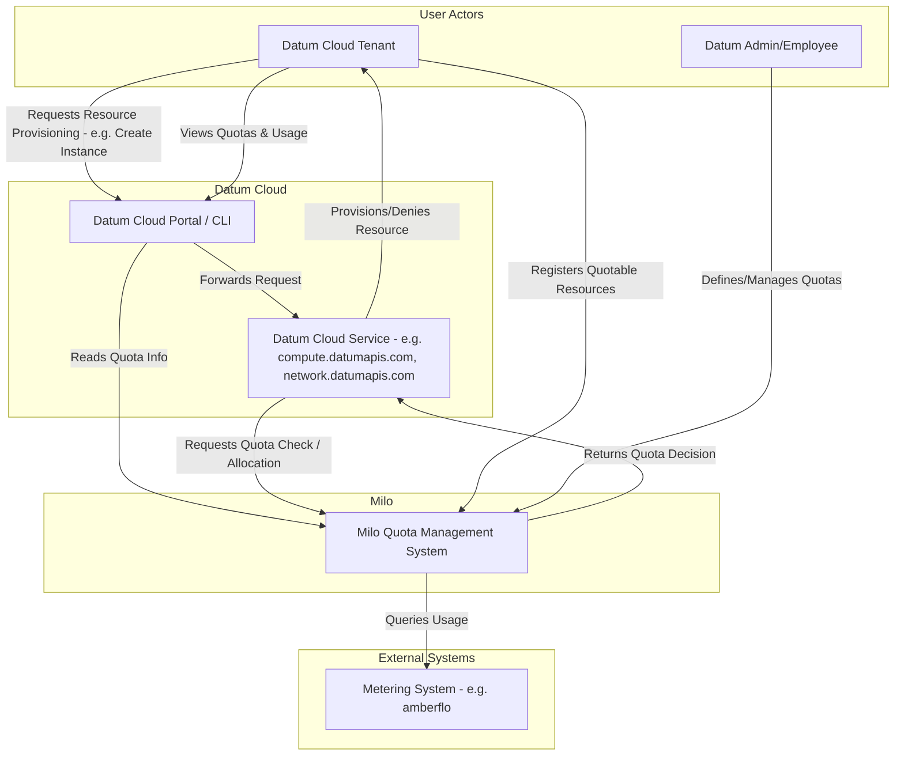
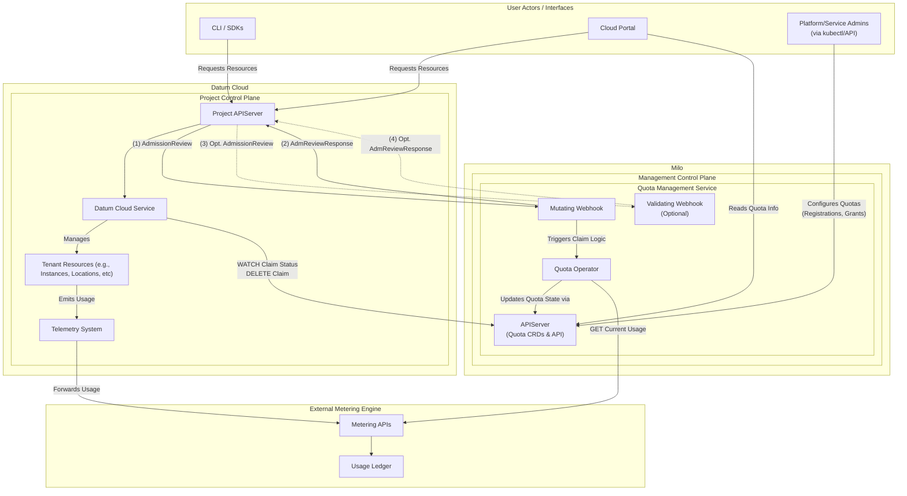
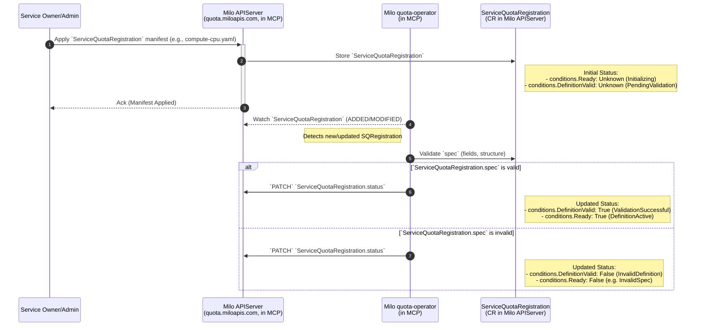
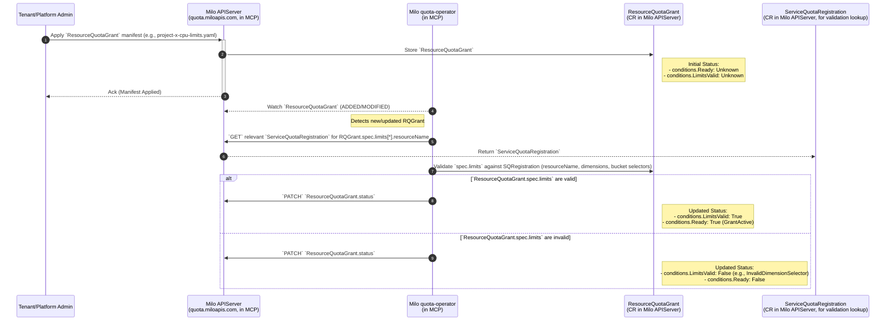
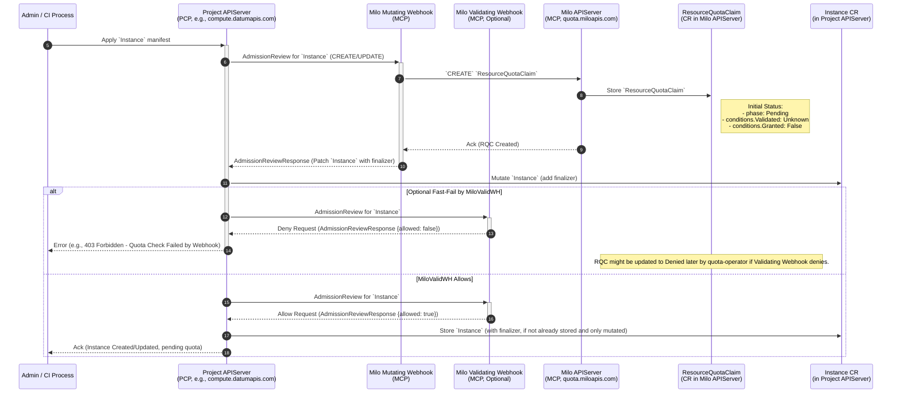
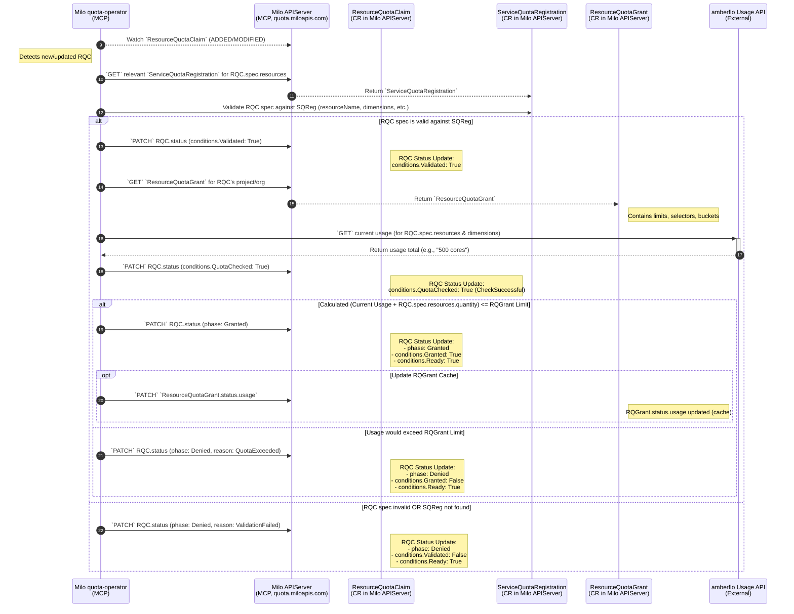
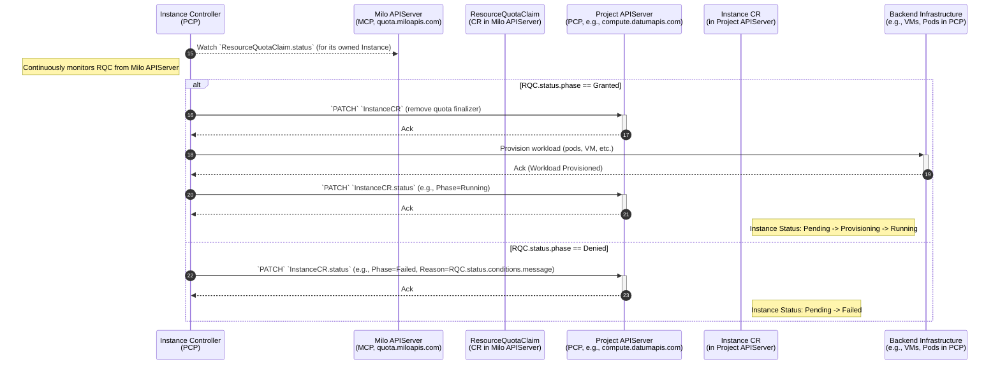
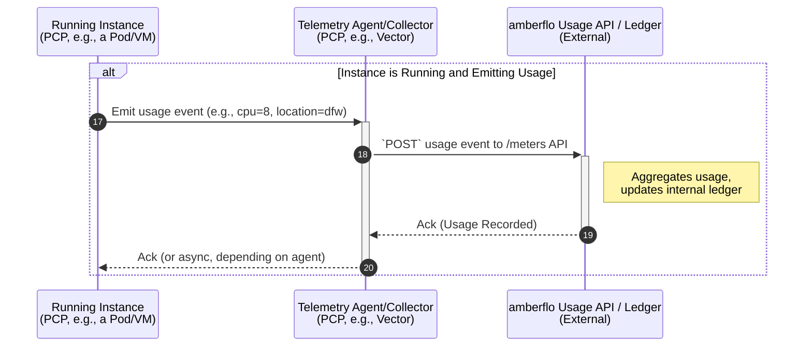
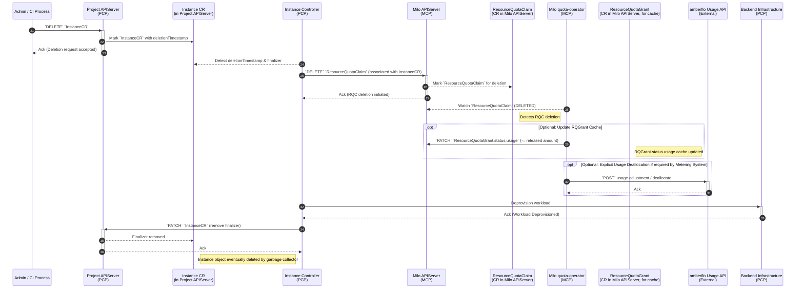

# Quota Management


## Table of Contents

- [Quota Management](#quota-management)
  - [Summary](#summary)
  - [Motivation](#motivation)
    - [Goals](#goals)
    - [Non-Goals](#non-goals)
  - [Proposal](#proposal)
    - [Desired Outcome and Definition of
      Success](#desired-outcome-and-definition-of-success)
    - [Key Components and Capabilities](#key-components-and-capabilities)
    - [User Stories (Optional)](#user-stories-optional)
      - [Story 1](#story-1)
      - [Story 2](#story-2)
    - [Notes/Constraints/Caveats (Optional)](#notesconstraintscaveats-optional)
    - [Risks and Mitigations](#risks-and-mitigations)
  - [Design Details](#design-details)
    - [Custom Resource Definitions](#custom-resource-definitions)
      - [`ServiceQuotaRegistration`](#servicequotaregistration)
      - [`ResourceQuotaGrant`](#resourcequotagrant)
      - [`ResourceQuotaClaim`](#resourcequotaclaim)
    - [Quota Registration](#quota-registration)
    - [Quota Operator Controller](#quota-operator-controller)
    - [Admission Webhooks](#admission-webhooks)
    - [Architecture Diagrams](#architecture-diagrams)
      - [C1 Diagram - System Context](#c1-diagram---system-context)
      - [C2 Diagram - Containers/Components](#c2-diagram---containerscomponents)
    - [Sequence Diagrams](#sequence-diagrams)
      - [Sequence Diagram Step Breakdown](#sequence-diagram-step-breakdown)
        - [Service Quota Definition
          RegistrationPrerequisite](#service-quota-definition-registration-prerequisite)
        - [Defining Resource Quota Limits (`ResourceQuotaGrant` Creation)](#defining-resource-quota-limits-resourcequotagrant-creation)
        - [Instance Provisioning &
          AdmissionControl](#instance-provisioning--admission-control)
        - [Quota Reconciliation by
          `quota-operator`](#quota-reconciliation-by-quota-operator)
        - [Owning Service Reacts to `ResourceQuotaClaim`
          `Status`](#owning-service-reacts-to-resourcequotaclaim-status)
        - [Telemetry & Metering
          FlowPost-Provisioning](#telemetry--metering-flow-post-provisioning)
        - [Tear-down & Quota Release](#tear-down--quota-release)
  - [Production Readiness
    ReviewQuestionnaire](#production-readiness-review-questionnaire)
    - [Feature Enablement and Rollback](#feature-enablement-and-rollback)
      - [How can this feature be enabled / disabled in a live
        cluster?](#how-can-this-feature-be-enabled--disabled-in-a-live-cluster)
      - [Does enabling the feature change any default
        behavior?](#does-enabling-the-feature-change-any-default-behavior)
      - [Can the feature be disabled once it has been enabled (i.e. can we roll
        back
        theenablement)?](#can-the-feature-be-disabled-once-it-has-been-enabled-ie-can-we-roll-back-the-enablement)
      - [What happens if we reenable the feature if it was previously rolled
        back?](#what-happens-if-we-reenable-the-feature-if-it-was-previously-rolled-back)
      - [Are there any tests for feature
        enablement/disablement?](#are-there-any-tests-for-feature-enablementdisablement)
    - [Rollout, Upgrade and Rollback
      Planning](#rollout-upgrade-and-rollback-planning)
      - [How can a rollout or rollback fail? Can it impact already running
        workloads?](#how-can-a-rollout-or-rollback-fail-can-it-impact-already-running-workloads)
      - [What specific metrics should inform a
        rollback?](#what-specific-metrics-should-inform-a-rollback)
      - [Were upgrade and rollback tested? Was the upgrade->downgrade->upgrade
        path
        tested?](#were-upgrade-and-rollback-tested-was-the-upgrade-downgrade-upgrade-path-tested)
      - [Is the rollout accompanied by any deprecations and/or removals of
        features, APIs, fields of API types, flags,
        etc.?](#is-the-rollout-accompanied-by-any-deprecations-andor-removals-of-features-apis-fields-of-api-types-flags-etc)
    - [Monitoring Requirements](#monitoring-requirements)
      - [How can an operator determine if the feature is in use by
        workloads?](#how-can-an-operator-determine-if-the-feature-is-in-use-by-workloads)
      - [How can someone using this feature know that it is working for their
        instance?](#how-can-someone-using-this-feature-know-that-it-is-working-for-their-instance)
      - [What are the reasonable SLOs (Service Level Objectives) for the
        enhancement?](#what-are-the-reasonable-slos-service-level-objectives-for-the-enhancement)
      - [What are the SLIs (Service Level Indicators) an operator can use to
        determine the health of the
        service?](#what-are-the-slis-service-level-indicators-an-operator-can-use-to-determine-the-health-of-the-service)
      - [Are there any missing metrics that would be useful to have to improve
        observability of this
        feature?](#are-there-any-missing-metrics-that-would-be-useful-to-have-to-improve-observability-of-this-feature)
    - [Dependencies](#dependencies)
      - [Does this feature depend on any specific services running in the
        cluster?](#does-this-feature-depend-on-any-specific-services-running-in-the-cluster)
    - [Scalability](#scalability)
      - [Will enabling / using this feature result in any new API
        calls?](#will-enabling--using-this-feature-result-in-any-new-api-calls)
      - [Will enabling / using this feature result in introducing new API
        types?](#will-enabling--using-this-feature-result-in-introducing-new-api-types)
      - [Will enabling / using this feature result in any new calls to the cloud
        provider?](#will-enabling--using-this-feature-result-in-any-new-calls-to-the-cloud-provider)
      - [Will enabling / using this feature result in increasing size or count
        of the existing API
        objects?](#will-enabling--using-this-feature-result-in-increasing-size-or-count-of-the-existing-api-objects)
      - [Will enabling / using this feature result in increasing time taken by
        any operations covered by existing
        SLIs/SLOs?](#will-enabling--using-this-feature-result-in-increasing-time-taken-by-any-operations-covered-by-existing-slisslos)
      - [Will enabling / using this feature result in non-negligible increase of
        resource usage in any
        components?](#will-enabling--using-this-feature-result-in-non-negligible-increase-of-resource-usage-in-any-components)
      - [Can enabling / using this feature result in resource exhaustion of some
        node resources (PIDs, sockets, inodes,
        etc.)?](#can-enabling--using-this-feature-result-in-resource-exhaustion-of-some-node-resources-pids-sockets-inodes-etc)
    - [Troubleshooting](#troubleshooting)
      - [How does this feature react if the APIServer is
        unavailable?](#how-does-this-feature-react-if-the-apiserver-is-unavailable)
      - [What are other known failure
        modes?](#what-are-other-known-failure-modes)
      - [What steps should be taken if SLOs are not being met to determine the
        problem?](#what-steps-should-be-taken-if-slos-are-not-being-met-to-determine-the-problem)
  - [Implementation History](#implementation-history)
  - [Drawbacks](#drawbacks)
  - [Alternatives](#alternatives)
  - [Infrastructure Needed (Optional)](#infrastructure-needed-optional)


## Summary

This enhancement proposes the architecture and implementation of a comprehensive
quota management system within the Milo platform. This system, operating as a
centralized service within the Datum Management Control Plane (MCP), will
empower Datum Employees and Datum Cloud administrators to define, manage, and
enforce resource consumption limits at both the organizational and project
levels.

Datum employees will have the ability to view and modify these quota levels at a
global level across all organizations and projects, while Datum Cloud
administrators will be able to view and manage their allocated quotas and
current resource usage within the Datum Cloud Portal. 

The system aims to provide predictable capacity management, enable customer tier
enforcement, offer transparency to customers regarding their resource limits,
and include enforcement mechanisms to reject claim requests that would exceed
these limits. Furthermore, **services offered on the Datum Cloud platform,
operating within individual PCPs)** will be able to register the resources they
manage for quota protection and set default quota levels by interacting with the
central Milo Quota Management service.

## Motivation

The ability to create, observe, and self-manage resource quotas within
organizations and their projects provides numerous benefits to both internal and
external administrators of the system. By providing full transparency and
observability into quota management and resource consumption, quota management
also ensures:

1. Operational stability and reliability
2. Accurate cost predictability
3. Prevention of accidental or abusive overuse
4. Confidence in resource planning and the enforcement of internal and
   regulatory policies.

The safeguards put in place through quota management will enable users to fully
explore the Datum Cloud and Milo ecosystems and the variety of functionality
they provide, without the risk of exceeding the thresholds that have been set
within their organization and projects; leading to unexpected costs incurred by
the tenant.

### Goals

- Provide clear system context and architectural approach to the creation of a
  quota management system within Milo that integrates with Datum Cloud services,
- Define the APIs that **Datum Cloud services** will use to:
  - Register quotas for specific services and their resources with optional
    default limits.
  - Create and manage quota limits on the resources via dimensions and labels
    with the ability to override the default limits and less specific limits set
    as fallbacks.
  - Create claims that request additional resources, allocations, or
    deprovisioning.
- Define the API for **Datum Cloud tenants** to view and manage their quota
  limits and the live data showing the current resources consumed against each
  quota.
- Define the API for **Datum Employees** to create and manage global quota
  limits applied to all organizations and projects across the platform.
- Enable full visibility into the consumption metrics of provisioned workloads
  running in Datum Cloud in relation to set quota limits.
- Ensure the system can enforce defined quota limits, for example, by rejecting
  API requests that would exceed these limits.
- Facilitate predictable capacity management for the platform.
- Enable enhancement document handoff for implementation of the quota management
  enhancement within Datum Cloud.
- Remain service agnostic to not avoid tightly coupling the architecture to a
  specific SaaS vendor (amberflo, OpenMeter, etc)

### Non-Goals

- Provide detailed implementation specifics of how the metering and billing
  components of the system will work, outside of the acknowledgement of their
  overall role in system architecture from a quota management perspective. This
  includes how resource consumption is translated into actual billable units and
  invoices via the telemetry pipeline.
- Provide implementation specifics of any third-party SaaS integration in
  regards to quota management, metering and billing engines, beyond the example
  of amberflo used in this enhancement as the initial platform to be integrated
  with.
- Support customer tier enforcement (e.g., free vs. paid tiers) through
  configurable quotas (which will be implemented as a future enhancement).
- Define the future Milo Service Catalog and service registration (distinct from
  the service registration for quota management).
- Define the exact user interface (UI) mockups or user experience (UX) flows for
  managing or viewing quotas, beyond initial design for the MVP.
- Define how time-series metrics (e.g. CPU hours, data written, etc) will be
  implemented by the data plane.
- Define how alerts can be created and sent to organizational and project
  administrators to inform them that they are approaching the quota threshholds
  they set for the resources. These "early warning" alerts are *not* enforced by
  the quota system, nor a part of this enhancement.

## Proposal

This enhancement proposes the design, architecture, and implementation of a
quota management system in Milo, which will operate as a centralized service
within the Datum Management Control Plane (MCP) and integrate with Datum Cloud
services running in tenant Project Control Planes (PCPs). The system will allow
for the registration, management, and enforcement of resource quota limits at
both organizational and project levels by external and internal administrators.

### Desired Outcome and Definition of Success

Once implemented, the Milo Quota Management system (hosted in the MCP) will have
seamless integration with Datum Cloud services (running in PCPs) and downstream
external vendors. Both internal and external platform administrators will be
able to use the system to easily create and manage quotas through highly
scalable architecture and implementation. The system should properly allocate
and deallocate resources when claims are granted, deny claims that exceed set
limits, and stay in sync with integrated downstream systems such as amberflo.

### Key Components and Capabilities

There are several key components that will comprise the architecture and
implementation of the quota management system, primarily residing within the
Datum Management Control Plane (MCP) and exposing APIs for interaction from
tenant Project Control Planes:

1.  **`ResourceQuotaClaim` Definition (Hosted in MCP):**
    - **Tenants (via their project/org administrators or automated processes,
      interacting with Owning Services in PCPs)** can use the API (indirectly,
      by creating resources like Instances in their PCP) to request additional
      resources, allocations, or deprovisioning of resources. The Owning
      Service, via a webhook calls to Milo in the MCP, triggers the creation of
      a `ResourceQuotaClaim` in the Milo APIServer.
    - Claims will contain the relationship between owning/parent resources and
      the resources being requested within them.
    - Claims will be used when determining whether the request should be granted
      or denied by being compared to the `ResourceQuotaGrant` limits. W
2. **`ResourceQuotaGrant` Definition (Hosted in MCP):**
    - **Platform Administrators (Datum Employees)** can define global default
      quota grants for all resources by creating `ResourceQuotaGrant` objects in
      the Milo APIServer that apply to all projects and organizations across the
      platform.
    - **Organizational Administrators (Tenants)** can define
      organization-specific quotas by creating `ResourceQuotaGrant` objects in
      the Milo APIServer that apply to all projects within the organization.
    - **Project Administrators (Tenants)** can define project-specific quotas by
      creating `ResourceQuotaGrant` objects in the Milo APIServer that apply to
      specific projects within the organization.
    - In a future enhancement, resource quotas will be able to support different
      customer tiers and plans, allowing for varied limits based on subscription
      levels (e.g., "Free Tier gets 1 collaborator" and "Pro Tier gets
      unlimited").

3. **`ServiceQuotaRegistration` Definition (Hosted in MCP):**
    - **Service Owners/Administrators (representing the Datum Cloud service
      instances, which are hosted within the tenant PCPs)** can register
      resources to allow them to be managed by quotas by creating
      `ServiceQuotaRegistration` objects in the Milo APIServer.
    - This is necessary for creating `ResourceQuotaGrant` objects that define
      quota limits, as well as for requesting resources and generating a
      `ResourceQuotaClaim`.
    - If an attempt is made to generate a claim on a resource that has yet to be
      registered, it will be denied.

4.  **Quota Enforcement (Orchestrated from MCP):**
    - The system will include a mutating admission webhook (running in the MCP,
      but configured on Owning Service APIServers in PCPs) and a
      `quota-operator` reconciler (running in the MCP) to check against defined
      quotas during resource creation, modification, or deletion requests
      originating in PCPs.
    - The system will determine near real-time metric usage via integration with
      a downstream metering engine (e.g. amberflo, which is used as an example
      in this enhancement) to determine if the request should be granted or
      denied.
    - Requests exceeding the defined limits will be rejected with appropriate
      error messaging.
    - Denied quotas will be appropriately logged and persisted, creating
      additional observability and an audit trail detailing why specific claim
      requests were denied.
    - The system will be designed to be resilient to failures of the metering
      engine and the Milo APIServer, ensuring that the system can continue to
      function even if one of these components is unavailable.

5.  **Quota Visibility:**
    - Datum Cloud tenants will be able to view their current quota allocations
      and their consumption of resources against their self managed and global
      platform quotas via the Datum Cloud Portal.
    - Datum Employees (internal administrators) will have the ability to view
      and modify quota levels for all projects and organizations via the Datum
      Staff Portal.

6.  **Service Integration (MCP coordinating with PCPs):**
    - Services offered on the Datum Cloud platform running within the tenant
      PCPs will need a mechanism to register the resources they manage (via
      `ServiceQuotaRegistration` in the MCP) that should be subject to quotas.
    - A centralized API, hosted by the Milo APIServer in the MCP, will be
      designed for services to register these quotable resources and
      subsequently manage their quota limits for projects and organizations via
      a `ResourceQuotaGrant`.
    - The integration of the downstream metering engine and billing processor
      platform will remain service-agnostic to ensure flexibility of
      implementation in the future.
      - *Note: amberflo is used in this enhancement as an example and will be
        the initial platform of choice for metering and billing.*

7.  **Architectural Considerations:**
    - Initially, [Kubernetes
      ResourceQuotas](https://kubernetes.io/docs/concepts/policy/resource-quotas/)
      were explored for project-level resource control, while acknowledging
      potential limitations for project-wide (cross-namespace) totals. Due to
      this limitation, Kubernetes ResourceQuotas were determined to not provide
      the functionality desired for cross-namespace resource quota management.
    - Tying a "Resource Grant" to a product plan and tiers, as discussed in
      [enhancement issue
      #78](https://github.com/datum-cloud/enhancements/issues/78), will be added
      as a future enhancement to dynamically configure quotas based on the
      specific plans and tiers.
    - A "Resouce Claim", as represented in this enhancement, was inspired by the
      `ResourceClaim` type within the [Kubernetes Dynamic Resource Allocation
      API](https://kubernetes.io/docs/concepts/scheduling-eviction/dynamic-resource-allocation/#api)
      to model how changes to resources are requested

**Proposal Deliverables**
- An updated enhancement document (this document) detailing the system
  architecture
- A Proof of Concept (POC) demonstrating functional quota system in Milo
  integrated with a Datum Cloud project, and a complete API design for service
  quota registration and management.

### User Stories (Optional)

<!--
Detail the things that people will be able to do if this Enhancement is implemented.
Include as much detail as possible so that people can understand the "how" of
the system. The goal here is to make this feel real for users without getting
bogged down.
-->

#### Story 1
 As a Datum Cloud tenant administrator, I should be able to view and manage
 quota limits for my organization and project-level resources, so that I can
 easily manage the resource limits configured for my organization and projects.

#### Story 2
 As a Datum Cloud Employee, I should be able to view and manage quota limits for
 all projects and organizations across the platform, so that I can ensure that
 the platform is operating within the limits set for each organization and
 project.

### Notes/Constraints/Caveats (Optional)

<!--
What are the caveats to the proposal?
What are some important details that didn't come across above?
Go in to as much detail as necessary here.
This might be a good place to talk about core concepts and how they relate.
-->

### Risks and Mitigations

Different risks must be taken into account when considering implementation of
the Quota Management system to ensure the system is working as expected and the
risks are mitigated.

Best practices will be enforced by reviewers based on their knowledge of the
Datum Cloud ecosystem, including security and alignment with established
external and internal standards.

- **Risk:** The potential to block all resource creation, preventing
  administration of resources due to network failure or timeouts.
  - **Mitigations (High-Level):**
    - **Webhook Timeouts & Failure Policy:** Configure admission webhooks (Milo
      Mutating & Validating) with aggressive timeouts. Set their `failurePolicy`
      to `Ignore`. This ensures that if the Quota Management Service is
      unreachable or times out, resource creation/modification requests to
      Owning Services can still proceed (albeit without immediate quota
      enforcement). This prioritizes platform availability.
    - **`quota-operator` Resilience:** Design the `quota-operator` to retry
      calls to external dependencies like the metering system (`amberflo`) with
      exponential backoff. If dependencies are unavailable for an extended
      period, the operator should clearly indicate this (e.g., in
      `ResourceQuotaClaim` status) and might temporarily deny new claims (or use
      cached data with *extreme caution* if implemented, clearly marking
      approvals as conditional).
    - **Monitoring & Alerting:** Implement comprehensive monitoring and alerting
      for the Quota Management Service and its connectivity to critical
      dependencies (Milo APIServer, `amberflo`).
    - **Emergency Bypass (Break-Glass Procedure):** For extreme, prolonged
      outages of the core quota enforcement mechanism, a well-documented,
      audited, and access-controlled procedure should allow Datum Employees to
      temporarily bypass quota checks (e.g., by temporarily removing or altering
      webhook configurations). This is a last-resort measure, as it introduces
      manual intervention and potential for misconfiguration.
- **Risk:** The potential for actual resource usage being out-of-sync with the
  cluster-state, leading to: 
  - Allowing allocation of resources beyond the set quota limits on both
    external and internal levels, bypassing enforcement.
    - **Mitigations (High-Level):**
      - **Authoritative Usage Source:** The `quota-operator` must treat the
        external metering system (`amberflo`) as the authoritative source of
        truth for current usage when evaluating `ResourceQuotaClaim`s.
      - **Webhook `failurePolicy: Ignore` Trade-off:** Acknowledging that
        setting `failurePolicy: Ignore` for webhooks (to maintain platform
        availability if Milo is down) can lead to temporary periods where new
        resources are provisioned without an immediate quota check. This could
        result in temporary over-allocation.
      - **Post-Outage Reconciliation:** When the Milo Quota Management service
        recovers (or webhooks are re-enabled/fixed), the `quota-operator` will
        reconcile existing claims and usage. New requests for already over-limit
        projects/organizations will be denied until usage falls within limits.
        Alerts can be triggered for SREs/Platform Admins to review significant
        discrepancies.
      - **Robust Telemetry Pipeline:** Ensure the telemetry pipeline sending
        usage data to the metering system (`amberflo`) is resilient, with
        appropriate retries, buffering (e.g., in Vector agents), and error
        handling to minimize lost or delayed usage data.
  - **Risk:** Denying resource allocation when there are enough free resources to allow
    the request the ability to proceed.
    - **Mitigations (High-Level):**
      - **Real-time Usage Queries:** The `quota-operator` should *always*
        attempt to query the metering system (`amberflo`) in real-time for the
        most up-to-date usage data before making a decision on a
        `ResourceQuotaClaim`.
      - **Cautious Use of Cached Data:** If the optional caching of usage in
        `ResourceQuotaGrant.status.usage` is implemented, this data *must* be
        treated as potentially stale. Decisions based purely on this cache
        should be extremely limited (e.g., only for clear-cut denials where
        requested > hard_limit_from_cache, never for granting claims if amberflo
        is unreachable). Logic should *always* favor fresh data from the
        metering engine.
      - **Metering System Reliability:** The accuracy and timeliness of the
        metering system itself are crucial and should be configured for high
        availability and low data latency.
      - **Clear Status Reporting:** If a claim is denied due to inability to
        contact the metering system (despite retries), the
        `ResourceQuotaClaim.status` should clearly reflect this reason (e.g.,
        `MeteringSystemUnavailable`), distinguishing it from a denial due to
        actual quota exhaustion.

## Design Details

The Milo Quota Management System will be deployed as a series of components
within the central Datum Management Control Plane (MCP). It will expose APIs and
interact with Datum Cloud service instances, which are hosted within individual
Project Control Planes (PCPs) for each tenant project.

### Custom Resource Definitions

Three main CRDs will be created as core components of the Quota Management
implementation: `ServiceQuotaRegistration`, `ResourceQuotaClaim` and
`ResourceQuotaGrant`. These CRDs will be defined and served by the **Milo
APIServer**, a central component running within the Datum MCP. The API group for
these CRDs will be `quota.miloapis.com`, aligning with existing API group
standards; while the Go type definitions for these CRDs will be located within
the [milo GitHub repository](https://github.com/datum-cloud/milo).

Other `*.datumapis.com` API groups referenced in this document, such as
`compute.datumapis.com` (hosting resources like `Instance`) and
`network.datumapis.com` (hosting resources like `Subnet`), are served by
individual **Project APIServers**. Each Project APIServer is dedicated to a
specific tenant project and runs its own control plane. These Project APIServers
are *not* where the Milo quota CRDs reside. However, they will be configured
(via
[multicluster-runtime](https://github.com/kubernetes-sigs/multicluster-runtime))
to call Milo's admission webhooks (which run in the MCP and interact with the
Milo APIServer) when tenant resources are created or modified.

#### `ServiceQuotaRegistration`

The `ServiceQuotaRegistration` CRD, hosted by the **Milo APIServer** in the MCP,
allows **Datum Cloud Services** to define and register the specific resource
types (e.g., `compute.datumapis.com/instances/cpu`) that will become available
to then have quotas applied to them across the platform via a
`ResourceQuotaGrant`. Services interact with the Milo APIServer to manage these
registrations.

The inclusion of the `ServiceQuotaRegistration` CRD decouples the registration
of service quotas and the subsequent management of the quotas themselves;
removing the need to make changes for every new resource type. This will allow
for the system to be more flexible and scalable, as well as easier to maintain
and update over time.

```yaml
apiGroup: quota.miloapis.com
kind: ServiceQuotaRegistration
metadata:
  # Unique name for the registration
  name: <my-service-quota-registration>
spec:
  # Service which owns the resource being registered.
  serviceRef:
    apiGroup: compute.datumapis.com
    kind: Service
    name: compute.datumapis.com
    uid: <uid>
  # Fully qualified name of the resource being managed.
  # This should match the 'name' field in `ResourceQuotaClaim.spec.resources`
  # and also in `ResourceQuotaGrant.spec.limits`.
  resourceName: compute.datumapis.com/instances/cpu
  # Description of the resource.
  description: "Number of CPU cores allocated to provisioned instances."
  # The unit of measurement for the resource.
  unit: "cores"
  # Optional default limit for this resource quota, which can be overridden by
  # ResourceQuotaGrant buckets.
  defaultLimit:
    value: "1000"
  # Allowed demensions that can be used in ResourceQuotaGrant selectors.
  # for the service and resources being registered.
  allowedDimensions:
    - networking.datumapis.com/location
    - compute.datumapis.com/instanceType
Status:
  # The specific version of the ServiceQuotaRegistration that was observed by
  # the Milo APIServer.
  observedGeneration: 1
  # Standard kubernetes approach to represent the state of a resource.
  conditions:
    # Indicates if the definition is valid, accepted, and the resource can be managed.
    # - Type: Ready
    # - Status: "True" | "False" | "Unknown"
    # - Reason: (e.g., "DefinitionActive" | "InvalidDefinition" | "Initializing")
    # - Message: Human-readable message detailing status reason 
    #   (e.g. "The service's resource is ready to be managed by quotas.")
    - type: Ready
      status: Unknown
      lastTransitionTime: "2023-01-01T12:00:00Z"
      reason: Initializing
      message: "The definition is being initialized."
    # Indicates if the structure of the ServiceQuotaRegistration itself is correct.
    # - Type: DefinitionValid
    # - Status: "True" | "False" | "Unknown"
    # - Reason: (e.g., "PendingValidation" | "ValidationSuccessful" | 
    #   "MissingRequiredField" | "InvalidFormat")
    # - Message: Human-readable message detailing any validation issues.
    - type: DefinitionValid
      status: Unknown
      lastTransitionTime: "2023-01-01T12:00:00Z"
      reason: PendingValidation
      message: "Validation of the definition structure is pending."
```


#### `ResourceQuotaGrant`

The `ResourceQuotaGrant` CRD, hosted by the **Milo APIServer** in the MCP,
declares the resource quota limits for a project or organization. It is a
**Namespaced** resource within the Milo APIServer, meaning each grant will
reside within a namespace that corresponds to the specific project or
organization it governs.

```yaml
apiGroup: quota.miloapis.com
kind: ResourceQuotaGrant
metadata:
  name: proj-abc
  # Namespace of the project/organization this grant applies to
  namespace: proj-abc
  uid: <uid>
spec:
  # Reference to project or oganization since the CRD can use either
  resourceRef:
    apiGroup: resources.datumapis.com
    # Either Project or Organization
    kind: Project
    # Name of the Project/Organization custom resource
    name: proj-abc
  limits:
  # 1. CPU cores allocated per project / location / instance type
  - name: compute.datumapis.com/instances/cpu
    # Dimension labels are the same as the resource name.
    dimensionLabels:
      - resources.datumapis.com/project
      - networking.datumapis.com/location
      - compute.datumapis.com/instanceType
    buckets:
    # Default limit for all locations and instance types across the project,
    # which overrides the default limit set in the ServiceQuotaRegistration.
    # This is a global limit, and will apply to all locations, since the
    # Dimension label is not specified within the bucket selector.
    - value: "1000"
      selector: {}
    # Override for multi-location projects.
    - value: "300"
      selector:
        matchExpressions:
        - key: networking.datumapis.com/location
          operator: In
          values: ["dfw", "lhr", "dls"]

    # Single location and instance type override,
    # more specific than the global limit and multi-location override.
    - value: "40"
      selector:
        matchLabels:
          networking.datumapis.com/location: dfw
          compute.datumapis.com/instanceType: datumcloud/d1-standard-2

  # 2. Memory (GiB) allocated per project / location / instance type
  - name: compute.datumapis.com/instances/memoryAllocated
    dimensionLabels:
      - resources.datumapis.com/project
      - networking.datumapis.com/location
      - compute.datumapis.com/instanceType
    buckets:
    - value: "4096"
      selector: {}

    - value: "1024"
      selector:
        matchLabels:
          networking.datumapis.com/location: dfw

  # 3. Instance count per project / location / instance type
  - name: compute.datumapis.com/instances/count
    dimensionLabels:
      - resources.datumapis.com/project
      - networking.datumapis.com/location
      - compute.datumapis.com/instanceType
    buckets:
    - value: "200"
      selector: {}
    - value: "20"
      selector:
        matchLabels:
          instanceType: datumcloud/d1-standard-2
    - value: "5"
      selector:
        matchLabels:
          networking.datumapis.com/location: dfw
          compute.datumapis.com/instanceType: datumcloud/d1-standard-2

  # 4. Gateway count per project
  - name: network.datumapis.com/gateways
    dimensionLabels:
      - resources.datumapis.com/project
    buckets:
    - value: "15"
      selector: {}

    - value: "3"
      selector:
        matchExpressions:
        - key: networking.datumapis.com/location
          operator: Exists
# Status reflects the validity and applicability of the defined quotas.
Status:
  observedGeneration: 1
  # Optional: Cache of current usage for each bucket.
  usage:
  - name: compute.datumapis.com/instances/cpu
    buckets:
    # Global usage without any selectors
    - selector: {}
      used: "500"
    # Selector-specific usage
    - selector:
        matchLabels:
          networking.datumapis.com/location: dfw
          compute.datumapis.com/instanceType: datumcloud/d1-standard-2
      used: "10"
  # Standard kubernetes approach to represent the state of a resource.
  conditions:
    # Indicates if the grant is correctly configured and actively being used.
    # - Type: Ready
    # - Status: "True" | "False" | "Unknown"
    # - Reason: (e.g., "GrantActive" | "InvalidLimitsConfiguration" | "NotEnforced")
    # - Message: Human-readable message detailing the Reason value.
    - type: Ready
      status: Unknown
      lastTransitionTime: "2023-01-01T12:00:00Z"
      reason: Initializing
      message: "ResourceQuotaGrant is being initialized."
    # Indicates if the spec.limits are well-formed and logically consistent.
    # - Type: LimitsValid
    # - Status: "True" | "False" | "Unknown"
    # - Reason: (e.g., "ValidationSuccessful" | "InvalidDimensionSelector" | "ResourceNotDefined")
    # - Message: Human-readable message detailing any issues.
    - type: LimitsValid
      status: Unknown
      lastTransitionTime: "2023-01-01T12:00:00Z"
      reason: PendingValidation
      message: "Validation of limits is pending."
    # Optionally indicates the freshness of cached usage data, if implemented.
    # - Type: UsageSynchronized
    # - Status: "True" | "False" | "Unknown"
    # - Reason: (e.g., "SyncSuccessful" | "SyncFailed" | "StaleData" | "CachingDisabled")
    - type: UsageSynchronized
      status: Unknown
      lastTransitionTime: "2023-01-01T12:00:00Z"
      reason: PendingSync
      message: "Usage data synchronization is pending."
```

#### `ResourceQuotaClaim`

The `ResourceQuotaClaim` CRD, hosted by the **Milo APIServer** in the MCP,
represents the *intent* of the request to create, update/scale, or delete
resources against a defined quota. When a user attempts to create a resource
(e.g., an `Instance`) by interacting with their **Project APIServer**, that
Project APIServer (via a configured webhook) will trigger the creation of a
`ResourceQuotaClaim` in the central **Milo APIServer**. This CRD contains a
reference to the owner of the resources that are being requested (e.g. an
`Instance` CR managed by a Project APIServer), as well as the specific resource
requests, including name and quantity. It is a **Namespaced** resource within
the Milo APIServer, where the namespace corresponds to the tenant's project.

```yaml
apiGroup: quota.miloapis.com
kind: ResourceQuotaClaim
metadata:
  # Connect the claim's lifetime to the workload that needs the quota
  name: instance-abc123-claim
  # Namespace of the project/organization this claim applies to
  namespace: proj-abc
  uid: <uid>
  # Cleanup on resource deletion
  finalizers:
  - quota.miloapis.com/usage-release
spec:
  # The reference to the resource that owns the resources being requested. 
  # Will be used to key off of during reconciliation.
  resourceRef: 
    apiGroup: compute.datumapis.com 
    kind: Instance 
    name: instance-abc123 
    uid: <uid>
  # Resources being requested
  resources:
  - name: compute.datumapis.com/instances/cpu
    quantity: "8"
  - name: compute.datumapis.com/instances/memoryAllocated
    quantity: "32GiB"
  - name: compute.datumapis.com/instances/count
    quantity: "1"
Status:
  # High level summary
  phase: Pending    
  # List of resources that have been granted for this claim, 
  # using the fully qualified name of the resource.
  grantedResources: []  
  observedGeneration: 1
  # Standard kubernetes approach to represent the state of a resource.
  # https://github.com/kubernetes/community/blob/master/contributors/devel/sig-architecture/api-conventions.md#typical-status-properties
  conditions:
    # Ready indicates if the claim has been processed and is in a terminal state.
    # - Type: Ready
    # - Status: "True" (Granted/Denied) | "False" (Pending) | "Unknown"
    # - Reason: (e.g., "ClaimGranted" | "ClaimDenied" | "Processing")
    # - Message: Human-readable message detailing the reason for the status.
    - type: Ready
      status: "False"
      # Indicates time the status last changes e.g. from False to True
      lastTransitionTime: "2023-01-01T12:00:00Z"
      reason: Processing
      message: "Claim is currently being processed."
    # Validated indicates if the claim's spec has passed initial validation.
    # - Type: Validated
    # - Status: "True" | "False" | "Unknown"
    # - Reason: (e.g., "ValidationSuccessful" | "InvalidResourceRef" | "UnknownResourceName")
    # - Message: Human-readable message detailing the reason for the status.
    - type: Validated
      status: Unknown
      # Indicates time the status last changes e.g. from Unknown to True
      lastTransitionTime: "2023-01-01T12:00:00Z"
      reason: PendingValidation
      message: "Claim validation is pending."
    # QuotaChecked indicates if the quota availability has been checked.
    # - Type: QuotaChecked
    # - Status: "True" | "False" | "Unknown"
    # - Reason: (e.g., "PendingQuotaCheck" | "CheckSuccessful" | "MeteringServiceUnavailable" )
    # - Message: Human-readable message detailing the reason for the status.
    - type: QuotaChecked
      status: Unknown
      # Indicates time the status last changes e.g. from False to True
      lastTransitionTime: "2023-01-01T12:00:00Z"
      reason: PendingQuotaCheck
      message: "Quota check is pending."
    # Granted indicates if the claim was approved.
    # - Type: Granted
    # - Status: "True" if granted, "False" if denied or pending
    # - Reason: (e.g., "QuotaAvailable", "QuotaExceeded", "AwaitingDecision")
    # - Message: Human-readable message detailing the reason for the status.
    - type: Granted
      status: "False"
      # Indicates time the status last changes e.g. from False to True
      lastTransitionTime: "2023-01-01T12:00:00Z"
      reason: AwaitingDecision
      message: "Decision on granting the claim is pending."
```

### Quota Registration

To enable Datum Cloud services (whose resources are managed by Project
APIServers in tenant PCPs) to integrate with the quota management system, a
dedicated and centralized API, hosted by the **Milo APIServer** in the
Management Control Plane (MCP), will be provided. This API enables admins to
register services and the specific resource types that they want to be able to
create and manage quotas for. This results in the Milo APIServer being aware of
the types of resources that a project or organization are allowed to create
quotas for via a `ResourceQuotaGrant`.

This is achieved through the proposed [`ServiceQuotaRegistration`
CRD](#ServiceQuotaRegistration) (in the Milo APIServer), which acts as a
"catalog" for services to declare the types of resources they offer that *can*
be managed by the quota system at the project or organization level. This is
different than the Service Catalog, which will be proposed in a separate
enhancement.

**Datum CloudServices (via their Service Owners/Admins)** will create new
instances of `ServiceQuotaRegistration` in the **Milo APIServer** to declare
each type of resource they offer that can use quota limits. The `quota-operator`
can then use these definitions to understand and validate the tenant's requests
for setting the explicit limits for each resource type via a
`ResourceQuotaGrant`.

#### Quota Operator Controller

A `quota-operator` will be created to implement logic to convert the *intent* of
the incoming `ResourceQuotaClaim` object into the *actual allocation* of
resources. This controller will reside in the Milo Quota Management service and
**run within the Datum MCP**. Its core logic would reside in a path such as
`milo/internal/controller/quota-management/`, and it would be managed by Milo's
main application process (e.g., `milo/cmd/apiserver/app/`).

Running within the Milo MCP, it will:
- Watch `ServiceQuotaRegistration`, `ResourceQuotaGrant`, and
  `ResourceQuotaClaim` objects hosted by the **Milo APIServer**.
- Ensure accurate data is kept in sync with the downstream metering system
  (e.g., `amberflo`) by querying actual usage from the metering engine API.
- Optionally patch usage totals within the `ResourceQuotaGrant.status.usage`
  field to serve as a fail-fast cache.
- Enforce per-project or per-organization tenant resource quota limits that are
  declared in the `ResourceQuotaGrant` objects.

The reconciliation loop for this controller will contain the following logic,
primarily interacting with the **Milo APIServer** in the MCP:

1. **Validates Registration**:
  - Ensures that the specific requested service resource and dimensions, from a
    `ResourceQuotaClaim` in the **Milo APIServer**, have already been registered
    via a `ServiceQuotaRegistration`.
  - If the registration is not found, the operator sets the claim's
    `status.phase = Denied` and the `status.reason` to
    `"ServiceQuotaRegistration not found"`.

2. **Watches newly created or updated `ResourceQuotaClaim` objects** via
   Kubernetes informers connected to the **Milo APIServer**. These claims will
   be auto-generated by the Milo mutating admission webhook running in the MCP
   when a new resource (e.g., `Instance`, `Router`) is created, scaled, or
   deleted via a **Project APIServer**, and the Project APIServer calls the
   webhook.

3. **Validates the `ResourceQuotaClaim` structure**:
   - Ensures required fields like `resources`, `dimensions`, `resourceRef`, and
     other required fields are present and have a valid structure.
   - Verifies that the `resourceRef` (which points to a resource managed by a
     Project APIServer) is a valid reference to an existing resource.
     - **Note**: *The operator itself might not be able to directly access the
       Project APIServer to confirm the existence of the `resourceRef` object;
       this validation might be based on the structure or information propagated
       to the claim by the webhook.*
   - If validation fails, the operator sets the claim's `status.phase = Denied`
     with an appropriate `reason`.

4. **Retrieves the corresponding `ResourceQuotaGrant`**:
   - Looks up the `ResourceQuotaGrant` based on the owning resource's
     `spec.resourceRef.name` or `spec.resourceRef.uid` in the **Milo
     APIServer**.
   - Reads the declared `spec.limits` field, which contains the quota limits and
     bucket selectors.
   - Applies label/selector logic to find the correct bucket for the claim's
     dimensions (e.g., `networking.datumapis.com/location=dfw`,
     `compute.datumapis.com/instanceType=datumcloud/d1-standard-2`). 
   - If no bucket is found, the operator sets the claim `status.phase = Denied`
     with an appropriate `reason`.

5. **Queries the external usage source (e.g., amberflo)** via API to get the
     live usage data for the metric and dimension(s) defined in the claim (for a
     resource in a PCP).
   - If the API is unavailable, the operator sets the claim `status.phase =
     Denied` in the Milo APIServer with an appropriate `reason`.
   - This usage (queried from the metering engine) is treated as the
     *authoritative source of truth for the data*. The
     `ResourceQuotaGrant.status.usage` field is *not* the authoritative source
     of truth, since it is a cache and may be stale or partial.

6. **Evaluates whether the claim would exceed quota**:
   - Calculates: `actualUsage + requestedAmount > bucketLimit` within the Milo
     APIServer.
   - If the total would stay within the limit:
     - Optionally updates `ResourceQuotaGrant.status.usage` as the local cache
       of the most recently known usage for each quota bucket.
     - Sets `ResourceQuotaClaim.status.phase = Granted`.
   - If the request would exceed the quota:
     - Sets `ResourceQuotaClaim.status.phase = Denied` and provides a reason for
       the denial.
     - Emits an `Event` (associated with the `ResourceQuotaClaim` in the Milo
       APIServer) and records `status.reason` to the claim.

7. **Handles updates to `ResourceQuotaGrant` limits**:
   - When a Grant is updated (e.g., an admin raises CPU limits), the operator
     re-reconciles any affected `ResourceQuotaClaim`s within the Milo APIServer.
   - Previously denied claims may now be granted if usage fits under the new
     limits if they were raised.
   - Previously granted claims may now be denied if usage exceeds the new
     limits.

8. **Emits final status and metrics**:
   - Updates the `ResourceQuotaClaim.status` with the outcome (`Granted` or
     `Denied`).
   - Emits Prometheus metrics or logs (e.g., `quota_claims_granted_total`,
     `quota_claims_denied_total`) for observability and auditability.

**Optional Caching**

Patching the `ResourceQuotaGrant.status.usage` field is **optional**, but
recommended as it serves as a low-latency cache of the most recently known usage
for each quota bucket. This could provide several benefits to the system:

- *Fast-rejection* for obvious quota breaking claims without needing to query
  amberflo (e.g., requesting to claim 1000 GiB of written data while the quota
  limit is 100 GiB)
- *Auditability, observability, and transparency* by creating a point-in-time
  snapshot of denied claims which provides denial reasoning and other contextual
  information that can be stored for reference.
- *Best effort last known good view* fall-back if amberflo is temporarily
  unavailable

If implemented, the potential for stale data **must** be accounted for (as with
all caching implementations), and therefore *should not be used for final quota
enforcement nor billing purposes*.

**Failure Blast Radius**

If the `quota-operator` in the MCP is down, new `ResourceQuotaClaim`s (in the
**Milo APIServer**) will stall; however, workloads managed by Project APIServers
are not directly affected, and there is no blocking of writes to them if webhook
`failurePolicy` is set to `Ignore`.

#### Admission Webhooks

A *stateless mutating admission webhook* and an *optional validating admission
webhook* will be created as part of the Quota Management service. **These
webhook services will run within the Milo MCP.** Their Kubernetes configurations
(`MutatingWebhookConfiguration`, `ValidatingWebhookConfiguration`) will be
applied to the **Project APIServers** that manage quotable resources. This
registration will be facilitated by `multi-cluster-runtime`.

The logic for these webhooks will reside in the
`milo/internal/webhook/quota-management/` directory and be registered by the
main Milo application running in the MCP.

When a user attempts to create or modify a resource (e.g., an `Instance`) via
their **Project APIServer**, the APIServer will send an `AdmissionReview`
request to the configured Milo webhook service endpoint (running in the MCP);
aligning with [K8s Dynamic Admission
Control](https://kubernetes.io/docs/reference/access-authn-authz/extensible-admission-controllers/),
standard approach to webhook integration in Kubernetes.

- The **mutating webhook** is responsible for creating the `ResourceQuotaClaim`
  object in the central **Milo APIServer** and instructing the Project APIServer
  (via the `AdmissionReviewResponse`) to add finalizers to the original resource
  it manages.
- The **optional validating webhook** provides an additional safety check,
  potentially using cached data from `ResourceQuotaGrant`s in the **Milo
  APIServer** for fast-rejection. It responds to the **Project APIServer**.
- The Milo MCP will be responsible for managing the lifecycle of the webhooks,
  including their registration, configuration, and management.

This setup allows the Quota Management system to hook into the lifecycle of
resources managed by other Datum Cloud service instances (via their Project
APIServers) without those services needing direct, hardcoded knowledge of the
quota management system's specific quota check logic. They only need to have the
admissions webhooks registered with their own Project APIServers. This allows
the Quota Management system to be *pluggable* and *extensible* to support new
services and features without requiring changes to the system itself.

## Architecture Diagrams

### C1 Diagram - System Context



### C2 Diagram - Containers/Components



---

## Sequence Diagrams

The below sequence diagram illustrates the end-to-end flow of quota management,
from service registration to resource provisioning and eventual teardown.


### Sequence Diagram Step Breakdown

The sequence diagram steps are broken down into multiple sections for narrative
and ease of understanding. 

The breakdown is organized into the following main sections: 

- **Service Quota Definition Registration (Prerequisite)**
- **Defining Resource Quota Limits**
- **Instance Provisioning & Admission Control**
- **Quota Reconciliation by `quota-operator`**
- **Instance Controller Reacts to ResourceQuotaClaim Status from Milo**
- **Telemetry & Metering Flow (POST-Provisioning if Granted)**
- **Tear-down & Quota Release**

These steps also distinguish between:
- The **Owning Service** (e.g., `compute.datumapis.com`): The Datum Cloud
    service that owns a resource (e.g., `Instance`) and is responsible for its
    lifecycle, including actual provisioning. It runs within a **Project Control
    Plane (PCP)** and has its own K8s APIServer (referred to as the **Owning
    Service's K8s APIServer / PCP APIServer**).
- The **Milo Quota Management Service**: The centralized service running in the
    MCP (`quota.miloapis.com`) responsible for registering service quota
    definitions (`ServiceQuotaRegistration`), managing quota limits
    (`ResourceQuotaGrant`), and quota requests (`ResourceQuotaClaim`). It runs
    within the **Datum Management Control Plane (MCP)**, has its own APIServer
    (**Milo APIServer** in MCP), and contains the `quota-operator` and admission
    webhooks.

Interactions involving `Instance` CRs (or similar resources provided by an
Owning Service) occur with the Owning Service's APIServer within a PCP.
Interactions involving `ServiceQuotaRegistration`, `ResourceQuotaClaim`, and
`ResourceQuotaGrant` CRs occur with the Milo APIServer in the MCP.

#### Service Quota Definition Registration (Prerequisite)

Before any resource quotas can be claimed or enforced, the Owning Service must
define what resources types are enabled to be quotable.

1.  **Define & Apply `ServiceQuotaRegistration`**: The **Service Owner** (e.g.,
    an administrator for `compute.datumapis.com`, representing the service
    itself, which are deployed within PCPs) applies a `ServiceQuotaRegistration`
    manifest to the **Milo APIServer (`quota.miloapis.com`) in the MCP**. This
    `ServiceQuotaRegistration` declares a resource type (e.g., CPU per instance)
    offered by their service as manageable by the quota system.
2.  **Store & Initialize `ServiceQuotaRegistration`**: The **Milo APIServer**
    stores the `ServiceQuotaRegistration`. Its `status` is initialized.
3. **`quota-operator` Validates `ServiceQuotaRegistration`**: The
    `quota-operator`, which watches for `ServiceQuotaRegistration` resources
    within the Milo APIServer, detects the new or modified
    `ServiceQuotaRegistration`. It validates the `ServiceQuotaRegistration`'s
    `spec`.
4.  **Update `ServiceQuotaRegistration` Status**: Based on above validation.
    - **If Valid**: The `quota-operator` patches the
        `ServiceQuotaRegistration.status` field via the **Milo APIServer**. The
        owning service's resource type is now actively manageable by the quota
        system.
    - **If Invalid**: The `quota-operator` patches
        `ServiceQuotaRegistration.status` (via the **Milo APIServer**) to
        reflect the failure.



#### Defining Resource Quota Limits (`ResourceQuotaGrant` Creation)

After a service's resources are registered via `ServiceQuotaRegistration`, Tenant or Platform Administrators can define specific quota limits for projects or organizations by creating `ResourceQuotaGrant` resources in the Milo APIServer.

1.  **Admin Defines & Applies `ResourceQuotaGrant`**: A **Tenant Administrator**
    (for a specific project/org) or a **Platform Administrator** (for
    global/default grants) creates a `ResourceQuotaGrant` manifest. This
    manifest specifies the target project/organization, the `resourceName`
    (e.g., `compute.datumapis.com/instances/cpu`), and the `limits` including
    `buckets` with specific values and selectors (dimensions such as location
    and instance type). The admin applies this manifest to the **Milo APIServer
    (`quota.miloapis.com`) in the MCP**.
2.  **Store & Initialize `ResourceQuotaGrant`**: The **Milo APIServer** stores
    the new `ResourceQuotaGrant` CR. Its `status` is initialized (e.g.,
    `conditions.Ready: Unknown`, `conditions.LimitsValid: Unknown`).
3.  **`quota-operator` Validates `ResourceQuotaGrant`**: The `quota-operator`, watching `ResourceQuotaGrant` resources, detects the new CR. It validates the `spec.limits` against the corresponding `ServiceQuotaRegistration` (e.g., checking if `resourceName` is registered, if dimensions in selectors are allowed).
4.  **Update `ResourceQuotaGrant` Status**:
    - **If Valid**: The `quota-operator` patches the `ResourceQuotaGrant.status` (e.g., `conditions.LimitsValid: True`, `conditions.Ready: True`) via the **Milo APIServer**. The quota limits are now active and enforceable.
    - **If Invalid**: The `quota-operator` patches `ResourceQuotaGrant.status` (e.g., `conditions.LimitsValid: False`, `conditions.Ready: False` with reasons) via the **Milo APIServer**.



#### Instance Provisioning & Admission Control

Once services are registered as offering quotable resources, users can request
resources (e.g., an `Instance`) from the Owning Service's APIServer in the PCP.

5.  **Request `Instance` Creation**: An `Admin / CI` process (representing a
    tenant or an automated system) submits an `Instance` custom resource
    manifest to the **Owning Service's K8s APIServer (PCP APIServer, e.g., the
    `compute.datumapis.com` APIServer in a specific project).**
6.  **Mutating Webhook Intercepts & Modifies**: The **PCP APIServer** sends an
    `AdmissionReview` request for the `Instance` creation/update/deletion to the
    **Milo Mutating Webhook service** (which is registered with the PCP
    APIServer). - It modifies the `Instance` resource by adding a finalizer
    (e.g., `quota.miloapis.com/instance-protection`) in order to protect the
        `Instance` from being deleted while the quota claim is being processed.
        - It constructs and sends a `POST` request to the **Milo APIServer** to
    create and persist a new `ResourceQuotaClaim` object. - The webhook service
        returns an `AdmissionReviewResponse` (indicating success and including
    the mutated `Instance`) to the **PCP APIServer**. The PCP APIServer then
        continues its admission chain.
7.  **Validating Admission Webhook**: Following the mutating webhook phase, the
    **PCP APIServer** sends another `AdmissionReview` request to the **Milo
    Validating Webhook service** (if registered).
    - This webhook service performs a "fast-fail" check, potentially using
        cached data from `ResourceQuotaGrant`s in the Milo APIServer.
    - **If Denied by Validating Webhook**: The webhook service rejects the
        request. The **PCP APIServer** does not persist the `Instance` object.
        The `ResourceQuotaClaim` (if created) would eventually be updated by the
        `quota-operator` to `Denied`.
    - **If Allowed by Validating Webhook**: The webhook service allows the
        request. If all other admission controllers in the PCP APIServer also
        allow it, the `Instance` is persisted by the **PCP APIServer**. Actual
        provisioning is handled later by the Owning Service's controller in the
        PCP after explicit quota approval from Milo.



#### Quota Reconciliation by `quota-operator`

The `quota-operator` processes the `ResourceQuotaClaim`s stored in the Milo
APIServer to decide if the requested resources can be granted.

9.  **`quota-operator` Detects `ResourceQuotaClaim`**: The `quota-operator`
    detects the new `ResourceQuotaClaim` via its informer watching the Milo
    APIServer.
10. **Validate `ResourceQuotaClaim` Against `ServiceQuotaRegistration`**:
    - The `quota-operator` fetches the relevant `ServiceQuotaRegistration` from
        the **Milo APIServer**.
    - Based on validity, it patches `ResourceQuotaClaim.status` in the **Milo
        APIServer**. If invalid, reconciliation for this claim stops.
11. **Retrieve `ResourceQuotaGrant`**: If valid, the `quota-operator` retrieves
    the `ResourceQuotaGrant` from the **Milo APIServer**.
12. **Query amberflo for Usage**: The `quota-operator` makes a real-time API
    call to the `amberflo Usage API` for the resource running in the PCP.
13. **amberflo Returns Usage**: `amberflo` responds. The `quota-operator`
    updates `ResourceQuotaClaim.status` in the **Milo APIServer**.
14. **Evaluate Quota & Update `ResourceQuotaClaim` Status (in MCP)**: The
    `quota-operator` compares usage against the grant.
    - **If Within Limit (Granted)**: Patches `ResourceQuotaClaim.status` in the
        **Milo APIServer** to `Granted`. Optionally updates
        `ResourceQuotaGrant.status.usage` cache in Milo APIServer.
    - **If Over Limit (Denied)**: Patches `ResourceQuotaClaim.status` in the
        **Milo APIServer** to `Denied`.



#### Owning Service Reacts to `ResourceQuotaClaim` Status

The Owning Service controller (running in the PCP) acts based on the
`ResourceQuotaClaim`'s final status, which it reads from the central Milo
APIServer in the MCP.

15. **The Owning Service's `Instance` Controller Watches
    `ResourceQuotaClaim`s**: The **Owning Service's `Instance` Controller**
    watches the `status` of the `ResourceQuotaClaim` (associated with the
    `Instance` it manages in its PCP) on the **Milo APIServer**. This is an HTTP
    `GET`/`WATCH` from the PCP controller to the Milo APIServer.
16. **Provision or Fail `Instance` (in PCP)**:
    - **If `ResourceQuotaClaim.status.phase == Granted`**:
        - The **`Instance` Controller** removes its finalizer from the
            `Instance` resource (by patching it via its own PCP APIServer).
        - It then proceeds to provision the actual infrastructure for the
            instance within the PCP.
        - `Instance.status` is updated by the **PCP APIServer**.
    - **If `ResourceQuotaClaim.status.phase == Denied`**:
        - The **`Instance` Controller** updates `Instance.status` to `Phase:
          Failed` and the `Instance` is not provisioned in the PCP.



#### Telemetry & Metering Flow (Post-Provisioning if Granted)

When an `Instance` is successfully provisioned, it emits usage metrics to the
telemetry system. The telemetry system then forwards these metrics to the
metering engine for recording.

17. **Emit Usage Event**: The `Instance` emits usage metrics to the telemetry
    system.
18. **Telemetry System Forwarding**: The telemetry system forwards these metrics
    to the metering engine.
19. **Metering Engine Recording**: The metering engine records the usage
    metrics.
20. **Metering Engine Update**: The metering engine updates the
    `ResourceQuotaGrant` status with the latest usage data.



#### Tear-down & Quota Release (PCP initiates, MCP reflects)

When an `Instance` within a project is requested to be deleted, the following
steps occur:

21. **Delete `Instance` Request**: A user/process requests deletion of the
    `Instance` from the **Owning Service's K8s APIServer (PCP APIServer)**.
22. **PCP APIServer Marks for Deletion**: The **PCP APIServer** marks the
    `Instance` object with a `deletionTimestamp`, indicating that the `Instance`
    should be deleted.
23. **`Instance` Controller Finalizer Logic**: The **Owning Service's `Instance`
    Controller**, detecting the `deletionTimestamp`:
    - Initiates the deletion of the associated `ResourceQuotaClaim` by sending a
        `DELETE` request for that claim to the **Milo APIServer**.
24. **`quota-operator` Handles `ResourceQuotaClaim` Deletion**:
    - The `quota-operator` detects the deletion of the `ResourceQuotaClaim` in
        the Milo APIServer.
    - *(Optional Cache Update)*: `quota-operator` patches
        `ResourceQuotaGrant.status.usage` in the Milo APIServer.
    - The `quota-operator` communicates with amberflo APIs to deallocate the
      resource.
25. **Deprovision Infrastructure**: The **Owning Service's `Instance`
    Controller** within the PCP ensures the actual backend infrastructure for
    the `Instance` is deprovisioned within the project's specific scope.
26. **Remove Finalizer**: Once cleanup is done, the **`Instance` Controller**
    removes its finalizer from the `Instance` resource via its **PCP
    APIServer**.
27. **PCP APIServer Deletes `Instance`**: The **PCP APIServer** permanently
    deletes the `Instance` object.



## Production Readiness Review Questionnaire

<!--

Production readiness reviews are intended to ensure that features are observable,
scalable and supportable; can be safely operated in production environments, and
can be disabled or rolled back in the event they cause increased failures in
production.

See more in the PRR Enhancement at https://git.k8s.io/enhancements/keps/sig-architecture/1194-prod-readiness.

The production readiness review questionnaire must be completed and approved
for the Enhancement to move to `implementable` status and be included in the release.
-->

### Feature Enablement and Rollback

<!--
This section must be completed when targeting alpha to a release.
-->

#### How can this feature be enabled / disabled in a live cluster?

<!--
Pick one of these and delete the rest.
-->

- [ ] Feature gate
  - Feature gate name:
  - Components depending on the feature gate:
- [ ] Other
  - Describe the mechanism:
  - Will enabling / disabling the feature require downtime of the control plane?
  - Will enabling / disabling the feature require downtime or reprovisioning of
    a node?

#### Does enabling the feature change any default behavior?

<!--
Any change of default behavior may be surprising to users or break existing
automations, so be extremely careful here.
-->

#### Can the feature be disabled once it has been enabled (i.e. can we roll back the enablement)?

<!--
Describe the consequences on existing workloads (e.g., if this is a runtime
feature, can it break the existing applications?).

Feature gates are typically disabled by setting the flag to `false` and
restarting the component. No other changes should be necessary to disable the
feature.
-->

#### What happens if we reenable the feature if it was previously rolled back?

#### Are there any tests for feature enablement/disablement?

### Rollout, Upgrade and Rollback Planning

<!--
This section must be completed when targeting beta to a release.
-->

#### How can a rollout or rollback fail? Can it impact already running workloads?

<!--
Try to be as paranoid as possible - e.g., what if some components will restart
mid-rollout?

Be sure to consider highly-available clusters, where, for example,
feature flags will be enabled on some servers and not others during the
rollout. Similarly, consider large clusters and how enablement/disablement
will rollout across nodes.
-->

#### What specific metrics should inform a rollback?

<!--
What signals should users be paying attention to when the feature is young
that might indicate a serious problem?
-->

#### Were upgrade and rollback tested? Was the upgrade->downgrade->upgrade path tested?

<!--
Describe manual testing that was done and the outcomes.
Longer term, we may want to require automated upgrade/rollback tests, but we
are missing a bunch of machinery and tooling and can't do that now.
-->

#### Is the rollout accompanied by any deprecations and/or removals of features, APIs, fields of API types, flags, etc.?

<!--
Even if applying deprecation policies, they may still surprise some users.
-->

### Monitoring Requirements

<!--
This section must be completed when targeting beta to a release.

For GA, this section is required: approvers should be able to confirm the
previous answers based on experience in the field.
-->

#### How can an operator determine if the feature is in use by workloads?

<!--
Ideally, this should be a metric. Operations against the API (e.g., checking if
there are objects with field X set) may be a last resort. Avoid logs or events
for this purpose.
-->

#### How can someone using this feature know that it is working for their instance?

<!--
For instance, if this is an instance-related feature, it should be possible to
determine if the feature is functioning properly for each individual instance.
Pick one more of these and delete the rest.
Please describe all items visible to end users below with sufficient detail so
that they can verify correct enablement and operation of this feature.
Recall that end users cannot usually observe component logs or access metrics.
-->

- [ ] Events
  - Event Reason:
- [ ] API .status
  - Condition name:
  - Other field:
- [ ] Other (treat as last resort)
  - Details:

#### What are the reasonable SLOs (Service Level Objectives) for the enhancement?

<!--
This is your opportunity to define what "normal" quality of service looks like
for a feature.

It's impossible to provide comprehensive guidance, but at the very
high level (needs more precise definitions) those may be things like:
  - per-day percentage of API calls finishing with 5XX errors <= 1%
  - 99% percentile over day of absolute value from (job creation time minus expected
    job creation time) for cron job <= 10%
  - 99.9% of /health requests per day finish with 200 code

These goals will help you determine what you need to measure (SLIs) in the next
question.
-->

#### What are the SLIs (Service Level Indicators) an operator can use to determine the health of the service?

<!--
Pick one more of these and delete the rest.
-->

- [ ] Metrics
  - Metric name:
  - [Optional] Aggregation method:
  - Components exposing the metric:
- [ ] Other (treat as last resort)
  - Details:

#### Are there any missing metrics that would be useful to have to improve observability of this feature?

<!--
Describe the metrics themselves and the reasons why they weren't added (e.g., cost,
implementation difficulties, etc.).
-->

### Dependencies

<!--
This section must be completed when targeting beta to a release.
-->

#### Does this feature depend on any specific services running in the cluster?

<!--
Think about both cluster-level services (e.g. metrics-server) as well
as node-level agents (e.g. specific version of CRI). Focus on external or
optional services that are needed. For example, if this feature depends on
a cloud provider API, or upon an external software-defined storage or network
control plane.

For each of these, fill in the following—thinking about running existing user workloads
and creating new ones, as well as about cluster-level services (e.g. DNS):
  - [Dependency name]
    - Usage description:
      - Impact of its outage on the feature:
      - Impact of its degraded performance or high-error rates on the feature:
-->

### Scalability

#### Will enabling / using this feature result in any new API calls?

Yes, enabling this feature will result in new API calls:

-   **Kubernetes API Calls (interactions with Milo APIServer in MCP, unless
    specified otherwise):**
    -   **`quota-operator`:**
        -   `WATCH` `ServiceQuotaRegistration` objects: To detect new/updated
            quotable resource definitions.
        -   `PATCH` `ServiceQuotaRegistration.status`: To update validation
            status.
        -   `WATCH` `ResourceQuotaClaim` objects (`LIST`/`WATCH`): To detect new
            or updated claims. 
            - *Estimated throughput depends on the rate of resource provisioning
              and scaling by services whose resources trigger claims.*
        -   `GET` relevant `ServiceQuotaRegistration` objects: When reconciling
            a `ResourceQuotaClaim`.
        -   `GET` relevant `ResourceQuotaGrant` objects: To fetch quota limits
            when a claim is reconciled.
        -   `PATCH` `ResourceQuotaClaim.status` (`PATCH`/`UPDATE`): To set the
            claim's phase as `Granted` or `Denied`.
        -   *(Optional)* `PATCH` `ResourceQuotaGrant.status.usage`
            (`PATCH`/`UPDATE`): To cache current usage.
    -   **Milo Mutating Admission Webhook:**
        -   This webhook is triggered by an HTTP `POST` of an `AdmissionReview`
            object from an Owning Service APIServer when a relevant resource
            (e.g., `Instance`) is created/updated in that project.
        -   Makes a `CREATE` call for `ResourceQuotaClaim` objects to the Milo
            APIServer (MCP).
        -   Responds to the Owning Service APIServer with an
            `AdmissionReviewResponse`. This response may instruct the APIServer
            to apply a `PATCH` to its own managed resource (e.g., an `Instance`
            to add a finalizer).
    -   **Milo Validating Admission Webhook (*optional*):**
        -   This webhook is triggered by an HTTP `POST` of an `AdmissionReview`
            object from an Owning Service APIServer.
        -   *(Potentially)* makes `GET` calls for `ResourceQuotaGrant` objects
            to the Milo APIServer for fast-fail checks based on cached data.
    -   **Owning Service Controllers:**
        -   Make `WATCH` calls for `ResourceQuotaClaim.status` to the Milo
            APIServer to monitor quota decisions.
        -   Make `DELETE` calls for `ResourceQuotaClaim` objects to the Milo
            APIServer when the corresponding Owning Service resource in the PCP
            is deleted.
    -   **Datum Cloud Services:**
        -   Perform `CRUD` operations (`CREATE`, `GET`, `LIST`, `WATCH`,
            `UPDATE`, `DELETE`) on `ServiceQuotaRegistration` objects to
            register services and their resources to be managed by quotas.
          - *Throughput is expected to be low, primarily during service
            deployment or updates.*
        -   Perform `CRUD` operations on `ResourceQuotaGrant` objects to manage
            quota limits.

-   **External API Calls (to Metering Engine, e.g., amberflo):**
    -   **`quota-operator`:**
        -   Queries usage API (e.g., HTTP `GET`/`POST` to amberflo): To get
            current authoritative usage for a resource/dimensions before
            granting a `ResourceQuotaClaim`. 
            - *Estimated throughput is proportional to the rate of
              `ResourceQuotaClaim` reconciliation.*

#### Will enabling / using this feature result in introducing new API types?

Yes, this enhancement introduces three new Custom Resource Definitions (CRDs):

-   **`ServiceQuotaRegistration` (`quota.miloapis.com`):**
    -   **Description:** Defines and registers a service's resource type that
        can be managed by quotas.
    -   **Scope:** Project, Service and Organization-scoped.
    -   **Supported number of objects within the Milo APIServer:** Relatively
        low to moderate. One per quotable resource type offered by each service
        integrated with the quota system. (e.g., dozens to a hundred).
    -   **Supported number of objects per namespace (if namespaced):** Similar
        to instance count if namespaced by service.

-   **`ResourceQuotaClaim` (`quota.miloapis.com`):**
    -   **Description:** Represents the intent to request/consume resources
        against a quota.
    -   **Scope:** Project and Service-scoped.
    -   **Supported number of objects within the Milo APIServer:** Potentially
        high. One claim is generated per resource (e.g., `Instance`, `User`,
        etc.) creation or significant update that affects quota. This scales
        with the number of managed resources across all projects. (e.g.,
        thousands to tens of thousands, depending on project activity).
    -   **Supported number of objects per namespace:** Depends on the number of
        resources managed within that project/namespace. (e.g., dozens to
        hundreds per active project).

-   **`ResourceQuotaGrant` (`quota.miloapis.com`):**
    -   **Description:** Declares the set of resource limits for a project or
        organization. It is bound to a project or organization, which would map
        to a namespace seen in `metadata.name: proj-abc`, and is scoped to a
        specific resource type and dimensions.
    -   **Scope:** Namespaced and scoped to a specific resource type and
        dimensions.
    -   **Supported number of objects within the Milo APIServer:** Moderate to
        high. One per project or organization. Scales with the number of
        tenants. (e.g., hundreds to thousands).
    -   **Supported number of objects per namespace:** One, as it defines the
        grant for that specific project/namespace. (e.g., dozens to hundreds per
        active project).

#### Will enabling / using this feature result in any new calls to the cloud provider?

<!--
Describe them, providing:
  - Which API(s):
  - Estimated increase:
-->

#### Will enabling / using this feature result in increasing size or count of the existing API objects?

<!--
Describe them, providing:
  - API type(s):
  - Estimated increase in size: (e.g., new annotation of size 32B)
  - Estimated amount of new objects: (e.g., new Object X for every existing Pod)
-->

#### Will enabling / using this feature result in increasing time taken by any operations covered by existing SLIs/SLOs?

<!--
Look at the [existing SLIs/SLOs].

Think about adding additional work or introducing new steps in between
(e.g. need to do X to start a container), etc. Please describe the details.

[existing SLIs/SLOs]: https://git.k8s.io/community/sig-scalability/slos/slos.md#kubernetes-slisslos
-->

#### Will enabling / using this feature result in non-negligible increase of resource usage in any components?

<!--
Things to keep in mind include: additional in-memory state, additional
non-trivial computations, excessive access to disks (including increased log
volume), significant amount of data sent and/or received over network, etc.
This through this both in small and large cases, again with respect to the
[supported limits].

[supported limits]: https://git.k8s.io/community//sig-scalability/configs-and-limits/thresholds.md
-->

#### Can enabling / using this feature result in resource exhaustion of some node resources (PIDs, sockets, inodes, etc.)?

<!--
Focus not just on happy cases, but primarily on more pathological cases.

Are there any tests that were run/should be run to understand performance
characteristics better and validate the declared limits?
-->

### Troubleshooting

<!--
This section must be completed when targeting beta to a release.

For GA, this section is required: approvers should be able to confirm the
previous answers based on experience in the field.

The Troubleshooting section currently serves the `Playbook` role. We may consider
splitting it into a dedicated `Playbook` document (potentially with some monitoring
details). For now, we leave it here.
-->

#### How does this feature react if the APIServer is unavailable?

#### What are other known failure modes?

<!--
For each of them, fill in the following information by copying the below template:
  - [Failure mode brief description]
    - Detection: How can it be detected via metrics? Stated another way:
      how can an operator troubleshoot without logging into a master or worker node?
    - Mitigations: What can be done to stop the bleeding, especially for already
      running user workloads?
    - Diagnostics: What are the useful log messages and their required logging
      levels that could help debug the issue?
      Not required until feature graduated to beta.
    - Testing: Are there any tests for failure mode? If not, describe why.
-->

#### What steps should be taken if SLOs are not being met to determine the problem?

## Implementation History

<!--
Major milestones in the lifecycle of a Enhancement should be tracked in this section.
Major milestones might include:
- the `Summary` and `Motivation` sections being merged, signaling acceptance
- the `Proposal` section being merged, signaling agreement on a proposed design
- the date implementation started
- the first release where an initial version of the Enhancement was available
- the version where the Enhancement graduated to general availability
- when the Enhancement was retired or superseded
-->

## Drawbacks

<!--
Why should this Enhancement _not_ be implemented?
-->

## Alternatives

<!--
What other approaches did you consider, and why did you rule them out? These do
not need to be as detailed as the proposal, but should include enough
information to express the idea and why it was not acceptable.
-->

## Infrastructure Needed (Optional)

<!--
Use this section if you need things from another party. Examples include a
new repos, external services, compute infrastructure.
-->