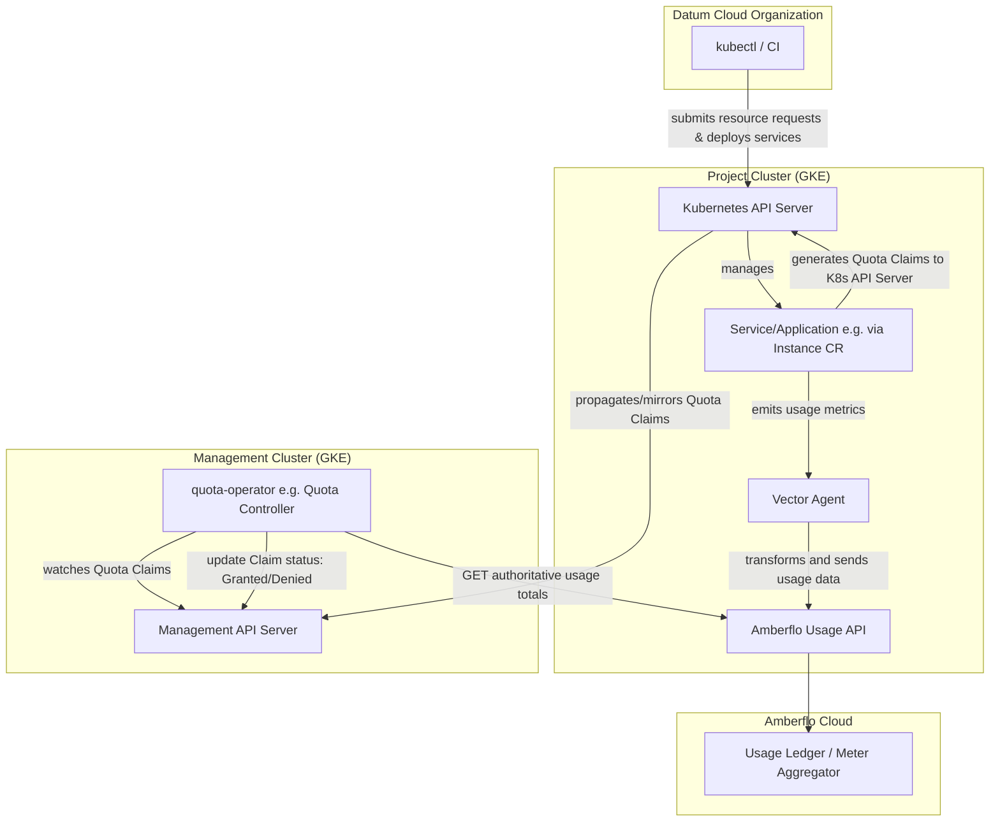

# Quota Management

- [Summary](#summary)
- [Motivation](#motivation)
  - [Goals](#goals)
  - [Non-Goals](#non-goals)
- [Proposal](#proposal)
  - [User Stories (Optional)](#user-stories-optional)
  - [Notes/Constraints/Caveats (Optional)](#notesconstraintscaveats-optional)
  - [Risks and Mitigations](#risks-and-mitigations)
- [Design Details](#design-details)
- [Production Readiness Review
  Questionnaire](#production-readiness-review-questionnaire)
  - [Feature Enablement and Rollback](#feature-enablement-and-rollback)
  - [Rollout, Upgrade and Rollback
    Planning](#rollout-upgrade-and-rollback-planning)
  - [Monitoring Requirements](#monitoring-requirements)
  - [Dependencies](#dependencies)
  - [Scalability](#scalability)
  - [Troubleshooting](#troubleshooting)
- [Implementation History](#implementation-history)
- [Drawbacks](#drawbacks)
- [Alternatives](#alternatives)
- [Infrastructure Needed (Optional)](#infrastructure-needed-optional)

## Summary

This enhancement proposes the development and implementation of a comprehensive
quota management system within the Datum Cloud platform. This system will
empower platform administrators to define, enforce, and manage resource
consumption limits for tenants at both the organizational and project levels.
Datum employees will have the ability to view and modify these quota levels,
while Datum Cloud users will be able to see their allocated quotas and current
resource usage. The system aims to provide predictable capacity management,
enable customer tier enforcement, offer transparency to customers regarding
their resource limits, and include enforcement mechanisms to reject API requests
that would exceed these limits. Furthermore, services offered on the Datum Cloud
platform will be able to register the resources they manage for quota protection
and set default quota levels.

## Motivation

The ability to create, observe, and self-manage resource quotas within
organizations and their projects provides numerous benefits to both internal and
external administrators of the system. By providing full transparency and
observability into key metrics and their limits, quota management also ensures
operational stability and reliability, enables accurate cost predictability,
prevents accidental or abusive overuse, and instills confidence in resource
planning and the enforcement of internal and regulatory policies. The safeguards
put in place through quota management will enable users to fully explore the
Datum Cloud ecosystem and variety of functionality it provides, without worrying
about exceeding the thresholds that have been set within their organzation and
projects.

### Goals

- Provide clear system context and architectural approach to the creation of a
  quota management system within Datum Cloud, including new Custom Resource
  Definitions
- Outline the ability of **organizational and project administrators** to create
  and manage specific resource quota limits within their organization or
  project, ensuring these limits apply to the entirety of the project,
  potentially spanning multiple underlying namespaces or infrastructure
  components.
- Outline the ability of **Datum Cloud platform administrators** to create and
  manage global quota limits applied to all organizations and projects within
  the system.
- Enable full visibility into the consumption metrics of provisioned workloads
  running in Datum Cloud in relation to set quota limits
- Enable Datum Cloud users to view their allocated quota limits and the number
  of resources consumed against each quota.
- Define the API design for services registering quotas and for managing quota
  thresholds for projects and organizations.
- Ensure the system can enforce defined quota limits, for example, by rejecting
  API requests that would exceed these limits.
- Facilitate predictable capacity management for the platform.
- Support customer tier enforcement (e.g., free vs. paid tiers) through
  configurable quotas.
- Enable enhancement document handoff for implementation of the quota management
  enhancement within Datum Cloud.
- Remain service agnostic to not avoid tightly coupling the architecture to a
  specific SaaS vendor (amberflo, OpenMeter, etc)

### Non-Goals

- Provide detailed implementation specifics of how the metering and billing
  components of the system will work, outside of the acknowledgement of their
  overall role in system architecture from a quota management perspective. This
  includes how resource consumption is translated into actual billable units and
  invoices. 
- Provide implementation specifics of any third-party SaaS integration in
  regards to quota management, metering and billing.
- Define the future Milo Service Catalog and service registration.
- Define the exact user interface (UI) mockups or user experience (UX) flows for
  managing or viewing quotas, beyond the functional requirements.
- Define how time-series metrics (e.g. CPU hours, data written, etc) will be
  implemented by the data plane.
- Define how alerts can be created and sent organizational and project
  administrators to inform them that they are approaching the quota threshholds
  they set for the resources. 

## Proposal

This enhancement proposes the design and architectural foundation for a quota
management system integrated into Datum Cloud. The system will allow for the
definition, management, and enforcement of resource quota limits at both
organizational and project levels by external and internal administrators. 

### Desired Outcome and Definition of Success

Once implemented, the quota management system will have seamless integration
with Datum Cloud services and downstream external vendors. Both internal and
external platform administrators will be able to use the system to easily create
and manage quotas through highly scalabe architecture and implementation. The
system should properly allocate and deallocate resources when claims are
granted, deny claims that exceed set limits, and stay in sync with integrated
downstream systems such as amberflo.

### Key Components and Capabilities

There are several key components that will comprise the architecture and
implementation of the quota management system:

1.  **`ResourceQuotaClaim` Definition:**
    - Administrators can use the API to request management of quotas - whether
      creating, scaling, or deleting them.
    - Claims will contain the relationship between owning/parent resources and
      the resources being requested within them.
    - Claims will be used when determining whether the request should be granted
      or denied by being compared to the `ResourceQuotaGrant` limits.

2. **`ResourceQuotaGrant` Definition:**
    - Platform administrators can define global default quota grants for various
      resources.
    - Organizational administrators can define organization-specific quotas
      (e.g., number of projects, number of collaborators/team-members).
    - Project administrators can define project-specific quotas (e.g., number of
      workloads, CPU/memory limits, total data written, etc.).
    - In a future enhancement, resource quotas will be able to support different
      customer tiers and plans, allowing for varied limits based on subscription
      levels (e.g., "Free Tier gets 1 collaborator" and "Pro Tier gets
      unlimited").

3. **`ServiceQuotaDefinition` Definition:**
    - Administrators can register resources to allow them to be managed by
      quotas
    - This is necessary to request resources and generate a
      `ResourceQuotaClaim`, as well as create a `ResourceQuotaGrant` that
      defines quota limits.
    - If an attempt is made to generate a claim on a resource that has yet to be
      registered, it will be denied.

4.  **Quota Enforcement:**
    - The system will include mutating admission webhooks and a quota-controller
      reconciler to check against defined quotas during resource creation,
      modification, or deletion.
    - The system will determine near real-time metric usage via integration with
      a downstream metering engine (e.g. amberflo, which is used as an example
      in this enhancement)
    - Requests exceeding the defined limits will be rejected with appropriate
      error messaging.
    - Denied quotas can be appropriately logged and persisted, creating
      additional observability and an audit trail detailing why specific claim
      requests were denied.

5.  **Quota Visibility:**
    - Datum Cloud users (tenants) will be able to view their current quota
      allocations and their consumption of resources against their self managed
      and global platform quotas.
    - Datum Employees (internal administrators) will have the ability to view
      and modify quota levels for all projects and organizations.

6.  **Service Integration:**
    - Services offered on the Datum Cloud platform will need a mechanism to
      register the resources they manage that should be subject to quotas.
    - An API will be designed for services to register these quotable resources
      and for the management (CRUD operations) of quota limits for projects and
      organizations.
    - Services will define default quota levels for the resources when
      registering a new resource metric.
    - The integration of the downstream metering engine and billing processor
      platform will remain service-agnostic to ensure flexibility of
      implementation in the future.
      - *Note: amberflo is used in this enhancement as an example and will be
        the initial platform of choice for metering and billing.*

7.  **Architectural Considerations:**
    - Initially, [Kubernetes
      ResourceQuotas](https://kubernetes.io/docs/concepts/policy/resource-quotas/)
      was explored for project-level resource control, while acknowledging its
      potential limitations for project-wide (cross-namespace) totals. Due to
      this limitation, Kubernetes ResourceQuotas was determined to not provide
      the functionality desired for cross-namespace resource quota management.
    - Tying a "Resource Grant" to a product plan and tiers, as discussed in
      [enhancement issue
      #78](https://github.com/datum-cloud/enhancements/issues/78), will be added
      as a future enhancement to dynamically configure quotas based on the
      specific plans and tiers.
    - A "Resouce Claim", as represented in this enhancement, was inspired by the
      `ResourceClaim` type within the [Kubernetes Dynamic Resource Allocation
      API](https://kubernetes.io/docs/concepts/scheduling-eviction/dynamic-resource-allocation/#api)
      to model how changes to resources are requested

**Proposal Deliverables**
- An updated enhancement document (this document) detailing the system
  architecture
- A Proof of Concept (POC) demonstrating functional quota system integration
  with a Datum Cloud project, and a complete API design for service quota
  registration and management.
- Information outlining on an architectural level how Quota Management will be
  integrated into Milo in the near future.

### User Stories (Optional)

<!--
Detail the things that people will be able to do if this Enhancement is implemented.
Include as much detail as possible so that people can understand the "how" of
the system. The goal here is to make this feel real for users without getting
bogged down.
-->

#### Story 1

#### Story 2

### Notes/Constraints/Caveats (Optional)

<!--
What are the caveats to the proposal?
What are some important details that didn't come across above?
Go in to as much detail as necessary here.
This might be a good place to talk about core concepts and how they relate.
-->

### Risks and Mitigations

<!--
What are the risks of this proposal, and how do we mitigate? Think broadly.
For example, consider both security and how this will impact the larger
software ecosystem.

How will security be reviewed, and by whom?

How will UX be reviewed, and by whom?

Consider including folks who also work outside of your immediate team.
-->

Different risks must be taken into account when considering implementation of
the Quota Management system to ensure the system is working as expected and the
risks are mitigated.

Best practices will be enforced by reviewers based on their knowledge of the
Datum Cloud ecosystem, including security and alignment with established
external and internal standards.

<!--
TODO add mitigation steps to explain how the below risks are accounted for
-->

- The potential to block all resource creation, preventing administration of
  resources due to network failure or timeouts.
- The potential for actual resource usage being out-of-sync with the
      cluster-state, leading to: - Allowing allocation of resources beyond the
      set quota limits on both external and internal levels, bypassing
      enforcement. - Denying resource allocation when there are enough free
      resources to allow the request the ability to proceed.

## Design Details

### Custom Resource Definitions 

Three main CRDs will be created as a direct part of the Quota Management
implementation: `ServiceQuotaDefinition`, `ResourceQuotaClaim` and
`ResourceQuotaGrant`.

#### `ServiceQuotaDefinition`

The `ServiceQuotaDefinition` CRD allows services to define the specific resource
types are available to have quotas applied to them as the first step in
management of their quotas before requesting resources. This CRD is distinct
from the `ResourceQuotaClaim` (which actually *requests* resources) and
`ResourceQuotaGrant` (which defines the *limits* for those resources). The
inclusion of a `ServiceQuotaDefinition` CRD in the system would allow services
to validate that a `ResourceQuotaGrant` is accurately set for both a valid
resource type and it's dimensions. It also decouples the declaration and
registration of the types of resources the user wants to manage from operator
logic, removing the need to make changes for every new resource type.

```yaml
apiGroup: quota.datumapis.com
kind: ServiceQuotaDefinition
metadata:
  # Unique name for the definition
  name: <my-service-quota>
spec:
  # Service which owns the quota definition
  serviceRef:
    apiGroup: compute.datumapis.com
    kind: Service
    name: compute.datumapis.com
    uid: <uid>
  # Fully qualified name of the resource being managed.
  # This should match the 'name' field in `ResourceQuotaClaim.spec.resources`
  # and also in `ResourceQuotaGrant.spec.limits`.
  resourceName: compute.datumapis.com/instances/cpu
  # Description of the resource.
  description: "Number of CPU cores allocated to instances."
  # Optional global default limit for this resource if it is not explicitly set in a ResourceQuotaGrant.
  defaultLimit:
    value: "1000"
  # The unit of measurement for the resource.
  unit: "cores"
  # Dimensions that can be used in ResourceQuotaGrant selectors.
  allowedDimensions:
    - compute.datumapis.com/location
    - compute.datumapis.com/instanceType
  # Category for grouping quotas (service name that owns quota definition)
  category: compute.datumapis.com
Status:
  observedGeneration: 1
  # Standard kubernetes approach to represent the state of a resource.
  conditions:
    # Indicates if the definition is valid, accepted, and the resource can be managed.
    # - Type: Ready
    # - Status: "True", "False", "Unknown"
    # - Reason: (e.g., "DefinitionActive", "InvalidDefinition", "Processing")
    # - Message: Human-readable message detailing status reason
    - type: Ready
      status: Unknown
      lastTransitionTime: "2023-01-01T12:00:00Z"
      reason: Initializing
      message: "ServiceQuotaDefinition is being initialized."
    # Indicates if the structure of the ServiceQuotaDefinition itself is correct.
    # - Type: DefinitionValid
    # - Status: "True", "False", "Unknown"
    # - Reason: (e.g., "ValidationSuccessful", "MissingRequiredField", "InvalidFormat")
    # - Message: Human-readable message detailing any structural issues.
    - type: DefinitionValid
      status: Unknown
      lastTransitionTime: "2023-01-01T12:00:00Z"
      reason: PendingValidation
      message: "Validation of the definition structure is pending."

```

#### `ResourceQuotaClaim`

The `ResourceQuotaClaim` CRD represents the *intent* of the request to create,
update/scale, or delete resources. This CRD contains a reference to the owner of
the resources being requested (e.g. Instance), as well as the specific resource
requests, including name and quantity. The below `yaml` snippet shows an claim
created by an incoming request tied to one Instance, which requests the
additional allocation of 8 CPU cores and 32GiB of memory, along with the
instance count:

```yaml
apiGroup: quota.datumapis.com
kind: ResourceQuotaClaim
metadata:
  # Connect the claim's lifetime to the workload that needs the quota
  name: instance-abc123-claim
  namespace: proj-abc
  # Cleanup on resource deletion
  finalizers:
  - quota.datumapis.com/usage-release
spec:
  # The reference to the resource that owns the resources being requested. 
  # Will be used to key off of during reconciliation.
  resourceRef: 
    apiGroup: compute.datumapis.com 
    kind: Instance 
    name: instance-abc123 
    uid: <uid>
  # Resources being requested
  resources:
  - name: compute.datumapis.com/instances/cpu
    quantity: "8"
  - name: compute.datumapis.com/instances/memoryAllocated
    quantity: "32GiB"
  - name: compute.datumapis.com/instances/count
    quantity: "1"
Status:
  # High level summary
  phase: Pending    
  grantedResources: []  
  observedGeneration: 1
  # Standard kubernetes approach to represent the state of a resource.
  # https://github.com/kubernetes/community/blob/master/contributors/devel/sig-architecture/api-conventions.md#typical-status-properties
  conditions:
    # Ready indicates if the claim has been processed and is in a terminal state.
    # - Type: Ready
    # - Status: "True" (Granted/Denied), "False" (Pending), "Unknown"
    # - Reason: (e.g., "ClaimGranted", "ClaimDenied", "Processing")
    # - Message: Human-readable message.
    - type: Ready
      status: "False"
      # Indicates time the status last changes e.g. from False to True
      lastTransitionTime: "2023-01-01T12:00:00Z"
      reason: Processing
      message: "Claim is currently being processed."
    # Validated indicates if the claim's specification has passed initial validation.
    # - Type: Validated
    # - Status: "True", "False", "Unknown"
    # - Reason: (e.g., "ValidationSuccessful", "InvalidResourceRef", "UnknownResourceName")
    # - Message: Human-readable message.
    - type: Validated
      status: Unknown
      # Indicates time the status last changes e.g. from Unknown to True
      lastTransitionTime: "2023-01-01T12:00:00Z"
      reason: PendingValidation
      message: "Claim validation is pending."
    # QuotaChecked indicates if the quota availability has been checked.
    # - Type: QuotaChecked
    # - Status: "True", "False", "Unknown"
    # - Reason: (e.g., "CheckSuccessful", "MeteringServiceUnavailable", "GrantNotFound")
    # - Message: Human-readable message.
    - type: QuotaChecked
      status: Unknown
      # Indicates time the status last changes e.g. from False to True
      lastTransitionTime: "2023-01-01T12:00:00Z"
      reason: PendingQuotaCheck
      message: "Quota check is pending."
    # Granted indicates if the claim was approved.
    # - Type: Granted
    # - Status: "True" if granted, "False" if denied or pending
    # - Reason: (e.g., "QuotaAvailable", "QuotaExceeded", "AwaitingDecision")
    # - Message: Human-readable message.
    - type: Granted
      status: "False"
      # Indicates time the status last changes e.g. from False to True
      lastTransitionTime: "2023-01-01T12:00:00Z"
      reason: AwaitingDecision
      message: "Decision on granting the claim is pending."
```

#### `ResourceQuotaGrant`

The `ResourceQuotaGrant` CRD declares the resource limits for a project or
organization (it can be bound to either level via `spec.resourceRef`).
Importantly, when bound to a Project or Organization, these limits represent the
total allowable consumption for that entity, regardless of how many namespaces
or discrete infrastructure components its resources might span. More granularly,
it declares which specific resources are limited by existing quotas, how the
those limits vary by different dimensions (such as `dimensionLabels` and
`buckets`), and how much of each resource is still free (which is maintained by
the quota controller and amberflo).

```yaml
apiGroup: quota.datumapis.com
kind: ResourceQuotaGrant
metadata:
  name: proj-abc
spec:
  # Reference to project or oganization since the CRD can use either
  resourceRef:
    apiGroup: compute.datumapis.com
    kind: Project
    name: proj-abc
    uid: <uid>
  limits:
  # 1. CPU cores allocated per project / location / instance type
  - name: compute.datumapis.com/instances/cpu
    # Dimension labels are the same as the resource name.
    dimensionLabels:
      - resources.datumapis.com/project
      - compute.datumapis.com/location
      - compute.datumapis.com/instanceType
    buckets:
    # Default limit for all locations and instance types across the project.
    # This is a global limit, and will apply to all locations, since we
    # don't specify a location dimension label within the bucket selector.
    - value: "1000"
      selector: {}
    # Override for multi-location projects.
    - value: "300"
      selector:
        matchExpressions:
        - key: compute.datumapis.com/location
          operator: In
          values: ["dfw", "lhr", "dls"]

    # Single location and instance type override,
    # more specific than the global limit and multi-location override.
    - value: "40"
      selector:
        matchLabels:
          compute.datumapis.com/location: dfw
          compute.datumapis.com/instanceType: datumcloud/d1-standard-2

  # 2. Memory (GiB) allocated per project / location / instance type
  - name: compute.datumapis.com/instances/memoryAllocated
    dimensionLabels:
      - resources.datumapis.com/project
      - compute.datumapis.com/location
      - compute.datumapis.com/instanceType
    buckets:
    - value: "4096"
      selector: {}

    - value: "1024"
      selector:
        matchLabels:
          compute.datumapis.com/location: dfw

  # 3. Instance count per project / location / instance type
  - name: compute.datumapis.com/instances/count
    dimensionLabels:
      - resources.datumapis.com/project
      - compute.datumapis.com/location
      - compute.datumapis.com/instanceType
    buckets:
    - value: "200"
      selector: {}
    - value: "20"
      selector:
        matchLabels:
          instanceType: datumcloud/d1-standard-2
    - value: "5"
      selector:
        matchLabels:
          compute.datumapis.com/location: dfw
          compute.datumapis.com/instanceType: datumcloud/d1-standard-2

  # 4. Gateway count per project
  - name: network.datumapis.com/gateways
    dimensionLabels:
      - resources.datumapis.com/project
    buckets:
    - value: "15"
      selector: {}

    - value: "3"
      selector:
        matchExpressions:
        - key: compute.datumapis.com/location
          operator: Exists
# Status reflects the validity and applicability of the defined quotas.
Status:
  observedGeneration: 1
  # Optional: Cache of current usage for each bucket.
  usage:
  - name: compute.datumapis.com/instances/cpu
    buckets:
    # Global usage without any selectors
    - selector: {}
      used: "500"
    # Selector-specific usage
    - selector:
        matchLabels:
          compute.datumapis.com/location: dfw
          compute.datumapis.com/instanceType: datumcloud/d1-standard-2
      used: "10"
  # Standard kubernetes approach to represent the state of a resource.
  conditions:
    # Indicates if the grant is correctly configured and actively being used.
    # - Type: Ready
    # - Status: "True", "False", "Unknown"
    # - Reason: (e.g., "GrantActive", "InvalidLimitsConfiguration", "NotEnforced")
    # - Message: Human-readable message detailing the Reason value.
    - type: Ready
      status: Unknown
      lastTransitionTime: "2023-01-01T12:00:00Z"
      reason: Initializing
      message: "ResourceQuotaGrant is being initialized."
    # Indicates if the spec.limits are well-formed and logically consistent.
    # - Type: LimitsValid
    # - Status: "True", "False", "Unknown"
    # - Reason: (e.g., "ValidationSuccessful", "InvalidDimensionSelector", "ResourceNotDefined")
    # - Message: Human-readable message detailing any issues.
    - type: LimitsValid
      status: Unknown
      lastTransitionTime: "2023-01-01T12:00:00Z"
      reason: PendingValidation
      message: "Validation of limits is pending."
    # Optionally indicates the freshness of cached usage data, if implemented.
    - Type: UsageSynchronized
    - Status: "True", "False", "Unknown"
    - Reason: (e.g., "SyncSuccessful", "SyncFailed", "StaleData", "CachingDisabled")
    - Message: Human-readable message.
    - type: UsageSynchronized
      status: Unknown
      lastTransitionTime: "2023-01-01T12:00:00Z"
      reason: PendingSync
      message: "Usage data synchronization is pending."

```


#### Quota Registration

To enable services on the Datum Cloud platform to integrate with the quota
management system, a dedicated API will be provided for services to register the
resources they manage that should be subject to quotas. This is achieved through
the proposed `ServiceQuotaDefinition` CRD, which acts as a "catalog" for
services to declare the types of resources they offer that *can* be managed by
the quota system.

Services will create new instances of `ServiceQuotaDefinition` to declare each
type of resource they offer that can use quota limits. The `quota-operator` can
then use these definitions to understand and validate the types of resources
being requested in `ResourceQuotaClaim` objects.

*Registration Operations*

Services can interact with the custom resources using the standard Kubernetes
API. The below example commands use `ServiceQuotaDefinition` as an example:

- **Create:** To register a new quotable resource, a service creates a new
  `ServiceQuotaDefinition` object.
    ```bash
    kubectl apply -f my-service-quota-definition.yaml
    ```
- **Read:** Services can list or get `ServiceQuotaDefinition`s to inspect
  existing registrations.
    ```bash
    kubectl get servicequotadefinitions
    kubectl get servicequotadefinition compute-instances-cpu -o yaml
    ```
- **Update:** If a resource's definition changes (e.g., its description, allowed
  dimensions, etc), the service updates the corresponding
  `ServiceQuotaDefinition` object.
    ```bash
    kubectl apply -f updated-service-quota-definition.yaml
    ```
- **Delete:** If a service no longer offers a particular quotable resource (or
  it's being deprecated), the service deletes its `ServiceQuotaDefinition`
  object.
    ```bash
    kubectl delete servicequotadefinition compute-instances-cpu
    ```

### Quota Operator Controller

A `quota-operator` will be created to implement logic to convert the *intent* of
the incoming `ResourceQuotaClaim` object into the *actual allocation* of
resources. It will ensure accurate data is kept in sync with the downstream
metering system by querying actual usage from the metering engine API and
optionally patching usage totals within `ResourceQuotaGrant` via the
`ResourceQuotaGrant.status.usage` field to serve as a cache. The controller will
enforce per-project or per-organization (tenant) resource quota limits that are
declared in the `ResourceQuotaGrant` objects after being registered via a
`ServiceQuotaDefinition`.

The reconciliation loop for this controller will contain the following logic:

1. **Validates Registration**:
  - Ensures that the specific requested resource and dimensions have already
    been registered by the service via a `ServiceQuotaDefinition`

2. **Watches newly created or updated `ResourceQuotaClaim` objects** via
   Kubernetes informers. These claims are typically auto-generated by the
   admission webhook when a new resource (e.g., `Instance`, `Gateway`) is
   created or scaled and will consume quota.

3. **Validates the `ResourceQuotaClaim` structure**:
   - Ensures required fields like `resources`, `dimensions`, and `resourceRef`
     are present and well-formed.
   - Optionally verifies that the `resourceRef` points to a valid object in the
     API server.
   - If validation fails, the operator sets the claim `status.phase = Denied`
     with an appropriate `reason`.

4. **Retrieves the corresponding `ResourceQuotaGrant`**:
   - Looks up the `Grant` by `project`, `organization`, or via an explicit
     reference on the claim. This grant represents the total limit for the
     entire project/organization entity.
   - Reads the declared `spec.limits` quota limits and bucket selectors.
   - Applies label/selector logic to find the correct bucket for the claim's
     dimensions (e.g., `location=dfw`, `instanceType=datumcloud/d1-standard-2`).

5. **Queries an external usage source (e.g., Amberflo)** to get the current
   actual usage for the metric and dimension(s) defined in the claim:
   - Makes a real-time HTTP request to the usage API, ensuring the query
     aggregates usage across all relevant sources associated with the Project or
     Organization (e.g., potentially multiple namespaces or resource instances).
   - This usage is treated as the source of truth (not just
     `ResourceQuotaGrant.status.usage`, which may be stale or partial).

6. **Evaluates whether the claim would exceed quota**:
   - Calculates: `actualUsage + requestedAmount > bucketLimit?`
   - If the total would stay within the limit:
     - Optionally updates `ResourceQuotaGrant.status.usage` as a local cache or
       mirror.
     - Sets `ResourceQuotaClaim.status.phase = Granted`.
   - If the request would exceed the quota:
     - Sets `ResourceQuotaClaim.status.phase = Denied`.
     - Optionally emits a Kubernetes `Event` and records `status.reason`.

7. **Handles updates to `ResourceQuotaGrant` limits**:
   - When a Grant is updated (e.g., an admin raises CPU from 100 to 200), the
     operator re-reconciles affected claims.
   - Previously denied claims may now be granted if usage fits under the new
     limits.

8. **Emits final status and metrics**:
   - Updates the `ResourceQuotaClaim.status` with the outcome (`Granted` or
     `Denied`).
   - Optionally emits Prometheus metrics or logs (e.g.,
     `quota_claims_granted_total`, `quota_claims_denied_total`).

**Notes**

Patching the `ResourceQuotaGrant.status.usage` field is **optional** and serves
as a low-latency cache of the most recently known usage for each quota bucket.
This could provide benefits to the system, including:

- Fast-rejection for obvious quota breaking claims without needing to query
  amberflo (e.g., requesting to claim 1000 GiB of written data while the quota
  limit is 100 GiB)
- Auditability, observability, and transparency by creating a point-in-time
  snapshot of denied claims which provides denial reasoning and other contextual
  information
- Best effort last known good view fall-back if amberflo is temporarily
  unavailable

If implemented, the potential for stale data **must** be accounted for, and
therefore ***it should not be used for final quota enforcement nor billing
purposes.***

**Failure Blast Radius**

If the controller is down, new Claims will stall; however workloads are not
affected and there is no blocking of writes to the cluster.

### Admission Webhooks

A stateless mutating admission webhook will be created to serve as the initial
interaction between the incoming claim request and the `quota-operator`
controller. While this webhook is optional, it provides additional safety of the
workflow at claim creation time.

The admission webhook is responsible for and executes the following steps:

1. Synchronously intercepts incoming requests for resource
   creation/scaling/deletion that are sent to the `quota-operator` controller.
2. Automatically creates a `ResourceClaimQuota` object based on the intent of
   the intercepted request.
3. Attaches labels and annotations to the object to enable easy claim deletion
   via a finalizer when workloads are torn down.

### Architectural and Sequence Diagrams



---

A metering engine such as [amberflo](https://docs.amberflo.io) acts as the
real-time metering usage authority, and will be queried for live metrics to
compare against resource quotas set in Datum Cloud. The telemetry system
pipeline sends metered events (via Vector) to the external metering engine and
billing processor.

When quota decisions need to be made within the `quota-operator`, the quota
operator will query amberflo via API to check true usage before granting the
`ResourceQuotaClaim` based on quota limits set in `ResourceQuotaGrant`. This
ensures quota enforcement is aligned with what is ultimately billed downstream.

```mermaid
%% Sequence Diagram - Quota Management Enhancement
sequenceDiagram
    autonumber

    participant SvcOwner as Service Owner/Admin
    participant Dev as  Admin / CI
    participant APIServer as Kubernetes API Server
    participant MutateWH as Mutating Webhook<br>(RQC injector)
    participant ValidWH as Validating Webhook<br>(optional fast-fail)
    participant SQD as ServiceQuotaDefinition
    participant RQC as ResourceQuotaClaim
    participant RQG as ResourceQuotaGrant
    participant QOp as quota-operator
    participant Amberflo as Amberflo Usage API
    participant Instance as Instance CR
    participant InstCtrl as Instance Controller
    participant Telemetry as Telemetry / Metering Pipeline
    participant Vector as Vector Agent
    participant Infra as Backend Infrastructure

    %% --- Service Quota Definition Registration (Prerequisite) ---
    Note over SvcOwner, APIServer: Service Owner registers quotable resources
    SvcOwner->>APIServer: kubectl apply ServiceQuotaDefinition (e.g., compute-cpu.yaml)
    APIServer-->>SQD: Store SQD
    note right of SQD: Initial Status:  - conditions.Ready: Unknown (Reason: Initializing)  - conditions.DefinitionValid: Unknown (Reason: PendingValidation)
    QOp-->>SQD: Watch ADDED/MODIFIED SQD
    QOp->>SQD: Validate SQD spec (e.g., fields, structure)
    alt SQD spec is valid
        QOp->>APIServer: PATCH SQD.status
        note right of SQD: Updated Status:  - conditions.DefinitionValid: True (Reason: ValidationSuccessful)  - conditions.Ready: True (Reason: DefinitionActive)
    else SQD spec is invalid
        QOp->>APIServer: PATCH SQD.status
        note right of SQD: Updated Status:  - conditions.DefinitionValid: False (Reason: InvalidDefinition)  - conditions.Ready: False
    end

    %% --- Instance Provisioning & Admission Control ---
    Note over Dev, APIServer:  Admin requests a new Instance
    Dev->>APIServer: kubectl apply Instance
    APIServer->>MutateWH: AdmissionReview (Instance draft)
    MutateWH-->>APIServer: Mutate Instance (add finalizer)
    par RQC Creation by Mutating Webhook
        MutateWH->>APIServer: Create ResourceQuotaClaim for Instance
        APIServer-->>RQC: Store RQC
        note right of RQC: Initial Status:  - phase: Pending  - conditions.Ready: False (Reason: Processing)  - conditions.Validated: Unknown (Reason: PendingValidation)  - conditions.QuotaChecked: Unknown (Reason: PendingQuotaCheck)  - conditions.Granted: False (Reason: AwaitingDecision)
    end
    APIServer->>ValidWH: AdmissionReview (Instance, optional fast-fail for RQC)
    alt optional fast-fail (e.g., based on cached RQG.status.usage or simple checks)
        ValidWH-->>APIServer: Deny request (Instance not created)
        QOp->>APIServer: PATCH RQC.status (if RQC was created before denial)
        note right of RQC: Status Update (Optional):  - phase: Denied (Reason: ValidatingWebhookDenied)
    else
        ValidWH-->>APIServer: Allow request
        APIServer-->>Instance: Store Instance (with finalizer)
        APIServer-->>Dev: 201 Created (Instance)
    end


    %% --- Quota Reconciliation Path by quota-operator ---
    Note over QOp, RQC: quota-operator reconciles the new ResourceQuotaClaim
    QOp-->>RQC: Watch ADDED RQC (e.g., for instance-abc123)
    
    QOp->>APIServer: GET relevant ServiceQuotaDefinition for RQC.spec.resources
    alt SQD found AND RQC spec is valid against SQD (resourceName, dimensions, etc.)
        QOp->>APIServer: PATCH RQC.status
        note right of RQC: Status Update:  - conditions.Validated: True (Reason: ValidationSuccessful)
        
        QOp->>APIServer: GET ResourceQuotaGrant for RQC's project/org
        note left of RQG: RQG contains limits, selectors, buckets

        QOp->>Amberflo: GET current usage from Amberflo API (for RQC.spec.resources & dimensions)
        Amberflo-->>QOp: Return usage total (e.g., "500 cores")
        QOp->>APIServer: PATCH RQC.status
        note right of RQC: Status Update:  - conditions.QuotaChecked: True (Reason: CheckSuccessful)

        alt Calculated (Current Usage + RQC.spec.resources.quantity) <= RQG Limit for matching bucket
            QOp->>APIServer: PATCH RQC.status (Granted)
            note right of RQC: Status Update:  - phase: Granted  - conditions.Granted: True (Reason: QuotaAvailable)  - conditions.Ready: True (Reason: ClaimGranted)
            opt Update RQG Cache
                 QOp->>APIServer: PATCH RQG.status.usage (+= requested amount for the bucket)
                 note left of RQG: RQG.status.usage updated (cache)
            end
        else Usage would exceed RQG Limit
            QOp->>APIServer: PATCH RQC.status (Denied due to Quota Exceeded)
            note right of RQC: Status Update:  - phase: Denied  - conditions.Granted: False (Reason: QuotaExceeded)  - conditions.Ready: True (Reason: ClaimDenied)
        end
    else SQD not found OR RQC spec invalid against SQD
        QOp->>APIServer: PATCH RQC.status (Denied due to Validation Failure)
        note right of RQC: Status Update:  - phase: Denied  - conditions.Validated: False (Reason: e.g., UnknownResourceName or InvalidDimension)  - conditions.Ready: True (Reason: ClaimDenied)
    end

    %% --- Instance Controller Reacts to RQC Status ---
    Note over InstCtrl, Instance: Instance Controller acts based on RQC status
    InstCtrl-->>RQC: Watch RQC.status (for its owned Instance)
    alt RQC.status.phase == Granted
        InstCtrl->>APIServer: PATCH Instance (remove finalizer)
        InstCtrl->>Infra: Provision workload (pods, VM, etc.)
        note right of Instance: Instance Status: Pending -> Provisioning -> Running
        InstCtrl->>APIServer: PATCH Instance.status (e.g., Phase=Running)
    else RQC.status.phase == Denied
        note right of Instance: Instance Status: Pending -> Failed
        InstCtrl->>APIServer: PATCH Instance.status (e.g., Phase=Failed, Reason=RQC.status.conditions.message)
    end

    %% --- Telemetry & Metering Flow (Post-Provisioning if Granted) ---
    Note over Instance, Telemetry: If Instance is running, it emits usage metrics
    alt Instance is Running
        Instance->>Telemetry: Emit usage event (cpu=8, location=dfw, ...)
        Telemetry->>Vector: Format & Forward event
        Vector->>Amberflo: POST usage event to Amberflo /meters API
        Amberflo->>Amberflo: Aggregate usage, update ledger
    end

    %% --- Tear-down & Quota Release ---
    Note over Dev, APIServer:  Admin deletes the Instance
    Dev->>APIServer: kubectl delete Instance
    APIServer->>Instance: Mark Instance with deletionTimestamp
    
    Note over InstCtrl, RQC: Instance controller handles finalizer for graceful shutdown
    InstCtrl-->>Instance: Detect deletionTimestamp & finalizer present
    InstCtrl->>APIServer: DELETE ResourceQuotaClaim associated with Instance
    APIServer-->>RQC: RQC marked for deletion
    
    QOp-->>RQC: Watch DELETED RQC
    note right of QOp: Operator might trigger explicit usage release/adjustment in Amberflo if necessary, or rely on Amberflo's TTL/idempotency for usage.
    opt Update RQG Cache if used
        QOp->>APIServer: PATCH RQG.status.usage (-= released amount for the bucket)
        note left of RQG: RQG.status.usage updated (cache)
    end
    InstCtrl->>Infra: Deprovision workload
    InstCtrl->>APIServer: PATCH Instance (remove finalizer, after RQC deleted and other cleanup)
    APIServer-->>Instance: Instance object eventually deleted by garbage collector
```



**Sequence Diagram Step Breakdown**

The sequence diagram illustrates the end-to-end flow of quota management, from
service registration to resource provisioning and eventual teardown. The steps
are numbered to correspond to the major interactions shown in the diagram.

- **RQD**: `ResourceQuotaDefinition`
- **SQD**: `ServiceQuotaDefinition`
- **RQC**: `ResourceQuotaClaim`

#### Service Quota Definition Registration (Prerequisite)

Before any resource quotas can be claimed or enforced, a `Service Owner` must
define what resources are quotable. This typically happens when a service is
onboarded or updated.

1.  **Define & Apply `ServiceQuotaDefinition`**: The `Service Owner` (or an
    automated process) applies a `ServiceQuotaDefinition` (SQD) manifest to the
    Kubernetes `API Server` (e.g., `kubectl apply -f compute-cpu-sqd.yaml`).
    This SQD (e.g., for `compute-cpu`) declares a resource type as manageable by
    the quota system, specifying details like `resourceName`, `description`,
    `unit`, `defaultLimit`, and `allowedDimensions`.
2.  **Store & Initialize `SQD`**: The `API Server` stores the
    `ServiceQuotaDefinition`. Its `status` is initialized, with conditions like
    `Ready` and `DefinitionValid` typically starting as `Unknown` (Reason:
    `Initializing` or `PendingValidation`).
3.  **`quota-operator` Validates `SQD`**: The `quota-operator` (QOp), which
    watches for `ServiceQuotaDefinition` resources, detects the new or modified
    SQD. It validates the SQD's `spec` against its internal rules (e.g.,
    ensuring required fields are present, values are correctly formatted).
4.  **Update `SQD` Status**: Based on validation:
    *   **If Valid**: The `quota-operator` patches the `SQD.status` via the `API
        Server`. `conditions.DefinitionValid` becomes `True` (Reason:
        `ValidationSuccessful`), and `conditions.Ready` becomes `True` (Reason:
        `DefinitionActive`), indicating the resource type is now actively
        managed by the quota system.
    *   **If Invalid**: The `quota-operator` patches `SQD.status` to reflect the
        failure, setting `conditions.DefinitionValid` to `False` (Reason: e.g.,
        `InvalidDefinition`) and `conditions.Ready` to `False`.

#### Instance Provisioning & Admission Control

Once quotable resources are defined (via SQDs), users (Admins/Developers or
CI/CD) can request resources like `Instances`.

5.  **Request `Instance` Creation**: An `Admin / CI` process submits an
    `Instance` custom resource manifest to the `API Server`.
6.  **Mutating Webhook Intercepts & Modifies**: The `API Server` sends an
    `AdmissionReview` request for the `Instance` to the `Mutating Admission
    Webhook`.
    *   The webhook modifies the `Instance` resource, primarily by adding a
        finalizer (e.g., `quota.datumapis.com/instance-protection`) to block its
        full provisioning until quota is approved.
    *   Crucially, the webhook *also* constructs and sends a `POST` request to
        the `API Server` to create a new `ResourceQuotaClaim` (RQC) object. This
        RQC details the resources the `Instance` intends to consume (e.g., CPU,
        memory).
    *   The `API Server` stores this new `RQC`. Its initial `status` is
        `Pending`, with conditions like `Validated`, `QuotaChecked`, and
        `Granted` set to `Unknown` or `False` (Reason: `Processing` or
        `PendingValidation`).
    *   The webhook then returns the mutated `Instance` (with finalizer) to the
        `API Server`.
7.  **Optional Validating Webhook Check**: The `API Server` may then send
    another `AdmissionReview` request (now with the mutated `Instance` and
    awareness of the RQC intent) to an optional `Validating Admission Webhook`.
    *   This webhook can perform a "fast-fail" check. For example, it might look
        at cached `ResourceQuotaGrant.status.usage` or apply simple, quick rules
        to deny the request if quota is obviously exceeded.
    *   **If Denied by Validating Webhook**: The webhook rejects the request.
        The `API Server` does not store the `Instance`, and the RQC might be
        updated to `Denied` (Reason: `ValidatingWebhookDenied`). The user
        receives an error.
    *   **If Allowed by Validating Webhook**: The webhook allows the request.
8.  **Store `Instance` & Confirm Creation**: If not rejected by the validating
    webhook, the `API Server` stores the (mutated) `Instance` resource and
    returns a `201 Created` response to the `Admin / CI`.

#### Quota Reconciliation by `quota-operator`

The `quota-operator` processes the `ResourceQuotaClaim` to decide if the
requested resources can be granted.

9.  **`quota-operator` Detects `RQC`**: The `quota-operator` detects the new
    `ResourceQuotaClaim` via its Kubernetes informer.
10. **Validate `RQC` Against `SQD`**:
    *   The `quota-operator` fetches the relevant `ServiceQuotaDefinition` from
        the `API Server` that corresponds to the resource types listed in
        `RQC.spec.resources`.
    *   **If `SQD` is found and `RQC` is valid against it** (e.g.,
        `resourceName` matches, requested `dimensions` are allowed): The
        `quota-operator` patches `RQC.status`, setting `conditions.Validated` to
        `True` (Reason: `ValidationSuccessful`).
    *   **If `SQD` is not found or `RQC` is invalid**: The `quota-operator`
        patches `RQC.status` to `phase: Denied`, sets `conditions.Validated` to
        `False` (Reason: e.g., `UnknownResourceName` or `InvalidDimension`), and
        `conditions.Ready` to `True` (Reason: `ClaimDenied`). Reconciliation for
        this RQC stops.
11. **Retrieve `ResourceQuotaGrant`**: If RQC validation passed, the
    `quota-operator` retrieves the `ResourceQuotaGrant` (RQG) for the RQC's
    project or organization from the `API Server`. The RQG contains the actual
    quota limits and bucketing rules.
12. **Query Amberflo for Usage**: The `quota-operator` makes a real-time API
    call to `Amberflo Usage API` to get the current authoritative usage for the
    specific resource(s) and dimension(s) defined in the RQC, scoped to the
    relevant project/organization.
13. **Amberflo Returns Usage**: `Amberflo` responds with the current usage total
    (e.g., "920 cores used for project X in dfw"). The `quota-operator` then
    updates `RQC.status`, setting `conditions.QuotaChecked` to `True` (Reason:
    `CheckSuccessful`).
14. **Evaluate Quota & Update `RQC` Status**: The `quota-operator` compares
    `(Amberflo Usage + RQC Requested Amount)` against the limit in the
    corresponding bucket of the `ResourceQuotaGrant`.
    *   **If Within Limit (Granted)**:
        *   `RQC.status` is patched: `phase: Granted`, `conditions.Granted:
            True` (Reason: `QuotaAvailable`), `conditions.Ready: True` (Reason:
            `ClaimGranted`).
        *   *(Optional Cache Update)*: `quota-operator` may patch
            `ResourceQuotaGrant.status.usage` to reflect the newly allocated
            amount as a cached value.
    *   **If Over Limit (Denied)**:
        *   `RQC.status` is patched: `phase: Denied`, `conditions.Granted:
            False` (Reason: `QuotaExceeded`), `conditions.Ready: True` (Reason:
            `ClaimDenied`).

#### `Instance` Controller Reacts to `RQC` Status

The `Instance Controller` (which manages `Instance` resources) acts based on the
`ResourceQuotaClaim`'s final status.

15. **`Instance` Controller Watches `RQC`**: The `Instance Controller` is
    watching the `status` of the `ResourceQuotaClaim` associated with the
    `Instance` it manages.
16. **Provision or Fail `Instance`**:
    *   **If `RQC.status.phase == Granted`**:
        *   The `Instance Controller` removes its finalizer from the `Instance`
            resource (by patching it via the `API Server`).
        *   It then proceeds to provision the actual backend infrastructure
            (e.g., creating Pods, VMs via cloud provider APIs).
        *   The `Instance.status` is updated to reflect its lifecycle (e.g.,
            `Pending` -> `Provisioning` -> `Running`).
    *   **If `RQC.status.phase == Denied`**:
        *   The `Instance Controller` updates `Instance.status` to `Phase:
            Failed` and includes a reason derived from the
            `RQC.status.conditions.message` (e.g., "QuotaExceeded for CPU"). The
            `Instance` is not provisioned.

#### Telemetry & Metering Flow (Post-Provisioning)

If the `Instance` is successfully provisioned and running, it (or its underlying
components) emits usage data.

17. **`Instance` Emits Usage**: The running `Instance` generates usage data
    (e.g., CPU allocated, data written, active time).
18. **Telemetry Pipeline**: This data is collected by a `Telemetry / Metering
    Pipeline` (e.g., OpenTelemetry SDKs) within the workload or an
    infrastructure-level agent.
19. **`Vector` Agent Forwards to `Amberflo`**: A `Vector` agent (or similar
    aggregator/shipper) formats these raw usage events into structured metering
    events and POSTs them to `Amberflo's /meters API`. These events include
    `meterApiName`, `customerId` (project/org ID), `timestamp`, `value`, and
    relevant dimensions.
20. **`Amberflo` Aggregates Usage**: `Amberflo` ingests and aggregates these
    events in real-time, updating its usage ledger. This ledger provides the
    authoritative usage data queried by the `quota-operator` (in step 12).

#### Tear-down & Quota Release

When an `Instance` is deleted by a user or process.

21. **Delete `Instance` Request**: An `Admin / CI` process issues a `kubectl
    delete Instance` command.
22. **`API Server` Marks for Deletion**: The `API Server` marks the `Instance`
    object with a `deletionTimestamp`. This triggers the finalizer logic.
23. **`Instance` Controller Finalizer Logic**: The `Instance Controller`,
    detecting the `deletionTimestamp` on an `Instance` it manages with its
    finalizer still present:
    *   Initiates the deletion of the associated `ResourceQuotaClaim` by sending
        a `DELETE` request for the RQC to the `API Server`. The `API Server`
        then marks the RQC for deletion.
24. **`quota-operator` Handles `RQC` Deletion**:
    *   The `quota-operator` detects the deletion of the `ResourceQuotaClaim`.
    *   *(Optional Cache Update)*: If `ResourceQuotaGrant.status.usage` caching
        is active, the `quota-operator` patches it to decrement the usage by the
        amount released by the deleted RQC.
    *   The `quota-operator` might also perform explicit actions with `Amberflo`
        if needed to signal resource release, though often, the cessation of
        telemetry from the deleted resource handles this implicitly in the
        metering system.
25. **Deprovision Infrastructure**: The `Instance Controller` ensures the actual
    backend infrastructure for the `Instance` is deprovisioned.
26. **Remove Finalizer**: Once all cleanup is done (RQC deleted, infrastructure
    gone), the `Instance Controller` removes its finalizer from the `Instance`
    resource by patching it via the `API Server`.
27. **`API Server` Deletes `Instance`**: With the finalizer removed, the
    Kubernetes garbage collector permanently deletes the `Instance` object from
    etcd.

## Production Readiness Review Questionnaire

<!--

Production readiness reviews are intended to ensure that features are observable,
scalable and supportable; can be safely operated in production environments, and
can be disabled or rolled back in the event they cause increased failures in
production.

See more in the PRR Enhancement at https://git.k8s.io/enhancements/keps/sig-architecture/1194-prod-readiness.

The production readiness review questionnaire must be completed and approved
for the Enhancement to move to `implementable` status and be included in the release.
-->

### Feature Enablement and Rollback

<!--
This section must be completed when targeting alpha to a release.
-->

#### How can this feature be enabled / disabled in a live cluster?

<!--
Pick one of these and delete the rest.
-->

- [ ] Feature gate
  - Feature gate name:
  - Components depending on the feature gate:
- [ ] Other
  - Describe the mechanism:
  - Will enabling / disabling the feature require downtime of the control plane?
  - Will enabling / disabling the feature require downtime or reprovisioning of
    a node?

#### Does enabling the feature change any default behavior?

<!--
Any change of default behavior may be surprising to users or break existing
automations, so be extremely careful here.
-->

#### Can the feature be disabled once it has been enabled (i.e. can we roll back the enablement)?

<!--
Describe the consequences on existing workloads (e.g., if this is a runtime
feature, can it break the existing applications?).

Feature gates are typically disabled by setting the flag to `false` and
restarting the component. No other changes should be necessary to disable the
feature.
-->

#### What happens if we reenable the feature if it was previously rolled back?

#### Are there any tests for feature enablement/disablement?

### Rollout, Upgrade and Rollback Planning

<!--
This section must be completed when targeting beta to a release.
-->

#### How can a rollout or rollback fail? Can it impact already running workloads?

<!--
Try to be as paranoid as possible - e.g., what if some components will restart
mid-rollout?

Be sure to consider highly-available clusters, where, for example,
feature flags will be enabled on some servers and not others during the
rollout. Similarly, consider large clusters and how enablement/disablement
will rollout across nodes.
-->

#### What specific metrics should inform a rollback?

<!--
What signals should users be paying attention to when the feature is young
that might indicate a serious problem?
-->

#### Were upgrade and rollback tested? Was the upgrade->downgrade->upgrade path tested?

<!--
Describe manual testing that was done and the outcomes.
Longer term, we may want to require automated upgrade/rollback tests, but we
are missing a bunch of machinery and tooling and can't do that now.
-->

#### Is the rollout accompanied by any deprecations and/or removals of features, APIs, fields of API types, flags, etc.?

<!--
Even if applying deprecation policies, they may still surprise some users.
-->

### Monitoring Requirements

<!--
This section must be completed when targeting beta to a release.

For GA, this section is required: approvers should be able to confirm the
previous answers based on experience in the field.
-->

#### How can an operator determine if the feature is in use by workloads?

<!--
Ideally, this should be a metric. Operations against the API (e.g., checking if
there are objects with field X set) may be a last resort. Avoid logs or events
for this purpose.
-->

#### How can someone using this feature know that it is working for their instance?

<!--
For instance, if this is an instance-related feature, it should be possible to
determine if the feature is functioning properly for each individual instance.
Pick one more of these and delete the rest.
Please describe all items visible to end users below with sufficient detail so
that they can verify correct enablement and operation of this feature.
Recall that end users cannot usually observe component logs or access metrics.
-->

- [ ] Events
  - Event Reason:
- [ ] API .status
  - Condition name:
  - Other field:
- [ ] Other (treat as last resort)
  - Details:

#### What are the reasonable SLOs (Service Level Objectives) for the enhancement?

<!--
This is your opportunity to define what "normal" quality of service looks like
for a feature.

It's impossible to provide comprehensive guidance, but at the very
high level (needs more precise definitions) those may be things like:
  - per-day percentage of API calls finishing with 5XX errors <= 1%
  - 99% percentile over day of absolute value from (job creation time minus expected
    job creation time) for cron job <= 10%
  - 99.9% of /health requests per day finish with 200 code

These goals will help you determine what you need to measure (SLIs) in the next
question.
-->

#### What are the SLIs (Service Level Indicators) an operator can use to determine the health of the service?

<!--
Pick one more of these and delete the rest.
-->

- [ ] Metrics
  - Metric name:
  - [Optional] Aggregation method:
  - Components exposing the metric:
- [ ] Other (treat as last resort)
  - Details:

#### Are there any missing metrics that would be useful to have to improve observability of this feature?

<!--
Describe the metrics themselves and the reasons why they weren't added (e.g., cost,
implementation difficulties, etc.).
-->

### Dependencies

<!--
This section must be completed when targeting beta to a release.
-->

#### Does this feature depend on any specific services running in the cluster?

<!--
Think about both cluster-level services (e.g. metrics-server) as well
as node-level agents (e.g. specific version of CRI). Focus on external or
optional services that are needed. For example, if this feature depends on
a cloud provider API, or upon an external software-defined storage or network
control plane.

For each of these, fill in the following—thinking about running existing user workloads
and creating new ones, as well as about cluster-level services (e.g. DNS):
  - [Dependency name]
    - Usage description:
      - Impact of its outage on the feature:
      - Impact of its degraded performance or high-error rates on the feature:
-->

### Scalability

<!--
For alpha, this section is encouraged: reviewers should consider these questions
and attempt to answer them.

For beta, this section is required: reviewers must answer these questions.

For GA, this section is required: approvers should be able to confirm the
previous answers based on experience in the field.
-->

#### Will enabling / using this feature result in any new API calls?

Yes, enabling this feature will result in new API calls:

-   **Kubernetes API Calls:**
    -   **`quota-operator`:**
        -   **Watches `ResourceQuotaClaim` objects:** (LIST/WATCH) To detect new
            or updated claims. Estimated throughput depends on the rate of
            resource provisioning and scaling.
        -   **Reads `ResourceQuotaGrant` objects:** (GET) To fetch quota limits
            for a project/organization when a claim is reconciled.
        -   **Updates `ResourceQuotaClaim.status`:** (PATCH/UPDATE) To set the
            claim's phase to `Granted` or `Denied`.
        -   **Optionally updates `ResourceQuotaGrant.status.usage`:**
            (PATCH/UPDATE) To cache current usage.
    -   **Mutating Admission Webhook:**
        -   **Creates `ResourceQuotaClaim` objects:** (CREATE) When a new
            resource requiring quota is submitted to the API server.
        -   **Updates existing resources (e.g., `Instance`):** (PATCH/UPDATE) To
            add finalizers.
    -   **Services (via `kubectl` or clients):**
        -   **CRUD on `ServiceQuotaDefinition` objects:** (CREATE, GET, LIST,
            WATCH, UPDATE, DELETE) When services register or manage their
            quotable resource types. Throughput is expected to be low, primarily
            during service deployment or updates.

-   **External API Calls (to Metering Engine, e.g., Amberflo):**
    -   **`quota-operator`:**
        -   **Queries usage API:** (HTTP GET/POST) To get current authoritative
            usage for a resource/dimension before granting a
            `ResourceQuotaClaim`. Estimated throughput is proportional to the
            rate of `ResourceQuotaClaim` reconciliation.

#### Will enabling / using this feature result in introducing new API types?

Yes, this feature introduces three new Custom Resource Definitions (CRDs):

-   **`ServiceQuotaDefinition` (`quota.datumapis.com` or similar group):**
    -   **Description:** Defines a resource type that can be managed by quotas,
        registered by services.
    -   **Scope:** Likely cluster-scoped or namespaced if services are
        namespaced.
    -   **Supported number of objects per cluster:** Relatively low to moderate.
        One per quotable resource type offered by each service integrated with
        the quota system. (e.g., dozens to a few hundreds).
    -   **Supported number of objects per namespace (if namespaced):** Similar
        to cluster count if namespaced by service.

-   **`ResourceQuotaClaim` (`quota.datumapis.com` or similar group):**
    -   **Description:** Represents the intent to request/consume resources
        against a quota.
    -   **Scope:** Namespaced (e.g., within a project namespace like `proj-abc`
        as shown in examples).
    -   **Supported number of objects per cluster:** Potentially high. One claim
        is generated per resource (e.g., `Instance`) creation or significant
        update that affects quota. This scales with the number of managed
        resources across all projects. (e.g., thousands to tens of thousands, or
        more, depending on cluster activity).
    -   **Supported number of objects per namespace:** Depends on the number of
        resources managed within that project/namespace. (e.g., dozens to
        hundreds per active project).

-   **`ResourceQuotaGrant` (`quota.datumapis.com` or similar group):**
    -   **Description:** Declares the resource limits for a project or
        organization.
    -   **Scope:** Namespaced (bound to a project or organization, which
        typically maps to a namespace as seen in `metadata.name: proj-abc`).
    -   **Supported number of objects per cluster:** Moderate to high. One per
        project or organization. Scales with the number of tenants. (e.g.,
        hundreds to thousands).
    -   **Supported number of objects per namespace:** Typically one, as it
        defines the grant for that specific project/namespace.

#### Will enabling / using this feature result in any new calls to the cloud provider?

<!--
Describe them, providing:
  - Which API(s):
  - Estimated increase:
-->

#### Will enabling / using this feature result in increasing size or count of the existing API objects?

<!--
Describe them, providing:
  - API type(s):
  - Estimated increase in size: (e.g., new annotation of size 32B)
  - Estimated amount of new objects: (e.g., new Object X for every existing Pod)
-->

#### Will enabling / using this feature result in increasing time taken by any operations covered by existing SLIs/SLOs?

<!--
Look at the [existing SLIs/SLOs].

Think about adding additional work or introducing new steps in between
(e.g. need to do X to start a container), etc. Please describe the details.

[existing SLIs/SLOs]: https://git.k8s.io/community/sig-scalability/slos/slos.md#kubernetes-slisslos
-->

#### Will enabling / using this feature result in non-negligible increase of resource usage in any components?

<!--
Things to keep in mind include: additional in-memory state, additional
non-trivial computations, excessive access to disks (including increased log
volume), significant amount of data sent and/or received over network, etc.
This through this both in small and large cases, again with respect to the
[supported limits].

[supported limits]: https://git.k8s.io/community//sig-scalability/configs-and-limits/thresholds.md
-->

#### Can enabling / using this feature result in resource exhaustion of some node resources (PIDs, sockets, inodes, etc.)?

<!--
Focus not just on happy cases, but primarily on more pathological cases.

Are there any tests that were run/should be run to understand performance
characteristics better and validate the declared limits?
-->

### Troubleshooting

<!--
This section must be completed when targeting beta to a release.

For GA, this section is required: approvers should be able to confirm the
previous answers based on experience in the field.

The Troubleshooting section currently serves the `Playbook` role. We may consider
splitting it into a dedicated `Playbook` document (potentially with some monitoring
details). For now, we leave it here.
-->

#### How does this feature react if the API server is unavailable?

#### What are other known failure modes?

<!--
For each of them, fill in the following information by copying the below template:
  - [Failure mode brief description]
    - Detection: How can it be detected via metrics? Stated another way:
      how can an operator troubleshoot without logging into a master or worker node?
    - Mitigations: What can be done to stop the bleeding, especially for already
      running user workloads?
    - Diagnostics: What are the useful log messages and their required logging
      levels that could help debug the issue?
      Not required until feature graduated to beta.
    - Testing: Are there any tests for failure mode? If not, describe why.
-->

#### What steps should be taken if SLOs are not being met to determine the problem?

## Implementation History

<!--
Major milestones in the lifecycle of a Enhancement should be tracked in this section.
Major milestones might include:
- the `Summary` and `Motivation` sections being merged, signaling acceptance
- the `Proposal` section being merged, signaling agreement on a proposed design
- the date implementation started
- the first release where an initial version of the Enhancement was available
- the version where the Enhancement graduated to general availability
- when the Enhancement was retired or superseded
-->

## Drawbacks

<!--
Why should this Enhancement _not_ be implemented?
-->

## Alternatives

<!--
What other approaches did you consider, and why did you rule them out? These do
not need to be as detailed as the proposal, but should include enough
information to express the idea and why it was not acceptable.
-->

## Infrastructure Needed (Optional)

<!--
Use this section if you need things from another party. Examples include a
new repos, external services, compute infrastructure.
-->