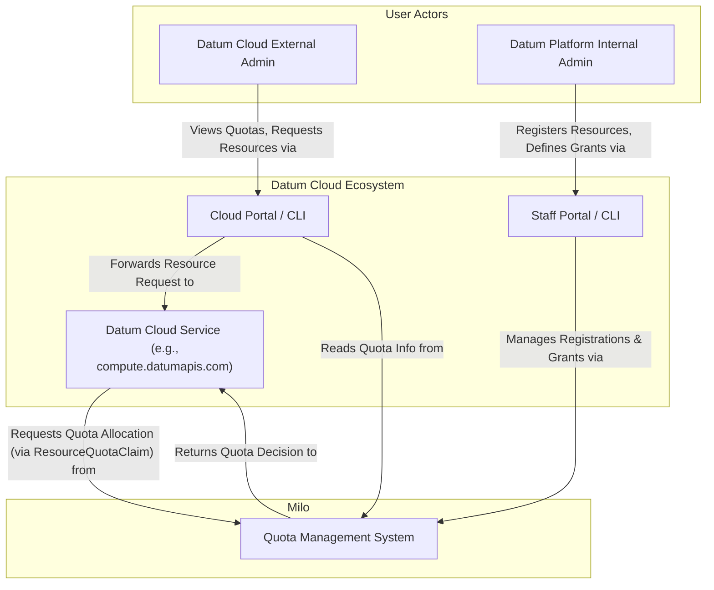
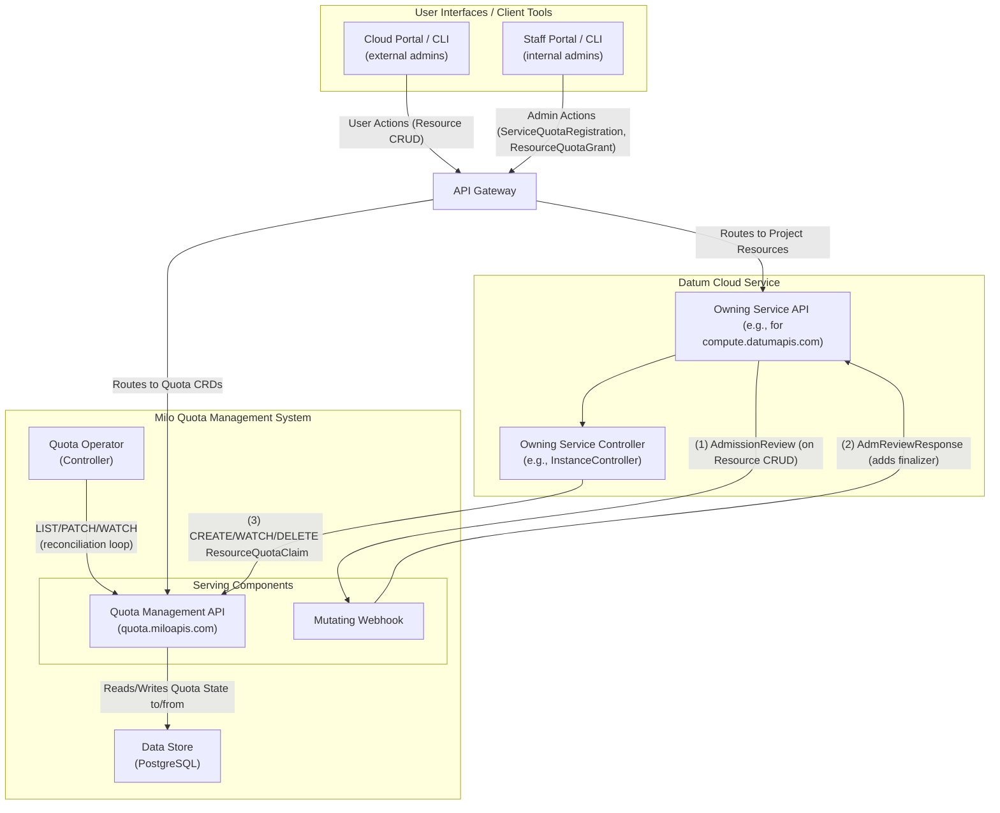
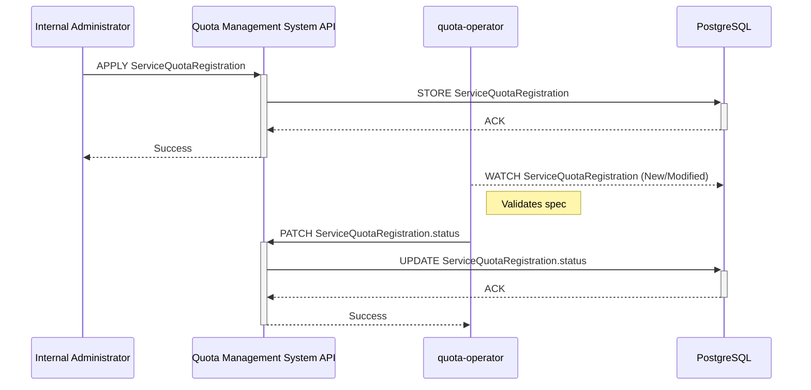
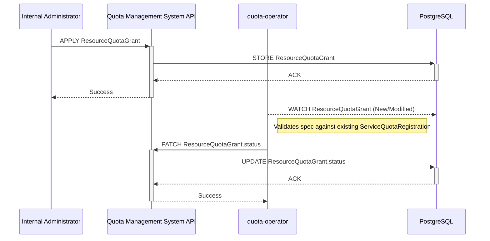
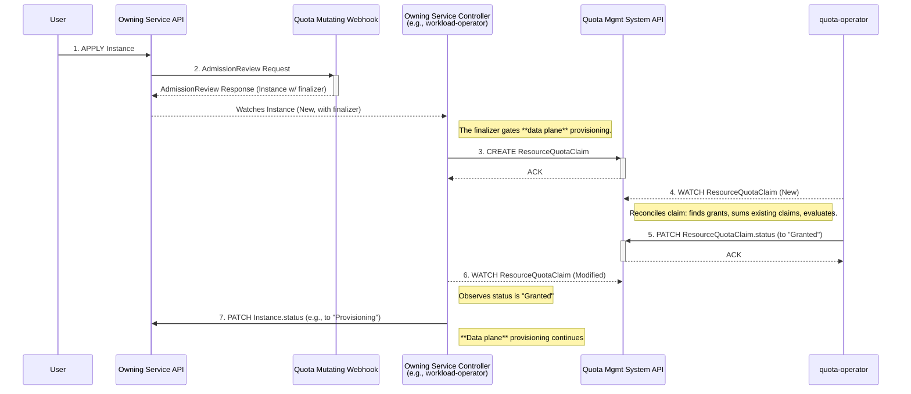
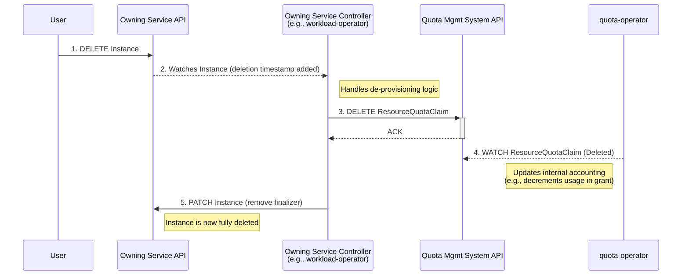

# Quota Management


## Table of Contents

- [Quota Management](#quota-management)
  - [Glossary of Terminology](#glossary-of-terminology)
  - [Summary](#summary)
  - [Motivation](#motivation)
    - [Goals](#goals)
    - [Non-Goals](#non-goals)
  - [Proposal](#proposal)
    - [Desired Outcome and Definition of
      Success](#desired-outcome-and-definition-of-success)
    - [Key Components and Capabilities](#key-components-and-capabilities)
    - [User Stories (Optional)](#user-stories-optional)
      - [Story 1](#story-1)
      - [Story 2](#story-2)
      - [Story 3](#story-3)
      - [Story 4](#story-4)
    - [Risks and Mitigations](#risks-and-mitigations)
      - [Risk: The potential to block resource
        creation](#risk-the-potential-to-block-resource-creation)
        - [Mitigations (High-Level):](#mitigations-high-level)
      - [Risk: The potential to use non-live data when evaluating
        `ResourceQuotaClaim` against
        `ResourceQuotaGrant`s](#risk-the-potential-to-use-non-live-data-when-evaluating-resourcequotaclaim-against-resourcequotagrants)
        - [Mitigations (High-Level):](#mitigations-high-level-1)
      - [Risk: Potential for Inaccurate Quota Accounting by
        `quota-operator`](#risk-potential-for-inaccurate-quota-accounting-by-quota-operator)
        - [Mitigations (High-Level):](#mitigations-high-level-2)
      - [Risk: Quota System Unavailability Blocks Resource
        Creation](#risk-quota-system-unavailability-blocks-resource-creation)
        - [Mitigations (High-Level):](#mitigations-high-level-3)
  - [Design Details](#design-details)
    - [Custom Resource Definitions](#custom-resource-definitions)
      - [`ServiceQuotaRegistration`](#servicequotaregistration)
      - [`ResourceQuotaGrant`](#resourcequotagrant)
      - [`ResourceQuotaClaim`](#resourcequotaclaim)
      - [`AggregatedResourceQuotaView`](#aggregatedresourcequotaview)
    - [Quota Registration](#quota-registration)
      - [Quota Operator Controller](#quota-operator-controller)
      - [Admission Webhooks](#admission-webhooks)
    - [Service Integration Patterns for Quota
      Management](#service-integration-patterns-for-quota-management)
      - [Service Controller Driven Pattern](#service-controller-driven-pattern)
      - [Validating Webhook Driven Pattern](#validating-webhook-driven-pattern)
  - [System Architecture Diagrams](#system-architecture-diagrams)
    - [Static Structure: System Context and
      Components](#static-structure-system-context-and-components)
      - [C1 Diagram - System Context](#c1-diagram---system-context)
      - [C2 Diagram - Containers/Components](#c2-diagram---containerscomponents)
    - [Dynamic Flows: Sequence Diagrams](#dynamic-flows-sequence-diagrams)
      - [Sequence Diagram Step Breakdown](#sequence-diagram-step-breakdown)
        - [Prerequisite 1: Service Quota Definition
          Registration](#prerequisite-1-service-quota-definition-registration)
        - [Prerequisite 2: Defining Resource Quota Limits (`ResourceQuotaGrant`
          Creation)](#prerequisite-2-defining-resource-quota-limits-resourcequotagrant-creation)
        - [Core Flow: Resource Provisioning and Quota
          Claim](#core-flow-resource-provisioning-and-quota-claim)
        - [Ancillary Flow: Tear-down & Quota
          Release](#ancillary-flow-tear-down--quota-release)
  - [Open Questions](#open-questions)
  - [Production Readiness Review
    Questionnaire](#production-readiness-review-questionnaire)
    - [Feature Enablement and Rollback](#feature-enablement-and-rollback)
      - [How can this feature be enabled / disabled in a live
        cluster?](#how-can-this-feature-be-enabled--disabled-in-a-live-cluster)
      - [Does enabling the feature change any default
        behavior?](#does-enabling-the-feature-change-any-default-behavior)
      - [Can the feature be disabled once it has been enabled (i.e. can we roll
        back the
        enablement)?](#can-the-feature-be-disabled-once-it-has-been-enabled-ie-can-we-roll-back-the-enablement)
      - [What happens if we reenable the feature if it was previously rolled
        back?](#what-happens-if-we-reenable-the-feature-if-it-was-previously-rolled-back)
      - [Are there any tests for feature
        enablement/disablement?](#are-there-any-tests-for-feature-enablementdisablement)
    - [Rollout, Upgrade and Rollback
      Planning](#rollout-upgrade-and-rollback-planning)
      - [How can a rollout or rollback fail? Can it impact already running
        workloads?](#how-can-a-rollout-or-rollback-fail-can-it-impact-already-running-workloads)
      - [What specific metrics should inform a
        rollback?](#what-specific-metrics-should-inform-a-rollback)
      - [Were upgrade and rollback tested? Was the upgrade-> downgrade-> upgrade
        path
        tested?](#were-upgrade-and-rollback-tested-was-the-upgrade--downgrade--upgrade-path-tested)
      - [Is the rollout accompanied by any deprecations and/or removals of
        features, APIs, fields of API types, flags,
        etc.?](#is-the-rollout-accompanied-by-any-deprecations-andor-removals-of-features-apis-fields-of-api-types-flags-etc)
    - [Monitoring Requirements](#monitoring-requirements)
      - [How can an operator determine if the feature is in use by
        workloads?](#how-can-an-operator-determine-if-the-feature-is-in-use-by-workloads)
      - [How can someone using this feature know that it is working for their
        instance?](#how-can-someone-using-this-feature-know-that-it-is-working-for-their-instance)
      - [What are the reasonable SLOs (Service Level Objectives) for the
        enhancement?](#what-are-the-reasonable-slos-service-level-objectives-for-the-enhancement)
      - [What are the SLIs (Service Level Indicators) an operator can use to
        determine the health of the
        service?](#what-are-the-slis-service-level-indicators-an-operator-can-use-to-determine-the-health-of-the-service)
      - [Are there any missing metrics that would be useful to have to improve
        observability of this
        feature?](#are-there-any-missing-metrics-that-would-be-useful-to-have-to-improve-observability-of-this-feature)
    - [Dependencies](#dependencies)
      - [Does this feature depend on any specific services running in the
        cluster?](#does-this-feature-depend-on-any-specific-services-running-in-the-cluster)
    - [Scalability](#scalability)
      - [Will enabling / using this feature result in any new API
        calls?](#will-enabling--using-this-feature-result-in-any-new-api-calls)
      - [Will enabling / using this feature result in introducing new API
        types?](#will-enabling--using-this-feature-result-in-introducing-new-api-types)
      - [Will enabling / using this feature result in any new calls to the cloud
        provider?](#will-enabling--using-this-feature-result-in-any-new-calls-to-the-cloud-provider)
      - [Will enabling / using this feature result in increasing size or count
        of the existing API
        objects?](#will-enabling--using-this-feature-result-in-increasing-size-or-count-of-the-existing-api-objects)
      - [Will enabling / using this feature result in increasing time taken by
        any operations covered by existing
        SLIs/SLOs?](#will-enabling--using-this-feature-result-in-increasing-time-taken-by-any-operations-covered-by-existing-slisslos)
      - [Will enabling / using this feature result in non-negligible increase of
        resource usage in any
        components?](#will-enabling--using-this-feature-result-in-non-negligible-increase-of-resource-usage-in-any-components)
      - [Can enabling / using this feature result in resource exhaustion of some
        node resources (PIDs, sockets, inodes,
        etc.)?](#can-enabling--using-this-feature-result-in-resource-exhaustion-of-some-node-resources-pids-sockets-inodes-etc)
    - [Troubleshooting](#troubleshooting)
      - [How does this feature react if the APIServer is
        unavailable?](#how-does-this-feature-react-if-the-apiserver-is-unavailable)
      - [What are other known failure
        modes?](#what-are-other-known-failure-modes)
      - [What steps should be taken if SLOs are not being met to determine the
        problem?](#what-steps-should-be-taken-if-slos-are-not-being-met-to-determine-the-problem)
  - [Implementation History](#implementation-history)
  - [Drawbacks](#drawbacks)
  - [Alternatives](#alternatives)
  - [Infrastructure Needed (Optional)](#infrastructure-needed-optional)

## Glossary of Terminology

*   **Quota Management APIs**: The primary APIs for interacting with the quota
    management system via quota-related CRDs (`ServiceQuotaRegistration`,
    `ResourceQuotaGrant`, `ResourceQuotaClaim`) and organization-scoped
    resources. This is where the core quota logic resides.
*   **Owning Service API**: An API specific to a service (e.g.,
    `compute.datumapis.com` or `networking.datumapis.com`) that manage primary
    resources for a project (e.g., `Instance`, `Subnet`, `Project`, etc.).
*   **Internal Administrator**: Administrators responsible for the overall
    management, operation, and definition of services and quota policies within
    the Datum Cloud and Milo platforms (e.g., a Datum employee).
*   **External Administrator**: A customer representative who manages their
    organization's or project's resources, views their applicable quotas, and
    can request changes or increases to these quotas via Internal Administrators
    (e.g., a customer).
*   **Owning Service**: A Datum Cloud service (e.g., `compute.datumapis.com`)
    that manages a specific type of resource (e.g., `Instance`) and is
    responsible for its lifecycle, including integrating with the quota system.
*   **[`ServiceQuotaRegistration`](#servicequotaregistration)**: a CRD within
    the Quota Management system, used by internal administrators to register a
    specific resource type from an Owning Service (e.g.,
    `compute.datumapis.com/instances/cpu`) as quotable, defining its unit, and
    allowed dimensions.
*   **[`ResourceQuotaGrant`](#resourcequotagrant)**: a CRD within the Quota
    Management system, namespaced to a project or organization, that declares
    the actual quota limits for a registered Owning Service resource (e.g.,
    `compute.datumapis.com/instances/cpu`) and specific scope with dimensional
    bucketing.
*   **[`ResourceQuotaClaim`](#resourcequotaclaim)**: a CRD within the Quota
    Management system, namespaced to a project or organization, that represents
    an Owning Service's *intent* to consume a specific quantity of a
    *registered* Owning Service resource (e.g.,
    `compute.datumapis.com/instances/cpu`) against a defined grant.
*   **[`AggregatedResourceQuotaView`](#aggregatedresourcequotaview)**: A
    **read-only** CRD that provides a consolidated view of the total effective
    quota limits for a specific Owning Service resource type and set of
    dimensions within a given namespace. It is dynamically generated and updated
    by the `quota-operator`.
*   **[`quota-operator`](#quota-operator-controller)**: A controller that
    reconciles `ResourceQuotaClaim`s by validating them, checking against
    `ResourceQuotaGrant`s, and updating claim statuses based on its own
    accounting of granted and released claims.
*   **[Admission Webhooks](#admission-webhooks)**: Initially, a single mutating
    admission webhook registered with Owning Service APIs to intercept resource
    requests and add finalizers, supporting the controller-driven quota
    management pattern.

## Summary

This enhancement proposes the architecture and implementation of a comprehensive
and centralized Quota Management system within the Milo platform. This system
will allow **Internal Administrators** the ability to register services and the
resources that are subject to quota limits, and manage those limits through
grants. **External Administrators** will be able to view their quota limits as
well as request changes to them, which will be processed by **Internal
Administrators**, as they are not able to directly manage quota limits
themselves.

The system aims to provide predictable capacity management, enable customer tier
enforcement, offer transparency to customers regarding their resource limits,
and include enforcement mechanisms to reject claim requests that would exceed
these limits *without blocking resource creation*.

## Motivation

The ability to create, observe, and manage resource quotas and limits for
organizations and their projects provides numerous benefits to both **Internal
and External Administrators** of the system. By providing full transparency and
observability into quota management and resource consumption, quota management
also ensures:

1. Operational stability and reliability
2. Accurate cost predictability
3. Prevention of accidental or abusive overuse
4. Confidence in resource planning and the enforcement of internal and
   regulatory policies

The safeguards put in place through quota management will enable users to fully
explore the Datum Cloud and Milo ecosystems and the variety of valuable
functionality they provide, without the risk of exceeding the limits that have
been set within their organization and projects; leading to unexpected costs.

### Goals

- Provide clear system context and architectural approach to the creation of a
  quota management system that Datum Cloud services will integrate with.
- Define the APIs that **Internal Administrators** will use to:
  - Register specific service resources that can be subject to quota limits.
  - Create and manage the actual quota limits on the resources through grants
    containing dimensions and labels with the ability to grant additional quotas
    to specific projects or organizations.
  - Automatically generate grants for new projects and organizations when they
    are initialized.
- Define the API for **External Administrators** to view their quota limits and
  request changes to them through **Internal Administrators**.
- Enforce quota limits without blocking the initial creation of the resource
  object in the **control plane**. This allows a resource (e.g., an `Instance`)
  to be created and be visible to the user immediately, while the actual
  provisioning of the underlying **data plane** resources are gated by the
  Owning Service's controller until the quota is successfully claimed.
- Facilitate predictable capacity management for the platform.

### Non-Goals

- Provide detailed implementation specifics of how the billing components of the
  system will work.
- Support customer tier enforcement (e.g., free vs. paid tiers) through
  configurable quotas (which will be implemented as a future enhancement).
- Define the future Milo Service Catalog and service registration (distinct from
  the service resource-type registration for quota management).
- Define the exact user interface (UI) mockups or user experience (UX) flows for
  managing or viewing quotas, beyond initial design for the MVP.
- Define how time-series metrics (e.g. CPU hours, data written, etc) will be
  implemented by the data plane.
- Define how alerts can be created and sent to **External Administrators** to
  inform them that they are approaching the quota threshholds they set for the
  resources. These "early warning" alerts are *not* enforced by the quota
  system, nor a part of this enhancement.
- Provide a mechanism for **External Administrators** (customers) to define
  their own "soft limits" for billing alerts or notifications. The limits
  defined in `ResourceQuotaGrant` are authoritative and can only be set by
  **Internal Administrators**.

## Proposal

This enhancement proposes the design, architecture, and implementation of a
quota management system in Milo. This system will be centralized and designed
for integration by Datum Cloud services. It will allow for the observation and
management of resource quota limits at both organizational and project levels by
administrators.

### Desired Outcome and Definition of Success

The Quota Management system will provide a robust and scalable mechanism for
registering resources that are subject to quota limits, defining those limits,
allocating, tracking, and enforcing resource quotas across various services
within Projects and Organizations. 

The Definition of Success for this enhancement includes the following:

*   **Resource Registration**: Internal Administrators can register resources
    that are subject to quota limits, both manually and automatically when a new
    project or organization is created.
*   **Centralized Quota Definition**: Internal Administrators can define and
    manage quota limits for different services and their resource types.
*   **Clear Quota Visibility**: External administrators can easily view their
    current quota limits and usage for registered resources via the Datum Cloud
    Portal. Internal administrators can view and manage quota limits and grant
    additional quota for any project or organization via the Staff Portal.
*   **Automated Enforcement**: The system automatically prevents resource
    consumption that would exceed defined quotas, providing clear feedback to
    the requesting service or user.
*   **Extensibility**: New services can integrate with the quota system by
    registering their resource types and dimensions without requiring
    modifications to the core quota management logic.
*   **Accurate Accounting**: Resource consumption is accurately tracked against
    allocated quotas.
*   **Service Integration**: Owning Services can integrate with the quota system
    using well-defined patterns, such as the service-controller pattern.

### Key Components and Capabilities

*   **Service Resource Registration (`ServiceQuotaRegistration`)**:
    *   A mechanism for **Internal Administrators** to formally register
        resource types from various Owning Services (e.g.,
        `compute.datumapis.com/instances/cpu`,
        `networking.datumapis.com/subnets/count`) that need to be subjected to
        quota limits.
    *   Registration includes the canonical name of the Owning Service resource
        type, its unit of measurement (e.g., count, bytes, millicores, etc), and
        the specific, named *Resource Dimensions* (e.g.,
        `networking.datumapis.com/location`,
        `compute.datumapis.com/instance-type`) that can be independently limited
        for that resource type and dimension combination.
    *   This registration makes these Owning Service resource types and their
        associated dimensions explicitly known and manageable by the quota
        system.
*   **Resource Claim Requests (`ResourceQuotaClaim`)**:
    *   When an **Owning Service** needs to provision a specific resource that
        is subject to quota limits, it creates a `ResourceQuotaClaim` to request
        the resource provisioning or additional allocation (or the opposite, if
        the resource is being deprovisioned or allocation is being reduced).
    *   The claim specifies the *registered Owning Service resource type* and
        the quantities for each *registered dimension* it intends to consume.
        This claim is then reconciled by the `quota-operator` against the
        relevant `ResourceQuotaGrant`s for the given scope (e.g., project).
*   **Resource Quota Definition (`ResourceQuotaGrant`)**:
    *   **Internal Administrators** define actual quota limits for *registered*
        Owning Service resource types at different scopes (e.g., organization,
        project).
    *   Grants specify limits for one or more resource types and the *registered
        dimensions* of that type.
*   **Quota Enforcement**:
    *   Within the primary controller-driven pattern, the `quota-operator` is
        responsible for all enforcement. It validates each new
        `ResourceQuotaClaim` object against the additive `ResourceQuotaGrant`s
        for the given scope.
    *   If the claim can be satisfied, its status is updated to `Granted`. The
        Owning Service then proceeds with provisioning.
    *   If the claim cannot be satisfied, its status is updated to `Denied`,  
        and the Owning Service will either reject the claim, or allow the claim
        to be created and resources provisioned without allowing usage of the
        resource until the quota limit is increased via **Internal
        Administrators** or a request to the quota system is made to increase
        the quota limit. This is done to ensure that the platform is able to
        continue operating and not block resource creation.
*   **Quota Aggregation and Visibility (`AggregatedResourceQuotaView`)**:
    *   A read-only view that aggregates all applicable `ResourceQuotaGrant`s
        for a given scope (e.g., project and dimensions) and registered resource
        type; providing a clear picture of the total effective quota and current
        usage.
    *   This is useful for Cloud and Staff Portal UIs and for services to
        understand their available capacity.
*   **Service Integration**:
    *   Owning Services integrate with the quota management system by:
        1.  Creating `ResourceQuotaClaim`s when users request resources.
        2.  Observing the status of their `ResourceQuotaClaim`s to proceed with
            or halt resource provisioning.
        3.  Deleting `ResourceQuotaClaim`s when the underlying resources are
            deprovisioned, thus releasing the quota.
*   **Administration & User Interface**:
    - **External Administrators** and users will be able to view their current
      quota limits via the Datum Cloud Portal.
    - **Internal Administrators** will have the ability to view and manage
      registrations and grants for all projects and organizations via the Staff
      Portal.

**Proposal Deliverables**
- An fully complete enhancement document (this document) detailing the system
  architecture, with clear separation of responsibilities between the involved
  services and components.


### User Stories (Optional)

To provide concrete examples of how the system will be used, beyond previously
discussed benefits, the following user stories are proposed. These stories are
not exhaustive, but are intended to provide a clear understanding of the system
and its capabilities at a high level for the various personas involved.

#### Story 1
 As an **External Administrator**, I should be able to view the available
 resource registrations, grants, and requested claims for my organization and
 project-level resources, so that I have full visibility into the scope of
 resources that are available to me and the quota limits that are set for my
 organization and projects.

#### Story 2
As an **External Administrator**, I should be able to request a quota increase
for my organization or project through a manual, out-of-band process (e.g., by
contacting Internal Administrators), so that I can control the scope of resource
limits that are available to my organization and projects.

#### Story 3
 As an **Internal Administrator**, I should be able to view and manage quota
 limits for all projects and organizations across the platform through the Staff
 Portal, so that I can ensure that the platform and external organizations are
 operating within the limits set by both external and internal administrators.

#### Story 4
As an **Internal Administrator**, I should be able to view and manage resource
registrations for all projects and organizations across the platform, through
the Staff Portal, so that I can ensure that the platform is aware of the scope
of resources that are available to each organization and project and performing
as expected.

### Risks and Mitigations

Various risks must be taken into account for the proposed implementation of the
Quota Management system to ensure the system is working as expected and the
risks are mitigated. These risks are not exhaustive, but are intended to provide
a clear understanding of the potential issues that may arise and the mitigations
that are proposed if they do arise

Best practices will be enforced by reviewers based on their knowledge of the
Datum Cloud and Milo ecosystems, including full security compliance and
alignment with established external and internal standards of Datum platforms.

#### Risk: Quota System Unavailability Blocks Resource Creation

**Consequence**: If the Quota Management webhook is unavailable, it will block
the creation and modification of any resource that it is configured to watch.
This prioritizes system consistency over availability, a trade-off that is
acceptable for the system.

##### Mitigations (High-Level):
-   **High Availability of Webhook:** The primary mitigation is to ensure the
    Quota Management webhook service is deployed in a highly available
    configuration (e.g., with multiple replicas) to minimize its downtime.
-   **Webhook `failurePolicy: Fail`:** The mutating admission webhook will be
    configured with aggressive timeouts and its `failurePolicy` set to `Fail`.
    This is a deliberate design choice to prevent system inconsistencies. It
    ensures that no resource can be created or modified without the webhook
    first adding its required finalizer. While this means the webhook is a
    critical-path component, it guarantees that quota accounting cannot be
    bypassed due to a webhook outage.
-   **`quota-operator` Resilience:** The `quota-operator` will be designed to be
    resilient. If its connections to necessary components of the system are
    unavailable for any period not resolved through thorough retries and failure
    policies, the operator should clearly indicate this in both in its own
    status *and* logs (providing full transparency), and might temporarily deny
    new claims.
-   **Monitoring & Alerting:** Comprehensive monitoring will be in place to
    alert operators immediately if the webhook service becomes unhealthy or if
    its error rate or latency increases, allowing for rapid intervention.
-   **Emergency Bypass (Break-Glass Procedure):** For extreme, prolonged outages
    of the core quota enforcement workflow, a well-documented, audited, and
    IAM-controlled procedure should allow **Internal Administrators only** to
      temporarily bypass quota checks (e.g., by temporarily removing or altering
      webhook configurations). This is a last-resort measure.

#### Risk: Inaccurate Quota Accounting by the `quota-operator`

Since the `quota-operator` is responsible for all quota accounting by summing
`ResourceQuotaClaim`s, its accuracy is critical.

**Consequence:** Inaccurate accounting can lead to two failure modes:
- **Over-allocation**: Allowing resource creation beyond the specified quota
  limits if the operator undercounts existing claims.
- **Under-allocation**: Incorrectly denying resource creation when sufficient
  quota is available if the operator overcounts claims or fails to process
  released claims.

##### Mitigations (High-Level):
-   **Authoritative State in CRDs**: The state of all granted resources is
    derived *exclusively* from the sum of `ResourceQuotaClaim` objects present
    in the cluster. The `quota-operator`'s role is to reconcile this state.
-   **Robust Reconciliation Logic**: The `quota-operator`'s reconciliation logic
    must be robust, idempotent, and correctly handle all lifecycle events of
    `ResourceQuotaClaim`s (creation, modification, deletion).
-   **Use of Finalizers**: `ResourceQuotaClaim`s will use finalizers. This
    ensures that a claim object is not fully deleted from the data store until
    the `quota-operator` has successfully processed its deletion and released
    the quota.
-   **Full Reconciliation on Startup**: Upon startup or recovery, the
    `quota-operator` must perform a full reconciliation, re-calculating usage by
    summing all existing `ResourceQuotaClaim`s to ensure its internal ledger is
    consistent with the state of the cluster.
-   **Auditability and Observability**: The `AggregatedResourceQuotaView` and
    metrics exposed by the `quota-operator` provide clear reference points for
    accounted usage and reconciliation actions.
-   **Clear Status Reporting**: The `ResourceQuotaClaim.status.conditions` will
    clearly report the outcome of any claim, aiding in troubleshooting.

---

## Design Details

The Milo Quota Management System will be deployed as a series of components that
form a central service. Its core quota-related CRDs and logic will be managed by
this central service, along with any organization-scoped resources.

The system will expose APIs and allow Datum Cloud services to integrate with
them, enabling these services to manage their primary resources (`Instance`,
`Gateway`, `Subnet`, etc.) via their respective Owning Service APIs. These
Owning Service APIs are the primary entrypoints for users and administrators to
interact with their project-scoped resources. The central quota management
service will also be responsible for managing any organization-scoped resources,
such as total `Users` and `Project` resources.

### Custom Resource Definitions

Four main CRDs will be created as core components of the Quota Management
implementation: 

- `ServiceQuotaRegistration`
- `ResourceQuotaClaim`
- `ResourceQuotaGrant`
- `AggregatedResourceQuotaView`

These CRDs will be defined and their APIs served by the **central Quota
Management APIs**, with the API group for these CRDs being `quota.miloapis.com`;
aligning with existing API group standards. The Go type definitions for these
CRDs will be located within the [milo GitHub
Repository](https://github.com/datum-cloud/milo).

Other `*.datumapis.com` API groups referenced in this document, such as
`compute.datumapis.com`, are used to group resources managed by individual
**Owning Services through their respective APIs**. Each such API is dedicated to
a specific organization's project and runs its own control plane logic.

These Owning Service APIs are *not* where the Milo quota CRDs are directly
managed. However, they will instead be configured (via
[multicluster-runtime](https://github.com/kubernetes-sigs/multicluster-runtime))
to call Milo's mutating admission webhook when resources like an `Instance` is
created or modified via that Owning Service API.

#### `ServiceQuotaRegistration`

The `ServiceQuotaRegistration` CRD gives **Internal Administrators** the ability
to define and register specific resource types from Owning Services (e.g.,
`compute.datumapis.com/instances/cpu`, `networking.datumapis.com/subnets`) that
the Quota Management system can manage. This registration makes these resource
types *available* for `ResourceQuotaGrant` CRs to apply limits to. **Internal
Administrators** interact with the Quota Management APIs to manage these
registrations.

This approach ensures that the Quota Management system is aware of which
specific Owning Service resources are quotable, without the Quota Management
system itself needing to understand the internal details of those Owning
Services. The `quota-operator` uses these registrations to validate
`ResourceQuotaGrant`s and `ResourceQuotaClaim`s.

```yaml
apiGroup: quota.miloapis.com
kind: ServiceQuotaRegistration
metadata:
  # Unique name for the registration, should clearly identify the Owning Service resource
  # <service-name>-<parent-resource-name>-<resource-name>-registration
  name: compute-instances-cpu-registration
spec:
  # Service which owns the resource being registered.
  serviceRef:
    name: compute.datumapis.com
    uid: <uid>
  # The type of resource being registered (e.g., Allocation, Feature).
  # This helps categorize the resource type.
  type: Allocation

  # Fully qualified name of the resource type being registered, as defined by the Owning Service.
  # This is the identifier used in `ResourceQuotaClaim.spec.resources`
  # and `ResourceQuotaGrant.spec.resources`.
  resourceName: compute.datumapis.com/instances/cpu
  # Description of the resource type.
  description: "Number of allocatable CPU cores for compute instances."
  # The unit of measurement for the resource (raw unit for accounting).
  # Examples: "millicores", "bytes", etc,
  unit: "millicores"
  # Optional: Hint for UIs on how to convert the raw unit for display.
  # Examples: "cores" (from millicores or units), "GiB" (from bytes).
  displayUnits: "cpu"
  # Dimensions that can be used in ResourceQuotaGrant selectors
  # for this resource type. These are typically fully qualified attribute names
  # from the Owning Service's domain.
  # Example: compute.datumapis.com/instance-type, networking.datumapis.com/location
  dimensions:
    - compute.datumapis.com/instance-type
    - networking.datumapis.com/location
status:
  # The specific revision of the ServiceQuotaRegistration.
  observedGeneration: 1
  # Standard kubernetes approach to represent the state of a resource.
  conditions:
    # Indicates if the registration is valid (e.g. owning service exists), accepted, and the resource is now quotable.
    # - Type: Ready
    # - Status: "True" | "False" | "Unknown"
    # - Reason: (e.g., "DefinitionActive" | "InvalidServiceReference" | "Initializing")
    # - Message: Human-readable message detailing status reason
    #   (e.g. "The service's resource is ready to be managed by quotas.")
    - type: Ready
      status: Unknown
      lastTransitionTime: "2023-01-01T12:00:00Z"
      reason: Initializing
      message: "The registration is being initialized."
```

#### `ResourceQuotaGrant`

The `ResourceQuotaGrant` CRD declares the actual quota limits for a specific
scope, referencing the Owning Service resource types defined by
`ServiceQuotaRegistration`. It is a **Namespaced** resource, meaning each grant
will reside within a namespace that corresponds to the specific project or
organization it governs. Multiple `ResourceQuotaGrant` CRs can exist for the
same scope and Owning Service resource type, as their limits are *additive* to
determine the total effective quota.

```yaml
apiGroup: quota.miloapis.com
kind: ResourceQuotaGrant
metadata:
  name: <my-resource-quota-grant>
  # Namespace of the project/organization this grant applies to
  namespace: proj-abc
  uid: <uid>
spec:
  # Reference to project or organization since the CRD can use either
  resourceRef:
    apiGroup: resourcemanager.datumapis.com
    # Either Project or Organization
    resource: Project
    # Name of the Project/Organization custom resource
    name: proj-abc
  # The specific Owning Service resource types (defined by ServiceQuotaRegistration)
  # and their quota limits being managed by this grant.
  resources:
  # 1. Grant for compute instance CPUs
  - name: compute.datumapis.com/instances/cpu
    # A bucket represents a specific combination of dimensions and a limit.
    buckets:
    # Grant for a specific combination of dimensions
    - type: Limit
      unit: "millicores"
      value: 40000
      # Explicitly define dimension key-value pairs for this bucket,
      # using dimension keys registered in ServiceQuotaRegistration.
      dimensionLabels:
        networking.datumapis.com/location: "dfw-region"
        compute.datumapis.com/instance-type: "d1-standard-2"

  # 2. Grant for compute instance memory allocation
  - name: compute.datumapis.com/instances/memoryAllocated
    buckets:
    - type: Limit
      unit: "bytes"
      # In bytes (4096 GiB)
      value: 4398046511104
      # Empty dimensionLabels means it applies globally for this resource type
      # in this grant, or for claims that do not specify these dimensions.
      dimensionLabels: {}

    - type: Limit
      unit: "bytes"
      # in bytes (1024 GiB)
      value: 1099511627776
      dimensionLabels:
        networking.datumapis.com/location: "dfw-region"

  # 3. Grant for compute instance count
  - name: compute.datumapis.com/instances/count
    buckets:
    - type: Limit
      unit: "instances"
      value: 20
      dimensionLabels:
        compute.datumapis.com/instance-type: "d1-standard-2"
    - type: Limit
      unit: "instances"
      value: 5
      dimensionLabels:
        networking.datumapis.com/location: "dfw-region"
        compute.datumapis.com/instance-type: "d1-standard-2"

  # 4. Grant for network gateway count
  - name: networking.datumapis.com/subnets/count
    buckets:
    - type: Limit
      unit: "subnets"
      value: 15
      # Applies to all subnets of this type for the project in this grant
      dimensionLabels: {}

# Status reflects the validity and applicability of the defined quotas.
status:
  observedGeneration: 1
  # The `quota-operator` updates this field to show how much of this specific
  # grant's allocation has been consumed or attributed to. It is used for
  # reporting and auditing, but the authoritative source for a quota decision is
  # the real-time summation of all relevant ResourceQuotaClaims.
  usage:
  - name: compute.datumapis.com/instances/cpu
    buckets:
    # Dimension-specific usage
    - dimensionLabels:
        networking.datumapis.com/location: "dfw-region"
        compute.datumapis.com/instance-type: "d1-standard-2"
      used: 10000
      unit: "millicores"
  # Standard kubernetes approach to represent the state of a resource.
  conditions:
    # Indicates if the grant is correctly configured and actively being used.
    # - Type: Ready
    # - Status: "True" | "False" | "Unknown"
    # - Reason: (e.g., "GrantActive" | "InvalidResourcesConfiguration" | "NotEnforced")
    # - Message: Human-readable message detailing the Reason value.
    - type: Ready
      status: Unknown
      lastTransitionTime: "2023-01-01T12:00:00Z"
      reason: Initializing
      message: "ResourceQuotaGrant is being initialized."
    # Indicates if the spec.resources are well-formed and logically consistent.
    # - Type: ResourcesValid
    # - Status: "True" | "False" | "Unknown"
    # - Reason: (e.g., "ValidationSuccessful" | "InvalidDimensionSelector" | "ResourceNotDefined")
    # - Message: Human-readable message detailing any issues.
    - type: ResourcesValid
      status: Unknown
      lastTransitionTime: "2023-01-01T12:00:00Z"
      reason: PendingValidation
      message: "Validation of resources is pending."
    # Indicates whether the usage field is up-to-date with the sum of existing claims.
    # - Type: UsageCorrectlyAccounted
    # - Status: "True" | "False" | "Unknown"
    # - Reason: (e.g., "AccountingSuccessful" | "ReconciliationNeeded")
    - type: UsageCorrectlyAccounted
      status: Unknown
      lastTransitionTime: "2023-01-01T12:00:00Z"
      reason: PendingCalculation
      message: "Usage accounting is pending."
```

#### `ResourceQuotaClaim`

The `ResourceQuotaClaim` CRD represents the *intent* of an Owning Service to
request/consume resources against a defined quota limit, using the Owning
Service resource types defined by `ServiceQuotaRegistration`. When a user action
triggers an Owning Service to create a resource (e.g., an `Instance` via its
specific Owning Service API), that Owning Service's controller will then create
a `ResourceQuotaClaim` CR. This CR contains a reference to the Owning Service
resource, as well as the quantity of the resource being requested. It is a
**Namespaced** resource, where the namespace corresponds to the organization or
project.

```yaml
apiGroup: quota.miloapis.com
kind: ResourceQuotaClaim
metadata:
  # Connect the claim's lifetime to the workload that needs the quota
  name: instance-abc123-claim
  # Namespace of the project/organization this claim applies to
  namespace: proj-abc
  uid: <uid>
  # Cleanup on resource deletion
  finalizers:
  - quota.miloapis.com/usage-release
spec:
  # The reference to the resource (managed by an Owning Service) that this claim is for.
  resourceRef: 
    apiGroup: compute.datumapis.com 
    kind: Instance 
    name: instance-abc123 
    uid: <uid>
  # Resources being requested, using fully qualified Owning Service resource types and dimensions.
  # The Owning Service controller is responsible for mapping its specific resource
  # needs (e.g., a 'd1-standard-2' instance in 'dfw') to these registered types and dimensions.
  resources:
  - name: compute.datumapis.com/instances/cpu
    unit: "millicores"
    value: 8000
    # Owning Service maps its specific dimensions (e.g., region, instance type)
    # to the dimension keys defined in ServiceQuotaRegistration for this resource type.
    dimensionValues:
      networking.datumapis.com/location: "dfw-region"
      compute.datumapis.com/instance-type: "d1-standard-2"

  - name: compute.datumapis.com/instances/memoryAllocated
    unit: "bytes"
    value: 34359738368
    dimensionValues:
      networking.datumapis.com/location: "dfw-region"
      compute.datumapis.com/instance-type: "d1-standard-2"

  - name: compute.datumapis.com/instances/count
    unit: "instances"
    value: 1
    dimensionValues:
      networking.datumapis.com/location: "dfw-region"
      compute.datumapis.com/instance-type: "d1-standard-2"
status:
  # List of Owning Service resources that have been granted for this claim, 
  # using the fully qualified name of the resource from the Owning Service
  # e.g., ["compute.datumapis.com/instances/cpu", ...]
  grantedResources: [] 
  observedGeneration: 1
  # Standard kubernetes approach to represent the state of a resource.
  # https://github.com/kubernetes/community/blob/master/contributors/devel/sig-architecture/api-conventions.md#typical-status-properties
  conditions:
    # Ready indicates if the claim has been processed and is in a terminal state
    # (i.e., Granted condition is True or False).
    # - Type: Ready
    # - Status: "True" (Claim is resolved: Granted or Denied) | "False" (Pending Processing) | "Unknown"
    # - Reason: (e.g., "ClaimResolved" | "Processing")
    # - Message: Human-readable message detailing the reason for the status.
    - type: Ready
      status: "True"
      # Indicates time the status last changes e.g. from False to True
      lastTransitionTime: "2023-01-01T12:00:00Z"
      reason: ClaimResolved
      message: "Claim is resolved."
    # QuotaChecked indicates if the quota availability check has been completed.
    # - Type: QuotaChecked
    # - Status: "True" | "False" | "Unknown"
    # - Reason: (e.g., "CheckSuccessful" | "GrantNotFound" | "PendingQuotaCheck")
    # - Message: Human-readable message detailing the reason for the status.
    - type: QuotaChecked
      status: True
      # Indicates time the status last changes e.g. from False to True
      lastTransitionTime: "2023-01-01T12:00:00Z"
      reason: CheckSuccessful
      message: "Quota check was successful."
    # Granted indicates the final outcome of the claim. This is the primary condition
    # representing whether the claim was approved or denied.
    # - Type: Granted
    # - Status: "True" (Claim Approved) | "False" (Claim Denied) | "Unknown" (Awaiting Decision)
    # - Reason: (e.g., "QuotaAvailable", "QuotaExceeded", "ServiceQuotaRegistrationNotFound", "ValidationError", "GrantEvaluationError", "AwaitingDecision")
    # - Message: Human-readable message detailing the reason for the status.
    - type: Granted
      # Default to False until explicitly Granted or Denied
      status: "True"
      # Indicates time the status last changes e.g. from False to True
      lastTransitionTime: "2023-01-01T12:00:00Z"
      reason: QuotaAvailable
      message: "Claim was granted due to quota availability."
```

#### `AggregatedResourceQuotaView`

The `AggregatedResourceQuotaView` is a **read-only view for end-users**,
designed to provide a consolidated summary of the *total effective quota limits*
and *usage* for a specific resource and dimension combination within a given
scope (e.g., project).

**Its purpose is to optimize and simplify client interactions.** Instead of
requiring clients (like the Cloud Portal UI) to perform expensive and complex
calculations (listing all grants and all claims and aggregating them), this CRD
provides a pre-calculated, server-side-aggregated view.

The view itself is **dynamically generated and managed by the
`quota-operator`**. The operator watches for changes in `ResourceQuotaGrant` and
`ResourceQuotaClaim` objects and continuously updates the `status` of the
corresponding `AggregatedResourceQuotaView` to reflect the current total limit
and usage. Therefore, while end-users should treat it as read-only, the operator
actively writes to its status field. It is namespaced to the project or
organization.

```yaml
apiGroup: quota.miloapis.com
kind: AggregatedResourceQuotaView
metadata:
  name: <my-aggregated-resource-quota-view>
  namespace: proj-abc
  # UID is assigned by the system
  uid: <uid>
  labels:
    # Labels to help in querying the view, using the fully qualified Owning Service resource name
    resourceName: "compute.datumapis.com/instances/cpu"
# Defines scope of view
spec:
  # Fully qualified Owning Service resource type
  resourceName: compute.datumapis.com/instances/cpu
  # Fully qualified dimension key-value pairs from the Owning Service
  dimensionValues:
    networking.datumapis.com/location: "dfw-region"
    compute.datumapis.com/instance-type: "d1-standard-2"
status:
  # Reflects the generation of the operator logic used
  observedGeneration: 3
  # Total aggregated limit from all applicable ResourceQuotaGrants
  totalLimit:
    unit: "millicores"
    value: 120000
  # Summation of all granted ResourceQuotaClaims for this Owning Service resource/dimension combination
  totalUsed:
    unit: "millicores"
    value: 30000
  # List of UIDs of the ResourceQuotaGrant objects used for aggregation
  observedGrantUIDs:
    # Default grant created by the system
    - "uid-grant-default"
    # Specific grants used for aggregation
    - "uid-grant-1"
    - "uid-grant-2"
  # Standard conditions
  conditions:
    - type: Ready
      status: "True"
      lastTransitionTime: "2023-10-27T10:00:00Z"
      reason: ViewCalculated
      message: "Aggregated view is up to date."
    - type: Stale
      status: "False"
      lastTransitionTime: "2023-10-27T10:00:00Z"
      reason: ViewRefreshed
      message: "Aggregated view is current."
```

### Quota Registration

To enable Datum Cloud services to integrate with the Quota Management system,
the dedicated and centralized APIs will be leveraged. These APIs provide the
ability for **Internal Administrators** to register services and the specific
resource types that they want to be able to create and manage quotas for. This
results in the `Core Milo APIServer` being aware of the types of resources that
a project or organization are allowed to create quotas for via a
`ResourceQuotaGrant` CR.

This is achieved through the proposed [`ServiceQuotaRegistration`
CRD](#ServiceQuotaRegistration), which acts as a "catalog" for services to
declare the types of resources they offer that *can* be managed by the quota
system at the project or organization level.

**Internal Administrators** will create new `ServiceQuotaRegistration` objects
 to declare each type of resource the system offers that can use quota limits.
The `quota-operator` can then use these CRs to understand and validate requests
for setting the explicit limits for each resource type via a
`ResourceQuotaGrant`.

#### Quota Operator Controller

A `quota-operator` will be created to implement logic to convert the *intent* of
the incoming `ResourceQuotaClaim` object (created by an Owning Service) into the
*actual allocation* of resources. This controller is a core component of the
Quota Management service, and its core logic would be managed by Milo's main
application process (`milo/cmd/apiserver/app/`).

The function of the `quota-operator` is to:
  - Watch `ServiceQuotaRegistration`, `ResourceQuotaGrant`, and
    `ResourceQuotaClaim` objects.
  - Maintain an internal accounting of granted resources based on the lifecycle
    of `ResourceQuotaClaim`s.
  - Update `ResourceQuotaGrant.status.usage` to reflect its internal accounting
    of granted resources for each quota bucket.
  - Enforce per-project or per-organization resource quota limits that are
    declared in `ResourceQuotaGrant` objects by comparing new claims against
    existing limits and its internal accounting.
  - **Manage `AggregatedResourceQuotaView` resources**:
    - When `ResourceQuotaGrant` or `ResourceQuotaClaim` objects are created,
      updated, or deleted, the `quota-operator` identifies the relevant
      `AggregatedResourceQuotaView` CRs that need updating (based on namespace,
      `resourceName`, and `dimensionValues`).
    - For each affected view, the operator recalculates and updates:
      - `status.totalLimit`: By summing the `value` from all applicable
        `ResourceQuotaGrant` buckets that match the view's `resourceName` and
        `dimensionLabels` in that namespace.
      - `status.totalUsed`: By summing the `quantity` of all `Granted`
        `ResourceQuotaClaim`s that match the view's `resourceName` and
        `dimensionLabels` in that namespace.
      - `status.observedGrantUIDs`: By listing the UIDs of the
        `ResourceQuotaGrant`s that contributed to the aggregated `totalLimit`.
      - `status.conditions`: To reflect the view's current state (e.g., `Ready`,
        `Stale`).
    - If an `AggregatedResourceQuotaView` does not exist for a combination that
      now has grants or usage, the operator will create it.

The reconciliation loop for this controller will contain the following logic:

1.  **Validates Registration**:
    - Ensures that the specific requested service resource and dimensions have
      already been registered via a `ServiceQuotaRegistration`, allowing it to
      be used in a `ResourceQuotaGrant`.
    - If the registration is not found, the operator updates the claim's
      `status.conditions` with the appropriate status and reason.

2.  **Watches newly created or updated `ResourceQuotaClaim` objects**. These
    claims are generated by Owning Services when a new resource (e.g.,
    `Instance`, `Router`) is created, scaled, or deleted through its respective
    service API.

3.  **Validates the `ResourceQuotaClaim` structure**:
    - Ensures required fields like `resources`, `resourceRef`, and other
      required fields are present and have a valid structure.
    - Verifies that the `resourceRef` (which points to a resource managed by an
      Owning Service) is a valid reference.
      - **Note**: *The `quota-operator` might not directly access each Owning
        Service API to deeply confirm the existence of the `resourceRef` object
        in real-time for every claim. Validation might initially rely on the
        structure, information propagated to the claim, or eventual consistency
        checks.*
    - If validation fails, the operator updates the claim's `status.conditions`
      to reflect the failure reason.

4.  **Calculates Total Limit from Additive Grants**:
    - Based on the incoming claim's namespace, resource, and dimensions, the
      operator finds **all applicable `ResourceQuotaGrant`s**.
    - It sums the `value` from all matching buckets in these grants to determine
      the `TotalLimit`.

5.  **Calculates Current Usage from Claims and Evaluates**:
    - The operator finds **all existing `ResourceQuotaClaim`s** in the same
      namespace that are in a `Granted` state and match the same resource and
      dimensions.
    - It sums the `quantity` from all these existing claims to determine the
      `TotalUsed`.
    - **IMPORTANT: This live summation of claims is the sole authoritative
      source of truth for usage.** The operator **never** uses
      `ResourceQuotaGrant.status.usage` or other status fields for this
      calculation.
    - It then evaluates if the new claim can be satisfied: `TotalUsed +
      newClaim.spec.quantity <= TotalLimit`.

6.  **Updates Claim and Grant Statuses**:
    - If the claim can be satisfied:
      - It sets `ResourceQuotaClaim.status.conditions` to reflect success (e.g.,
        `type: Granted, status: True, reason: QuotaAvailable`).
      - As a reporting mechanism, it may update the
        `ResourceQuotaGrant.status.usage` field on one or more of the grants
        that contributed to the limit.
    - If the claim would exceed the quota:
      - It sets `ResourceQuotaClaim.status.conditions` to reflect the denial
        (e.g., `type: Granted, status: False, reason: QuotaExceeded`).
    - In both cases, it sets the claim's `Ready` condition to `True`.


**`ResourceQuotaGrant.status.usage` - Reporting and Attribution**

The `ResourceQuotaGrant.status.usage` field's primary role is for reporting and
attribution, not for making authoritative decisions. To be perfectly clear: when
a new claim arrives, the operator *does not* look at `status.usage`; it
recalculates the total usage from scratch by listing all existing claims.

- **Non-Authoritative**: It is not the source of truth for the total usage. The
  operator relies on summing `ResourceQuotaClaim`s for that.
- **Observability**: It provides a convenient way to see how much of a
  *specific* grant has been "allocated" from. The operator might fill grants
  sequentially, for example.
- **Auditability**: Along with the claims themselves, it provides a trail for
  how the total quota pool is being consumed.

**Failure Blast Radius**

If the quota system is down, new `ResourceQuotaClaim` CRs will stall; however,
workloads managed by Owning Services are not directly affected by the
quota-operator outage itself, and there is no blocking of writes to them since
the webhook `failurePolicy` will be set to `Failed`. Resource creation might
proceed without quota checks until the operator recovers.
- See the [Risks and Mitigations](#risks-and-mitigations) section for more
  details.

#### Admission Webhooks

A *stateless mutating admission webhook* will be created as part of the Quota
Management service. **This webhook will be registered with the various **Owning
Service APIs** that manage quotable resources. This registration will be
facilitated by `multi-cluster-runtime`.

When a user attempts to create or modify a resource (e.g., an `Instance`) via an
**Owning Service API** (triggering an action in the Owning Service), the
underlying infrastructure for that API will send an `AdmissionReview` request to
the configured quota management webhook service endpoint. This aligns with the
standard Kubernetes [Dynamic Admission
Control](https://kubernetes.io/docs/reference/access-authn-authz/extensible-admission-controllers/)
pattern.

- The **mutating admission webhook**, when configured for an Owning Service's
  resource type:
    - Has the primary role of inspecting the incoming resource and adding a
      finalizer to the resource via the `AdmissionReviewResponse`. This
      finalizer prevents the premature deletion of the resource while its quota
      is being processed or needs to be released.
    - It **does not** create the `ResourceQuotaClaim` itself, as claim creation
      is the responsibility of the Owning Service's controller which manages the
      lifecycle of the claim.
- The central Quota Management service will be responsible for managing the
  lifecycle of the mutating webhook service.

This setup allows the Quota Management system to reliably participate in the
lifecycle of resources managed by Owning Services by ensuring resources aren't
deleted mid-quota-operation via finalizers. The Owning Services only need to
have the mutating admission webhook registered with their respective APIs.

### Service Integration Patterns for Quota Management

Datum Cloud Services integrate with the Milo Quota Management system primarily
using the controller-driven pattern. This approach is well-suited for resources
where provisioning might involve asynchronous operations and where providing
clear, stateful feedback to the user about quota allocation is important.

#### Service Controller Driven Pattern

**This is the primary initial pattern that will be used for the quota management
system. All diagrams and documentation will be based on this pattern.**

-   **Use Case:** Ideal for infrastructure resources where provisioning may take
    time. It allows the resource to be created in the **control plane** (i.e.,
    the user sees it in the portal) while the actual, more expensive **data
    plane** provisioning is deferred until quota is approved. This provides a
    superior user experience.
-   **Flow:**
    1.  A user requests the creation of a resource (e.g., `Instance`) from the
        Owning Service. The resource object is created in the control plane with
        a status indicating it is pending quota allocation.
    2.  The quota management mutating webhook adds a finalizer to the `Instance`
        CR as it's being persisted by the Owning Service's API. This gate
        prevents the resource from being deleted before its quota is released.
    3.  The Owning Service's controller (e.g., `InstanceController`) sees the
        new `Instance` CR. It will not proceed with data plane provisioning
        while the gate is present and the quota is not yet granted.
    4.  The Owning Service controller programmatically creates a
        `ResourceQuotaClaim`.
    5.  The Owning Service controller watches the `status` of this
        `ResourceQuotaClaim`.
    6.  If `ResourceQuotaClaim.status.conditions.Granted.status == True`:
        -   The controller proceeds to provision the actual data plane resources
            (e.g., number of CPUs, memory, etc. for the `Instance`).
        -   It updates the `Instance.status` to reflect successful provisioning
            (e.g., `Running`).
        -   The finalizer remains until the `Instance` is deleted.
    7.  If `ResourceQuotaClaim.status.conditions.Granted.status == False` (e.g.,
        due to `QuotaExceeded`):
        -   The controller updates the `Instance.status.conditions` to reflect
            the failure (e.g., `QuotaExhausted`).
        -   The data plane resources are not provisioned. The user can see the
            resource exists via the Cloud Portal,but is not running due to a
            clear reason.
-   **Benefits:** Excellent user experience: The resource appears immediately in
    the Cloud Portal, providing instant feedback. The resource's status (e.g.,
    `PendingQuota`, `QuotaExhausted`, `Running`) clearly communicates its state
    to the user without blocking the initial request. This also allows for
    robust, asynchronous processing of resource lifecycles.

#### Validating Webhook Driven Pattern

**This pattern is not currently being considered for the initial implementation
of the quota management system. However, it is a valid pattern that will be
supported for the future as an additional integration pattern.**

-   **Use Case:** Suitable for resources where a pending state is less desirable
    and immediate feedback on creation is preferred, or where the resource
    creation is very lightweight (e.g., creating a `User` in an IAM system,
    adding a collaborator, creating a `Project` where the count is the primary
    quota). This pattern would require careful design to ensure performance and
    reliability.
-   **Flow:**
    1.  A user requests the creation of a resource (e.g., `Instance`) from the
        Owning Service.
    2.  The Owning Service's API, as part of its admission chain, sends an
        `AdmissionReview` request to a validating webhook. This webhook can be
        either:
        -   A specific webhook provided by the quota management system and
            configured for the Owning Service's resource type.
        -   The Owning Service's own validating webhook, which then communicates
            with the quota management system.
    3.  The validating webhook (or the logic it calls in quota management)
        performs a synchronous quota check. This would involve:
        -   Creating a `ResourceQuotaClaim` in the quota management system and
            awaiting its immediate resolution (if the claim processing is fast
            enough for synchronous validation).
        -   A direct, optimized check against `ResourceQuotaGrant`s for quota
            limits that the quota management system exposes as API endpoint for
            synchronous checks.
    4.  If quota is available:
        -   The validating webhook returns an `AdmissionReviewResponse` with
            `allowed: true`.
        -   The Owning Service's API proceeds to persist the new resource (e.g.,
            `Instance` object).
    5.  If quota is exceeded:
        -   The validating webhook returns an `AdmissionReviewResponse` with
            `allowed: false` and an appropriate message.
        -   The Owning Service's API rejects the resource creation request, and
            the user receives an immediate error.
-   **Considerations:**
    -   This pattern provides immediate, synchronous feedback but requires the
        quota check to be very fast to avoid impacting API responsiveness.
    -   It's crucial that webhooks are configured correctly. Per Kubernetes best
        practices, validating webhooks run *after* mutating webhooks; therefore
        if this pattern were used alongside the controller-driven pattern's
        mutating admissionwebhook (which adds a finalizer), the execution order
        would need careful management.
    -   The `failurePolicy` for a validating webhook is critical. `Ignore` could
        lead to quota violations if the webhook is down, while `Fail` could
        block resource creation if the quota system is unavailable. The
        appropriate choice depends on the trade-off between strict enforcement
        and availability, however `Fail` is the recommended policy that will be
        used.
    -   This pattern introduces consistency challenges. If the webhook performs
        a synchronous check and "reserves" quota, but the resource creation
        fails for a different reason after the webhook has returned success, the
        reserved quota can be orphaned. Solving this would likely require an
        additional two-phase commit mechanism, such as a "quota binding" object
        that links the reservation to the final resource, which adds significant
        complexity.


## System Architecture Diagrams

### Static Structure: System Context and Components

#### C1 Diagram - System Context



#### C2 Diagram - Containers/Components




### Dynamic Flows: Sequence Diagrams

The following sections break down the end-to-end flow of quota management using
the **service controller-driven pattern**, as illustrated in the high-level
diagram. This is the primary integration pattern for Owning Services.

#### Sequence Diagram Step Breakdown

The sequence of operations is broken down into the following distinct phases:

- **Prerequisite 1: Service Quota Definition Registration**
- **Prerequisite 2: Defining Resource Quota Limits**
- **Core Flow: Resource Provisioning and Quota Claim**
- **Ancillary Flow: Tear-down & Quota Release**

##### Prerequisite 1: Service Quota Definition Registration

Before any resource's quota can be managed, an **Internal Administrator** must
first register the resource type with the central quota management system.

1.  **Define & Apply `ServiceQuotaRegistration`**: An **Internal Administrator**
    responsible for an Owning Service (e.g., the `compute.datumapis.com`
    service) applies a `ServiceQuotaRegistration` manifest to the quota
    management system via the Staff Portal or CLI. This manifest declares a
    specific, fully-qualified resource type (e.g.,
    `compute.datumapis.com/instances/cpu`) as being subject to quota.
2.  **Store & Validate**: The quota management system stores the
    `ServiceQuotaRegistration` and the `quota-operator` validates its
    specification (e.g., ensuring the `resourceName` is valid).
3.  **Update Status**: The `quota-operator` updates the `status` of the
    `ServiceQuotaRegistration` to reflect whether it is valid and active.



##### Prerequisite 2: Defining Resource Quota Limits (`ResourceQuotaGrant` Creation)

Once a resource type is registered, an **Internal Administrator** can then
define specific quota limits against it.

1.  **Admin Defines & Applies `ResourceQuotaGrant`**: An **Internal
    Administrator** creates and applies a `ResourceQuotaGrant` manifest via the
    Staff Portal or CLI. This specifies the scope (e.g., a specific project),
    the target `resourceName` (e.g., `compute.datumapis.com/instances/cpu`), and
    the limits, including dimensional buckets (e.g., for
    `networking.datumapis.com/location`).
2.  **Store & Validate**: The quota management system stores the
    `ResourceQuotaGrant`. The `quota-operator` validates it against the
    corresponding `ServiceQuotaRegistration`.
3.  **Update Status**: The `quota-operator` updates the `status` of the
    `ResourceQuotaGrant` to reflect that the limits are active and enforceable.



##### Core Flow: Resource Provisioning and Quota Claim

This is the main runtime flow when a user requests a new resource.

1.  **User Creates Resource**: A user creates a resource (e.g., an `Instance`)
    via the Owning Service's API. The resource object is immediately created in
    the **control plane**.
2.  **Webhook Adds Finalizer**: The API server, upon receiving the request,
    calls the configured Quota Management mutating webhook. The webhook inspects
    the `Instance` object and adds a finalizer (e.g., `quota.miloapis.com/gate`)
    to it. This finalizer acts as the **"quota scheduling gate"**, preventing
    the resource from being deleted before its quota claim is processed and
    released.
3.  **Controller Observes and Creates Claim**: The Owning Service's controller
    observes the new `Instance` with the finalizer. It sees the resource is in a
    pending state and will not begin **data plane** provisioning yet. It then
    creates a `ResourceQuotaClaim` to request the necessary resources.
4.  **`quota-operator` Observes & Reconciles Claim**: The `quota-operator`
    detects the new `ResourceQuotaClaim` and performs its reconciliation logic.
5.  **`quota-operator` Updates Claim Status**: The `quota-operator` patches the
    `ResourceQuotaClaim.status` to `Granted` or `Denied`.
6.  **Controller Observes Claim Status**: The Owning Service controller, which
    is watching the `ResourceQuotaClaim`, observes the updated status.
7.  **Controller Acts on Status**:
    -   If `Granted`, the controller proceeds with its normal **data plane**
        provisioning logic for the `Instance` and updates its status to reflect
        that it is active (e.g., `Running`).
    -   If `Denied`, the controller updates the `Instance` status to a failure
        state (e.g., `QuotaExhausted`) and does not provision data plane
        resources.



##### Ancillary Flow: Tear-down & Quota Release

When the `Instance` is deleted, its claimed quota must be released.

1. **User Deletes Resource**: A user deletes the `Instance` resource.
2. **Controller Handles Deletion**: The Owning Service controller observes the
   deletion timestamp on the `Instance`.
3. **Controller Deletes Claim**: As part of its de-provisioning logic (and
   before removing its finalizer), the controller deletes the
   `ResourceQuotaClaim` associated with the `Instance`.
4. **`quota-operator` Updates Accounting**: The `quota-operator` sees the
   `ResourceQuotaClaim` has been deleted and updates its internal accounting,
   decreasing the usage count in the relevant `ResourceQuotaGrant`. The quota is
   now released.
5. **Controller Finishes Deletion**: With the claim removed, the controller
   removes its finalizer from the `Instance`, allowing it to be fully garbage
   collected.



---

## Open Questions

1. ...
2. ...

---

## Production Readiness Review Questionnaire

<!--

Production readiness reviews are intended to ensure that features are observable,
scalable and supportable; can be safely operated in production environments, and
can be disabled or rolled back in the event they cause increased failures in
production.

See more in the PRR Enhancement at https://git.k8s.io/enhancements/keps/sig-architecture/1194-prod-readiness.

The production readiness review questionnaire must be completed and approved
for the Enhancement to move to `implementable` status and be included in the release.
-->

### Feature Enablement and Rollback

<!--
This section must be completed when targeting alpha to a release.
-->

#### How can this feature be enabled / disabled in a live cluster?

<!--
Pick one of these and delete the rest.
-->

- [ ] Feature gate
  - Feature gate name:
  - Components depending on the feature gate:
- [ ] Other
  - Describe the mechanism:
  - Will enabling / disabling the feature require downtime of the control plane?
  - Will enabling / disabling the feature require downtime or reprovisioning of
    a node?

#### Does enabling the feature change any default behavior?

<!--
Any change of default behavior may be surprising to users or break existing
automations, so be extremely careful here.
-->

#### Can the feature be disabled once it has been enabled (i.e. can we roll back the enablement)?

<!--
Describe the consequences on existing workloads (e.g., if this is a runtime
feature, can it break the existing applications?).

Feature gates are typically disabled by setting the flag to `false` and
restarting the component. No other changes should be necessary to disable the
feature.
-->

#### What happens if we reenable the feature if it was previously rolled back?

#### Are there any tests for feature enablement/disablement?

### Rollout, Upgrade and Rollback Planning

<!--
This section must be completed when targeting beta to a release.
-->

#### How can a rollout or rollback fail? Can it impact already running workloads?

<!--
Try to be as paranoid as possible - e.g., what if some components will restart
mid-rollout?

Be sure to consider highly-available clusters, where, for example,
feature flags will be enabled on some servers and not others during the
rollout. Similarly, consider large clusters and how enablement/disablement
will rollout across nodes.
-->

#### What specific metrics should inform a rollback?

<!--
What signals should users be paying attention to when the feature is young
that might indicate a serious problem?
-->

#### Were upgrade and rollback tested? Was the upgrade-> downgrade-> upgrade path tested?

<!--
Describe manual testing that was done and the outcomes.
Longer term, we may want to require automated upgrade/rollback tests, but we
are missing a bunch of machinery and tooling and can't do that now.
-->

#### Is the rollout accompanied by any deprecations and/or removals of features, APIs, fields of API types, flags, etc.?

<!--
Even if applying deprecation policies, they may still surprise some users.
-->

### Monitoring Requirements

<!--
This section must be completed when targeting beta to a release.

For GA, this section is required: approvers should be able to confirm the
previous answers based on experience in the field.
-->

#### How can an operator determine if the feature is in use by workloads?

<!--
Ideally, this should be a metric. Operations against the API (e.g., checking if
there are objects with field X set) may be a last resort. Avoid logs or events
for this purpose.
-->

#### How can someone using this feature know that it is working for their instance?

<!--
For instance, if this is an instance-related feature, it should be possible to
determine if the feature is functioning properly for each individual instance.
Pick one more of these and delete the rest.
Please describe all items visible to end users below with sufficient detail so
that they can verify correct enablement and operation of this feature.
Recall that end users cannot usually observe component logs or access metrics.
-->

- [ ] Events
  - Event Reason:
- [ ] API .status
  - Condition name:
  - Other field:
- [ ] Other (treat as last resort)
  - Details:

#### What are the reasonable SLOs (Service Level Objectives) for the enhancement?

<!--
This is your opportunity to define what "normal" quality of service looks like
for a feature.

It's impossible to provide comprehensive guidance, but at the very
high level (needs more precise definitions) those may be things like:
  - per-day percentage of API calls finishing with 5XX errors <= 1%
  - 99% percentile over day of absolute value from (job creation time minus expected
    job creation time) for cron job <= 10%
  - 99.9% of /health requests per day finish with 200 code

These goals will help you determine what you need to measure (SLIs) in the next
question.
-->

#### What are the SLIs (Service Level Indicators) an operator can use to determine the health of the service?

<!--
Pick one more of these and delete the rest.
-->

- [ ] Metrics
  - Metric name:
  - [Optional] Aggregation method:
  - Components exposing the metric:
- [ ] Other (treat as last resort)
  - Details:

#### Are there any missing metrics that would be useful to have to improve observability of this feature?

<!--
Describe the metrics themselves and the reasons why they weren't added (e.g., cost,
implementation difficulties, etc.).
-->

### Dependencies

Yes. The Quota Management system is a central service but relies on several
other components to function correctly:

- **Owning Services:** The system is inherently dependent on the various Owning
  Services (e.g., the service for `compute.datumapis.com`) that manage resources
  subject to quota. The controllers for these services are responsible for
  creating, watching, and deleting `ResourceQuotaClaim` objects in response to
  their own resource lifecycles.
- **PostgreSQL:** All quota-related CRDs (`ServiceQuotaRegistration`,
  `ResourceQuotaGrant`, `ResourceQuotaClaim`, `AggregatedResourceQuotaView`) are
  persisted in the platform's central PostgreSQL data store.

### Scalability

#### Will enabling / using this feature result in any new API calls?

Yes. The feature introduces several new API interactions. The most significant
is that for every new resource requiring quota, the `quota-operator` must
perform a `LIST` operation to calculate usage.

- **Resource Provisioning Flow (per resource):**
    -   1 `CREATE ResourceQuotaClaim` call from an Owning Service controller.
    -   Inside the `quota-operator`'s reconciliation loop for that claim:
        -   1 `LIST` call for all `ResourceQuotaGrant`s in the namespace.
        -   1 `LIST` call for all `ResourceQuotaClaim`s in the namespace to sum
            usage.
    -   1 `PATCH` call from the `quota-operator` to update the new
        `ResourceQuotaClaim`'s status.
    -   1 `PATCH` call (optional, for reporting) from the `quota-operator` to
        update a `ResourceQuotaGrant.status.usage` field.
    -   1 `DELETE ResourceQuotaClaim` call from the Owning Service controller
        when the resource is destroyed.
- **Administrative Actions (infrequent):**
    -   `CREATE`/`UPDATE`/`DELETE` calls for `ServiceQuotaRegistration` and
        `ResourceQuotaGrant` objects by administrators to define quota limits
        and specific project/organization grants. This should typically be
        automated and not require human interaction, but is listed here for
        completeness.

#### Will enabling / using this feature result in introducing new API types?

Yes. This feature is centered around the introduction of four new Custom
Resource Definition (CRD) types, which define new API objects:

-   `ServiceQuotaRegistration`
-   `ResourceQuotaGrant`
-   `ResourceQuotaClaim`
-   `AggregatedResourceQuotaView` (read-only)

#### Will enabling / using this feature result in any new API calls to the cloud provider?

No. This feature operates entirely within the Kubernetes and platform ecosystem
and does not make any direct calls to an underlying cloud provider (e.g., GCP,
AWS, alt-clouds, etc.).

#### Will enabling / using this feature result in increasing size or count of the existing API objects?

Yes, it will increase the number of API objects in the system.

-   **Count:** For every user-facing resource that is subject to quota (e.g., an
    `Instance`), a corresponding `ResourceQuotaClaim` object will be created.
    This will lead to a 1:1 increase in the number of objects for each quotable
    resource created.
-   **Size:** The feature adds a finalizer (e.g., the "quota scheduling gate")
    to user-facing resources that are managed by this system, which marginally
    increases their size.

#### Will enabling / using this feature result in increasing time taken by any operations covered by existing SLIs/SLOs?

Yes, slightly. The time to provision a resource that is subject to quota will
now include the time taken for the quota reconciliation loop. This includes:

-   Creation of the `ResourceQuotaClaim` by the Owning Service controller.
-   Detection of the claim by the `quota-operator`.
-   The `LIST` operations for grants and existing claims.
-   Detection of the `Granted` status by the Owning Service controller.

This entire process adds a small amount of latency to the provisioning workflow.
Because this happens asynchronously after the user's initial request has been
accepted, it does not impact the initial API response time for the user.
However, the performance of the `LIST` calls is critical to keeping the overall
provisioning time low. The SLO for the `ResourceQuotaClaim` reconciliation
itself should be aggressive (e.g., p99 < 1 second). Caching strategies within
the operator may be required to meet this SLO in clusters with a very high
number of claims.

#### Will enabling / using this feature result in non-negligible increase of resource usage in any components?

<!--
Things to keep in mind include: additional in-memory state, additional
non-trivial computations, excessive access to disks (including increased log
volume), significant amount of data sent and/or received over network, etc.
This through this both in small and large cases, again with respect to the
[supported limits].

[supported limits]: https://git.k8s.io/community//sig-scalability/configs-and-limits/thresholds.md
-->

#### Can enabling / using this feature result in resource exhaustion of some node resources (PIDs, sockets, inodes, etc.)?

<!--
Focus not just on happy cases, but primarily on more pathological cases.

Are there any tests that were run/should be run to understand performance
characteristics better and validate the declared limits?
-->

### Troubleshooting

<!--
This section must be completed when targeting beta to a release.

For GA, this section is required: approvers should be able to confirm the
previous answers based on experience in the field.

The Troubleshooting section currently serves the `Playbook` role. We may consider
splitting it into a dedicated `Playbook` document (potentially with some monitoring
details). For now, we leave it here.
-->

#### How does this feature react if the APIServer is unavailable?

#### What are other known failure modes?

<!--
For each of them, fill in the following information by copying the below template:
  - [Failure mode brief description]
    - Detection: How can it be detected via metrics? Stated another way:
      how can an operator troubleshoot without logging into a master or worker node?
    - Mitigations: What can be done to stop the bleeding, especially for already
      running user workloads?
    - Diagnostics: What are the useful log messages and their required logging
      levels that could help debug the issue?
      Not required until feature graduated to beta.
    - Testing: Are there any tests for failure mode? If not, describe why.
-->

#### What steps should be taken if SLOs are not being met to determine the problem?

---

## Implementation History

<!--
Major milestones in the lifecycle of a Enhancement should be tracked in this section.
Major milestones might include:
- the `Summary` and `Motivation` sections being merged, signaling acceptance
- the `Proposal` section being merged, signaling agreement on a proposed design
- the date implementation started
- the first release where an initial version of the Enhancement was available
- the version where the Enhancement graduated to general availability
- when the Enhancement was retired or superseded
-->

## Drawbacks

<!--
Why should this Enhancement _not_ be implemented?
-->

## Alternatives

<!--
What other approaches did you consider, and why did you rule them out? These do
not need to be as detailed as the proposal, but should include enough
information to express the idea and why it was not acceptable.
-->

## Infrastructure Needed (Optional)

<!--
Use this section if you need things from another party. Examples include a
new repos, external services, compute infrastructure.
-->

