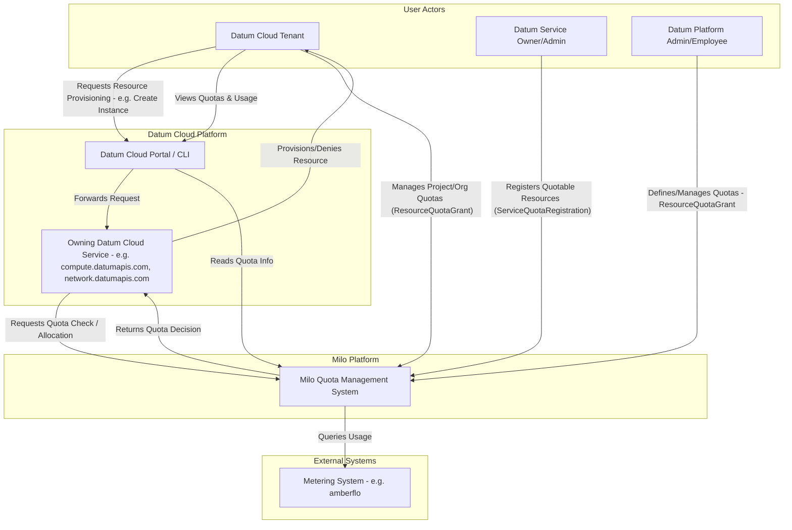
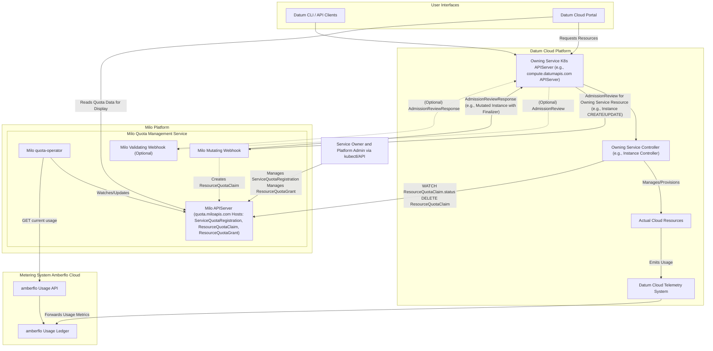

# Quota Management

- [Quota Management](#quota-management)
  - [Summary](#summary)
  - [Motivation](#motivation)
    - [Goals](#goals)
    - [Non-Goals](#non-goals)
  - [Proposal](#proposal)
    - [Desired Outcome and Definition of
      Success](#desired-outcome-and-definition-of-success)
    - [Key Components and Capabilities](#key-components-and-capabilities)
    - [User Stories (Optional)](#user-stories-optional)
      - [Story 1](#story-1)
      - [Story 2](#story-2)
    - [Notes/Constraints/Caveats (Optional)](#notesconstraintscaveats-optional)
    - [Risks and Mitigations](#risks-and-mitigations)
  - [Design Details](#design-details)
    - [Custom Resource Definitions](#custom-resource-definitions)
      - [`ServiceQuotaRegistration`](#ServiceQuotaRegistration)
      - [`ResourceQuotaClaim`](#resourcequotaclaim)
      - [`ResourceQuotaGrant`](#resourcequotagrant)
      - [Quota Registration](#quota-registration)
    - [Quota Operator Controller](#quota-operator-controller)
    - [Admission Webhooks](#admission-webhooks)
    - [Architectural and Sequence
      Diagrams](#architectural-and-sequence-diagrams)
      - [Service Quota Definition Registration
        (Prerequisite)](#service-quota-definition-registration-prerequisite)
      - [Instance Provisioning \& Admission
        Control](#instance-provisioning--admission-control)
      - [Quota Reconciliation by
        `quota-operator`](#quota-reconciliation-by-quota-operator)
      - [`Instance` Controller Reacts to `ResourceQuotaClaim`
        Status](#instance-controller-reacts-to-ResourceQuotaClaim-status)
      - [Telemetry \& Metering Flow
        (Post-Provisioning)](#telemetry--metering-flow-post-provisioning)
      - [Tear-down \& Quota Release](#tear-down--quota-release)
  - [Production Readiness Review
    Questionnaire](#production-readiness-review-questionnaire)
    - [Feature Enablement and Rollback](#feature-enablement-and-rollback)
      - [How can this feature be enabled / disabled in a live
        cluster?](#how-can-this-feature-be-enabled--disabled-in-a-live-cluster)
      - [Does enabling the feature change any default
        behavior?](#does-enabling-the-feature-change-any-default-behavior)
      - [Can the feature be disabled once it has been enabled (i.e. can we roll
        back the
        enablement)?](#can-the-feature-be-disabled-once-it-has-been-enabled-ie-can-we-roll-back-the-enablement)
      - [What happens if we reenable the feature if it was previously rolled
        back?](#what-happens-if-we-reenable-the-feature-if-it-was-previously-rolled-back)
      - [Are there any tests for feature
        enablement/disablement?](#are-there-any-tests-for-feature-enablementdisablement)
    - [Rollout, Upgrade and Rollback
      Planning](#rollout-upgrade-and-rollback-planning)
      - [How can a rollout or rollback fail? Can it impact already running
        workloads?](#how-can-a-rollout-or-rollback-fail-can-it-impact-already-running-workloads)
      - [What specific metrics should inform a
        rollback?](#what-specific-metrics-should-inform-a-rollback)
      - [Were upgrade and rollback tested? Was the upgrade-\>downgrade-\>upgrade
        path
        tested?](#were-upgrade-and-rollback-tested-was-the-upgrade-downgrade-upgrade-path-tested)
      - [Is the rollout accompanied by any deprecations and/or removals of
        features, APIs, fields of API types, flags,
        etc.?](#is-the-rollout-accompanied-by-any-deprecations-andor-removals-of-features-apis-fields-of-api-types-flags-etc)
    - [Monitoring Requirements](#monitoring-requirements)
      - [How can an operator determine if the feature is in use by
        workloads?](#how-can-an-operator-determine-if-the-feature-is-in-use-by-workloads)
      - [How can someone using this feature know that it is working for their
        instance?](#how-can-someone-using-this-feature-know-that-it-is-working-for-their-instance)
      - [What are the reasonable SLOs (Service Level Objectives) for the
        enhancement?](#what-are-the-reasonable-slos-service-level-objectives-for-the-enhancement)
      - [What are the SLIs (Service Level Indicators) an operator can use to
        determine the health of the
        service?](#what-are-the-slis-service-level-indicators-an-operator-can-use-to-determine-the-health-of-the-service)
      - [Are there any missing metrics that would be useful to have to improve
        observability of this
        feature?](#are-there-any-missing-metrics-that-would-be-useful-to-have-to-improve-observability-of-this-feature)
    - [Dependencies](#dependencies)
      - [Does this feature depend on any specific services running in the
        cluster?](#does-this-feature-depend-on-any-specific-services-running-in-the-cluster)
    - [Scalability](#scalability)
      - [Will enabling / using this feature result in any new API
        calls?](#will-enabling--using-this-feature-result-in-any-new-api-calls)
      - [Will enabling / using this feature result in introducing new API
        types?](#will-enabling--using-this-feature-result-in-introducing-new-api-types)
      - [Will enabling / using this feature result in any new calls to the cloud
        provider?](#will-enabling--using-this-feature-result-in-any-new-calls-to-the-cloud-provider)
      - [Will enabling / using this feature result in increasing size or count
        of the existing API
        objects?](#will-enabling--using-this-feature-result-in-increasing-size-or-count-of-the-existing-api-objects)
      - [Will enabling / using this feature result in increasing time taken by
        any operations covered by existing
        SLIs/SLOs?](#will-enabling--using-this-feature-result-in-increasing-time-taken-by-any-operations-covered-by-existing-slisslos)
      - [Will enabling / using this feature result in non-negligible increase of
        resource usage in any
        components?](#will-enabling--using-this-feature-result-in-non-negligible-increase-of-resource-usage-in-any-components)
      - [Can enabling / using this feature result in resource exhaustion of some
        node resources (PIDs, sockets, inodes,
        etc.)?](#can-enabling--using-this-feature-result-in-resource-exhaustion-of-some-node-resources-pids-sockets-inodes-etc)
    - [Troubleshooting](#troubleshooting)
      - [How does this feature react if the APIServer is
        unavailable?](#how-does-this-feature-react-if-the-api-server-is-unavailable)
      - [What are other known failure
        modes?](#what-are-other-known-failure-modes)
      - [What steps should be taken if SLOs are not being met to determine the
        problem?](#what-steps-should-be-taken-if-slos-are-not-being-met-to-determine-the-problem)
  - [Implementation History](#implementation-history)
  - [Drawbacks](#drawbacks)
  - [Alternatives](#alternatives)
  - [Infrastructure Needed (Optional)](#infrastructure-needed-optional)


## Summary

This enhancement proposes the architecture and implementation of a comprehensive
quota management system within the Milo platform. This system will empower
platform administrators to define, enforce, and manage resource consumption
limits for tenants at both the organizational and project levels. Datum
employees will have the ability to view and modify these quota levels, while
Datum Cloud users will be able to see and manage their allocated quotas and
current resource usage. The system aims to provide predictable capacity
management, enable customer tier enforcement, offer transparency to customers
regarding their resource limits, and include enforcement mechanisms to reject
API requests that would exceed these limits. Furthermore, **services offered on
the Datum Cloud platform (via their Service Owners/Admins)** will be able to
register the resources they manage for quota protection and set default quota
levels.

## Motivation

The ability to create, observe, and self-manage resource quotas within
organizations and their projects provides numerous benefits to both internal and
external administrators of the system. By providing full transparency and
observability into quota management and resource consumption, quota management
also ensures:

1. Operational stability and reliability
2. Enables accurate cost predictability
3. Prevents accidental or abusive overuse
4. Instills confidence in resource planning and the enforcement of internal and
   regulatory policies

The safeguards put in place through quota management will enable users to fully
explore the Datum Cloud ecosystem and variety of functionality it provides,
without worrying about exceeding the thresholds that have been set within their
organzation and projects.

### Goals

- Provide clear system context and architectural approach to the creation of a
  quota management system within Datum Cloud, including new Custom Resource
  Definitions.
- Define the APIs that **Datum Cloud services (via their Service
  Owners/Admins)** will use to:
  - Register quotas for specific resources with optional default limits.
  - Create and manage quota limits on the resources via dimensions and labels.
  - Create claims to request additional resources, allocations, or
    deprovisioning.
- Define the API that will allow **Datum Employees (acting as Platform
  Administrators)** to create and manage global quota limits applied to
  organizations and projects within Datum Cloud. 
- Define the API for Datum Cloud users to view their allocated quota limits and
  the number of resources consumed against each quota.
- Outline the ability of **Datum Cloud platform administrators** to create and
  manage global quota limits applied to all organizations and projects within
  the system.
- Enable full visibility into the consumption metrics of provisioned workloads
  running in Datum Cloud in relation to set quota limits
- Ensure the system can enforce defined quota limits, for example, by rejecting
  API requests that would exceed these limits.
- Facilitate predictable capacity management for the platform.
- Support customer tier enforcement (e.g., free vs. paid tiers) through
  configurable quotas.
- Enable enhancement document handoff for implementation of the quota management
  enhancement within Datum Cloud.
- Remain service agnostic to not avoid tightly coupling the architecture to a
  specific SaaS vendor (amberflo, OpenMeter, etc)

### Non-Goals

- Provide detailed implementation specifics of how the metering and billing
  components of the system will work, outside of the acknowledgement of their
  overall role in system architecture from a quota management perspective. This
  includes how resource consumption is translated into actual billable units and
  invoices. 
- Provide implementation specifics of any third-party SaaS integration in
  regards to quota management, metering and billing engines, beyond the concrete
  example of amberflo used in this enhancement as an example.
- Define the future Milo Service Catalog and service registration (distinct from
  the service registration for quota management).
- Define the exact user interface (UI) mockups or user experience (UX) flows for
  managing or viewing quotas, beyond the functional requirements.
- Define how time-series metrics (e.g. CPU hours, data written, etc) will be
  implemented by the data plane.
- Define how alerts can be created and sent to organizational and project
  administrators to inform them that they are approaching the quota threshholds
  they set for the resources. These "early warning" alerts are *not* enforced by
  the quota service, nor a part of this enhancement.

## Proposal

This enhancement proposes the design and architectural foundation for a quota
management system in Milo that will be integrated into Datum Cloud. The system
will allow for the definition, management, and enforcement of resource quota
limits at both organizational and project levels by external and internal
administrators. 

### Desired Outcome and Definition of Success

Once implemented, the quota management system in Milo will have seamless
integration with Datum Cloud services and downstream external vendors. Both
internal and external platform administrators will be able to use the system to
easily create and manage quotas through highly scalabe architecture and
implementation. The system should properly allocate and deallocate resources
when claims are granted, deny claims that exceed set limits, and stay in sync
with integrated downstream systems such as amberflo.

### Key Components and Capabilities

There are several key components that will comprise the architecture and
implementation of the quota management system:

1.  **`ResourceQuotaClaim` Definition:**
    - **Tenants (via their project/org administrators or automated processes)**
      can use the API (indirectly, by creating resources like Instances) to
      request management of quotas - whether creating, scaling, or deleting
      them.
    - Claims will contain the relationship between owning/parent resources and
      the resources being requested within them.
    - Claims will be used when determining whether the request should be granted
      or denied by being compared to the `ResourceQuotaGrant` limits.

2. **`ResourceQuotaGrant` Definition:**
    - **Platform Administrators (Datum Employees)** can define global default
      quota grants for various resources.
    - **Organizational Administrators (Tenants)** can define
      organization-specific quotas (e.g., number of projects, number of
      collaborators/team-members).
    - **Project Administrators (Tenants)** can define project-specific quotas
      (e.g., number of workloads, CPU/memory limits, total data written, etc.).
    - In a future enhancement, resource quotas will be able to support different
      customer tiers and plans, allowing for varied limits based on subscription
      levels (e.g., "Free Tier gets 1 collaborator" and "Pro Tier gets
      unlimited").

3. **`ServiceQuotaRegistration` Definition:**
    - **Service Owners/Administrators (representing the Datum Cloud services)**
      can register resources to allow them to be managed by quotas
    - This is necessary to request resources and generate a
      `ResourceQuotaClaim`, as well as create a `ResourceQuotaGrant` that
      defines quota limits.
    - If an attempt is made to generate a claim on a resource that has yet to be
      registered, it will be denied.

4.  **Quota Enforcement:**
    - The system will include mutating admission webhooks and a quota-controller
      reconciler to check against defined quotas during resource creation,
      modification, or deletion.
    - The system will determine near real-time metric usage via integration with
      a downstream metering engine (e.g. amberflo, which is used as an example
      in this enhancement)
    - Requests exceeding the defined limits will be rejected with appropriate
      error messaging.
    - Denied quotas can be appropriately logged and persisted, creating
      additional observability and an audit trail detailing why specific claim
      requests were denied.

5.  **Quota Visibility:**
    - Datum Cloud users (tenants) will be able to view their current quota
      allocations and their consumption of resources against their self managed
      and global platform quotas.
    - Datum Employees (internal administrators) will have the ability to view
      and modify quota levels for all projects and organizations.

6.  **Service Integration:**
    - Services offered on the Datum Cloud platform will need a mechanism (via
      their **Service Owners/Admins**) to register the resources they manage
      that should be subject to quotas.
    - An API will be designed for services to register these quotable resources
      and for the management (CRUD operations) of quota limits for projects and
      organizations.
    - **Services (via their Service Owners/Admins)** will define default quota
      levels for the resources when registering a new resource metric.
    - The integration of the downstream metering engine and billing processor
      platform will remain service-agnostic to ensure flexibility of
      implementation in the future.
      - *Note: amberflo is used in this enhancement as an example and will be
        the initial platform of choice for metering and billing.*

7.  **Architectural Considerations:**
    - Initially, [Kubernetes
      ResourceQuotas](https://kubernetes.io/docs/concepts/policy/resource-quotas/)
      was explored for project-level resource control, while acknowledging its
      potential limitations for project-wide (cross-namespace) totals. Due to
      this limitation, Kubernetes ResourceQuotas was determined to not provide
      the functionality desired for cross-namespace resource quota management.
    - Tying a "Resource Grant" to a product plan and tiers, as discussed in
      [enhancement issue
      #78](https://github.com/datum-cloud/enhancements/issues/78), will be added
      as a future enhancement to dynamically configure quotas based on the
      specific plans and tiers.
    - A "Resouce Claim", as represented in this enhancement, was inspired by the
      `ResourceClaim` type within the [Kubernetes Dynamic Resource Allocation
      API](https://kubernetes.io/docs/concepts/scheduling-eviction/dynamic-resource-allocation/#api)
      to model how changes to resources are requested

**Proposal Deliverables**
- An updated enhancement document (this document) detailing the system
  architecture
- A Proof of Concept (POC) demonstrating functional quota system in Milo
  integrated with a Datum Cloud project, and a complete API design for service
  quota registration and management.

### User Stories (Optional)

<!--
Detail the things that people will be able to do if this Enhancement is implemented.
Include as much detail as possible so that people can understand the "how" of
the system. The goal here is to make this feel real for users without getting
bogged down.
-->

#### Story 1

#### Story 2

### Notes/Constraints/Caveats (Optional)

<!--
What are the caveats to the proposal?
What are some important details that didn't come across above?
Go in to as much detail as necessary here.
This might be a good place to talk about core concepts and how they relate.
-->

### Risks and Mitigations

<!--
What are the risks of this proposal, and how do we mitigate? Think broadly.
For example, consider both security and how this will impact the larger
software ecosystem.

How will security be reviewed, and by whom?

How will UX be reviewed, and by whom?

Consider including folks who also work outside of your immediate team.
-->

Different risks must be taken into account when considering implementation of
the Quota Management system to ensure the system is working as expected and the
risks are mitigated.

Best practices will be enforced by reviewers based on their knowledge of the
Datum Cloud ecosystem, including security and alignment with established
external and internal standards.

- The potential to block all resource creation, preventing administration of
  resources due to network failure or timeouts.
  - **Mitigations (High-Level):**
    - **Webhook Timeouts & Failure Policy:** Configure admission webhooks (Milo Mutating & Validating) with aggressive timeouts. Set their `failurePolicy` to `Ignore`. This ensures that if the Milo Quota Management Service is unreachable or times out, resource creation/modification requests to Owning Services can still proceed (albeit without immediate quota enforcement). This prioritizes platform availability.
    - **`quota-operator` Resilience:** Design the `quota-operator` to retry calls to external dependencies like the metering system (`amberflo`) with exponential backoff. If dependencies are unavailable for an extended period, the operator should clearly indicate this (e.g., in `ResourceQuotaClaim` status) and might temporarily deny new claims (or use cached data with extreme caution if implemented, clearly marking approvals as conditional).
    - **Monitoring & Alerting:** Implement comprehensive monitoring and alerting for the Milo Quota Management Service and its connectivity to critical dependencies (Milo APIServer, `amberflo`).
    - **Emergency Bypass (Break-Glass Procedure):** For extreme, prolonged outages of the core quota enforcement mechanism, a well-documented, audited, and access-controlled procedure could allow platform administrators to temporarily bypass quota checks (e.g., by temporarily removing or altering webhook configurations). This is a last-resort measure.
- The potential for actual resource usage being out-of-sync with the
  cluster-state, leading to: 
  - Allowing allocation of resources beyond the set quota limits on both external
    and internal levels, bypassing enforcement.
    - **Mitigations (High-Level):**
      - **Authoritative Usage Source:** The `quota-operator` must treat the external metering system (`amberflo`) as the authoritative source of truth for current usage when evaluating `ResourceQuotaClaim`s.
      - **Webhook `failurePolicy: Ignore` Trade-off:** Acknowledging that setting `failurePolicy: Ignore` for webhooks (to maintain platform availability if Milo is down) can lead to temporary periods where new resources are provisioned without an immediate quota check. This might result in temporary over-allocation.
      - **Post-Outage Reconciliation:** When the Milo Quota Management service recovers (or webhooks are re-enabled/fixed), the `quota-operator` will reconcile existing claims and usage. New requests for already over-limit projects/organizations will be denied until usage falls within limits. Alerts can be triggered for SREs/Platform Admins to review significant discrepancies.
      - **Robust Telemetry Pipeline:** Ensure the telemetry pipeline sending usage data to the metering system (`amberflo`) is resilient, with appropriate retries, buffering (e.g., in Vector agents), and error handling to minimize lost or delayed usage data.
  - Denying resource allocation when there are enough free resources to allow
    the request the ability to proceed.
    - **Mitigations (High-Level):**
      - **Real-time Usage Queries:** The `quota-operator` should always attempt to query the metering system (`amberflo`) in real-time for the most up-to-date usage data before making a decision on a `ResourceQuotaClaim`.
      - **Cautious Use of Cached Data:** If the optional caching of usage in `ResourceQuotaGrant.status.usage` is implemented, this data must be treated as potentially stale. Decisions based purely on this cache should be limited (e.g., only for clear-cut denials where requested > hard_limit_from_cache, never for granting if amberflo is unreachable). Logic should heavily favor fresh data from the metering system.
      - **Metering System Reliability:** The accuracy and timeliness of the metering system itself are crucial. Choose and configure it for high availability and low data latency.
      - **Clear Status Reporting:** If a claim is denied due to inability to contact the metering system (despite retries), the `ResourceQuotaClaim.status` should clearly reflect this reason (e.g., `MeteringSystemUnavailable`), distinguishing it from a denial due to actual quota exhaustion.

## Design Details

### Custom Resource Definitions 

Three main CRDs will be created as a direct part of the Quota Management
implementation: `ServiceQuotaRegistration`, `ResourceQuotaClaim` and
`ResourceQuotaGrant`. The API group for these CRDs will be `quota.miloapis.com`.
The Go type definitions for these CRDs will be located within the Milo
repository, following a structure similar to other Datum APIs, likely under
`milo/api/datum/quota-management/v1alpha/`. This colocation ensures that Milo,
which is central to the Datum ecosystem, defines and serves these APIs.

Other `*.datumapis.com` API groups referenced in this document, such as
`compute.datumapis.com` and `network.datumapis.com`, are *not* part of the
collection of Milo services, however they are part of the Datum Cloud platform
that Milo will communicate with.

#### `ServiceQuotaRegistration`

The `ServiceQuotaRegistration` CRD allows **Datum Cloud services (via their
Service Owners/Admins)** to define and register the specific resource types that
will become available to then have quotas applied to them. This CRD is distinct
from the `ResourceQuotaClaim` (which actually *requests* resources) and
`ResourceQuotaGrant` (which defines the *limits* for those resources). 

The inclusion of the `ServiceQuotaRegistration` CRD decouples the registration
of service quotas and the subsequent management of the quotas themselves;
removing the need to make changes for every new resource type. This will allow
for the system to be more flexible and scalable, as well as easier to maintain
and update.

```yaml
apiGroup: quota.miloapis.com
kind: ServiceQuotaRegistration
metadata:
  # Unique name for the definition
  name: <my-service-quota>
spec:
  # Service which owns the quota definition registration.
  serviceRef:
    apiGroup: compute.datumapis.com
    kind: Service
    name: compute.datumapis.com
    uid: <uid>
  # Fully qualified name of the resource being managed.
  # This should match the 'name' field in `ResourceQuotaClaim.spec.resources`
  # and also in `ResourceQuotaGrant.spec.limits` fields.
  resourceName: compute.datumapis.com/instances/cpu
  # Description of the resource.
  description: "Number of CPU cores allocated to instances."
  # Optional default limit for this resource quota, which can 
  # be overridden by a ResourceQuotaGrant.
  defaultLimit:
    value: "1000"
  # The unit of measurement for the resource.
  unit: "cores"
  # Dimensions that can be used in ResourceQuotaGrant selectors.
  allowedDimensions:
    - compute.datumapis.com/location
    - compute.datumapis.com/instanceType
Status:
  observedGeneration: 1
  # Standard kubernetes approach to represent the state of a resource.
  conditions:
    # Indicates if the definition is valid, accepted, and the resource can be managed.
    # - Type: Ready
    # - Status: "True" | "False" | "Unknown"
    # - Reason: (e.g., "DefinitionActive" | "InvalidDefinition" | "Initializing")
    # - Message: Human-readable message detailing status reason 
    #   (e.g. "The resource is ready to be managed by quotas.")
    - type: Ready
      status: Unknown
      lastTransitionTime: "2023-01-01T12:00:00Z"
      reason: Initializing
      message: "The definition is being initialized."
    # Indicates if the structure of the ServiceQuotaRegistration itself is correct.
    # - Type: DefinitionValid
    # - Status: "True" | "False" | "Unknown"
    # - Reason: (e.g., "PendingValidation" | "ValidationSuccessful" | 
    #   "MissingRequiredField" | "InvalidFormat")
    # - Message: Human-readable message detailing any validation issues.
    - type: DefinitionValid
      status: Unknown
      lastTransitionTime: "2023-01-01T12:00:00Z"
      reason: PendingValidation
      message: "Validation of the definition structure is pending."

```

#### `ResourceQuotaClaim`

The `ResourceQuotaClaim` CRD represents the *intent* of the request to create,
update/scale, or delete resources. This CRD contains a reference to the owner of
the resources that are being requested (e.g. Instance), as well as the specific
resource requests, including name and quantity. The below `yaml` snippet shows
an claim created by an incoming request tied to one Instance, which requests the
additional allocation of 8 CPU cores and 32GiB of memory, along with the
instance count:

```yaml
apiGroup: quota.miloapis.com
kind: ResourceQuotaClaim
metadata:
  # Connect the claim's lifetime to the workload that needs the quota
  name: instance-abc123-claim
  namespace: proj-abc
  uid: <uid>
  # Cleanup on resource deletion
  finalizers:
  - quota.miloapis.com/usage-release
spec:
  # The reference to the resource that owns the resources being requested. 
  # Will be used to key off of during reconciliation.
  resourceRef: 
    apiGroup: compute.datumapis.com 
    kind: Instance 
    name: instance-abc123 
    uid: <uid>
  # Resources being requested
  resources:
  - name: compute.datumapis.com/instances/cpu
    quantity: "8"
  - name: compute.datumapis.com/instances/memoryAllocated
    quantity: "32GiB"
  - name: compute.datumapis.com/instances/count
    quantity: "1"
Status:
  # High level summary
  phase: Pending    
  grantedResources: []  
  observedGeneration: 1
  # Standard kubernetes approach to represent the state of a resource.
  # https://github.com/kubernetes/community/blob/master/contributors/devel/sig-architecture/api-conventions.md#typical-status-properties
  conditions:
    # Ready indicates if the claim has been processed and is in a terminal state.
    # - Type: Ready
    # - Status: "True" (Granted/Denied) | "False" (Pending) | "Unknown"
    # - Reason: (e.g., "ClaimGranted" | "ClaimDenied" | "Processing")
    # - Message: Human-readable message detailing the reason for the status.
    - type: Ready
      status: "False"
      # Indicates time the status last changes e.g. from False to True
      lastTransitionTime: "2023-01-01T12:00:00Z"
      reason: Processing
      message: "Claim is currently being processed."
    # Validated indicates if the claim's spec has passed initial validation.
    # - Type: Validated
    # - Status: "True" | "False" | "Unknown"
    # - Reason: (e.g., "ValidationSuccessful" | "InvalidResourceRef" | "UnknownResourceName")
    # - Message: Human-readable message detailing the reason for the status.
    - type: Validated
      status: Unknown
      # Indicates time the status last changes e.g. from Unknown to True
      lastTransitionTime: "2023-01-01T12:00:00Z"
      reason: PendingValidation
      message: "Claim validation is pending."
    # QuotaChecked indicates if the quota availability has been checked.
    # - Type: QuotaChecked
    # - Status: "True" | "False" | "Unknown"
    # - Reason: (e.g., "PendingQuotaCheck" | "CheckSuccessful" | "MeteringServiceUnavailable" )
    # - Message: Human-readable message detailing the reason for the status.
    - type: QuotaChecked
      status: Unknown
      # Indicates time the status last changes e.g. from False to True
      lastTransitionTime: "2023-01-01T12:00:00Z"
      reason: PendingQuotaCheck
      message: "Quota check is pending."
    # Granted indicates if the claim was approved.
    # - Type: Granted
    # - Status: "True" if granted, "False" if denied or pending
    # - Reason: (e.g., "QuotaAvailable", "QuotaExceeded", "AwaitingDecision")
    # - Message: Human-readable message detailing the reason for the status.
    - type: Granted
      status: "False"
      # Indicates time the status last changes e.g. from False to True
      lastTransitionTime: "2023-01-01T12:00:00Z"
      reason: AwaitingDecision
      message: "Decision on granting the claim is pending."
```

#### `ResourceQuotaGrant`

The `ResourceQuotaGrant` CRD declares the resource quota limits for a project or
organization (it can be bound to either level via `spec.resourceRef`).
Importantly, when bound to a project or organization, these limits represent the
total allowable consumption for that entity, regardless of how many namespaces
or discrete infrastructure components its resources might span. More granularly,
it declares which specific resources are limited by existing quotas, how the
those limits vary by different dimensions (such as `dimensionLabels` and
`buckets`), and how much of each resource is still free (which is determined by
the quota controller and amberflo).

```yaml
apiGroup: quota.miloapis.com
kind: ResourceQuotaGrant
metadata:
  name: proj-abc
  uid: <uid>
spec:
  # Reference to project or oganization since the CRD can use either
  resourceRef:
    apiGroup: compute.datumapis.com
    kind: Project
    name: proj-abc
    uid: <uid>
  limits:
  # 1. CPU cores allocated per project / location / instance type
  - name: compute.datumapis.com/instances/cpu
    # Dimension labels are the same as the resource name.
    dimensionLabels:
      - resources.datumapis.com/project
      - compute.datumapis.com/location
      - compute.datumapis.com/instanceType
    buckets:
    # Default limit for all locations and instance types across the project,
    # which overrides the default limit set in the ServiceQuotaRegistration.
    # This is a global limit, and will apply to all locations, since the
    # Dimension label is not specified within the bucket selector.
    - value: "1000"
      selector: {}
    # Override for multi-location projects.
    - value: "300"
      selector:
        matchExpressions:
        - key: compute.datumapis.com/location
          operator: In
          values: ["dfw", "lhr", "dls"]

    # Single location and instance type override,
    # more specific than the global limit and multi-location override.
    - value: "40"
      selector:
        matchLabels:
          compute.datumapis.com/location: dfw
          compute.datumapis.com/instanceType: datumcloud/d1-standard-2

  # 2. Memory (GiB) allocated per project / location / instance type
  - name: compute.datumapis.com/instances/memoryAllocated
    dimensionLabels:
      - resources.datumapis.com/project
      - compute.datumapis.com/location
      - compute.datumapis.com/instanceType
    buckets:
    - value: "4096"
      selector: {}

    - value: "1024"
      selector:
        matchLabels:
          compute.datumapis.com/location: dfw

  # 3. Instance count per project / location / instance type
  - name: compute.datumapis.com/instances/count
    dimensionLabels:
      - resources.datumapis.com/project
      - compute.datumapis.com/location
      - compute.datumapis.com/instanceType
    buckets:
    - value: "200"
      selector: {}
    - value: "20"
      selector:
        matchLabels:
          instanceType: datumcloud/d1-standard-2
    - value: "5"
      selector:
        matchLabels:
          compute.datumapis.com/location: dfw
          compute.datumapis.com/instanceType: datumcloud/d1-standard-2

  # 4. Gateway count per project
  - name: network.datumapis.com/gateways
    dimensionLabels:
      - resources.datumapis.com/project
    buckets:
    - value: "15"
      selector: {}

    - value: "3"
      selector:
        matchExpressions:
        - key: compute.datumapis.com/location
          operator: Exists
# Status reflects the validity and applicability of the defined quotas.
Status:
  observedGeneration: 1
  # Optional: Cache of current usage for each bucket.
  usage:
  - name: compute.datumapis.com/instances/cpu
    buckets:
    # Global usage without any selectors
    - selector: {}
      used: "500"
    # Selector-specific usage
    - selector:
        matchLabels:
          compute.datumapis.com/location: dfw
          compute.datumapis.com/instanceType: datumcloud/d1-standard-2
      used: "10"
  # Standard kubernetes approach to represent the state of a resource.
  conditions:
    # Indicates if the grant is correctly configured and actively being used.
    # - Type: Ready
    # - Status: "True" | "False" | "Unknown"
    # - Reason: (e.g., "GrantActive" | "InvalidLimitsConfiguration" | "NotEnforced")
    # - Message: Human-readable message detailing the Reason value.
    - type: Ready
      status: Unknown
      lastTransitionTime: "2023-01-01T12:00:00Z"
      reason: Initializing
      message: "ResourceQuotaGrant is being initialized."
    # Indicates if the spec.limits are well-formed and logically consistent.
    # - Type: LimitsValid
    # - Status: "True" | "False" | "Unknown"
    # - Reason: (e.g., "ValidationSuccessful" | "InvalidDimensionSelector" | "ResourceNotDefined")
    # - Message: Human-readable message detailing any issues.
    - type: LimitsValid
      status: Unknown
      lastTransitionTime: "2023-01-01T12:00:00Z"
      reason: PendingValidation
      message: "Validation of limits is pending."
    # Optionally indicates the freshness of cached usage data, if implemented.
    # - Type: UsageSynchronized
    # - Status: "True" | "False" | "Unknown"
    # - Reason: (e.g., "SyncSuccessful" | "SyncFailed" | "StaleData" | "CachingDisabled")
    - type: UsageSynchronized
      status: Unknown
      lastTransitionTime: "2023-01-01T12:00:00Z"
      reason: PendingSync
      message: "Usage data synchronization is pending."

```

### Quota Registration

To enable services on the Datum Cloud platform to integrate with the quota
management system, a dedicated API will be provided for **services (via their
Service Owners/Admins)** to register the resources they manage that should be
subject to quotas. This is achieved through the proposed
[`ServiceQuotaRegistration` CRD](#ServiceQuotaRegistration), which acts as a
"catalog" for services to declare the types of resources they offer that *can*
be managed by the quota system.

**Services (via their Service Owners/Admins)** will create new instances of
`ServiceQuotaRegistration` to declare each type of resource they offer that can
use quota limits. The `quota-operator` can then use these definitions to
understand and validate the types of resources being requested in
`ResourceQuotaClaim` objects.

#### Quota Operator Controller

A `quota-operator` will be created to implement logic to convert the *intent* of
the incoming `ResourceQuotaClaim` object into the *actual allocation* of
resources. This controller will be integrated into the Milo Quota Management
service. Its core logic would reside in a path such as
`milo/internal/controller/quota-management/`, and it would be managed by Milo's
main application process (e.g., `milo/cmd/apiserver/app/`). Running within the
management cluster, it will ensure accurate data is kept in sync with the
downstream metering system by querying actual usage from the metering engine API
and optionally patching usage totals within `ResourceQuotaGrant` via the
`ResourceQuotaGrant.status.usage` field to serve as a cache. The controller will
enforce per-project or per-organization (tenant) resource quota limits that are
declared in the `ResourceQuotaGrant` objects after being registered via a
`ServiceQuotaRegistration`.

The reconciliation loop for this controller will contain the following logic:

1. **Validates Registration**:
  - Ensures that the specific requested resource and dimensions have already
    been registered by the service via a `ServiceQuotaRegistration`

2. **Watches newly created or updated `ResourceQuotaClaim` objects** via
   Kubernetes informers. These claims will be auto-generated by the admission
   webhook when a new resource (e.g., `Instance`, `Gateway`) is created or
   scaled and will consume quota.

3. **Validates the `ResourceQuotaClaim` structure**:
   - Ensures required fields like `resources`, `dimensions`, and `resourceRef`,
     and other required fields are present and have a valid structure..
   - Optionally verifies that the `resourceRef` points to a valid object in the
     APIServer.
   - If validation fails, the operator sets the claim `status.phase = Denied`
     with an appropriate `reason`.

4. **Retrieves the corresponding `ResourceQuotaGrant`**:
   - Looks up the `ResourceQuotaGrant` based on the `resourceRef` in the
     `ResourceQuotaClaim`. The retrieved grant represents the quota limits that
     were registered by the service that are applicable to the claim.
   - Reads the declared `spec.limits` quota limits and bucket selectors.
   - Applies label/selector logic to find the correct bucket for the claim's
     dimensions (e.g., `compute.datumapis.com/location=dfw`,
     `compute.datumapis.com/instanceType=datumcloud/d1-standard-2`). 
   - If no bucket is found, the operator sets the claim `status.phase = Denied`
     with an appropriate `reason`.

5. **Queries the external usage source (e.g., amberflo)** via API to get the
     live usage data for the metric and dimension(s) defined in the claim.
   - If the API is unavailable, the operator sets the claim `status.phase =
     Denied` with an appropriate `reason`.
   - This usage (queried from the metering engine) is treated as the
     authoritative source of truth for the data. The
     `ResourceQuotaGrant.status.usage` field is *not* the authoritative source
     of truth, since it is a cache and may be stale or partial.

6. **Evaluates whether the claim would exceed quota**:
   - Calculates: `actualUsage + requestedAmount > bucketLimit`
   - If the total would stay within the limit:
     - Optionally updates `ResourceQuotaGrant.status.usage` as the local cache
       of the most recently known usage for each quota bucket.
     - Sets `ResourceQuotaClaim.status.phase = Granted`.
   - If the request would exceed the quota:
     - Sets `ResourceQuotaClaim.status.phase = Denied` and provides a reason for
       the denial.
     - Emits an `Event` and records `status.reason` to the claim.

7. **Handles updates to `ResourceQuotaGrant` limits**:
   - When a Grant is updated (e.g., an admin raises CPU limits in an instance),
     the operator re-reconciles any affected claims.
   - Previously denied claims may now be granted if usage fits under the new
     limits if they were raised.
   - Previously granted claims may now be denied if usage exceeds the new
     limits.

8. **Emits final status and metrics**:
   - Updates the `ResourceQuotaClaim.status` with the outcome (`Granted` or
     `Denied`).
   - Optionally mits Prometheus metrics or logs (e.g.,
     `quota_claims_granted_total`, `quota_claims_denied_total`).

**Optional Caching**

Patching the `ResourceQuotaGrant.status.usage` field is **optional** and serves
as a low-latency cache of the most recently known usage for each quota bucket.
This could provide several benefits to the system:

- *Fast-rejection* for obvious quota breaking claims without needing to query
  amberflo (e.g., requesting to claim 1000 GiB of written data while the quota
  limit is 100 GiB)
- *Auditability, observability, and transparency* by creating a point-in-time
  snapshot of denied claims which provides denial reasoning and other contextual
  information
- *Best effort last known good view* fall-back if amberflo is temporarily
  unavailable

If implemented, the potential for stale data **must** be accounted for, and
therefore **it should not be used for final quota enforcement nor billing
purposes**.

**Failure Blast Radius**

If the controller is down, new Claims will stall; however workloads are not
affected and there is no blocking of writes to the cluster.

#### Admission Webhooks

A stateless mutating admission webhook will be created to serve as the initial
interaction between the incoming claim request and the `quota-operator`
controller. This webhook, along with any validating webhooks for quota
management, will be part of the Milo service. The logic for these webhooks would
likely reside in `milo/internal/webhook/quota-management/` and be registered by
Milo's main application. While this webhook is optional, it provides additional
safety of the workflow at claim creation time.

The mutatingadmission webhook is responsible for and executes the following
steps:

1. Synchronously intercepts incoming requests for resource
   creation/scaling/deletion that are sent to the `quota-operator` controller.
2. Automatically creates a `ResourceQuotaClaim` object based on the intent of
   the intercepted request.
3. Attaches labels and annotations to the object to enable easy claim deletion
   via a finalizer when workloads are torn down.

### Architectural and Sequence Diagrams

#### Architecture Diagram (C1 - System Context)



#### Architecture Diagram (C2 - Containers/Components)



---

#### Sequence Diagram

*Key*
- **ServiceQuotaRegistration**: `ServiceQuotaRegistration`
- **ResourceQuotaClaim**: `ResourceQuotaClaim`
- **RQD**: `ResourceQuotaDefinition`

```mermaid
%% Sequence Diagram - Quota Management Enhancement - Milo Integration
sequenceDiagram
    autonumber

    participant SvcOwner as Service Owner/Admin
    participant Dev as Admin / CI
    participant ProjAPIServer as Project K8s APIServer <br>(Manages Instance CR)
    participant MiloAPIServer as Milo APIServer <br>(quota.miloapis.com)
    participant MiloMutateWH as Milo Mutating Webhook <br>(ResourceQuotaClaim injector)
    participant MiloValidWH as Quota Service Validating Webhook <br>(optional fast-fail)
    participant ServiceQuotaRegistration as ServiceQuotaRegistration <br>(in Milo)
    participant ResourceQuotaClaim as ResourceQuotaClaim <br>(in Milo)
    participant ResourceQuotaGrant as ResourceQuotaGrant <br>(in Milo)
    participant MiloQOp as Milo quota-operator
    participant amberflo as amberflo Usage API
    participant Instance as Instance CR <br>(in Project Cluster)
    participant InstCtrl as Instance Controller <br>(in Project Cluster)
    participant Telemetry as Telemetry / Metering Pipeline
    participant Vector as Vector Agent
    participant Infra as Backend Infrastructure

    %% --- Service Quota Definition Registration (Prerequisite) ---
    Note over SvcOwner, MiloAPIServer: Service Owner registers quotable resources with Milo
    SvcOwner->>MiloAPIServer: kubectl apply ServiceQuotaRegistration (e.g., compute-cpu.yaml)
    MiloAPIServer-->>ServiceQuotaRegistration: Store ServiceQuotaRegistration
    note right of ServiceQuotaRegistration: Initial Status:  - conditions.Ready: Unknown (Reason: Initializing)  - conditions.DefinitionValid: Unknown (Reason: PendingValidation)
    MiloQOp-->>ServiceQuotaRegistration: Watch ADDED/MODIFIED ServiceQuotaRegistration
    MiloQOp->>ServiceQuotaRegistration: Validate ServiceQuotaRegistration spec (e.g., fields, structure)
    alt ServiceQuotaRegistration spec is valid
        MiloQOp->>MiloAPIServer: PATCH ServiceQuotaRegistration.status
        note right of ServiceQuotaRegistration: Updated Status:  - conditions.DefinitionValid: True (Reason: ValidationSuccessful)  - conditions.Ready: True (Reason: DefinitionActive)
    else ServiceQuotaRegistration spec is invalid
        MiloQOp->>MiloAPIServer: PATCH ServiceQuotaRegistration.status
        note right of ServiceQuotaRegistration: Updated Status:  - conditions.DefinitionValid: False (Reason: InvalidDefinition)  - conditions.Ready: False
    end

    %% --- Instance Provisioning & Admission Control ---
    Note over Dev, ProjAPIServer: Admin requests a new Instance in Project Cluster
    Dev->>ProjAPIServer: kubectl apply Instance
    Note over ProjAPIServer, MiloMutateWH: Instance creation in Project Cluster triggers ResourceQuotaClaim creation in Milo. This could be direct API call from Instance Controller or webhook on Instance CR if ProjAPIServer calls Milo. For simplicity, showing a trigger.
    ProjAPIServer->>MiloMutateWH: AdmissionReview for Instance (or equivalent trigger for ResourceQuotaClaim)
    MiloMutateWH-->>ProjAPIServer: Mutate Instance (add finalizer for quota check, if applicable to Instance CR)
    par ResourceQuotaClaim Creation by Milo Mutating Webhook
        MiloMutateWH->>MiloAPIServer: Create ResourceQuotaClaim for Instance
        MiloAPIServer-->>ResourceQuotaClaim: Store ResourceQuotaClaim
        note right of ResourceQuotaClaim: Initial Status:  - phase: Pending  - conditions.Ready: False (Reason: Processing)  - conditions.Validated: Unknown (Reason: PendingValidation)  - conditions.QuotaChecked: Unknown (Reason: PendingQuotaCheck)  - conditions.Granted: False (Reason: AwaitingDecision)
    end
    ProjAPIServer->>MiloValidWH: AdmissionReview for Instance (optional fast-fail for ResourceQuotaClaim from Milo)
    alt optional fast-fail (e.g., based on cached ResourceQuotaGrant.status.usage or simple checks in Milo)
        MiloValidWH-->>ProjAPIServer: Deny request (Instance not created/rolled back)
        MiloQOp->>MiloAPIServer: PATCH ResourceQuotaClaim.status (if ResourceQuotaClaim was created before denial)
        note right of ResourceQuotaClaim: Status Update (Optional):  - phase: Denied (Reason: ValidatingWebhookDenied)
    else
        MiloValidWH-->>ProjAPIServer: Allow request
        ProjAPIServer-->>Instance: Store Instance (with finalizer)
        ProjAPIServer-->>Dev: 201 Created (Instance)
    end


    %% --- Quota Reconciliation Path by Milo quota-operator ---
    Note over MiloQOp, ResourceQuotaClaim: Milo quota-operator reconciles the new ResourceQuotaClaim
    MiloQOp-->>ResourceQuotaClaim: Watch ADDED ResourceQuotaClaim (e.g., for instance-abc123)
    
    MiloQOp->>MiloAPIServer: GET relevant ServiceQuotaRegistration for ResourceQuotaClaim.spec.resources
    alt ServiceQuotaRegistration found AND ResourceQuotaClaim spec is valid against ServiceQuotaRegistration (resourceName, dimensions, etc.)
        MiloQOp->>MiloAPIServer: PATCH ResourceQuotaClaim.status
        note right of ResourceQuotaClaim: Status Update:  - conditions.Validated: True (Reason: ValidationSuccessful)
        
        MiloQOp->>MiloAPIServer: GET ResourceQuotaGrant for ResourceQuotaClaim's project/org
        note left of ResourceQuotaGrant: ResourceQuotaGrant contains limits, selectors, buckets

        MiloQOp->>amberflo: GET current usage from amberflo API (for ResourceQuotaClaim.spec.resources & dimensions)
        amberflo-->>MiloQOp: Return usage total (e.g., "500 cores")
        MiloQOp->>MiloAPIServer: PATCH ResourceQuotaClaim.status
        note right of ResourceQuotaClaim: Status Update:  - conditions.QuotaChecked: True (Reason: CheckSuccessful)

        alt Calculated (Current Usage + ResourceQuotaClaim.spec.resources.quantity) <= ResourceQuotaGrant Limit for matching bucket
            MiloQOp->>MiloAPIServer: PATCH ResourceQuotaClaim.status (Granted)
            note right of ResourceQuotaClaim: Status Update:  - phase: Granted  - conditions.Granted: True (Reason: QuotaAvailable)  - conditions.Ready: True (Reason: ClaimGranted)
            opt Update ResourceQuotaGrant Cache in Milo
                 MiloQOp->>MiloAPIServer: PATCH ResourceQuotaGrant.status.usage (+= requested amount for the bucket)
                 note left of ResourceQuotaGrant: ResourceQuotaGrant.status.usage updated (cache)
            end
        else Usage would exceed ResourceQuotaGrant Limit
            MiloQOp->>MiloAPIServer: PATCH ResourceQuotaClaim.status (Denied due to Quota Exceeded)
            note right of ResourceQuotaClaim: Status Update:  - phase: Denied  - conditions.Granted: False (Reason: QuotaExceeded)  - conditions.Ready: True (Reason: ClaimDenied)
        end
    else ServiceQuotaRegistration not found OR ResourceQuotaClaim spec invalid against ServiceQuotaRegistration
        MiloQOp->>MiloAPIServer: PATCH ResourceQuotaClaim.status (Denied due to Validation Failure)
        note right of ResourceQuotaClaim: Status Update:  - phase: Denied  - conditions.Validated: False (Reason: e.g., UnknownResourceName or InvalidDimension)  - conditions.Ready: True (Reason: ClaimDenied)
    end

    %% --- Instance Controller Reacts to ResourceQuotaClaim Status from Milo ---
    Note over InstCtrl, Instance: Instance Controller (Project Cluster) acts based on ResourceQuotaClaim status from Milo
    InstCtrl-->>ResourceQuotaClaim: Watch ResourceQuotaClaim.status (from MiloAPIServer, for its owned Instance)
    alt ResourceQuotaClaim.status.phase == Granted
        InstCtrl->>ProjAPIServer: PATCH Instance (remove quota finalizer)
        InstCtrl->>Infra: Provision workload (pods, VM, etc.)
        note right of Instance: Instance Status: Pending -> Provisioning -> Running
        InstCtrl->>ProjAPIServer: PATCH Instance.status (e.g., Phase=Running)
    else ResourceQuotaClaim.status.phase == Denied
        note right of Instance: Instance Status: Pending -> Failed
        InstCtrl->>ProjAPIServer: PATCH Instance.status (e.g., Phase=Failed, Reason=ResourceQuotaClaim.status.conditions.message from Milo)
    end

    %% --- Telemetry & Metering Flow (Post-Provisioning if Granted) ---
    Note over Instance, Telemetry: If Instance is running, it emits usage metrics
    alt Instance is Running
        Instance->>Telemetry: Emit usage event (cpu=8, location=dfw, ...)
        Telemetry->>Vector: Format & Forward event
        Vector->>amberflo: POST usage event to amberflo /meters API
        amberflo->>amberflo: Aggregate usage, update ledger
    end

    %% --- Tear-down & Quota Release ---
    Note over Dev, ProjAPIServer: Admin deletes the Instance in Project Cluster
    Dev->>ProjAPIServer: kubectl delete Instance
    ProjAPIServer->>Instance: Mark Instance with deletionTimestamp
    
    Note over InstCtrl, ResourceQuotaClaim: Instance controller (Project Cluster) handles finalizer for graceful shutdown, interacts with Milo for ResourceQuotaClaim
    InstCtrl-->>Instance: Detect deletionTimestamp & finalizer present
    InstCtrl->>MiloAPIServer: DELETE ResourceQuotaClaim associated with Instance
    MiloAPIServer-->>ResourceQuotaClaim: ResourceQuotaClaim marked for deletion
    
    MiloQOp-->>ResourceQuotaClaim: Watch DELETED ResourceQuotaClaim
    note right of MiloQOp: Milo Operator might trigger explicit usage release/adjustment in amberflo if necessary, or rely on amberflo's TTL/idempotency for usage.
    opt Update ResourceQuotaGrant Cache in Milo if used
        MiloQOp->>MiloAPIServer: PATCH ResourceQuotaGrant.status.usage (-= released amount for the bucket)
        note left of ResourceQuotaGrant: ResourceQuotaGrant.status.usage updated (cache)
    end
    InstCtrl->>Infra: Deprovision workload
    InstCtrl->>ProjAPIServer: PATCH Instance (remove finalizer, after ResourceQuotaClaim deleted and other cleanup)
    ProjAPIServer-->>Instance: Instance object eventually deleted by garbage collector
```



**Sequence Diagram Step Breakdown**

The above sequence diagram illustrates the end-to-end flow of quota management,
from service registration to resource provisioning and eventual teardown. The
steps are numbered to correspond to the major interactions shown in the diagram,
however the below steps are summaries of groups of steps within the diagram for
narrative and ease of understanding.

The following breakdown clarifies the interactions in the sequence diagram. It
distinguishes between:
*   The **Owning Service** (e.g., `compute.datumapis.com`): The Datum Cloud
    service that provides a resource (like an `Instance`) and is responsible for
    its lifecycle, including actual provisioning. It has its own K8s APIServer
    (referred to as Owning Service's K8s APIServer) and controllers.
*   The **Milo Quota Management Service**: The central service
    (`quota.miloapis.com`) responsible for managing quota definitions
    (`ServiceQuotaRegistration`), quota limits (`ResourceQuotaGrant`), and quota
    requests (`ResourceQuotaClaim`). It has its own APIServer (Milo APIServer)
    and the `quota-operator`.

Interactions involving `Instance` CRs (or similar resources provided by an
Owning Service) occur with the Owning Service's K8s APIServer. Interactions
involving `ServiceQuotaRegistration`, `ResourceQuotaClaim`, and
`ResourceQuotaGrant` CRs occur with the Milo APIServer.

#### Service Quota Definition Registration (Prerequisite)

Before any resource quotas can be claimed or enforced, it must define what
resources types are enabled to be quotable. This is done by creating a
`ServiceQuotaRegistration` manifest and applying it to the `APIServer`.

1.  **Define & Apply `ServiceQuotaRegistration`**: The **Service Owner** (e.g.,
    an administrator for `compute.datumapis.com`, representing the service
    itself) applies a `ServiceQuotaRegistration` manifest to the **Milo
    APIServer (`quota.miloapis.com`)**. This `ServiceQuotaRegistration` declares
    a resource type (e.g., CPU for instances) offered by their service as
    manageable by the quota system, including a reference to the owning service
    `ownerRef` and information about the resource type, such as the `unit`,
    `defaultLimit`, and `allowedDimensions` that are supported.
2.  **Store & Initialize `ServiceQuotaRegistration`**: The **Milo APIServer**
    stores the `ServiceQuotaRegistration`. Its `status` is initialized, with
    conditions like `Ready` and `DefinitionValid`. It would initially start as
    `Unknown`, due to the `ServiceQuotaRegistration` being initialized or
    pending validation, before being updated.
3. **`quota-operator` Validates `ServiceQuotaRegistration`**: The
    `quota-operator`, which watches for `ServiceQuotaRegistration` resources
    within the Milo system, detects the new or modified
    `ServiceQuotaRegistration`. It validates the `ServiceQuotaRegistration`'s
    `spec` against its internal rules (e.g., ensuring required fields are
    present and well-formed).
4.  **Update `ServiceQuotaRegistration` Status**: Based on above validation.
    *   **If Valid**: The `quota-operator` patches the
        `ServiceQuotaRegistration.status` field via the **Milo APIServer**.
        `conditions.DefinitionValid` becomes `True` (Reason:
        `ValidationSuccessful`), and `conditions.Ready` becomes `True` (Reason:
        `DefinitionActive`), indicating the resource type is now actively
        managed by the quota system. The `ServiceQuotaRegistration` is now ready
        to be used by `ResourceQuotaClaim`s.
    *   **If Invalid**: The `quota-operator` patches
        `ServiceQuotaRegistration.status` (via the **Milo APIServer**) to
        reflect the failure, setting `conditions.DefinitionValid` to `False` and
        `conditions.Ready` to `False`.

#### Instance Provisioning & Admission Control

Once services register quotable resources (via `ServiceQuotaRegistration`s),
users can request resources such as an `Instance` or number of CPUs from the
service's `APIServer`, and know that the resources are quotable and will be
enforced.

5.  **Request `Instance` Creation**: An `Admin / CI` process (representing a
    tenant or an automated system) submits an `Instance` custom resource
    manifest to the **Owning Service's K8s APIServer (e.g., the
    `compute.datumapis.com` APIServer)**.
6.   **Mutating Webhook Intercepts & Modifies**: The **Owning Service's K8s
    APIServer** then sends an `AdmissionReview` request for the `Instance`
    creation/update to the **Milo Mutating Webhook** (registered to intercept
    `Instance` resources or similar resources from owning services). This
        webhook is responsible for creating the `ResourceQuotaClaim` object and
    adding a finalizer to the `Instance` resource for future cleanup. *   The
        webhook modifies the `Instance` resource by adding a finalizer (e.g.,
        `quota.miloapis.com/instance-protection`). This modification is part of
        the `AdmissionReviewResponse` returned to the Owning Service's K8s
    APIServer. *   The webhook constructs and sends a `POST` request to the
        **Milo APIServer (`quota.miloapis.com`)** to create a new
        `ResourceQuotaClaim` object. This object details the resources that the
        `Instance` intends to consume (e.g., CPU, memory, data written, etc.). *
    The **Milo APIServer** stores the new `ResourceQuotaClaim` object. Its
    initial `status` is `Pending`, with conditions like `Validated`,
    `QuotaChecked`, and `Granted` set to `Unknown` or `False` (Reason:
    `Processing` or `PendingValidation`). *   The webhook then returns an
    `AdmissionReviewResponse` (indicating success and including the mutated
    `Instance` with the added finalizer) to the **Owning Service's K8s
    APIServer**. The Owning Service's K8s APIServer has not yet persisted the
    `Instance`; it continues its admission chain.
7. **Validating Admission Webhook**: Following the mutating webhook phase (if
    successful), the **Owning Service's K8s APIServer** sends another
    `AdmissionReview` request (for the same `Instance` operation, now
    potentially modified) to the **Quota Service Validating Webhook** (if
    registered).
    *   This webhook performs a "fast-fail" check. For example, looking at the
        cached `ResourceQuotaGrant.status.usage` and apply basic rules to deny
        the request if quota would be obviously exceeded (e.g. trying to claim a
        million CPUs for an instance).
    *   **If Denied by Validating Webhook**: The webhook rejects the request.
        The **Owning Service's K8s APIServer** does not store the `Instance`,
        and the claim (if created in step 6) would be updated by the
        `quota-operator` to `Denied` (Reason: `ValidatingWebhookDenied`). The
        Owning Service then receives an error back with this information, and
        denies the request to the original caller. The `Instance` is therefore
        not provisioned.
    *   **If Allowed by Validating Webhook**: The webhook allows the request. If
        all other admission controllers in the Owning Service's K8s APIServer
        also allow it, the `Instance` (potentially with the finalizer from step
        6) is then persisted by the **Owning Service's K8s APIServer**. Note
        that the *provisioning* of the underlying resource is handled later by
        the Owning Service's `Instance` controller, after explicit quota
        approval from the Milo system.

#### Quota Reconciliation by `quota-operator`

The `quota-operator` (part of the Milo Quota Management Service) processes the
`ResourceQuotaClaim` (stored in the Milo APIServer) to decide if the requested
resources can be granted.

9.  **`quota-operator` Detects `ResourceQuotaClaim`**: The `quota-operator`
    detects the new `ResourceQuotaClaim` via its informer watching the Milo
    APIServer.
10. **Validate `ResourceQuotaClaim` Against `ServiceQuotaRegistration`**:
    *   The `quota-operator` fetches the relevant `ServiceQuotaRegistration`
        from the **Milo APIServer** that corresponds to the resource types
        listed in `ResourceQuotaClaim.spec.resources`.
    *   **If `ServiceQuotaRegistration` is found and `ResourceQuotaClaim` is
        valid against it** (e.g., `resourceName` matches, requested `dimensions`
        are allowed): The `quota-operator` patches `ResourceQuotaClaim.status`
        in the **Milo APIServer**, setting `conditions.Validated` to `True`
        (Reason: `ValidationSuccessful`).
    *   **If `ServiceQuotaRegistration` is not found or `ResourceQuotaClaim` is
        invalid**: The `quota-operator` patches `ResourceQuotaClaim.status` in
        the **Milo APIServer** to `phase: Denied`, sets `conditions.Validated`
        to `False` (Reason: e.g., `UnknownResourceName` or `InvalidDimension`),
        and `conditions.Ready` to `True` (Reason: `ClaimDenied`). Reconciliation
        for the `ResourceQuotaClaim` stops.
11. **Retrieve `ResourceQuotaGrant`**: If `ResourceQuotaClaim` validation
    passed, the `quota-operator` retrieves the `ResourceQuotaGrant` for the
    claim's owning project/organization from the **Milo APIServer**. The
    `ResourceQuotaGrant` contains the actual quota limits and bucketing rules.
12. **Query amberflo for Usage**: The `quota-operator` makes a real-time API
    call to the `amberflo Usage API` to get the current authoritative usage for
    the specific resource(s) and dimension(s) defined in the
    `ResourceQuotaClaim`, scoped to the relevant project/organization.
13. **amberflo Returns Usage**: `amberflo` responds with the current usage total
    (e.g., "920 cores used for project X in the dfw location"). The
    `quota-operator` then updates `ResourceQuotaClaim.status`, setting
    `conditions.QuotaChecked` to `True` (Reason: `CheckSuccessful`).
14. **Evaluate Quota & Update `ResourceQuotaClaim` Status**: The Milo Quota
    Service's `quota-operator` compares `(amberflo Usage + ResourceQuotaClaim
    Requested Amount)` against the quota limit in the corresponding bucket of
    the `ResourceQuotaGrant`.
    *   **If Within Limit (Granted)**:
        *   `ResourceQuotaClaim.status` is patched (via the **Milo APIServer**):
            `phase: Granted`, `conditions.Granted: True` (Reason:
            `QuotaAvailable`), `conditions.Ready: True` (Reason:
            `ClaimGranted`).
        *   *(Optional Cache Update)*: `quota-operator` may patch
            `ResourceQuotaGrant.status.usage` to reflect the newly allocated
            amount as a cached value. This is used to fast-fail future claims
            that would exceed the limit.
    *   **If Over Limit (Denied)**:
        *   `ResourceQuotaClaim.status` is patched: `phase: Denied`,
            `conditions.Granted: False` (Reason: `QuotaExceeded`),
            `conditions.Ready: True` (Reason: `ClaimDenied`).

#### Owning Service Reacts to `ResourceQuotaClaim` Status

The Owning Service (e.g. `compute.datumapis.com`, via its controller) acts based
on the `ResourceQuotaClaim`'s final status, which it reads from the Milo
APIServer.

15. **`Instance` Controller Watches `ResourceQuotaClaim`**: The **Owning
    Service's `Instance` Controller** (e.g., the controller for
    `compute.datumapis.com/Instance` resources) is watching the `status` of the
    `ResourceQuotaClaim` (associated with the `Instance` it manages) on the
    **Milo APIServer (`quota.miloapis.com`)**. This involves an HTTP GET/WATCH
    from the Owning Service controller to the Milo APIServer.
16. **Provision or Fail `Instance`**:
    *   **If `ResourceQuotaClaim.status.phase == Granted`**:
        *   The **Owning Service's `Instance` Controller** removes its finalizer
            from the `Instance` resource (by patching it via its APIServer).
        *   It then proceeds to provision the actual infrastructure for the
            instance. This is the sole responsibility of the Owning Service in
            the Quota Management workflow.
        *   `Instance.status` is updated (on the **Owning Service's K8s
            APIServer**) to reflect its lifecycle (e.g., `Pending` ->
            `Provisioning` -> `Running`).
    *   **If `ResourceQuotaClaim.status.phase == Denied`**:
        *   The **Owning Service's `Instance` Controller** updates
            `Instance.sitatus` (via its APIServer ) to `Phase: Failed` and
            includes a reason derived from the
            `ResourceQuotaClaim.status.conditions.message` (e.g., "QuotaExceeded
            for CPU"). The `Instance` is not provisioned.

#### Telemetry & Metering Flow (Post-Provisioning)

If the `Instance` is successfully provisioned and running, it (or underlying
components) emits usage data. This is shown for context, however the details of
metering will be handled in a separate metering enhancement.

17. **`Instance` Emits Usage**: The running `Instance` generates usage data
    (e.g., CPU allocated, data written, active time).
18. **Telemetry Pipeline**: This data is collected by a `Telemetry / Metering
    Pipeline` within the workload or an infrastructure-level agent.
19. **`Vector` Agent Forwards to `amberflo`**: A `Vector` agent aggregates and
    formats the raw usage events into structured metering events, and POSTs them
    to `amberflo's /meters API` to [Create a
    Meter](https://docs.amberflo.io/reference/create-a-meter).
20. **`amberflo` Aggregates Usage**: `amberflo` ingests and aggregates these
    events in real-time, updating its usage ledger. This ledger provides the
    authoritative usage data queried by the `quota-operator` (in step 12).

#### Tear-down & Quota Release

When an `Instance` is requested to be deleted by a user or process.

21. **Delete `Instance` Request**: A user/process requests deletion of the
    `Instance` from the **Owning Service's K8s APIServer**.
22. **`APIServer` Marks for Deletion**: The **Owning Service's K8s APIServer**
    marks the `Instance` object with a `deletionTimestamp`. This triggers the
    finalizer logic.
23. **`Instance` Controller Finalizer Logic**: The **Owning Service's `Instance`
    Controller**, detecting the `deletionTimestamp` on an `Instance` it manages
    with its finalizer still present:
    *   Initiates the deletion of the associated `ResourceQuotaClaim` by sending
        a `DELETE` request for that claim to the **Milo APIServer
        (`quota.miloapis.com`)**, which then marks the claim for deletion.
24. **`quota-operator` Handles `ResourceQuotaClaim` Deletion**:
    *   The `quota-operator` detects the deletion of the `ResourceQuotaClaim`.
    *   *(Optional Cache Update)*: If `ResourceQuotaGrant.status.usage` caching
        is active, the `quota-operator` patches it in Milo to decrement the
        usage by the amount released by the deleted `ResourceQuotaClaim`.
    *   The `quota-operator` interacts with the amberflo API to release the
        quota if necessary.
25. **Deprovision Infrastructure**: The **Owning Service's `Instance`
    Controller** ensures the actual backend infrastructure for the `Instance` is
    deprovisioned.
26. **Remove Finalizer**: Once all cleanup is done (`ResourceQuotaClaim` deleted
    from Milo, infrastructure gone), the **Owning Service's `Instance`
    Controller** removes its finalizer from the `Instance` resource by patching
    it via the **Owning Service's K8s APIServer**.
27. **`APIServer` Deletes `Instance`**: With the finalizer removed, the **Owning
    Service's K8s APIServer**'s garbage collector permanently deletes the
    `Instance` object from etcd.

## Production Readiness Review Questionnaire

<!--

Production readiness reviews are intended to ensure that features are observable,
scalable and supportable; can be safely operated in production environments, and
can be disabled or rolled back in the event they cause increased failures in
production.

See more in the PRR Enhancement at https://git.k8s.io/enhancements/keps/sig-architecture/1194-prod-readiness.

The production readiness review questionnaire must be completed and approved
for the Enhancement to move to `implementable` status and be included in the release.
-->

### Feature Enablement and Rollback

<!--
This section must be completed when targeting alpha to a release.
-->

#### How can this feature be enabled / disabled in a live cluster?

<!--
Pick one of these and delete the rest.
-->

- [ ] Feature gate
  - Feature gate name:
  - Components depending on the feature gate:
- [ ] Other
  - Describe the mechanism:
  - Will enabling / disabling the feature require downtime of the control plane?
  - Will enabling / disabling the feature require downtime or reprovisioning of
    a node?

#### Does enabling the feature change any default behavior?

<!--
Any change of default behavior may be surprising to users or break existing
automations, so be extremely careful here.
-->

#### Can the feature be disabled once it has been enabled (i.e. can we roll back the enablement)?

<!--
Describe the consequences on existing workloads (e.g., if this is a runtime
feature, can it break the existing applications?).

Feature gates are typically disabled by setting the flag to `false` and
restarting the component. No other changes should be necessary to disable the
feature.
-->

#### What happens if we reenable the feature if it was previously rolled back?

#### Are there any tests for feature enablement/disablement?

### Rollout, Upgrade and Rollback Planning

<!--
This section must be completed when targeting beta to a release.
-->

#### How can a rollout or rollback fail? Can it impact already running workloads?

<!--
Try to be as paranoid as possible - e.g., what if some components will restart
mid-rollout?

Be sure to consider highly-available clusters, where, for example,
feature flags will be enabled on some servers and not others during the
rollout. Similarly, consider large clusters and how enablement/disablement
will rollout across nodes.
-->

#### What specific metrics should inform a rollback?

<!--
What signals should users be paying attention to when the feature is young
that might indicate a serious problem?
-->

#### Were upgrade and rollback tested? Was the upgrade->downgrade->upgrade path tested?

<!--
Describe manual testing that was done and the outcomes.
Longer term, we may want to require automated upgrade/rollback tests, but we
are missing a bunch of machinery and tooling and can't do that now.
-->

#### Is the rollout accompanied by any deprecations and/or removals of features, APIs, fields of API types, flags, etc.?

<!--
Even if applying deprecation policies, they may still surprise some users.
-->

### Monitoring Requirements

<!--
This section must be completed when targeting beta to a release.

For GA, this section is required: approvers should be able to confirm the
previous answers based on experience in the field.
-->

#### How can an operator determine if the feature is in use by workloads?

<!--
Ideally, this should be a metric. Operations against the API (e.g., checking if
there are objects with field X set) may be a last resort. Avoid logs or events
for this purpose.
-->

#### How can someone using this feature know that it is working for their instance?

<!--
For instance, if this is an instance-related feature, it should be possible to
determine if the feature is functioning properly for each individual instance.
Pick one more of these and delete the rest.
Please describe all items visible to end users below with sufficient detail so
that they can verify correct enablement and operation of this feature.
Recall that end users cannot usually observe component logs or access metrics.
-->

- [ ] Events
  - Event Reason:
- [ ] API .status
  - Condition name:
  - Other field:
- [ ] Other (treat as last resort)
  - Details:

#### What are the reasonable SLOs (Service Level Objectives) for the enhancement?

<!--
This is your opportunity to define what "normal" quality of service looks like
for a feature.

It's impossible to provide comprehensive guidance, but at the very
high level (needs more precise definitions) those may be things like:
  - per-day percentage of API calls finishing with 5XX errors <= 1%
  - 99% percentile over day of absolute value from (job creation time minus expected
    job creation time) for cron job <= 10%
  - 99.9% of /health requests per day finish with 200 code

These goals will help you determine what you need to measure (SLIs) in the next
question.
-->

#### What are the SLIs (Service Level Indicators) an operator can use to determine the health of the service?

<!--
Pick one more of these and delete the rest.
-->

- [ ] Metrics
  - Metric name:
  - [Optional] Aggregation method:
  - Components exposing the metric:
- [ ] Other (treat as last resort)
  - Details:

#### Are there any missing metrics that would be useful to have to improve observability of this feature?

<!--
Describe the metrics themselves and the reasons why they weren't added (e.g., cost,
implementation difficulties, etc.).
-->

### Dependencies

<!--
This section must be completed when targeting beta to a release.
-->

#### Does this feature depend on any specific services running in the cluster?

<!--
Think about both cluster-level services (e.g. metrics-server) as well
as node-level agents (e.g. specific version of CRI). Focus on external or
optional services that are needed. For example, if this feature depends on
a cloud provider API, or upon an external software-defined storage or network
control plane.

For each of these, fill in the following—thinking about running existing user workloads
and creating new ones, as well as about cluster-level services (e.g. DNS):
  - [Dependency name]
    - Usage description:
      - Impact of its outage on the feature:
      - Impact of its degraded performance or high-error rates on the feature:
-->

### Scalability

#### Will enabling / using this feature result in any new API calls?

Yes, enabling this feature will result in new API calls:

-   **Kubernetes API Calls:**
    -   **`quota-operator`:**
        -   **Watches `ResourceQuotaClaim` objects:** (LIST/WATCH) To detect new
            or updated claims. Estimated throughput depends on the rate of
            resource provisioning and scaling by the service.
        -   **Reads `ResourceQuotaGrant` objects:** (GET) To fetch quota limits
            for a project/organization/resource type when a claim is reconciled.
        -   **Updates `ResourceQuotaClaim.status`:** (PATCH/UPDATE) To set the
            claim's phase to `Granted` or `Denied`.
        -   **Optionally updates `ResourceQuotaGrant.status.usage`:**
            (PATCH/UPDATE) To cache current usage.
    -   **Mutating Admission Webhook:**
        -   **Creates `ResourceQuotaClaim` objects:** (CREATE) When a new
            resource requiring quota is submitted to the APIServer.
        -   **Updates existing resources (e.g., `Instance`):** (PATCH/UPDATE) To
            add finalizers.
    -   **Services (via `kubectl` or clients):**
        -   **CRUD on `ServiceQuotaRegistration` objects:** (CREATE, GET, LIST,
            WATCH, UPDATE, DELETE) When services register or manage their
            quotable resource types. Throughput is expected to be low, primarily
            during service deployment or updates.

-   **External API Calls (to Metering Engine, e.g., amberflo):**
    -   **`quota-operator`:**
        -   **Queries usage API:** (HTTP GET/POST) To get current authoritative
            usage for a resource/dimensions before granting a
            `ResourceQuotaClaim`. Estimated throughput is proportional to the
            rate of `ResourceQuotaClaim` reconciliation.

#### Will enabling / using this feature result in introducing new API types?

Yes, this enhancement introduces three new Custom Resource Definitions (CRDs):

-   **`ServiceQuotaRegistration` (`quota.miloapis.com`):**
    -   **Description:** Defines and registers a resource type that can be
        managed by quotas.
    -   **Scope:** Cluster-scoped or namespaced to services.
    -   **Supported number of objects per cluster:** Relatively low to moderate.
        One per quotable resource type offered by each service integrated with
        the quota system. (e.g., dozens to a hundred).
    -   **Supported number of objects per namespace (if namespaced):** Similar
        to cluster count if namespaced by service.

-   **`ResourceQuotaClaim` (`quota.miloapis.com`):**
    -   **Description:** Represents the intent to request/consume resources
        against a quota.
    -   **Scope:** Namespaced (e.g., within a project namespace like `proj-abc`
        as shown in the CRD example).
    -   **Supported number of objects per cluster:** Potentially high. One claim
        is generated per resource (e.g., `Instance`, `User`, etc.) creation or
        significant update that affects quota. This scales with the number of
        managed resources across all projects. (e.g., thousands to tens of
        thousands, depending on cluster activity).
    -   **Supported number of objects per namespace:** Depends on the number of
        resources managed within that project/namespace. (e.g., dozens to
        hundreds per active project).

-   **`ResourceQuotaGrant` (`quota.miloapis.com`):**
    -   **Description:** Declares the set of resource limits for a project or
        organization. It is bound to a project or organization, which would map
        to a namespace seen in `metadata.name: proj-abc`, and is scoped to a
        specific resource type and dimensions.
    -   **Scope:** Namespaced and scoped to a specific resource type and
        dimensions.
    -   **Supported number of objects per cluster:** Moderate to high. One per
        project or organization. Scales with the number of tenants. (e.g.,
        hundreds to thousands).
    -   **Supported number of objects per namespace:** One, as it defines the
        grant for that specific project/namespace.

#### Will enabling / using this feature result in any new calls to the cloud provider?

<!--
Describe them, providing:
  - Which API(s):
  - Estimated increase:
-->

#### Will enabling / using this feature result in increasing size or count of the existing API objects?

<!--
Describe them, providing:
  - API type(s):
  - Estimated increase in size: (e.g., new annotation of size 32B)
  - Estimated amount of new objects: (e.g., new Object X for every existing Pod)
-->

#### Will enabling / using this feature result in increasing time taken by any operations covered by existing SLIs/SLOs?

<!--
Look at the [existing SLIs/SLOs].

Think about adding additional work or introducing new steps in between
(e.g. need to do X to start a container), etc. Please describe the details.

[existing SLIs/SLOs]: https://git.k8s.io/community/sig-scalability/slos/slos.md#kubernetes-slisslos
-->

#### Will enabling / using this feature result in non-negligible increase of resource usage in any components?

<!--
Things to keep in mind include: additional in-memory state, additional
non-trivial computations, excessive access to disks (including increased log
volume), significant amount of data sent and/or received over network, etc.
This through this both in small and large cases, again with respect to the
[supported limits].

[supported limits]: https://git.k8s.io/community//sig-scalability/configs-and-limits/thresholds.md
-->

#### Can enabling / using this feature result in resource exhaustion of some node resources (PIDs, sockets, inodes, etc.)?

<!--
Focus not just on happy cases, but primarily on more pathological cases.

Are there any tests that were run/should be run to understand performance
characteristics better and validate the declared limits?
-->

### Troubleshooting

<!--
This section must be completed when targeting beta to a release.

For GA, this section is required: approvers should be able to confirm the
previous answers based on experience in the field.

The Troubleshooting section currently serves the `Playbook` role. We may consider
splitting it into a dedicated `Playbook` document (potentially with some monitoring
details). For now, we leave it here.
-->

#### How does this feature react if the APIServer is unavailable?

#### What are other known failure modes?

<!--
For each of them, fill in the following information by copying the below template:
  - [Failure mode brief description]
    - Detection: How can it be detected via metrics? Stated another way:
      how can an operator troubleshoot without logging into a master or worker node?
    - Mitigations: What can be done to stop the bleeding, especially for already
      running user workloads?
    - Diagnostics: What are the useful log messages and their required logging
      levels that could help debug the issue?
      Not required until feature graduated to beta.
    - Testing: Are there any tests for failure mode? If not, describe why.
-->

#### What steps should be taken if SLOs are not being met to determine the problem?

## Implementation History

<!--
Major milestones in the lifecycle of a Enhancement should be tracked in this section.
Major milestones might include:
- the `Summary` and `Motivation` sections being merged, signaling acceptance
- the `Proposal` section being merged, signaling agreement on a proposed design
- the date implementation started
- the first release where an initial version of the Enhancement was available
- the version where the Enhancement graduated to general availability
- when the Enhancement was retired or superseded
-->

## Drawbacks

<!--
Why should this Enhancement _not_ be implemented?
-->

## Alternatives

<!--
What other approaches did you consider, and why did you rule them out? These do
not need to be as detailed as the proposal, but should include enough
information to express the idea and why it was not acceptable.
-->

## Infrastructure Needed (Optional)

<!--
Use this section if you need things from another party. Examples include a
new repos, external services, compute infrastructure.
-->