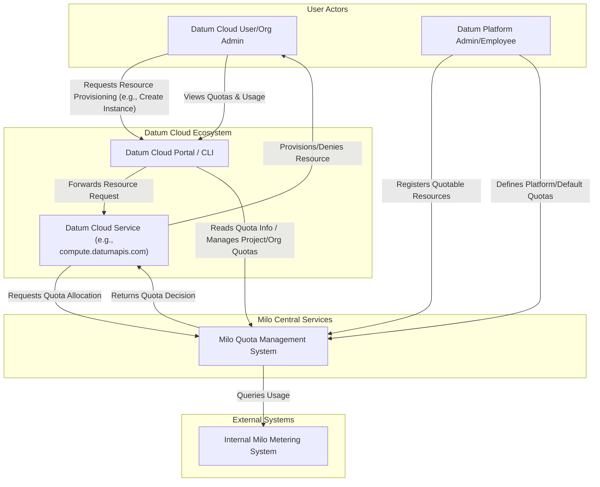
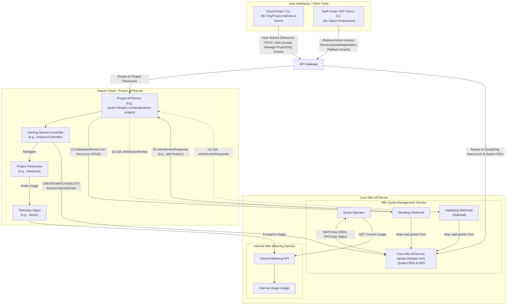
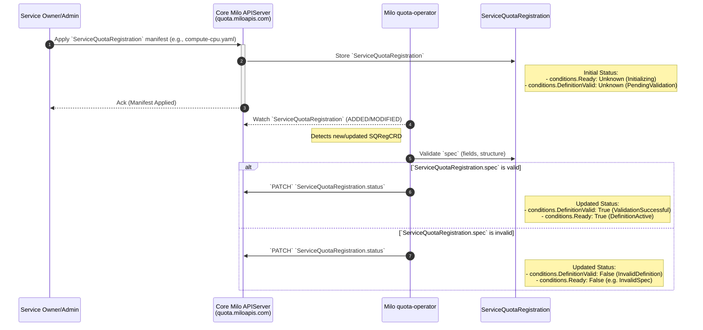
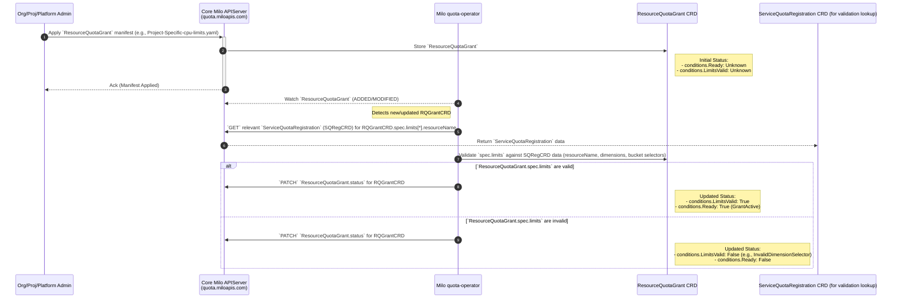
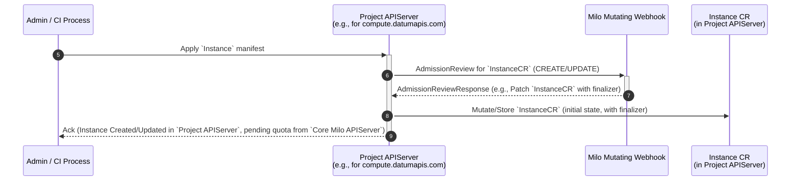
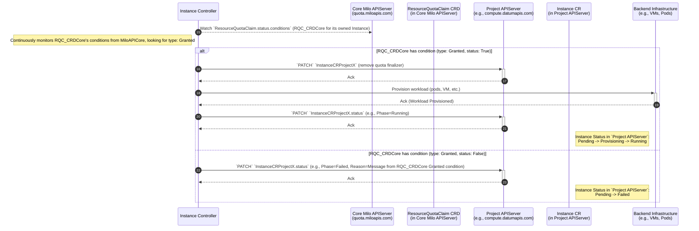
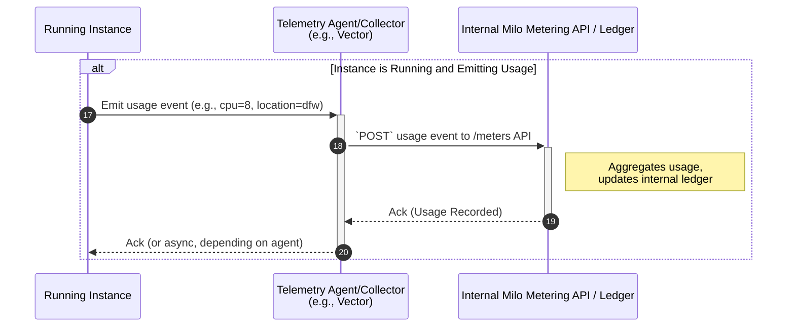
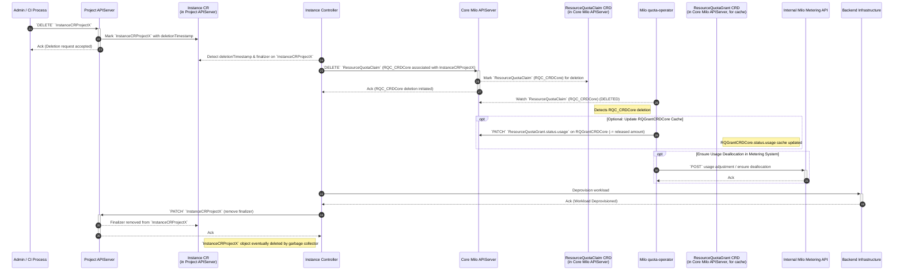

# Quota Management


## Table of Contents

- [Quota Management](#quota-management)
  - [Glossary of Terminology](#glossary-of-terminology)
  - [Summary](#summary)
  - [Motivation](#motivation)
    - [Goals](#goals)
    - [Non-Goals](#non-goals)
  - [Proposal](#proposal)
    - [Desired Outcome and Definition of
      Success](#desired-outcome-and-definition-of-success)
    - [Key Components and Capabilities](#key-components-and-capabilities)
    - [User Stories (Optional)](#user-stories-optional)
      - [Story 1](#story-1)
      - [Story 2](#story-2)
    - [Notes/Constraints/Caveats (Optional)](#notesconstraintscaveats-optional)
    - [Risks and Mitigations](#risks-and-mitigations)
      - [Risk: The potential to block all resource creation, preventing
        administration of resources due to network failure or
        timeouts.](#risk-the-potential-to-block-all-resource-creation-preventing-administration-of-resources-due-to-network-failure-or-timeouts)
        - [Mitigations (High-Level):](#mitigations-high-level)
      - [Risk: The potential to use non-live data when evaluating
        `ResourceQuotaClaim`s](#risk-the-potential-to-use-non-live-data-when-evaluating-resourcequotaclaims)
        - [Mitigations (High-Level):](#mitigations-high-level-1)
  - [Design Details](#design-details)
    - [Custom Resource Definitions](#custom-resource-definitions)
      - [`ServiceQuotaRegistration`](#servicequotaregistration)
      - [`ResourceQuotaGrant`](#resourcequotagrant)
      - [`ResourceQuotaClaim`](#resourcequotaclaim)
    - [Quota Registration](#quota-registration)
      - [Quota Operator Controller](#quota-operator-controller)
      - [Admission Webhooks](#admission-webhooks)
    - [Service Integration Patterns for Quota
      Management](#service-integration-patterns-for-quota-management)
    - [System Architecture Diagrams](#system-architecture-diagrams)
      - [Static Structure: System Context and
        Components](#static-structure-system-context-and-components)
        - [C1 Diagram - System Context](#c1-diagram---system-context)
        - [C2 Diagram -
          Containers/Components](#c2-diagram---containerscomponents)
      - [Dynamic Flows: Sequence Diagrams](#dynamic-flows-sequence-diagrams)
        - [Sequence Diagram Step
          Breakdown](#sequence-diagram-step-breakdown)
          - [Service Quota Definition Registration
            (Prerequisite)](#service-quota-definition-registration-prerequisite)
          - [Defining Resource Quota Limits (`ResourceQuotaGrant`
            Creation)](#defining-resource-quota-limits-resourcequotagrant-creation)
          - [Instance Provisioning & Admission
            Control](#instance-provisioning--admission-control)
          - [Quota Reconciliation by
            `quota-operator`](#quota-reconciliation-by-quota-operator)
          - [Owning Service Reacts to `ResourceQuotaClaim`
            Status](#owning-service-reacts-to-resourcequotaclaim-status)
          - [Telemetry & Metering Flow (Post-Provisioning if
            Granted)](#telemetry--metering-flow-post-provisioning-if-granted)
          - [Tear-down & Quota Release](#tear-down--quota-release)
  - [Open Questions](#open-questions)
  - [Production Readiness Review
    Questionnaire](#production-readiness-review-questionnaire)
    - [Feature Enablement and Rollback](#feature-enablement-and-rollback)
      - [How can this feature be enabled / disabled in a live
        cluster?](#how-can-this-feature-be-enabled--disabled-in-a-live-cluster)
      - [Does enabling the feature change any default
        behavior?](#does-enabling-the-feature-change-any-default-behavior)
      - [Can the feature be disabled once it has been enabled (i.e. can we roll
        back the
        enablement)?](#can-the-feature-be-disabled-once-it-has-been-enabled-ie-can-we-roll-back-the-enablement)
      - [What happens if we reenable the feature if it was previously rolled
        back?](#what-happens-if-we-reenable-the-feature-if-it-was-previously-rolled-back)
      - [Are there any tests for feature
        enablement/disablement?](#are-there-any-tests-for-feature-enablementdisablement)
    - [Rollout, Upgrade and Rollback
      Planning](#rollout-upgrade-and-rollback-planning)
      - [How can a rollout or rollback fail? Can it impact already running
        workloads?](#how-can-a-rollout-or-rollback-fail-can-it-impact-already-running-workloads)
      - [What specific metrics should inform a
        rollback?](#what-specific-metrics-should-inform-a-rollback)
      - [Were upgrade and rollback tested? Was the upgrade->downgrade->upgrade
        path
        tested?](#were-upgrade-and-rollback-tested-was-the-upgrade-downgrade-upgrade-path-tested)
      - [Is the rollout accompanied by any deprecations and/or removals of
        features, APIs, fields of API types, flags,
        etc.?](#is-the-rollout-accompanied-by-any-deprecations-andor-removals-of-features-apis-fields-of-api-types-flags-etc)
    - [Monitoring Requirements](#monitoring-requirements)
      - [How can an operator determine if the feature is in use by
        workloads?](#how-can-an-operator-determine-if-the-feature-is-in-use-by-workloads)
      - [How can someone using this feature know that it is working for their
        instance?](#how-can-someone-using-this-feature-know-that-it-is-working-for-their-instance)
      - [What are the reasonable SLOs (Service Level Objectives) for the
        enhancement?](#what-are-the-reasonable-slos-service-level-objectives-for-the-enhancement)
      - [What are the SLIs (Service Level Indicators) an operator can use to
        determine the health of the
        service?](#what-are-the-slis-service-level-indicators-an-operator-can-use-to-determine-the-health-of-the-service)
      - [Are there any missing metrics that would be useful to have to improve
        observability of this
        feature?](#are-there-any-missing-metrics-that-would-be-useful-to-have-to-improve-observability-of-this-feature)
    - [Dependencies](#dependencies)
      - [Does this feature depend on any specific services running in the
        cluster?](#does-this-feature-depend-on-any-specific-services-running-in-the-cluster)
    - [Scalability](#scalability)
      - [Will enabling / using this feature result in any new API
        calls?](#will-enabling--using-this-feature-result-in-any-new-api-calls)
      - [Will enabling / using this feature result in introducing new API
        types?](#will-enabling--using-this-feature-result-in-introducing-new-api-types)
      - [Will enabling / using this feature result in any new calls to the cloud
        provider?](#will-enabling--using-this-feature-result-in-any-new-calls-to-the-cloud-provider)
      - [Will enabling / using this feature result in increasing size or count
        of the existing API
        objects?](#will-enabling--using-this-feature-result-in-increasing-size-or-count-of-the-existing-api-objects)
      - [Will enabling / using this feature result in increasing time taken by
        any operations covered by existing
        SLIs/SLOs?](#will-enabling--using-this-feature-result-in-increasing-time-taken-by-any-operations-covered-by-existing-slisslos)
      - [Will enabling / using this feature result in non-negligible increase of
        resource usage in any
        components?](#will-enabling--using-this-feature-result-in-non-negligible-increase-of-resource-usage-in-any-components)
      - [Can enabling / using this feature result in resource exhaustion of some
        node resources (PIDs, sockets, inodes,
        etc.)?](#can-enabling--using-this-feature-result-in-resource-exhaustion-of-some-node-resources-pids-sockets-inodes-etc)
    - [Troubleshooting](#troubleshooting)
      - [How does this feature react if the APIServer is
        unavailable?](#how-does-this-feature-react-if-the-apiserver-is-unavailable)
      - [What are other known failure
        modes?](#what-are-other-known-failure-modes)
      - [What steps should be taken if SLOs are not being met to determine the
        problem?](#what-steps-should-be-taken-if-slos-are-not-being-met-to-determine-the-problem)
  - [Implementation History](#implementation-history)
  - [Drawbacks](#drawbacks)
  - [Alternatives](#alternatives)
  - [Infrastructure Needed (Optional)](#infrastructure-needed-optional)

## Glossary of Terminology

*   **[Core Milo APIServer](#custom-resource-definitions)**: The Core Milo
    APIServer instance responsible for hosting quota-related CRDs
    (`ServiceQuotaRegistration`, `ResourceQuotaGrant`, `ResourceQuotaClaim`) and
    organization-scoped resources.
*   **[Project APIServer](#custom-resource-definitions)**: A project-scoped Milo
    APIServer instance that manages primary resources (e.g., `Instance`,
    `Subnet`, etc.). The plural **`Project APIServers`** refers to multiple such
    instances. **[Service
    Owner/Admin](#service-quota-definition-registrationprerequisite)**: The
    entity responsible for a service that integrates with Datum Cloud. For core
    Datum services, this is an internal Datum Employee or team.
*   **[Organization Administrator](#key-components-and-capabilities)**: A
    customer administrator who manages organization-level settings and quotas
    (e.g., max projects, total collaborators) within their own Datum Cloud
    organization.
*   **[Project Administrator](#key-components-and-capabilities)**: A customer
    administrator who manages project-level settings and resource consumption
    quotas (e.g., CPU, memory for a specific project) within their own Datum
    Cloud project.
*   **[Owning Service](#sequence-diagram-step-breakdown)**: A Datum Cloud
    service (e.g., `compute.datumapis.com`) that manages a specific type of
    resource (e.g., `Instance`) and is responsible for its lifecycle, including
    integrating with the quota system.
*   **[`ServiceQuotaRegistration`](#servicequotaregistration)**: A Custom
    Resource Definition (CRD) in the `Core Milo APIServer` used by Datum
    employees to register a specific resource type as manageable by the quota
    system, defining its name, unit, and allowed dimensions.
*   **[`ResourceQuotaGrant`](#resourcequotagrant)**: A Custom Resource
    Definition (CRD) in the `Core Milo APIServer`, namespaced to a project or
    organization, that declares the actual quota limits for a registered
    resource, often with dimensional bucketing.
*   **[`ResourceQuotaClaim`](#resourcequotaclaim)**: A Custom Resource
    Definition (CRD) in the `Core Milo APIServer`, namespaced to a project or
    organization, representing an Owning Service's intent to consume a specific
    quantity of a registered resource against a defined quota.
*   **[`quota-operator`](#quota-operator-controller)**: A controller that
    reconciles `ResourceQuotaClaim`s by validating them, checking against
    `ResourceQuotaGrant`s, querying real-time usage from the metering system,
    and updating claim statuses.
*   **[Admission Webhooks](#admission-webhooks)**: Webhooks (mutating and
    _optionally_ validating) registered with `Project APIServer` instances to
    intercept resource requests, potentially adding finalizers and performing
    fast-fail quota checks.
*   **[Metering System](#key-components-and-capabilities)**: An internal Datum
    service the `quota-operator` queries to determine the current resource
    usage.

## Summary

This enhancement proposes the architecture and implementation of a comprehensive
and centralized quota management system within the Milo platform. This system
will allow internal administrators the ability to register services and the
resources that are subject to quota limits, as well as manage those limits.
External administrators will be able to view their quota limits as well as
request changes to them, which will be processed by internal administrators.

The system aims to provide predictable capacity management, enable customer tier
enforcement, offer transparency to customers regarding their resource limits,
and include enforcement mechanisms to reject claim requests that would exceed
these limits _without blocking resource creation_.

## Motivation

The ability to create, observe, and self-manage resource quotas within
organizations and their projects provides numerous benefits to both internal and
external administrators of the system. By providing full transparency and
observability into quota management and resource consumption, quota management
also ensures:

1. Operational stability and reliability
2. Accurate cost predictability
3. Prevention of accidental or abusive overuse
4. Confidence in resource planning and the enforcement of internal and
   regulatory policies.

The safeguards put in place through quota management will enable users to fully
explore the Datum Cloud and Milo ecosystems and the variety of valuable
functionality they provide, without the risk of exceeding the limits that have
been set within their organization and projects; leading to unexpected costs.

### Goals

- Provide clear system context and architectural approach to the creation of a
  quota management system within Milo that integrates with Datum Cloud services,
- Define the APIs that internal administrators will use to:
  - Register quotas for specific services and their resources that external
    administrators can then use as part of their own quota limits.
  - Create and manage the actual quota limits on the resources via dimensions
    and labels with the ability to grant additional quotas to specific projects
    or organizations.
  - Automatically generate quota grants for new projects and organizations when
    they are initialized.
- Define the API for external administrators to view their quota limits and
  request changes to them through internal administrators.
- Ensure the system can enforce defined quota limits without blocking resource
  creation. For example, by allowing the requested resource to be created in the
  system (such as an `Instance`), but preventing the actual allocation of
  resources and usage of the `Instance`until the quota limit is increased via
  internal administrators.
- Facilitate predictable capacity management for the platform.

### Non-Goals

- Provide detailed implementation specifics of how the metering and billing
  components of the system will work, outside of the acknowledgement of their
  overall role in system architecture from a quota management perspective. This
  includes how resource consumption is translated into actual billable units and
  invoices via the telemetry pipeline.
- Support customer tier enforcement (e.g., free vs. paid tiers) through
  configurable quotas (which will be implemented as a future enhancement).
- Define the future Milo Service Catalog and service registration (distinct from
  the service quota registration for quota management).
- Define the exact user interface (UI) mockups or user experience (UX) flows for
  managing or viewing quotas, beyond initial design for the MVP.
- Define how time-series metrics (e.g. CPU hours, data written, etc) will be
  implemented by the data plane.
- Define how alerts can be created and sent to organizational and project
  administrators to inform them that they are approaching the quota threshholds
  they set for the resources. These "early warning" alerts are *not* enforced by
  the quota system, nor a part of this enhancement.

## Proposal

This enhancement proposes the design, architecture, and implementation of a
quota management system in Milo. This system will be centralized and designed
for integration by other Datum Cloud services. It will allow for the management
of resource quota limits at both organizational and project levels by respective
internal and external administrators.

### Desired Outcome and Definition of Success

Once implemented, Datum Cloud services should be able to seamlessly integrate
with the Milo Quota Management system. Both internal and external platform
administrators will be able to use the system to easily create and manage quotas
through highly scalable architecture and implementation. The system should
properly allocate and and deallocate resources when claims are granted, deny
claims that exceed set limits and stay in sync with the Internal Milo Metering
Service.

### Key Components and Capabilities

There are several key components that will comprise the architecture and
implementation of the quota management system.

1.  **`ResourceQuotaClaim` Definition:**
    - **Datum Cloud Services** are the primary actors that request and manage
      the lifecycle of `ResourceQuotaClaim` objects storedin the `Core Milo
      APIServer`. When a user action occurs (e.g., creating an `Instance` via
      the Cloud Portal or CLI), the responsible Datum Cloud Service will
      generate a `ResourceQuotaClaim` to request the resource.
    - This claim represents the service's intent to consume a specific quantity
      of a registered resource (e.g., CPU cores, memory) for a particular
      project or organization.
    - Claims will contain a reference to the owning service and the specific
      resource instance in the Project APIServer that requires the quota (e.g.,
      a particular `Instance` CR).
    - The `quota-operator` evaluates these claims against the applicable
      `ResourceQuotaGrant` limits to determine if the request should be
      `Granted` or `Denied`.
    - Users and organization/project administrators typically do not interact
      directly with `ResourceQuotaClaim` objects; they interact with the Datum
      Cloud Service, which then handles the claim lifecycle.

2.  **`ResourceQuotaGrant` Definition:**
    - **The Quota Management system** will create default `ResourceQuotaGrant`s
      for each organization (for organization-level quotas like project count
      and collaborator count) and for each project (for resource consumption
      quotas like CPU, memory, instance count, etc.) on initialization. These
      ensure that safeguards are in place that prevent attempts to claim/create
      resources that exceed the limits set for the organization and project
      before specific grants are further added.
    - **Internal Administrators** can additionally grant additional quotas, that
      are additive to the existing `ResourceQuotaGrant`s for both
      organization-level quotas (e.g., max projects per org) and project-level
      resource consumption quotas (e.g., CPU limits per project). While the
      system will automatically create initial grants, the internal
      administrators the the flexibility to make adjustments as needed across
      the platform.
    - **Organizational Administrators** can view and indirectly manage
      `ResourceQuotaGrant` objects that pertain to their organization-specific
      limits, such as the maximum number of projects allowed within their
      organization or the total number of collaborators. They do not directly
      manage grants for resources (e.g., additional CPU or memory), but instead
      request additional grants to be added to their existing grants from
      internal administrators.
    - **Project Administrators** can define and manage `ResourceQuotaGrant`
      objects for their specific projects. These grants control project-level
      resource consumption quotas like CPU, memory, instance counts, gateway
      counts, etc. Like organizational administrators, they do not directly
      manage grants for resources, but instead request additional grants to be
      added to their existing grants from internal administrators.
    - In a future enhancement, the system will be able to support different
      customer tiers and plans that are tied to specific grants, allowing for
      varied limits based on subscription levels (e.g., "Free Tier gets 1
      collaborator" and "Pro Tier gets unlimited").
    - **Aggregating Quota Grants:** In scenarios where multiple
      `ResourceQuotaGrant` objects apply to the same resource and dimensions for
      a given project or organization (e.g., a default grant for CPU and an
      additional grant from a Datum Employee to increase CPU), the
      `quota-operator` must have a defined strategy for aggregating these limits
      to determine the effective total quota. This means summing the limits from
      all applicable grants for the defined resources. The system should provide
      clarity on the effective total limit to users and administrators.

3.  **`ServiceQuotaRegistration` Definition:**
    - **Service Owner/Admin** can register resources that _enable_ them to be
      managed by quotas by creating `ServiceQuotaRegistration` objects in the
      `Core Milo APIServer`.
    - This is necessary for creating `ResourceQuotaGrant` objects that define
      quota limits, as well as for requesting resources and generating a
      `ResourceQuotaClaim`.
    - If an attempt is made to generate a claim on a resource that has yet to be
      registered, it will be denied.

4.  **Quota Enforcement:**
    - The system will use a mutating admission webhook and a `quota-operator`
      reconciler. The webhook will be configured on `Project APIServer`
      instances to intercept resource requests originating there. The operator
      will then check these requests against defined quotas.
    - The system will determine near real-time metric usage by querying raw usage values (e.g., bytes, millicores)
      via integration with the **Internal Milo Metering Service** to determine if the request should
      be granted or denied.
    - Requests exceeding the defined limits will still create the resource in
      the system, as previously described, however it will not be allocated
      until the quota limit is increased via internal administrators. This will
      be done via the `quota-operator` and `Core Milo APIServer`.
    - Denied quotas will be appropriately logged and persisted, creating
      additional observability and an audit trail detailing why specific claim
      requests were denied. This will also be done via the `quota-operator` and
      `Core Milo APIServer`.
    - The system will be designed to be resilient to failures of the **Internal
      Milo Metering Service** and the `Core Milo APIServer`, ensuring that the
      system can continue to function even if one of these components is
      unavailable.

5.  **Quota Visibility:**
    - External users and administrators will be able to view their current quota
      limits via the Datum Cloud Portal.
    - Internal administrators will have the ability to view quota limits for all
      projects and organizations via the Datum Staff Portal.

6.  **Service Integration:**
    - Datum Cloud services need the ability to interact with the quota
      management system in order to 
    - A centralized API, hosted by the `Core Milo APIServer`, will be designed
      that enables both registering these quotable resources and subsequently ad
      their limits for projects and organizations via `ResourceQuotaGrant`s.
    - The integration with the **Internal Milo Metering Service** will be
      clearly defined. (Details of the billing processor platform are out of
      scope for this quota enhancement).

7.  **Architectural Considerations:**
    - Initially, [Kubernetes
      ResourceQuotas](https://kubernetes.io/docs/concepts/policy/resource-quotas/)
      were explored for project-level resource control, while acknowledging
      potential limitations for project-wide (cross-namespace) totals. Due to
      this limitation, Kubernetes ResourceQuotas were determined to not provide
      the functionality desired for cross-namespace resource quota management.
    - Tying a "Resource Grant" to a product plan and tiers, as discussed in
      [enhancement issue
      #78](https://github.com/datum-cloud/enhancements/issues/78), will be added
      as a future enhancement to dynamically configure quotas based on the
      specific plans and tiers.
    - A "Resource Claim", as represented in this enhancement, was inspired by
      the `ResourceClaim` type within the [Kubernetes Dynamic Resource
      Allocation
      API](https://kubernetes.io/docs/concepts/scheduling-eviction/dynamic-resource-allocation/#api)
      to model how changes to resources are requested

**Proposal Deliverables**
- An updated enhancement document (this document) detailing the system
  architecture
- A Proof of Concept (POC) demonstrating functional quota system in Milo
  integrated with a Datum Cloud project, and a complete API design for service
  quota registration and management.

### User Stories (Optional)

<!--
Detail the things that people will be able to do if this Enhancement is implemented.
Include as much detail as possible so that people can understand the "how" of
the system. The goal here is to make this feel real for users without getting
bogged down.
-->

#### Story 1
 As a Datum Cloud organization or project administrator, I should be able to
 view and manage quota limits for my organization and project-level resources,
 so that I can easily manage the resource limits configured for my organization
 and projects.

#### Story 2
 As a Datum Cloud Employee, I should be able to view and manage quota limits for
 all projects and organizations across the platform, so that I can ensure that
 the platform is operating within the limits set for each organization and
 project.

### Notes/Constraints/Caveats (Optional)

<!--
What are the caveats to the proposal?
What are some important details that didn't come across above?
Go in to as much detail as necessary here.
This might be a good place to talk about core concepts and how they relate.
-->

### Risks and Mitigations

Different risks must be taken into account when considering implementation of
the Quota Management system to ensure the system is working as expected and the
risks are mitigated.

Best practices will be enforced by reviewers based on their knowledge of the
Datum Cloud ecosystem, including security and alignment with established
external and internal standards.

#### Risk: The potential to block all resource creation, preventing administration of resources due to network failure or timeouts.

##### Mitigations (High-Level):
-   **Webhook Timeouts & Failure Policy:** Configure admission webhooks (Milo
    Mutating & Validating) with aggressive timeouts. Set their `failurePolicy`
    to `Fail`. This ensures that if the Quota Management Service is unreachable
    or times out, resource creation/modification requests to Owning Services can
    still proceed (albeit without immediate quota enforcement). This prioritizes
    platform availability.
-   **`quota-operator` Resilience:** Design the `quota-operator` to retry calls
    to internal dependencies like the **Internal Milo Metering Service** with
    exponential backoff. If dependencies are unavailable for an extended period,
    the operator should clearly indicate this (e.g., in `ResourceQuotaClaim`
    status) and might temporarily deny new claims (or use cached data with
    *extreme caution* if implemented, clearly marking approvals as conditional).
-   **Monitoring & Alerting:** Implement comprehensive monitoring and alerting
    for the Quota Management Service and its connectivity to critical
    dependencies (`Core Milo APIServer`, **Internal Milo Metering Service**).
-   **Emergency Bypass (Break-Glass Procedure):** For extreme, prolonged outages
    of the core quota enforcement mechanism, a well-documented, audited, and
    access-controlled procedure should allow Datum Employees to temporarily
    bypass quota checks (e.g., by temporarily removing or altering webhook
    configurations). This is a last-resort measure, as it introduces manual
    intervention and potential for misconfiguration.

#### Risk: The potential to use non-live data when evaluating `ResourceQuotaClaim`s

This could lead to the following non-desired behavior:
- The allocation of resources beyond the set quota limits, bypassing
  enforcement.
- The denial of resource allocation when there are enough free resources to
  allow the request the ability to proceed.

##### Mitigations (High-Level):
-   **Authoritative Usage Source:** A single authoritative source of truth for
    resource consumption should be used when evaluating `ResourceQuotaClaim`s.
-   **Post-Outage Reconciliation:** When the Milo Quota Management service
    recovers (or webhooks are re-enabled/fixed), the `quota-operator` will
    reconcile existing claims and usage. New requests for already over-limit
    projects/organizations will be denied until usage falls within limits.
    Alerts can optionally be created and triggered to review significant
    discrepancies.
-   **Robust Telemetry Pipeline:** Ensure the telemetry pipeline sending usage
    data to the **Internal Milo Metering Service** is resilient, with
    appropriate retries, buffering (e.g., in Vector agents), and error handling
    to minimize lost or delayed usage data.
-   **Real-time Usage Queries:** The `quota-operator` should *always* attempt to
    query the **Internal Milo Metering Service** in real-time for the most
    up-to-date usage data before making a decision on a `ResourceQuotaClaim`.
-   **Cautious Use of Cached Data:** If the optional caching of usage in
        `ResourceQuotaGrant.status.usage` is implemented, this data *must* be
    treated as potentially stale. Decisions based purely on this cache should be
    extremely limited (e.g., only for clear-cut denials where requested >
    hard_limit_from_cache). Logic should *always* favor fresh data
-   **Metering System Reliability:** The accuracy and timeliness of the
    **Internal Milo Metering Service** itself are crucial and should be
    configured for high availability and low data latency.
-   **Clear Status Reporting:** If a claim is denied due to inability to contact
    the **Internal Milo Metering Service** (despite retries), the
    `ResourceQuotaClaim.status` should clearly reflect this reason (e.g.,
    `MeteringSystemUnavailable`), distinguishing it from a denial due to actual
    quota exhaustion.

---

## Design Details

The Milo Quota Management System will be deployed as a series of components
within the central Milo Management Control Plane. Its core quota-related CRDs
and logic will reside within the `Core Milo APIServer` instance, along with any
organization-scoped resources.

The system will expose APIs and interact with Datum Cloud service instances
(e.g., `compute.datumapis.com`, `network.datumapis.com`, etc.), which manage
their primary resources (`Instance`, `Gateway`, `Subnet`, etc.) in
_project-scoped instances_ of the Milo APIServer **(referred to as `Project
APIServer`)**. These Project APIServers are the primary entrypoints for users
and administrators to interact with their project-scoped resources. The `Core
Milo APIServer` instance will be responsible for managing any
organization-scoped resources, such as total `Users` and `Project` resources.

### Custom Resource Definitions

Three main CRDs will be created as core components of the Quota Management
implementation: 

- `ServiceQuotaRegistration`
- `ResourceQuotaClaim`
- `ResourceQuotaGrant`

These CRDs will be defined and served by the **`Core Milo APIServer`**, and the
API group for these CRDs will be `quota.miloapis.com`, aligning with existing
API group standards; while the Go type definitions for these CRDs will be
located within the [milo GitHub
repository](https://github.com/datum-cloud/milo).

Other `*.datumapis.com` API groups referenced in this document, such as
`compute.datumapis.com` (hosting resources like `Instance`) and
`network.datumapis.com` (hosting resources like `Subnet`), are served by
individual **project-scoped Milo APIServer instances** (which again are referred
to as `Project APIServer` or `Project APIServers`). Each such instance is
dedicated to a specific organization's project and runs its own control plane
logic, even if it shares the same underlying Milo APIServer component base as
the `[core]` instance.

These `Project APIServer` instances are *not* where the Milo quota CRDs reside.
However, they will instead be configured (via
[multicluster-runtime](https://github.com/kubernetes-sigs/multicluster-runtime))
to call Milo's admission webhooks (which run as part of the central Quota
Management service, and interact with the `Core Milo APIServer`) when resources
like `Instance` are created or modified within that project.

#### `ServiceQuotaRegistration`

The `ServiceQuotaRegistration` CRD allows internal administrators the ability to
define and register the specific resource types (e.g.,
`compute.datumapis.com/instances/cpu`) they offer as quotable. This registration
makes these resource types available to have quotas applied to them across the
platform via `ResourceQuotaGrant`s. The Service Owners/Admins interact with the
`Core Milo APIServer` to manage these registrations.

The inclusion of the `ServiceQuotaRegistration` CRD decouples the definition of
*which resource types are quotable* (the responsibility of Service
Owners/Admins) from the subsequent management of specific quota *limits* for
those types (handled by Project/Organization Admins or Datum Employees via
`ResourceQuotaGrant`). This architectural separation allows for the system to be
more flexible and scalable, as well as easier to maintain and update over time.

```yaml
apiGroup: quota.miloapis.com
kind: ServiceQuotaRegistration
metadata:
  # Unique name for the registration
  name: <my-service-quota-registration>
spec:
  # Service which owns the resource being registered.
  serviceRef:
    name: compute.datumapis.com
  # The type of resource being registered.
  # Allocation | Feature | (possibly Rate? | Consumption?)
  type: Allocation

  # Fully qualified name of the resource being managed.
  # This should match the 'name' field in `ResourceQuotaClaim.spec.resources`
  # and also in `ResourceQuotaGrant.spec.limits`.
  resourceName: compute.datumapis.com/instances/cpu
  # Description of the resource.
  description: "Number of CPU cores allocated to provisioned instances."
  # The unit of measurement for the resource (raw unit for accounting).
  # Examples: "millicores", "bytes", "count"
  unit: "millicores"
  # Optional: Hint for UIs on how to display the raw unit.
  # Examples: "cores" (from millicores), "GiB" (from bytes), "Instances" (from count)
  displayUnits: "cores"
  # Allowed demensions that can be used in ResourceQuotaGrant selectors.
  # for the service and resources being registered.
  allowedDimensions:
    - networking.datumapis.com/location
    - compute.datumapis.com/instanceType
Status:
  # The specific version of the ServiceQuotaRegistration that was observed by
  # the `Core Milo APIServer`.
  observedGeneration: 1
  # Standard kubernetes approach to represent the state of a resource.
  conditions:
    # Indicates if the definition is valid, accepted, and the resource can be managed.
    # - Type: Ready
    # - Status: "True" | "False" | "Unknown"
    # - Reason: (e.g., "DefinitionActive" | "InvalidDefinition" | "Initializing")
    # - Message: Human-readable message detailing status reason 
    #   (e.g. "The service's resource is ready to be managed by quotas.")
    - type: Ready
      status: Unknown
      lastTransitionTime: "2023-01-01T12:00:00Z"
      reason: Initializing
      message: "The definition is being initialized."
```


#### `ResourceQuotaGrant`

The `ResourceQuotaGrant` CRD, hosted by the **`Core Milo APIServer`**, declares
the actual quota limits for a specific scope (e.g., project or organization). It
is a **Namespaced** resource, meaning each grant will reside within a namespace
that corresponds to the specific project or organization it governs. Multiple
`ResourceQuotaGrant` CRs can exist for the same scope (namespace) and resource
type; their limits are additive to determine the total effective quota.

```yaml
apiGroup: quota.miloapis.com
kind: ResourceQuotaGrant
metadata:
  name: <my-resource-quota-grant>
  # Namespace of the project/organization this grant applies to
  namespace: proj-abc
  uid: <uid>
spec:
  # Reference to project or organization since the CRD can use either
  resourceRef:
    apiGroup: resources.datumapis.com
    # Either Project or Organization
    kind: Project
    # Name of the Project/Organization custom resource
    name: proj-abc
  # The specific resource types and their quota limits being managed by this grant.
  resources:
  # 1. CPU cores allocated per project / location / instance type
  - name: compute.datumapis.com/instances/cpu
    buckets:
    # Single location and instance type
    - type: Limit
      # in milli-cores (40 cores)
      value: 40000
      # Explicitly define dimension key-value pairs for this bucket
      dimensionLabels:
        networking.datumapis.com/location: dfw
        compute.datumapis.com/instanceType: datumcloud/d1-standard-2

  # 2. Memory (GiB) allocated per project / location / instance type
  - name: compute.datumapis.com/instances/memoryAllocated
    buckets:
    - type: Limit
      # In bytes (4096 GiB)
      value: 4398046511104 
      # Empty dimensionLabels means it applies globally for this resource in this grant,
      # or for resources that do not have these specific dimensions.
      dimensionLabels: {}

    - type: Limit
      # in bytes (1024 GiB)
      value: 1099511627776
      dimensionLabels:
        networking.datumapis.com/location: dfw

  # 3. Instance count per project / location / instance type
  - name: compute.datumapis.com/instances/count
    buckets:
    - type: Limit
      # Raw count
      value: 200 
      dimensionLabels: {}
    - type: Limit
      # Raw count
      value: 20
      dimensionLabels:
        instanceType: datumcloud/d1-standard-2
    - type: Limit
      # Raw count
      value: 5 
      dimensionLabels:
        networking.datumapis.com/location: dfw
        compute.datumapis.com/instanceType: datumcloud/d1-standard-2

  # 4. Gateway count per project
  - name: network.datumapis.com/gateways
    buckets:
    - type: Limit
      # Raw count
      value: 15 
      # Applies to all gateways for this project in this grant
      dimensionLabels: {}

# Status reflects the validity and applicability of the defined quotas.
Status:
  observedGeneration: 1
  # Optional: Cache of current usage for each bucket.
  usage:
  - name: compute.datumapis.com/instances/cpu
    buckets:
    # Dimension-specific usage
    - dimensionLabels:
        networking.datumapis.com/location: dfw
        compute.datumapis.com/instanceType: datumcloud/d1-standard-2
      # in milli-cores (10 cores)
      used: 10000 
  # Standard kubernetes approach to represent the state of a resource.
  conditions:
    # Indicates if the grant is correctly configured and actively being used.
    # - Type: Ready
    # - Status: "True" | "False" | "Unknown"
    # - Reason: (e.g., "GrantActive" | "InvalidResourcesConfiguration" | "NotEnforced")
    # - Message: Human-readable message detailing the Reason value.
    - type: Ready
      status: Unknown
      lastTransitionTime: "2023-01-01T12:00:00Z"
      reason: Initializing
      message: "ResourceQuotaGrant is being initialized."
    # Indicates if the spec.resources are well-formed and logically consistent.
    # - Type: ResourcesValid
    # - Status: "True" | "False" | "Unknown"
    # - Reason: (e.g., "ValidationSuccessful" | "InvalidDimensionSelector" | "ResourceNotDefined")
    # - Message: Human-readable message detailing any issues.
    - type: ResourcesValid
      status: Unknown
      lastTransitionTime: "2023-01-01T12:00:00Z"
      reason: PendingValidation
      message: "Validation of resources is pending."
    # Optionally indicates the freshness of cached usage data, if implemented.
    # - Type: UsageSynchronized
    # - Status: "True" | "False" | "Unknown"
    # - Reason: (e.g., "SyncSuccessful" | "SyncFailed" | "StaleData" | "CachingDisabled")
    - type: UsageSynchronized
      status: Unknown
      lastTransitionTime: "2023-01-01T12:00:00Z"
      reason: PendingSync
      message: "Usage data synchronization is pending."
```

#### `ResourceQuotaClaim`

The `ResourceQuotaClaim` CRD represents the *intent* of a Datum Cloud Service to
request/consume resources against a defined quota limit. When a user action
triggers an Owning Service to create a resource (e.g., an `Instance` in a
specific `Project Milo APIServer`), that Owning Service's controller will then
create a `ResourceQuotaClaim` in the central **`Core Milo APIServer`** storage
layer. This CRD contains a reference to the Owning Service resource (e.g. an
`Instance` CR), as well as the specific resource requests, including name and
quantity. It is a **Namespaced** resource within the `Core Milo APIServer`,
where the namespace corresponds to the organization or project.

```yaml
apiGroup: quota.miloapis.com
kind: ResourceQuotaClaim
metadata:
  # Connect the claim's lifetime to the workload that needs the quota
  name: instance-abc123-claim
  # Namespace of the project/organization this claim applies to
  namespace: proj-abc
  uid: <uid>
  # Cleanup on resource deletion
  finalizers:
  - quota.miloapis.com/usage-release
spec:
  # The reference to the resource that owns the resources being requested. 
  # Will be used to key off of during reconciliation.
  resourceRef: 
    apiGroup: compute.datumapis.com 
    kind: Instance 
    name: instance-abc123 
    uid: <uid>
  # Resources being requested
  resources:
  - name: compute.datumapis.com/instances/cpu
    # in milli-cores
    quantity: 8000 
  - name: compute.datumapis.com/instances/memoryAllocated
    # in bytes (32 * 1024 * 1024 * 1024)
    quantity: 34359738368 
  - name: compute.datumapis.com/instances/count
    # Raw count
    quantity: 1 
Status:
  # List of resources that have been granted for this claim,
  # using the fully qualified name of the resource.
  grantedResources: []
  observedGeneration: 1
  # Standard kubernetes approach to represent the state of a resource.
  # https://github.com/kubernetes/community/blob/master/contributors/devel/sig-architecture/api-conventions.md#typical-status-properties
  conditions:
    # Ready indicates if the claim has been processed and is in a terminal state
    # (i.e., Granted condition is True or False).
    # - Type: Ready
    # - Status: "True" (Claim is resolved: Granted or Denied) | "False" (Pending Processing) | "Unknown"
    # - Reason: (e.g., "ClaimResolved" | "Processing")
    # - Message: Human-readable message detailing the reason for the status.
    - type: Ready
      status: "False"
      # Indicates time the status last changes e.g. from False to True
      lastTransitionTime: "2023-01-01T12:00:00Z"
      reason: Processing
      message: "Claim is currently being processed."
    # Validated indicates if the claim's specification has been validated against its ServiceQuotaRegistration.
    # - Type: Validated
    # - Status: "True" | "False" | "Unknown"
    # - Reason: (e.g., "ValidationSuccessful" | "ValidationFailed" | "PendingValidation")
    # - Message: Human-readable message.
    - type: Validated
      status: Unknown
      lastTransitionTime: "2023-01-01T12:00:00Z"
      reason: PendingValidation
      message: "Claim validation against ServiceQuotaRegistration is pending."
    # QuotaChecked indicates if the quota availability has been checked against live usage.
    # - Type: QuotaChecked
    # - Status: "True" | "False" | "Unknown"
    # - Reason: (e.g., "CheckSuccessful" | "MeteringServiceUnavailable" | "PendingQuotaCheck")
    # - Message: Human-readable message detailing the reason for the status.
    - type: QuotaChecked
      status: Unknown
      # Indicates time the status last changes e.g. from False to True
      lastTransitionTime: "2023-01-01T12:00:00Z"
      reason: PendingQuotaCheck
      message: "Quota check is pending."
    # Granted indicates the final outcome of the claim. This is the primary condition
    # representing whether the claim was approved or denied.
    # - Type: Granted
    # - Status: "True" (Claim Approved) | "False" (Claim Denied) | "Unknown" (Awaiting Decision)
    # - Reason: (e.g., "QuotaAvailable", "QuotaExceeded", "ServiceQuotaRegistrationNotFound", "ValidationError", "MeteringSystemUnavailable", "AwaitingDecision")
    # - Message: Human-readable message detailing the reason for the status.
    - type: Granted
      # Default to False until explicitly Granted or an earlier failure
      status: "False"
      # Indicates time the status last changes e.g. from False to True
      lastTransitionTime: "2023-01-01T12:00:00Z"
      reason: AwaitingDecision
      message: "Decision on granting the claim is pending."
```

### Quota Registration

To enable Datum Cloud services (whose primary resources are managed by `Project
APIServer` instances) to integrate with the quota management system, the
dedicated and centralized **`Core Milo APIServer`**, will be leveraged. This API
provides the ability for internal administrators to register services and the
specific resource types that they want to be able to create and manage quotas
for. This results in the `Core Milo APIServer` being aware of the types of
resources that a project or organization are allowed to create quotas for via a
`ResourceQuotaGrant` .

This is achieved through the proposed [`ServiceQuotaRegistration`
CRD](#ServiceQuotaRegistration) (in the `Core Milo APIServer`), which acts as a
"catalog" for services to declare the types of resources they offer that *can*
be managed by the quota system at the project or organization level. This is
different than the Service Catalog, which will be proposed in a separate
enhancement.

**Internal Administrators** will create new `ServiceQuotaRegistration` objects
 in the **`Core Milo APIServer`** to declare each type of resource Datum offers
that can use quota limits. The `quota-operator` can then use these definitions
to understand and validate requests for setting the explicit limits for each
resource type via a `ResourceQuotaGrant` (also in `Core Milo APIServer`).

#### Quota Operator Controller

A `quota-operator` will be created to implement logic to convert the *intent* of
the incoming `ResourceQuotaClaim` object into the *actual allocation* of
resources. This controller will reside in the Milo Quota Management service and
**run within The Core Milo APIServer**. Its core logic would reside in a path
such as `milo/internal/controller/quota-management/`, and would be managed by
Milo's main application process (e.g., `milo/cmd/apiserver/app/` which forms
part of the `Core Milo APIServer` system).

Running within The Core Milo APIServer, its primary interactions regarding quota
CRDs (`ServiceQuotaRegistration`, `ResourceQuotaGrant`, and
`ResourceQuotaClaim`). It will:
- Watch `ServiceQuotaRegistration`, `ResourceQuotaGrant`, and
  `ResourceQuotaClaim` objects.
- Ensure accurate data is kept in sync with the downstream metering system
  (e.g., `amberflo`) by querying actual usage from the metering engine API.
- Optionally patch usage totals within `ResourceQuotaGrant.status.usage` (in the
  `Core Milo APIServer`) to serve as a fail-fast cache.
- Enforce per-project or per-organization resource quota limits that are
  declared in `ResourceQuotaGrant` objects.

The reconciliation loop for this controller will contain the following logic:
operations:

1.  **Validates Registration**:
    - Ensures that the specific requested service resource and dimensions from a
      `ResourceQuotaClaim` have already been registered via a
      `ServiceQuotaRegistration`.
    - If the registration is not found, the operator updates the claim's
      `status.conditions` with `type: Granted, status: False, reason:
      "ServiceQuotaRegistrationNotFound"` and `type: Ready, status: True,
      reason: "ClaimResolved"`.

2.  **Watches newly created or updated `ResourceQuotaClaim` objects**. These
    claims are generated by Datum Cloud services when a new resource (e.g.,
    `Instance`, `Router`) is created, scaled, or deleted in a instance.

3.  **Validates the `ResourceQuotaClaim` structure**:
    - Ensures required fields like `resources`, `resourceRef`, and other
      required fields are present and have a valid structure.
    - Verifies that the `resourceRef` (which points to a resource managed by a
      `Project APIServer` instance) is a valid reference.
      - **Note**: *The `quota-operator` might not directly access each `Project
        APIServer` instance to deeply confirm the existence of the `resourceRef`
        object in real-time for every claim, unless `multicluster-runtime`
        provides a cached or aggregated view. Validation might initially rely on
        the structure, information propagated to the claim, or eventual
        consistency checks.*
    - If validation fails, the operator updates the claim's `status.conditions`
      with `type: Validated, status: False, reason: <SpecificValidationError>`,
      `type: Granted, status: False, reason: "ValidationError"`, and `type:
      Ready, status: True, reason: "ClaimResolved"`.

4.  **Retrieves the corresponding `ResourceQuotaGrant`**:
    - Looks up the `ResourceQuotaGrant` based on the claim's namespace
      (representing the project/org) and the resource details.
    - Reads the declared `spec.resources` field, which contains the quota limits
      (as raw integer values) and bucket configurations.
    - Applies matching logic against `bucket.dimensionLabels` to find the
      correct bucket for the claim's dimensions (e.g., matching the claim's
      implied or explicit dimensions like
      `networking.datumapis.com/location=dfw` and
      `compute.datumapis.com/instanceType=datumcloud/d1-standard-2` against the
      `dimensionLabels` in each bucket).
    - If no bucket is found (or no bucket with matching `dimensionLabels`), the
      operator updates the claim's `status.conditions` with `type: Granted,
      status: False, reason: "NoMatchingQuotaBucket"`, and `type: Ready, status:
      True, reason: "ClaimResolved"`.

5.  **Queries the Internal Milo Metering Service** via API to get the live usage
    data (as a raw integer value, e.g., total bytes used) for the metric (defined by `resourceName`)
    and dimension(s) being requested by the claim. The unit of this raw value
    is determined by `ServiceQuotaRegistration.spec.unit`.
   - If the API is unavailable, the operator updates the claim's
     `status.conditions` with `type: QuotaChecked, status: False, reason:
     "MeteringServiceUnavailable"`, `type: Granted, status: False, reason:
     "MeteringSystemUnavailable"`, and `type: Ready, status: True, reason:
     "ClaimResolved"`.

6.  **Evaluates whether the claim would exceed quota**:
    - All below steps are performed within the context of the `Core Milo
      APIServer` and its data.
    - Calculates: `actualUsage (raw value from metering) + requestedAmount (raw value from claim.spec.resources.quantity) > bucketLimit (raw value from grant.spec.resources.buckets.value)`.
    - If the total would stay within the limit:
      - Optionally updates `ResourceQuotaGrant.status.usage` as the local cache
        of the most recently known usage for each quota bucket.
      - Sets `ResourceQuotaClaim.status.conditions` with `type: Granted, status:
        True, reason: "QuotaAvailable"`, `type: QuotaChecked, status: True,
        reason: "CheckSuccessful"`, and `type: Ready, status: True, reason:
        "ClaimResolved"`.
    - If the request would exceed the quota:
      - Sets `ResourceQuotaClaim.status.conditions` with `type: Granted, status:
        False, reason: "QuotaExceeded"`, `type: QuotaChecked, status: True,
        reason: "CheckSuccessful"`, and `type: Ready, status: True, reason:
        "ClaimResolved"`.
      - Emits an `Event` (associated with the `ResourceQuotaClaim`) and records
        the reason in the `Granted` condition's message.
      - *Still creates the resource in the system, but does not allow the
        resource to be used until the quota limit is increased via internal
        administrators*

7.  **Handles updates to `ResourceQuotaGrant` limits**:
    - When a `ResourceQuotaGrant` is updated (e.g., an admin raises CPU limits),
      the operator re-reconciles any affected `ResourceQuotaClaim`s.
    - Previously denied claims (due to `QuotaExceeded`) may be re-evaluated and
      potentially granted if they now fit under the increased limits.
    - Decreases in `ResourceQuotaGrant` limits will primarily affect new
      `ResourceQuotaClaim`s. The handling of already granted/active resources
      that exceed newly lowered limits is typically managed by alerting and
      administrative review rather than automatic revocation by the quota
      system.

8.  **Emits final status and metrics**:
    - Updates `ResourceQuotaClaim.status.conditions` with the outcome reflected
      in the `Granted` condition (`status: True` or `status: False`).
    - Emits relevant Prometheus metrics (e.g., `quota_claims_granted_total`,
      `quota_claims_denied_total`) for observability and auditability.

**Optional Caching**

Patching the `ResourceQuotaGrant.status.usage` field (with raw integer values)
(in the `Core Milo APIServer`) is **optional**, but recommended as it serves as a low-latency cache
of the most recently known usage for each quota bucket. This could provide
several benefits to the system:

- *Fast-rejection* for obvious quota breaking claims without needing to query
  the **Internal Milo Metering Service** (e.g., requesting to claim 1,000,000,000,000 bytes
  while the quota limit is 100,000,000,000 bytes)
- *Auditability, observability, and transparency* by creating a point-in-time
  snapshot of denied claims which provides denial reasoning and other contextual
  information that can be stored for reference.
- *Best effort last known good view* fall-back if the **Internal Milo Metering
  Service** is temporarily unavailable

If implemented, the potential for stale data **must** be accounted for (as with
all caching implementations), and therefore *should not be used for final quota
_enforcement nor billing purposes_.

**Failure Blast Radius**

If the `quota-operator` is down, new `ResourceQuotaClaim`s (in the **`Core Milo
APIServer`**) will stall; however, workloads managed by project-scoped Milo
APIServer instances (`Project APIServers`) are not directly affected by the
quota-operator outage itself, and there is no blocking of writes to them if
webhook `failurePolicy` is set to `Failed`. Resource creation might proceed
without quota checks until the operator recovers.
- See the [Risks and Mitigations](#risks-and-mitigations) section for more
  details.

#### Admission Webhooks

A *stateless mutating admission webhook* and an *optional validating admission
webhook* will be created as part of the Quota Management service. **These
webhook services will run within The Core Milo APIServer** (as part of the
central Quota Management service) and be registered with the various
**`Project-Specific Milo APIServer` instances** that manage quotable resources
(e.g., `a compute Instance`). This registration will be facilitated by
`multi-cluster-runtime` (which is already used to manage the `Project APIServer`
instances).

The logic for these webhooks will reside in the
`milo/internal/webhook/quota-management/` directory and be registered by the
main application that provides the central Quota Management service functions.

When a user attempts to create or modify a resource (e.g., an `Instance`) via a
**`Project APIServer` instance** (triggering an action in an Owning Service like
the `compute.datumapis.com` service), that `Project-Specific Milo APIServer`
instance will send an `AdmissionReview` request to the configured Milo webhook
service endpoint. This aligns with the standard Kubernetes [Dynamic Admission
Control](https://kubernetes.io/docs/reference/access-authn-authz/extensible-admission-controllers/).

- The **Milo mutating admission webhook**, when configured for an Owning
  Service's resource type (e.g., `Instance` in a `Project APIServer`):
    - Its primary role is to inspect the incoming resource and, if it's subject
      to quota management (particularly using the [Service Controller
      Driven](#service-controller-driven-recommended-for-most-infrastructuremanaged-resources)
      pattern), to add a finalizer (e.g.,
      `quota.miloapis.com/instance-protection`) to the resource within that
      `Project APIServer` via the `AdmissionReviewResponse`. This finalizer
      prevents the premature deletion of the resource while its quota is being
      processed or needs to be released.
    - It generally **does not** create the `ResourceQuotaClaim` (in `Core Milo
      APIServer`) itself if the Owning Service employs the controller-driven
      integration pattern, as claim creation is the responsibility of the Owning
      Service's controller in that scenario.
- The **optional Milo validating admission webhook** can be used for:
    - Performing fast-fail checks, potentially using cached data from
      `ResourceQuotaGrant`s in the **`Core Milo APIServer`**, before an Owning
      Service controller even attempts to create a `ResourceQuotaClaim`.
    - Implementing the [Validating Webhook
      Driven](#validating-webhook-driven-for-immediate-createdeny-resources)
      integration pattern, where it might synchronously check quota (and
      potentially trigger a rapid claim process to `Core Milo APIServer` or a
      direct check) and deny the request if quota is unavailable.
- The Core Milo APIServer will be responsible for managing the lifecycle of
  these webhook services.

This setup allows the Quota Management system to reliably participate in the
lifecycle of resources managed by Owning Services. For example, by ensuring
resources aren't deleted mid-quota-operation via finalizers, without dictating
how those services must internally manage their claim creation logic (allowing
flexibility for controller-driven vs. webhook-driven claim patterns). The Owning
Services only need to have the relevant Milo admission webhooks registered with
their respective `Project APIServer` instances.

### Service Integration Patterns for Quota Management

Datum Cloud Services can integrate with the Milo Quota Management system using
primarily two patterns, depending on the nature of the resource being managed
and the desired user experience:

1.  **Service Controller Driven (Primary Recommended Pattern):**
    -   **Use Case:** Ideal for resources where provisioning might take some
        time, and it's acceptable for the resource to appear in a "Pending" or
        "AllocatingQuota" state while the quota check is in progress. This
        pattern aligns with the principle of eventual consistency and clearly
        separates resource creation *intent* from *actual data plane
        provisioning*.
    -   **Flow:**
        1.  A user requests the creation/modification of a resource (e.g.,
            `Instance`) from the Owning Service via its `Project-Specific Milo
            APIServer` instance.
        2.  The Milo mutating admission webhook (if configured for this resource
            type and registered with the `Project APIServer`) may add a
            finalizer to the `Instance` CR as it's being written to that
            `Project APIServer`.
        3.  The Owning Service's controller (e.g., `InstanceController`) detects
            the new/modified `Instance` CR. The initial status of this resource
            would indicate it's awaiting quota allocation (e.g., `status.phase:
            PendingQuota`).
        4.  The Owning Service controller then programmatically creates a
            `ResourceQuotaClaim` in the central `Core Milo APIServer`. This
            claim details the resources needed for the `Instance`.
        5.  The Owning Service controller watches the `status` of this
            `ResourceQuotaClaim` in the `Core Milo APIServer`.
        6.  If `ResourceQuotaClaim.status.phase == Granted`:
            -   The controller proceeds to provision the actual data plane
                resources (e.g., number of CPUs, memory, etc. for the
                `Instance`).
            -   It updates the `Instance.status` in the `Project-Specific Milo
                APIServer` to reflect successful provisioning (e.g.,
                `status.phase: Running`).
            -   The finalizer added by the Milo webhook remains until the
                `Instance` is deleted, at which point the Owning Service
                controller would ensure the corresponding `ResourceQuotaClaim`
                (in `Core Milo APIServer`) is also deleted (releasing the quota)
                before removing the finalizer from the `Instance` (in
                `Project-Specific Milo APIServer`).
        7.  If `ResourceQuotaClaim.status.phase == Denied` (e.g., due to
            `QuotaExceeded`):
            -   The controller updates the `Instance.status` in the
                `Project-Specific Milo APIServer` to reflect the failure (e.g.,
                `status.phase: Failed`, `status.reason: QuotaExceeded`).
            -   The data plane resources are not provisioned.
    -   **Benefits:** Provides a good user experience as the requested resource
        is immediately visible. The status clearly communicates whether it's
        pending quota, active, or failed due to quota limits. Allows for
        asynchronous processing and robust handling of resource lifecycles via
        controllers and finalizers.

2.  **Validating Webhook Driven (Secondary / Future Consideration):**
    -   **Use Case:** Potentially suitable for resources where a pending state
        is less desirable and immediate feedback on creation is preferred, or
        where the resource creation is very lightweight (e.g., creating a `User`
        in an IAM system, adding a collaborator, creating a `Project` where the
        count is the primary quota). This pattern would require careful design
        to ensure performance and reliability.
    -   **Flow:**
        1.  A user requests the creation of a resource (e.g., `Instance`) from
            the Owning Service.
        2.  The `Project APIServer`, as part of its admission chain, sends an
            `AdmissionReview` request to a validating webhook. This webhook can
            be either:
            -   A specific webhook provided by the Milo Quota Management system
                and configured for the Owning Service's resource type.
            -   The Owning Service's own validating webhook, which then
                communicates with the Milo Quota Management system (interacting
                with `Core Milo APIServer`).
        3.  The validating webhook (or the logic it calls in Milo) performs a
            synchronous quota check. This would involve:
            -   Creating a `ResourceQuotaClaim` in `Core Milo APIServer` and
                awaiting its immediate resolution (if the claim processing is
                fast enough for synchronous validation).
            -   A direct, optimized check against `ResourceQuotaGrant`s (in
                `Core Milo APIServer`) for simple count-based quotas the Milo
                system exposes as API endpoint for synchronous checks.
        4.  If quota is available:
            -   The validating webhook returns an `AdmissionReviewResponse` with
                `allowed: true`.
            -   The `Project APIServer` proceeds to persist the new resource
                (e.g., `Instance` object).
        5.  If quota is exceeded:
            -   The validating webhook returns an `AdmissionReviewResponse` with
                `allowed: false` and an appropriate message.
            -   The `Project APIServer` rejects the resource creation request,
                and the user receives an immediate error.
    -   **Considerations:**
        -   This pattern provides immediate feedback but requires the quota
            check to be very fast to avoid impacting API responsiveness.
        -   It's crucial that validating webhooks are configured correctly. Per
            Kubernetes best practices, validating webhooks run after mutating
            webhooks. If a Milo mutating webhook is also involved (e.g., to
            create a claim in some scenarios), the order of execution must be
            managed.
        -   The `failurePolicy` for such webhooks should be carefully
            considered. `Ignore` might lead to quota violations if the webhook
            is down, while `Fail` could block resource creation if the quota
            system is unavailable. `Fail` is the recommended policy.

Owning Services should choose the integration pattern that best suits their
resource lifecycle and user experience requirements. For complex resources, the
controller-driven approach is generally recommended.

## System Architecture Diagrams

### Static Structure: System Context and Components

#### C1 Diagram - System Context



#### C2 Diagram - Containers/Components



---

### Dynamic Flows: Sequence Diagrams

The below sequence diagram illustrates the end-to-end flow of quota management,
from service registration to resource provisioning and eventual teardown.


#### Sequence Diagram Step Breakdown

The sequence diagram steps are broken down into multiple sections for narrative
and ease of understanding:

- **Service Quota Definition Registration (Prerequisite)**
- **Defining Resource Quota Limits**
- **Instance Provisioning & Admission Control**
- **Quota Reconciliation by `quota-operator`**
- **Owning Service Reacts to `ResourceQuotaClaim` Status**
- **Telemetry & Metering Flow (Post-Provisioning if Granted)**
- **Tear-down & Quota Release**

These steps also distinguish between:
- The **Owning Service** (e.g., `compute.datumapis.com`): The Datum Cloud
    service that owns a resource (e.g., `Instance`) and is responsible for its
    lifecycle, including actual provisioning. Its resources are managed by a
    project-scoped Milo APIServer instance (again, referred to as **`Project
    APIServers`**).
- The **Quota Management Service**: The service responsible for registering
    service quota definitions (`ServiceQuotaRegistration`), managing quota
    limits (`ResourceQuotaGrant`), and quota requests (`ResourceQuotaClaim`).
    These CRDs and the core quota logic reside in the **`Core Milo APIServer`**
    instance, which also contains the `quota-operator` and admission webhooks.

Interactions involving user-facing resources like an `Instance` (or similar
resources provided by an Owning Service) occur with the respective
`Project-Specific Milo APIServer` instance. Interactions involving
`ServiceQuotaRegistration`, `ResourceQuotaClaim`, and `ResourceQuotaGrant` CRDs
occur with the `Core Milo APIServer`.

##### Service Quota Definition Registration (Prerequisite)

Before any resource quotas can be claimed or enforced, the **Service
Owner/Admin** must define what resource types it offers are enabled to be
quotable by the central Milo Quota Management system.

1.  **Define & Apply `ServiceQuotaRegistration`**: The **Service Owner/Admin** —
    a persona representing the entity responsible for a specific service that
    integrates with or runs on the Datum Cloud platform.
    *   **An internal Datum Employee team** responsible for developing and
        maintaining a core Datum Cloud service (e.g., the
        `compute.datumapis.com` service team). These internal administrators
    apply a `ServiceQuotaRegistration` manifest to the **`Core Milo APIServer`
    (`quota.miloapis.com`) This `ServiceQuotaRegistration` declares a resource
    type (e.g., CPU per instance) offered by their service as manageable by the
    quota system. This is a one-time or infrequent setup action per service to
    make its resources known to the central quota system.
2.  **Store & Initialize `ServiceQuotaRegistration`**: The **`Core Milo
    APIServer`** stores the `ServiceQuotaRegistration`. Its `status` is
    initialized.
3.  **`quota-operator` Validates `ServiceQuotaRegistration`**: The
    `quota-operator` (part of the Milo Quota Management Service), which watches
    for `ServiceQuotaRegistration` resources. within the `Core Milo APIServer`,
    detects the new or modified `ServiceQuotaRegistration`. It validates the
    `ServiceQuotaRegistration`'s `spec`.
4.  **Update `ServiceQuotaRegistration` Status**: Based on the above validation:
    - **If Valid**: The `quota-operator` patches the
        `ServiceQuotaRegistration.status` field (via the **`Core Milo
        APIServer`**). The Owning Service's resource type is now actively
        manageable by the quota system.
    - **If Invalid**: The `quota-operator` patches
        `ServiceQuotaRegistration.status` (via the **`Core Milo APIServer`**) to
        reflect the failure.



##### Defining Resource Quota Limits (`ResourceQuotaGrant` Creation)

After a service's resources are registered via `ServiceQuotaRegistration` in
`Core Milo APIServer`, Organization, Project, or Platform Administrators can
define specific quota limits for projects or organizations by creating
`ResourceQuotaGrant` resources in the same Milo APIServer as the
`ServiceQuotaRegistration`.

1.  **Admin Defines & Applies `ResourceQuotaGrant`**: An **Administrator**
    (e.g., an Organization Admin for their organization, a Project Admin for
    their project, or a Platform Administrator for global/default grants)
    creates a `ResourceQuotaGrant` manifest. This manifest specifies the target
    project/organization (which maps to a namespace in `Core Milo APIServer`),
    the `resourceName` (e.g., `compute.datumapis.com/instances/cpu` that was
    registered via a `ServiceQuotaRegistration`), and the `limits` including
    `buckets` with a specific type and specific values and selectors (dimensions
    such as location and instance type). The admin applies this manifest to the
    **`Core Milo APIServer` (`quota.miloapis.com`)**.
2.  **Store & Initialize `ResourceQuotaGrant`**: The **`Core Milo APIServer`**
    stores the new `ResourceQuotaGrant` CR. Its `status` is initialized (e.g.,
    `conditions.Ready: Unknown`, `conditions.LimitsValid: Unknown`).
3.  **`quota-operator` Validates `ResourceQuotaGrant`**: The `quota-operator` ,
   watching `ResourceQuotaGrant` resources in the `Core Milo APIServer`, detects
    the new CR. It validates the `spec.limits` against the corresponding
    `ServiceQuotaRegistration` (also in `Core Milo APIServer`, e.g., checking if
    `resourceName` is registered, if dimensions in selectors are allowed).
4.  **Update `ResourceQuotaGrant` Status**: Based on the validation by the
    `quota-operator`:
    - **If Valid**: The `quota-operator` patches the `ResourceQuotaGrant.status`
      (e.g., `conditions.LimitsValid: True`, `conditions.Ready: True`) via the
      **`Core Milo APIServer`**. The quota limits are now active and
      enforceable.
    - **If Invalid**: The `quota-operator` patches `ResourceQuotaGrant.status`
      (e.g., `conditions.LimitsValid: False`, `conditions.Ready: False` with
      reasons) via the **`Core Milo APIServer`**.



##### Instance Provisioning & Admission Control

Once services are registered (via `ServiceQuotaRegistration` in `Core Milo
APIServer`) as offering quotable resources, users or CI processes can request
project-scoped resources (e.g., an `Instance`) from the Owning Service. This
interaction happens with the project's specific `Project APIServer` instance.

5.  **Request `Instance` Creation**: An `Admin / CI` process submits an
    `Instance` custom resource manifest to the specific **`Project-Specific Milo
    APIServer`** (e.g., the `compute.datumapis.com` API endpoint for that
    project).
6.  **Mutating Webhook Intercepts & Modifies**: The **`Project-Specific Milo
    APIServer`** sends an `AdmissionReview` request for the `Instance`
    creation/update/deletion to the **Milo Mutating Webhook service** (which
    runs but is registered as a webhook with the `Project-Specific Milo
    APIServer`).
    - The webhook service may modify the `Instance` resource (e.g., by adding a
        finalizer e.g. `quota.miloapis.com/instance-protection` to protect the
        `Instance` from being deleted while its quota claim is processed).
    - If the Owning Service uses the webhook-driven pattern for claim creation
        (less common for `Instance`-like resources), the webhook might construct
        and send a `POST` request to the **`Core Milo APIServer`** to create and
        persist a new `ResourceQuotaClaim` object. (More commonly, the Owning
        Service's controller creates the claim later).
    - The webhook service returns an `AdmissionReviewResponse` (indicating
        success and including any mutations) to the **`Project-Specific Milo
        APIServer`**. The `Project APIServer` then continues its admission
        chain.
7.  **Validating Admission Webhook (Optional)**: Following the mutating webhook
    phase, the **`Project APIServer`** sends another `AdmissionReview` request
    to the **Milo Validating Webhook service** (if registered and configured for
    this resource type).
    - This webhook performs a "fast-fail" check, potentially using cached data
        from `ResourceQuotaGrant`s in the **`Core Milo APIServer`**.
    - **If Denied by Validating Webhook**: The webhook service rejects the
        request. The **`Project APIServer`** does not persist the `Instance`
        object. A `ResourceQuotaClaim` (if one was prematurely created by a
        webhook) would eventually be reconciled by the `quota-operator` (likely
        to `Denied` or cleaned up if the `Instance` doesn't exist).
    - **If Allowed by Validating Webhook**: The webhook service allows the
        request. If all other admission controllers in the `Project-Specific
        Milo APIServer` also allow it, the `Instance` is persisted by the
        **`Project APIServer`**. Actual provisioning is typically handled later
        by the Owning Service's controller after explicit quota approval from
        the `Core Milo APIServer` (via a `ResourceQuotaClaim`).



##### Quota Reconciliation by `quota-operator`

The `quota-operator` (running) processes the `ResourceQuotaClaim`s that are
stored in the `Core Milo APIServer`. Its primary goal is to decide if the
requested resources can be granted based on defined quotas and actual usage.

9.  **`quota-operator` Detects `ResourceQuotaClaim`**: The `quota-operator`
    detects a new or updated `ResourceQuotaClaim` via its informer watching the
    **`Core Milo APIServer`**. This claim would be created by the Owning Service
    controller (as a result of a user action on a resource like an `Instance` in
    a `Project APIServer` instance).
10. **Validate `ResourceQuotaClaim` Against `ServiceQuotaRegistration`**: The
    `quota-operator`:
    - Fetches the relevant `ServiceQuotaRegistration` (for the resource type
        named in the claim) from the **`Core Milo APIServer`**.
    - Validates the claim's specification against this registration.
    - Based on validity, it patches the `ResourceQuotaClaim.status` in the
        **`Core Milo APIServer`**. If invalid (e.g., resource not registered,
        dimensions incorrect), reconciliation for this claim stops, and the
        claim is marked as `Denied`.
11. **Retrieve `ResourceQuotaGrant`**: If the claim is valid against a
    registration, the `quota-operator` retrieves the applicable
    `ResourceQuotaGrant`(s) for the claim's target project/organization from the
    **`Core Milo APIServer`**.
12. **Query Internal Milo Metering Service for Usage**: The `quota-operator`
    makes a real-time API call to the **`Internal Milo Metering API`** to get
    the current usage for the specific resource (identified by the claim's
    `resourceRef`) and its applicable dimensions (this usage pertains to
    resources managed within a specific project, i.e., in a `Project APIServer`
    scope).
13. **Metering Service Returns Usage**: The service responds with the current
    usage data. The `quota-operator` updates the `ResourceQuotaClaim.status`
    (e.g., `conditions.QuotaChecked: True`) in the **`Core Milo APIServer`**.
14. **Evaluate Quota & Update `ResourceQuotaClaim` Status**: The
    `quota-operator` compares the (actual usage from the Metering Service +
    requested amount in claim) against the limit(s) from the relevant
    `ResourceQuotaGrant` bucket(s) found in step 11. All these CRD interactions
    occur with the **`Core Milo APIServer`**.
    - **If Within Limit (Granted)**: The `quota-operator` patches
        `ResourceQuotaClaim.status` to `Granted`. Optionally, it may update the
        `ResourceQuotaGrant.status.usage` cache in the `Core Milo APIServer`.
    - **If Over Limit (Denied)**: The `quota-operator` patches
        `ResourceQuotaClaim.status` to `Denied` (e.g., with reason
        `QuotaExceeded`).

```mermaid
%% Sequence Diagram - Quota Reconciliation by quota-operator
sequenceDiagram
    autonumber 9

    participant MiloQuotaOp as Milo quota-operator <br>
    participant MiloAPICore as Core Milo APIServer <br> (quota.miloapis.com)
    participant RQC_CRD as ResourceQuotaClaim CRD <br> (in Core Milo APIServer)
    participant SQReg_CRD as ServiceQuotaRegistration CRD <br> (in Core Milo APIServer)
    participant RQGrant_CRD as ResourceQuotaGrant CRD <br> (in Core Milo APIServer)
    participant InternalMeteringAPI as Internal Milo Metering API

    MiloQuotaOp-->>MiloAPICore: Watch `ResourceQuotaClaim` (RQC_CRD) (ADDED/MODIFIED)
    note left of MiloQuotaOp: Detects new/updated RQC_CRD
    
    MiloQuotaOp->>MiloAPICore: `GET` relevant `ServiceQuotaRegistration` (SQReg_CRD) for RQC_CRD.spec.resources
    MiloAPICore-->>SQReg_CRD: Return `ServiceQuotaRegistration` data
    MiloQuotaOp->>RQC_CRD: Validate RQC_CRD spec against SQReg_CRD data
    
    alt RQC_CRD spec is valid against SQReg_CRD
        MiloQuotaOp->>MiloAPICore: `PATCH` RQC_CRD.status.conditions (type: Validated, status: True)
        note right of RQC_CRD: RQC_CRD Condition Updated: <br> Validated: True (ValidationSuccessful)
        
        MiloQuotaOp->>MiloAPICore: `GET` `ResourceQuotaGrant` (RQGrant_CRD) for RQC_CRD's project/org
        MiloAPICore-->>RQGrant_CRD: Return `ResourceQuotaGrant` data
        note right of RQGrant_CRD: Contains limits, selectors, buckets

        MiloQuotaOp->>+InternalMeteringAPI: `GET` current usage (for RQC_CRD.spec.resources & dimensions)
        InternalMeteringAPI-->>-MiloQuotaOp: Return usage total (e.g., "500 cores")
        MiloQuotaOp->>MiloAPICore: `PATCH` RQC_CRD.status.conditions (type: QuotaChecked, status: True, reason: CheckSuccessful)
        note right of RQC_CRD: RQC_CRD Condition Updated: <br> QuotaChecked: True (CheckSuccessful)

        alt (Current Usage from InternalMeteringAPI + RQC_CRD.spec.resources.quantity) <= RQGrant_CRD Limit
            MiloQuotaOp->>MiloAPICore: `PATCH` RQC_CRD.status.conditions (type: Granted, status: True, reason: QuotaAvailable; type: Ready, status: True)
            note right of RQC_CRD: RQC_CRD Conditions Updated: <br> - Granted: True (QuotaAvailable) <br> - Ready: True (ClaimResolved)
            opt Update RQGrant_CRD Cache
                 MiloQuotaOp->>MiloAPICore: `PATCH` `ResourceQuotaGrant.status.usage` on RQGrant_CRD
                 note right of RQGrant_CRD: RQGrant_CRD.status.usage updated (cache)
            end
        else Usage would exceed RQGrant_CRD Limit
            MiloQuotaOp->>MiloAPICore: `PATCH` RQC_CRD.status.conditions (type: Granted, status: False, reason: QuotaExceeded; type: Ready, status: True)
            note right of RQC_CRD: RQC_CRD Conditions Updated: <br> - Granted: False (QuotaExceeded) <br> - Ready: True (ClaimResolved)
        end
    else RQC_CRD spec invalid OR SQReg_CRD not found (or other preliminary error)
        MiloQuotaOp->>MiloAPICore: `PATCH` RQC_CRD.status.conditions (type: Granted, status: False, reason: <SpecificError>; type: Validated, status: False/True; type: Ready, status: True)
        note right of RQC_CRD: RQC_CRD Conditions Updated: <br> - Granted: False (e.g., ServiceQuotaRegistrationNotFound) <br> - Validated: False (if applicable) <br> - Ready: True (ClaimResolved)
    end
```

##### Owning Service Reacts to `ResourceQuotaClaim` Status

The Owning Service controller acts based on the `ResourceQuotaClaim`'s final
status, read from the central **`Core Milo APIServer`**. It specifically checks
the `Granted` condition.

15. **The Owning Service's `Instance` Controller Watches
    `ResourceQuotaClaim`s**: The **Owning Service's `Instance` Controller**
     watches the `status.conditions` of the `ResourceQuotaClaim` (which is
    associated with the `Instance` it manages.) on the **`Core Milo APIServer`**
    via an HTTP `GET`/`WATCH` request from the controller to the `Core Milo
    APIServer`.
16. **Provision or Fail `Instance`**: Based on the `ResourceQuotaClaim`'s
    `Granted` condition from `Core Milo APIServer`:
    - **If `Granted` condition is `status: True`**:
        - The **`Instance` Controller** removes its finalizer from the
            `Instance` resource (by patching it via its own **`Project-Specific
            Milo APIServer`**).
        - It then proceeds to provision the actual infrastructure for the
            `Instance` within the scope of its `Project APIServer` instance.
        - The `Instance.status` is updated by the controller.
    - **If `Granted` condition is `status: False`**:
        - The **`Instance` Controller** updates the `Instance.status` to reflect
            the failure (e.g., `status: False`, `status.reason: <Reason from
            Granted condition>`).
        - The `Instance` is not provisioned.



##### Telemetry & Metering Flow (Post-Provisioning if Granted)

When an `Instance` is successfully provisioned (meaning its `ResourceQuotaClaim`
was `Granted` by the `quota-operator` in the `Core Milo APIServer`), the actual
running resource (e.g., an `Instance` in the `Project APIServer` instance)
begins to emit usage metrics. These metrics are crucial for tracking consumption
against the allocated quotas.

17. **Emit Usage Event**: The **Running `Instance`** emits usage metrics (e.g.,
    CPU used, data written) to the local **Telemetry Agent** (Vector agent).
18. **Telemetry System Forwarding**: The **Telemetry Agent** collects and
    forwards these usage metrics to the **Internal Milo Metering API**.
19. **Metering Service Recording**: The **Metering Service** receives the usage
    data and records it in its internal ledger, associating it with the correct
    project, organization, and resource dimensions.



##### Tear-down & Quota Release

When an `Instance` (or similar project-scoped resource) within a project is
requested to be deleted, the following steps occur to ensure its quota is
released in the central Milo Quota Management system and the resource is
properly deprovisioned in its `Project APIServer`.

21. **Delete `Instance` Request**: A **User / CI Process** requests deletion of
    the `Instance` from the **`Project APIServer`** (the Project APIServer for
    the Owning Service).
22. **`Project APIServer` Marks for Deletion**: The **`Project-Specific Milo
    APIServer`** marks the `Instance` object with a `deletionTimestamp`. The
    resource is not yet deleted due to finalizers.
23. **`Instance` Controller Finalizer Logic**: The **Owning Service's `Instance`
    Controller**, detecting the `deletionTimestamp` on the `InstanceCRProjectX`
    (and its own finalizer):
    - Initiates the deletion of the associated `ResourceQuotaClaim` by sending a
        `DELETE` request for that claim to the **`Core Milo APIServer`**.
24. **`quota-operator` Handles `ResourceQuotaClaim` Deletion**:
    - The **`Milo quota-operator`** detects the deletion of the
        `ResourceQuotaClaim` in the **`Core Milo APIServer`**.
    - *(Optional Cache Update)*: The `quota-operator` may patch the
        `ResourceQuotaGrant.status.usage` in the **`Core Milo APIServer`** to
        reflect the released amount.
    - The `quota-operator` ensures the usage is no longer accounted for by the
        metering system (e.g., by sending an explicit deallocation/zero-usage
        event to the **`Internal Milo Metering API`** if the metering API
        supports/requires it for immediate reflection).
25. **Deprovision Infrastructure**: The **Owning Service's `Instance`
    Controller** ensures the actual underlying infrastructure for the `Instance`
    is deprovisioned within the project's specific scope.
26. **Remove Finalizer**: Once all cleanup related to the `Instance` (including
    ensuring the `ResourceQuotaClaim` in `Core Milo APIServer` is gone or being
    processed for deletion, and backend infra is gone) is complete, the
    **`Instance` Controller** removes its finalizer from the `Instance` resource
    via its **`Project APIServer`**.
27. **`Project APIServer` Deletes `Instance`**: With finalizers removed, the
    `Instance` object is deleted.


---

## Open Questions

1. ...
2. ...

---

## Production Readiness Review Questionnaire

<!--

Production readiness reviews are intended to ensure that features are observable,
scalable and supportable; can be safely operated in production environments, and
can be disabled or rolled back in the event they cause increased failures in
production.

See more in the PRR Enhancement at https://git.k8s.io/enhancements/keps/sig-architecture/1194-prod-readiness.

The production readiness review questionnaire must be completed and approved
for the Enhancement to move to `implementable` status and be included in the release.
-->

### Feature Enablement and Rollback

<!--
This section must be completed when targeting alpha to a release.
-->

#### How can this feature be enabled / disabled in a live cluster?

<!--
Pick one of these and delete the rest.
-->

- [ ] Feature gate
  - Feature gate name:
  - Components depending on the feature gate:
- [ ] Other
  - Describe the mechanism:
  - Will enabling / disabling the feature require downtime of the control plane?
  - Will enabling / disabling the feature require downtime or reprovisioning of
    a node?

#### Does enabling the feature change any default behavior?

<!--
Any change of default behavior may be surprising to users or break existing
automations, so be extremely careful here.
-->

#### Can the feature be disabled once it has been enabled (i.e. can we roll back the enablement)?

<!--
Describe the consequences on existing workloads (e.g., if this is a runtime
feature, can it break the existing applications?).

Feature gates are typically disabled by setting the flag to `false` and
restarting the component. No other changes should be necessary to disable the
feature.
-->

#### What happens if we reenable the feature if it was previously rolled back?

#### Are there any tests for feature enablement/disablement?

### Rollout, Upgrade and Rollback Planning

<!--
This section must be completed when targeting beta to a release.
-->

#### How can a rollout or rollback fail? Can it impact already running workloads?

<!--
Try to be as paranoid as possible - e.g., what if some components will restart
mid-rollout?

Be sure to consider highly-available clusters, where, for example,
feature flags will be enabled on some servers and not others during the
rollout. Similarly, consider large clusters and how enablement/disablement
will rollout across nodes.
-->

#### What specific metrics should inform a rollback?

<!--
What signals should users be paying attention to when the feature is young
that might indicate a serious problem?
-->

#### Were upgrade and rollback tested? Was the upgrade->downgrade->upgrade path tested?

<!--
Describe manual testing that was done and the outcomes.
Longer term, we may want to require automated upgrade/rollback tests, but we
are missing a bunch of machinery and tooling and can't do that now.
-->

#### Is the rollout accompanied by any deprecations and/or removals of features, APIs, fields of API types, flags, etc.?

<!--
Even if applying deprecation policies, they may still surprise some users.
-->

### Monitoring Requirements

<!--
This section must be completed when targeting beta to a release.

For GA, this section is required: approvers should be able to confirm the
previous answers based on experience in the field.
-->

#### How can an operator determine if the feature is in use by workloads?

<!--
Ideally, this should be a metric. Operations against the API (e.g., checking if
there are objects with field X set) may be a last resort. Avoid logs or events
for this purpose.
-->

#### How can someone using this feature know that it is working for their instance?

<!--
For instance, if this is an instance-related feature, it should be possible to
determine if the feature is functioning properly for each individual instance.
Pick one more of these and delete the rest.
Please describe all items visible to end users below with sufficient detail so
that they can verify correct enablement and operation of this feature.
Recall that end users cannot usually observe component logs or access metrics.
-->

- [ ] Events
  - Event Reason:
- [ ] API .status
  - Condition name:
  - Other field:
- [ ] Other (treat as last resort)
  - Details:

#### What are the reasonable SLOs (Service Level Objectives) for the enhancement?

<!--
This is your opportunity to define what "normal" quality of service looks like
for a feature.

It's impossible to provide comprehensive guidance, but at the very
high level (needs more precise definitions) those may be things like:
  - per-day percentage of API calls finishing with 5XX errors <= 1%
  - 99% percentile over day of absolute value from (job creation time minus expected
    job creation time) for cron job <= 10%
  - 99.9% of /health requests per day finish with 200 code

These goals will help you determine what you need to measure (SLIs) in the next
question.
-->

#### What are the SLIs (Service Level Indicators) an operator can use to determine the health of the service?

<!--
Pick one more of these and delete the rest.
-->

- [ ] Metrics
  - Metric name:
  - [Optional] Aggregation method:
  - Components exposing the metric:
- [ ] Other (treat as last resort)
  - Details:

#### Are there any missing metrics that would be useful to have to improve observability of this feature?

<!--
Describe the metrics themselves and the reasons why they weren't added (e.g., cost,
implementation difficulties, etc.).
-->

### Dependencies

<!--
This section must be completed when targeting beta to a release.
-->

#### Does this feature depend on any specific services running in the cluster?

<!--
Think about both cluster-level services (e.g. metrics-server) as well
as node-level agents (e.g. specific version of CRI). Focus on external or
optional services that are needed. For example, if this feature depends on
a cloud provider API, or upon an external software-defined storage or network
control plane.

For each of these, fill in the following—thinking about running existing user workloads
and creating new ones, as well as about cluster-level services (e.g. DNS):
  - [Dependency name]
    - Usage description:
      - Impact of its outage on the feature:
      - Impact of its degraded performance or high-error rates on the feature:
-->

Yes, the Quota Management feature depends on the following services:

- **Core Milo APIServer (hosting `quota.miloapis.com` CRDs)**
  - Usage description: Stores and serves `ServiceQuotaRegistration`,
    `ResourceQuotaGrant`, and `ResourceQuotaClaim` CRDs. The `quota-operator`
    and admission webhooks interact heavily with this APIServer.
  - Impact of its outage on the feature: Complete outage. No new quota
    definitions can be made, no claims can be processed, and admission webhooks
    might fail open or closed depending on their `failurePolicy` if they need to
    read data from it.
  - Impact of its degraded performance or high-error rates on the feature:
    Significant slowdown or errors in all quota operations, including claim
    processing and webhook decisions.

- **Internal Milo Metering Service**
  - Usage description: The `quota-operator` queries this service to get
    real-time resource usage for evaluating `ResourceQuotaClaim`s. The Telemetry
    Pipeline forwards usage data to this service.
  - Impact of its outage on the feature: If unavailable, the `quota-operator`
    cannot get live usage. This may lead to `ResourceQuotaClaim`s being denied
    with a `MeteringSystemUnavailable` reason, or potentially relying on stale
    cached data (if implemented, with caveats). New resource allocations
    requiring quota checks might be blocked or delayed.
  - Impact of its degraded performance or high-error rates on the feature:
    Degraded performance can slow down `ResourceQuotaClaim` processing,
    impacting the speed of resource provisioning. High error rates can lead to
    claims being incorrectly denied or delayed.

- **Project APIServers (hosting Owning Service resources like `Instance`)**
  - Usage description: Milo admission webhooks are registered with these
    APIServers to intercept resource CRUD operations. Owning Service controllers
    running against these APIServers create `ResourceQuotaClaim`s.
  - Impact of its outage on the feature: If a specific `Project APIServer` is
    down, new resource requests for that project cannot be made, and thus no new
    quota claims from that project will be generated. Existing quota
    grants/claims for that project remain in the Core Milo APIServer.
  - Impact of its degraded performance or high-error rates on the feature:
    Degraded performance of a `Project APIServer` will slow down resource
    operations for that project, which in turn slows down the triggering of
    quota-related workflows.

### Scalability

#### Will enabling / using this feature result in any new API calls?

Yes, enabling this feature will result in new API calls:

-   **Kubernetes API Calls (interactions with Milo APIServers):**
    -   **`quota-operator`:**
        -   `WATCH` `ServiceQuotaRegistration` objects: To detect new/updated
            quotable resource definitions.
        -   `PATCH` `ServiceQuotaRegistration.status`: To update validation
            status.
        -   `WATCH` `ResourceQuotaClaim` objects (`LIST`/`WATCH`): To detect new
            or updated claims. 
            - *Estimated throughput depends on the rate of resource provisioning
              and scaling by services whose resources trigger claims.*
        -   `GET` relevant `ServiceQuotaRegistration` objects: When reconciling
            a `ResourceQuotaClaim`.
        -   `GET` relevant `ResourceQuotaGrant` objects: To fetch quota limits
            when a claim is reconciled.
        -   `PATCH` `ResourceQuotaClaim.status` (`PATCH`/`UPDATE`): To set the
            claim's phase as `Granted` or `Denied`.
        -   *(Optional)* `PATCH` `ResourceQuotaGrant.status.usage`
            (`PATCH`/`UPDATE`): To cache current usage.
    -   **Milo Mutating Admission Webhook:**
        -   This webhook is triggered by an HTTP `POST` of an `AdmissionReview`
            object from an Owning Service APIServer when a relevant resource
            (e.g., `Instance`) is created/updated in that project.
        -   Makes a `CREATE` call for `ResourceQuotaClaim` objects to the Core
            Milo APIServer.
        -   Responds to the Owning Service APIServer with an
            `AdmissionReviewResponse`. This response may instruct the APIServer
            to apply a `PATCH` to its own managed resource (e.g., an `Instance`
            to add a finalizer).
    -   **Milo Validating Admission Webhook (*optional*):**
        -   This webhook is triggered by an HTTP `POST` of an `AdmissionReview`
            object from an Owning Service APIServer.
        -   *(Potentially)* makes `GET` calls for `ResourceQuotaGrant` objects
            to the Milo APIServer for fast-fail checks based on cached data.
    -   **Owning Service Controllers:**
        -   Make `WATCH` calls for `ResourceQuotaClaim.status` to the Milo
            APIServer to monitor quota decisions.
        -   Make `DELETE` calls for `ResourceQuotaClaim` objects to the Milo
            APIServer when the corresponding Owning Service resources are
            deleted.
    -   **Datum Cloud Services:**
        -   Perform `CRUD` operations (`CREATE`, `GET`, `LIST`, `WATCH`,
            `UPDATE`, `DELETE`) on `ServiceQuotaRegistration` objects to
            register services and their resources to be managed by quotas.
          - *Throughput is expected to be low, primarily during service
            deployment or updates.*
        -   Perform `CRUD` operations on `ResourceQuotaGrant` objects to manage
            quota limits.

-   **Internal API Calls (to Internal Milo Metering Service):**
    -   **`quota-operator`:**
        -   Queries usage API (e.g., HTTP `GET`/`POST` to the Internal Milo
            Metering Service): To get current authoritative usage for a
            resource/dimensions before granting a `ResourceQuotaClaim`. 
            - *Estimated throughput is proportional to the rate of
              `ResourceQuotaClaim` reconciliation.*

#### Will enabling / using this feature result in introducing new API types?

Yes, this enhancement introduces three new Custom Resource Definitions (CRDs):

-   **`ServiceQuotaRegistration` (`quota.miloapis.com`):**
    -   **Description:** Defines and registers a service's resource type that
        can be managed by quotas.
    -   **Scope:** Project, Service and Organization-scoped.
    -   **Supported number of objects within the Core Milo APIServer:**
        Relatively low to moderate. One per quotable resource type offered by
        each service integrated with the quota system. (e.g., dozens to a
        hundred).
    -   **Supported number of objects per namespace (if namespaced):** Similar
        to instance count if namespaced by service.

-   **`ResourceQuotaClaim` (`quota.miloapis.com`):**
    -   **Description:** Represents the intent to request/consume resources
        against a quota.
    -   **Scope:** Project and Service-scoped.
    -   **Supported number of objects within the CoreMilo APIServer:**
        Potentially high. One claim is generated per resource (e.g., `Instance`,
        `User`, etc.) creation or significant update that affects quota. This
        scales with the number of managed resources across all projects. (e.g.,
        thousands to tens of thousands, depending on project activity).
    -   **Supported number of objects per namespace:** Depends on the number of
        resources managed within that project/namespace. (e.g., dozens to
        hundreds per active project).

-   **`ResourceQuotaGrant` (`quota.miloapis.com`):**
    -   **Description:** Declares the set of resource limits for a project or
        organization. It is bound to a project or organization, which would map
        to a namespace seen in `metadata.name: proj-abc`, and is scoped to a
        specific resource type and dimensions.
    -   **Scope:** Namespaced (representing either a Project or an Organization)
        and scoped to a specific resource type and dimensions.
    -   **Supported number of objects within the Core Milo APIServer:** Moderate
        to high, as multiple `ResourceQuotaGrant`s can be created for a single
        resource. Scales with the number of projects and organizations. (e.g.,
        hundreds to thousands).
    -   **Supported number of objects per namespace:** One, as it defines the
        grant for that specific project or organization namespace.

#### Will enabling / using this feature result in any new calls to the cloud provider?

<!--
Describe them, providing:
  - Which API(s):
  - Estimated increase:
-->

#### Will enabling / using this feature result in increasing size or count of the existing API objects?

<!--
Describe them, providing:
  - API type(s):
  - Estimated increase in size: (e.g., new annotation of size 32B)
  - Estimated amount of new objects: (e.g., new Object X for every existing Pod)
-->

#### Will enabling / using this feature result in increasing time taken by any operations covered by existing SLIs/SLOs?

<!--
Look at the [existing SLIs/SLOs].

Think about adding additional work or introducing new steps in between
(e.g. need to do X to start a container), etc. Please describe the details.

[existing SLIs/SLOs]: https://git.k8s.io/community/sig-scalability/slos/slos.md#kubernetes-slisslos
-->

#### Will enabling / using this feature result in non-negligible increase of resource usage in any components?

<!--
Things to keep in mind include: additional in-memory state, additional
non-trivial computations, excessive access to disks (including increased log
volume), significant amount of data sent and/or received over network, etc.
This through this both in small and large cases, again with respect to the
[supported limits].

[supported limits]: https://git.k8s.io/community//sig-scalability/configs-and-limits/thresholds.md
-->

#### Can enabling / using this feature result in resource exhaustion of some node resources (PIDs, sockets, inodes, etc.)?

<!--
Focus not just on happy cases, but primarily on more pathological cases.

Are there any tests that were run/should be run to understand performance
characteristics better and validate the declared limits?
-->

### Troubleshooting

<!--
This section must be completed when targeting beta to a release.

For GA, this section is required: approvers should be able to confirm the
previous answers based on experience in the field.

The Troubleshooting section currently serves the `Playbook` role. We may consider
splitting it into a dedicated `Playbook` document (potentially with some monitoring
details). For now, we leave it here.
-->

#### How does this feature react if the APIServer is unavailable?

#### What are other known failure modes?

<!--
For each of them, fill in the following information by copying the below template:
  - [Failure mode brief description]
    - Detection: How can it be detected via metrics? Stated another way:
      how can an operator troubleshoot without logging into a master or worker node?
    - Mitigations: What can be done to stop the bleeding, especially for already
      running user workloads?
    - Diagnostics: What are the useful log messages and their required logging
      levels that could help debug the issue?
      Not required until feature graduated to beta.
    - Testing: Are there any tests for failure mode? If not, describe why.
-->

#### What steps should be taken if SLOs are not being met to determine the problem?

---

## Implementation History

<!--
Major milestones in the lifecycle of a Enhancement should be tracked in this section.
Major milestones might include:
- the `Summary` and `Motivation` sections being merged, signaling acceptance
- the `Proposal` section being merged, signaling agreement on a proposed design
- the date implementation started
- the first release where an initial version of the Enhancement was available
- the version where the Enhancement graduated to general availability
- when the Enhancement was retired or superseded
-->

## Drawbacks

<!--
Why should this Enhancement _not_ be implemented?
-->

## Alternatives

<!--
What other approaches did you consider, and why did you rule them out? These do
not need to be as detailed as the proposal, but should include enough
information to express the idea and why it was not acceptable.
-->

## Infrastructure Needed (Optional)

<!--
Use this section if you need things from another party. Examples include a
new repos, external services, compute infrastructure.
-->
