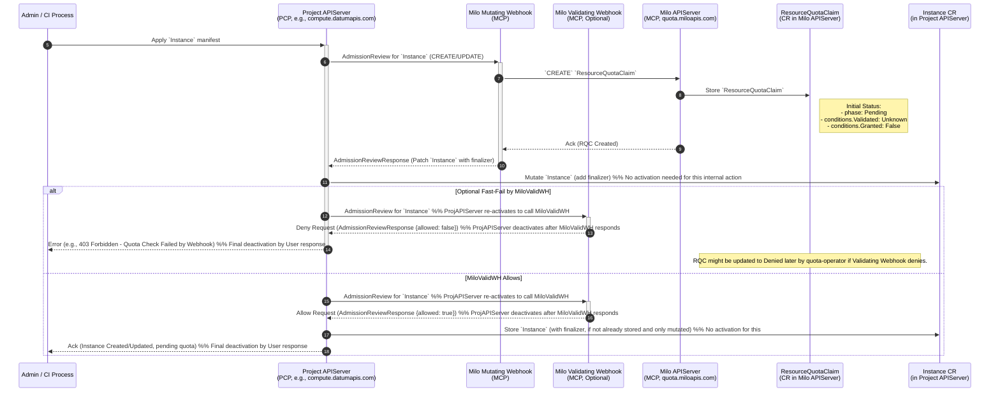

```mermaid
%% Sequence Diagram - Instance Provisioning & Admission Control
sequenceDiagram
    autonumber 5
    participant User as Admin / CI Process
    participant ProjAPIServer as Project APIServer <br> (PCP, e.g., compute.datumapis.com)
    participant MiloMutateWH as Milo Mutating Webhook <br> (MCP)
    participant MiloValidWH as Milo Validating Webhook <br> (MCP, Optional)
    participant MiloAPIServer as Milo APIServer <br> (MCP, quota.miloapis.com)
    participant RQC as ResourceQuotaClaim <br> (CR in Milo APIServer)
    participant InstanceCR as Instance CR <br> (in Project APIServer)

    User->>+ProjAPIServer: Apply `Instance` manifest
    
    ProjAPIServer->>+MiloMutateWH: AdmissionReview for `Instance` (CREATE/UPDATE)
    MiloMutateWH->>MiloAPIServer: `CREATE` `ResourceQuotaClaim`
    MiloAPIServer->>RQC: Store `ResourceQuotaClaim`
    note right of RQC: Initial Status: <br> - phase: Pending <br> - conditions.Validated: Unknown <br> - conditions.Granted: False
    MiloAPIServer-->>MiloMutateWH: Ack (RQC Created)
    MiloMutateWH-->>-ProjAPIServer: AdmissionReviewResponse (Patch `Instance` with finalizer) 
    %% ProjAPIServer is now briefly inactive after MiloMutateWH responds
    
    ProjAPIServer->>InstanceCR: Mutate `Instance` (add finalizer) %% No activation needed for this internal action
    
    alt Optional Fast-Fail by MiloValidWH
        ProjAPIServer->>+MiloValidWH: AdmissionReview for `Instance` %% ProjAPIServer re-activates to call MiloValidWH
        MiloValidWH-->>-ProjAPIServer: Deny Request (AdmissionReviewResponse {allowed: false}) %% ProjAPIServer deactivates after MiloValidWH responds
        ProjAPIServer-->>-User: Error (e.g., 403 Forbidden - Quota Check Failed by Webhook) %% Final deactivation by User response
        note over RQC: RQC might be updated to Denied later by quota-operator if Validating Webhook denies.
    else MiloValidWH Allows
        ProjAPIServer->>+MiloValidWH: AdmissionReview for `Instance` %% ProjAPIServer re-activates to call MiloValidWH
        MiloValidWH-->>-ProjAPIServer: Allow Request (AdmissionReviewResponse {allowed: true}) %% ProjAPIServer deactivates after MiloValidWH responds
        ProjAPIServer->>InstanceCR: Store `Instance` (with finalizer, if not already stored and only mutated) %% No activation for this
        ProjAPIServer-->>User: Ack (Instance Created/Updated, pending quota) %% Final deactivation by User response
    end
```