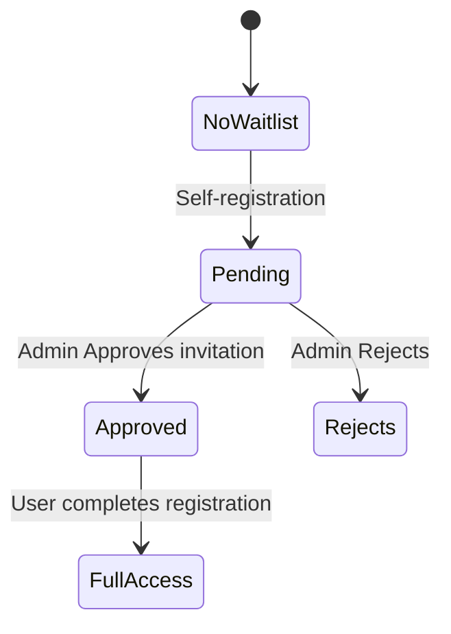
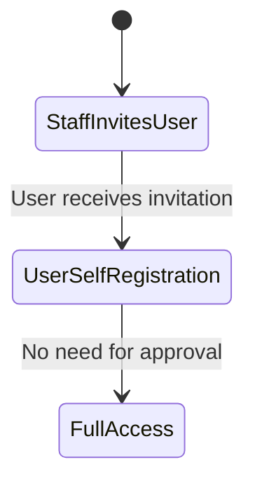

# Waitlist + Approval Gate
<!-- markdownlint-disable MD033 -->

This document describes the **end-to-end user journeys** for a platform that requires a *waitlist & administrator approval* before users can access the product.

---

## Table of Contents

1. [Summary](#summary)
2. [Conceptual Model](#conceptual-model)
3. [User Journeys](#user-journeys)
   - [Self-Signup](#1-self-signup)
   - [Invitation](#2-invitation)

---

## Summary

People can always register and create their account. However, they cannot perform any platform actions until the account’s `activation` status becomes **Active**. Self-signups start in *Pending* and require an administrator approval, whereas invite-based sign-ups are activated automatically.

## Conceptual Model

### Self Registration



### User Invitation



**State Axes** (orthogonal):

1. **Waitlist State** – `Pending / Approved / Rejected`
2. **Account Access** – `Pending / Approved/ Rejected`

---

## API Changes

| Resource | Scope | Purpose |
| -------- | ----- | ------- |
| **User** *(iam.miloapis.com/v1alpha1)* | Cluster | Adds `status.activation` to track `Pending` → `Approved/Rejected` progression. |
| **UserWaitlistEntry** *(iam.miloapis.com/v1alpha1)* | Cluster | Records self-signup requests awaiting review. Captures administrator decision (`Pending`, `Approved`, `Rejected`). |
| **UserApproval** *(iam.miloapis.com/v1alpha1)* | Cluster | Records administrator approval action, transitioning a pending account to active. |
| **UserDenial** *(iam.miloapis.com/v1alpha1)* | Cluster | Records administrator denial decision and reason, marking the account as inactive. |
| **PlatformInvitation** *(iam.miloapis.com/v1alpha1)* | Cluster | Represents an invitation issued by staff; allows invited users to bypass the waitlist and become active upon registration. |

### `User` additions

```yaml
status:
  activation: Pending | Approved | Rejected   # defaults to Pending
```

### `UserWaitlistEntry` fields

```yaml
apiVersion: iam.miloapis.com/v1alpha1
kind: UserWaitlistEntry
metadata:
  name: alice@example-com
spec:
 userRef:
   name: "154353338193813"
status:
  User:
    email: alice@example.com
    givenName: Alice
    familyName: Example 
    activation: Approved
```

### `UserApproval` fields

```yaml
apiVersion: iam.miloapis.com/v1alpha1
kind: UserApproval
metadata:
  name: alice@example-com
spec:
  subjectRef:
   email: alice@example.com # used for Email Invited Users
   userRef:
    name: "154353338193813"
```

### `UserDenial` fields

```yaml
apiVersion: iam.miloapis.com/v1alpha1
kind: UserDenial
metadata:
  name: alice@example-com
spec:
  userRef:
   name: "154353338193813"
  reason: "The reason..." 
```

### `PlatformInvitation` fields

```yaml
apiVersion: iam.miloapis.com/v1alpha1
kind: PlatformInvitation
metadata:
  name: alice@example-com
spec:
 email: alice@example.com 
 invitedBy:
  userRef:
   name: "343243431"
 givenName: Alice
 familyName: Acme
 scheduleAt:  "2025-11-19T14:30:00+02:00"

```

Controllers will reconcile these resources as follows:

- Creating `User` (self-signup)

  - sets user `Activation: Pending`; denies full access.
  - creates `Waitlist{Pending}` if self registered.
  - sends account into pending state email if self registered.

- `UserApproval Creation`:
  
  - sets user `Activation: Active`; permits full access.
  - sends approved account email
  - sets `WaitList{Approved}`

- `UserDenial Creation`

  - sets user `Activation: Inactive`; denies full access.
  - sends rejected account email
  - sets `WaitList{Rejected}`

- `PlatformInvitation Creation`

  - creates a `UserApproval` using an email subject
  - sends invitation email

---

## Admission Enforcement (`ValidatingAdmissionPolicy`)

Users can always create an account, but **all platform actions are blocked until the account’s `activation` status is `Active`**. This rule is enforced at the Kubernetes admission layer using a cluster-scoped `ValidatingAdmissionPolicy` and its binding.

### Policy

```yaml
apiVersion: admissionregistration.k8s.io/v1
kind: ValidatingAdmissionPolicy
metadata:
  name: deny-inactive-users
spec:
  failurePolicy: Fail
  matchConstraints:
    resourceRules:
    - apiGroups: ["*"]
      apiVersions: ["*"]
      operations: ["*"]
      resources: ["*"]
  validations:
  - expression: "request.userInfo.extra['iam.miloapis.com/userState'][0] != 'Inactive' || ((request.resource.group == 'iam.miloapis.com') && (request.resource.resource == 'users') && (request.operation == 'GET'))"
    message: "User account is inactive and cannot perform this operation."
```

### Binding

```yaml
apiVersion: admissionregistration.k8s.io/v1
kind: ValidatingAdmissionPolicyBinding
metadata:
  name: user-must-be-active-binding
spec:
  policyName: deny-inactive-users
  validationActions:
  - Deny
```

Invitation-driven sign-ups skip the waitlist: the controller sets `activation=Active` **before** the user attempts their first API call, so the above policy allows them through.

---

## User Journeys

### 1. Self-Signup

The front-end can access the user’s status, so it knows which screen to redirect the user to.

| Scenario | Flow |
| -------- | ---- |
| **Not on waitlist** | 1️⃣ User submits registration <br> 2️⃣ Record `UserWaitlistEntry(Pending)` <br> 3️⃣ Show *“Thanks – we’ll be in touch”* screen <br> 4️⃣ Send confirmation email |
| **Waitlisted, Pending** | 1️⃣ User logging <br> 2️⃣ Detect existing `Pending` entry <br> 3️⃣ Show same *pending* screen (idempotent) |
| **Waitlisted, Approved** | 1️⃣ User hits login <br> 2️⃣ System sees `Approved` <br> 3️⃣ Allows full access<br> |
| **Waitlisted, Rejected** | 1️⃣ User hits login <br> 2️⃣ System sees `Rejected` <br> 3️⃣ Show *“We're sorry...”* screen <br> |

### 2. Invitation

| Scenario | Flow |
| -------- | ---- |
| **Invitation Sent** | 1️⃣ User submits registration <br> 2️⃣ System sees `Approved` <br> 3️⃣ Allows full access<br> |

---
