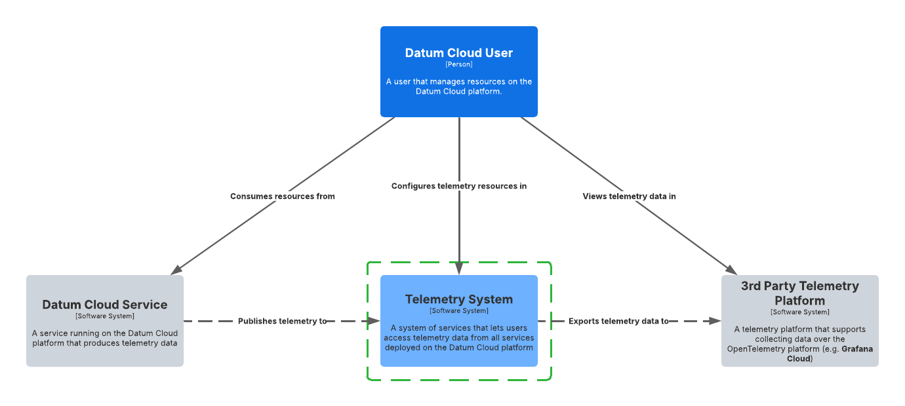

# Telemetry System

The telemetry system is responsible for defining, collecting, processing, and
exporting telemetry data (metrics, logs, and traces) from all services on the
Datum Cloud platform. This document provides a high-level overview of the system
and the functionality that's available.

## Overview

The telemetry system is used by all services on Datum Cloud to define the
telemetry data they make available to consumers. The telemetry system is
responsible for collecting the telemetry data and exporting it to third-party
telemetry data platforms that support ingesting data over the OpenTelemetry
protocol.

> [!NOTE]
>
> In the future Datum Cloud plans to offer a hosted telemetry dashboard (e.g.
> Grafana) that allows users to view and analyze telemetry data exposed by Datum
> Cloud services. Datum Cloud will provide pre-built Grafana dashboards for all
> services as well as allow users to built their own dashboards.

## Capabilities

### Exporting Telemetry

Telemetry exporters can be configured to select telemetry data exposed by
services on Datum Cloud and export to the platform of your choosing. We support
exporting to any telemetry platform that supports ingesting data over the
OpenTelemetry protocol.

Review the [telemetry exporter enhancement](./exporters/) for more details on
the design of our telemetry exporter functionality.
