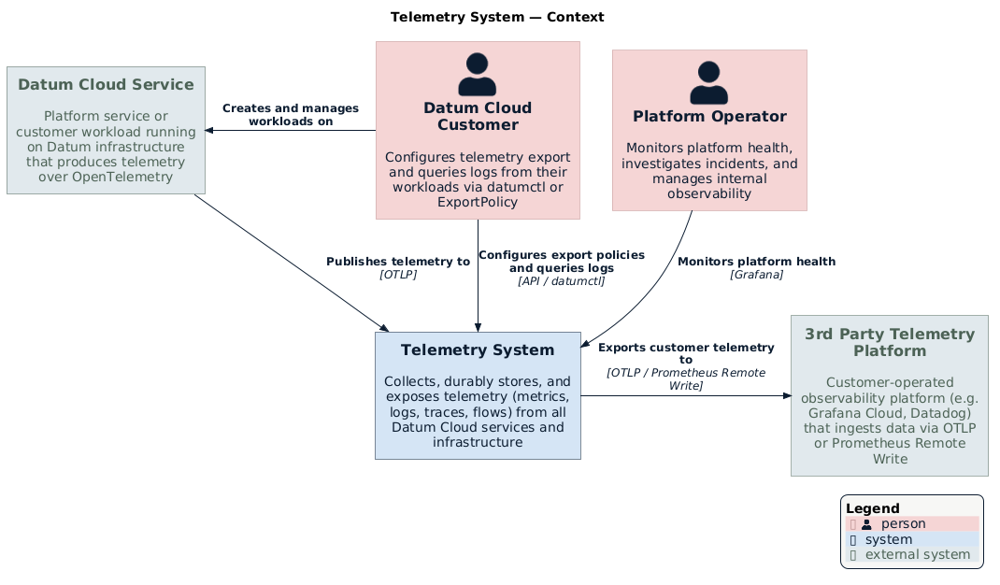

# Telemetry System

The telemetry system collects, processes, stores, and exposes telemetry data
(metrics, logs, traces, and flows) from all services and infrastructure on the
Datum Cloud platform. It serves both internal operational visibility and
tenant-scoped visibility for customers running workloads on Datum infrastructure.

Tracking issue: [datum-cloud/enhancements#765](https://github.com/datum-cloud/enhancements/issues/765)

## Guiding Principles

- OpenTelemetry by default
- Minimize database engines
- Avoid storing the same data more than once
- Avoid running in public clouds; avoid managed services when in public clouds
- Multi-tenancy first class support
- Data residency first class support
- Avoid propagating hierarchical information outside of the core control plane
  to prevent information from getting out of sync or inaccurately attributing telemetry

## Status at a Glance (as of June 2026)

| Component | Enhancement | Status | Phase |
|---|---|---|---|
| Telemetry export (ExportPolicy) | [export-policies](./export-policies/) | **Shipped — v0.3.0** | — |
| NATS ingest pipeline | [ingest-pipeline](./ingest-pipeline/) | **POC complete** | 1, 2 |
| Log pipeline | [logs](./logs/) | Designing | 1 |
| Query layer | [query-layer](./query-layer/) | Designed | 1 |
| OTLP-NATS bridge | [ingest-pipeline](./ingest-pipeline/) | Not started | 1 |
| Metrics pipeline | [metrics](./metrics/) | Designing | 2 |
| Retention and rollup | [retention](./retention/) | Designed | 2 |
| Network telemetry (gNMIc / SNMP / flows) | [network-telemetry](./network-telemetry/) | Not started | 3 |
| Observability backend migration | [observability-migration](./observability-migration/) | Not started | 4 |
| Log and metric definition/policy CRDs | [definition-policy](./definition-policy/) | Designed | 5 |
| Platform alerts and runbooks | [operations](./operations/) | Ongoing | — |

## Roadmap

### Phase 1: Compute and Envoy Logs (target: July 15, 2026)

Logging required for the Compute private alpha deliverable (#682) and supporting
existing Envoy logs. Builds on the validated POC in
`datum-cloud/infra/feat/telemetry-system`. Production code lives in
`milo-os/telemetry`; `datum-cloud/infra` holds image references for deployment.
The NATS → ClickHouse write path and per-tenant subject routing are validated;
what remains is building and deploying the full pipeline and read path. Expose
structured, tenant-scoped log access to customers via `datumctl logs`.

**Deliverables and sub-issues:**

1. **`telemetry` ClickHouse database — deployment and schema**
   Deploy the `telemetry` ClickHouse database and log schema (`logs_ingest`,
   `logs_mv`, `logs`). This is a new ClickHouse instance in `milo-os/telemetry`;
   the `edge-logs-system` ClickHouse is deprecated and decommissioned in Phase 4. Schema
   ordered by `(ProjectId, ServiceName, ObservedTimestamp)`. NATS engine ingest
   via the existing hub pipeline. Includes log TTL configuration (7-day
   retention for tenant data, deleted at day 7 with no cold move; 90-day for
   `datum-internal` with cold move to GCS at day 7). See [logs](./logs/) and
   [retention](./retention/#log-retention).

2. **NATS ingest pipeline — staging and production deployment**
   Promote the hub and edge Kustomize overlays from `dev` to `staging` and
   `production`. Wire ExternalSecrets for credentials, configure cert-manager
   for mTLS on the leaf-to-hub connection, and set up GCS cold storage. See
   [ingest-pipeline](./ingest-pipeline/) for what remains.

3. **NATS mTLS — cert-manager integration for leaf-to-hub connections**
   Complete mTLS on all leaf-to-hub NATS connections using cert-manager-issued
   certificates. Required before accepting data from untrusted edge environments.

4. **Query layer service — initial implementation (single region, logs)**
   Deploy the query layer as a Go HTTP service against the production ClickHouse.
   MVP scope: single-region, tenant-scoped log queries resolved via OIDC bearer
   token, streaming chunked responses for `--tail` mode. See
   [query-layer](./query-layer/).

5. **`datumctl logs` — initial implementation**
   Implement `datumctl logs [--tail] [--since] [filters]` against the query
   layer. kubectl-style streaming output with timestamps, service names, and
   severity. See [logs](./logs/).

6. **OTLP-NATS bridge — implementation and deployment**
   Implement and deploy the bridge service that receives OTLP/HTTP from the OTel
   Collector, extracts `datum.project.id` from resource attributes (returning a partial
   success response and dropping records where it is absent), and publishes one
   JSON message per log record to
   `telemetry.logs.<project_id>` on the NATS leaf. See
   [ingest-pipeline](./ingest-pipeline/#the-otlp-nats-bridge).

7. **Compute operations Grafana dashboards**
   Dashboards for the operations team: per-tenant log volume, error rates,
   ingest pipeline throughput (NATS lag, ClickHouse insert latency), storage
   utilization.

---

### Phase 2: Compute Metrics (target: July 31, 2026)

Metrics required for the Compute private alpha deliverable (#682). Extends the
NATS ingest pipeline to metrics and exposes tenant-scoped metric access via
`datumctl metrics` with ASCII chart visualizations, bridging the gap until a
dedicated UI is available.

**Deliverables and sub-issues:**

8. **Metrics ingest pipeline — NATS + ClickHouse schema**
   Extend the NATS hub stream to include `telemetry.metrics.<project_id>`
   subjects alongside existing log subjects. Add a metrics ingest table and
   materialized view in ClickHouse, parallel to the logs schema. See
   [metrics](./metrics/).

9. **Compute observability**
   Design and implement customer-facing observability for compute workloads:
   CPU, memory, and network metrics scoped per tenant workload.

10. **Retention rollup — three-tier AggregatingMergeTree**
    Implement the three-tier rollup (raw → hourly → daily with TTL) designed in
    [retention](./retention/).

11. **`datumctl metrics` — initial implementation**
    Extend the query layer to serve metric queries and implement
    `datumctl metrics [--since] [--service] [filters]` against it. Renders
    tenant-scoped metric data as ASCII charts (sparklines, bar charts) in the
    terminal. Provides a lightweight read path for the Compute private alpha
    before a UI is available.

---

### Phase 3: Network Telemetry (target: August–September 2026)

Required for the physical infrastructure deliverable. Datum will operate
physical network hardware that needs telemetry beyond what OTel and Kubernetes
collectors provide. All network telemetry feeds into the NATS ingest pipeline
for durability.

**Deliverables and sub-issues:**

12. **gNMIc streaming telemetry — deployment and NATS integration**
    Deploy [gNMIc](https://github.com/openconfig/gnmic) to collect streaming
    telemetry from OpenConfig-capable network devices. Publish to the NATS ingest
    pipeline under `telemetry.network.<device_id>` subjects. See
    [network-telemetry](./network-telemetry/).

13. **SNMP collection — deployment and NATS integration**
    For devices without gNMI support, use the OTel Collector `snmpreceiver`
    (contrib) to poll SNMP devices directly. Metrics are published to
    `telemetry.metrics.datum-internal` on the NATS leaf (SNMP produces OTLP
    metric data points, not gNMIc event format) and land in `otel_metrics_*`
    tables, queryable by `datum.device.id` resource attribute. See
    [network-telemetry](./network-telemetry/).

14. **Akvorado flow data — deployment and ClickHouse schema**
    Deploy [Akvorado](https://github.com/akvorado/akvorado) to collect
    NetFlow/IPFIX/sFlow from network hardware. Define the ClickHouse schema for
    flow records. See [network-telemetry](./network-telemetry/).

---

### Phase 4: Observability Backend Migration (target: Q4 2026)

Consolidate operational logs and metrics into the unified NATS + ClickHouse
pipeline. Decommission Loki and VictoriaMetrics. See
[observability-migration](./observability-migration/).

**Deliverables and sub-issues:**

15. **Observability backend migration — Loki and VictoriaMetrics → ClickHouse**
    Migrate each signal independently through dual-emit → ClickHouse primary →
    decommission. Update internal Grafana dashboards to query ClickHouse. Migrate
    ExportPolicy metric export from MetricsQL pull to NATS consumer push.

---

### Phase 5: Policy-Driven Logs and Metrics (target: Q1 2027)

Introduce a stable, declarative contract for metric definition and production
that separates *what* metrics are from *how* they are produced. Enables
consistent metrics across all platform resources and a forward path for
alerting and metering.

**Deliverables and sub-issues:**

16. **Log CRDs — LogDefinition, LogCollectionPolicy, LogRedactionPolicy**
    Implement the API types for log declaration (what log types a resource
    publishes), collection opt-in, and attribute-level redaction rules. See
    [definition-policy](./definition-policy/).

17. **Log collection controller — LogCollectionPolicy reconciler**
    Implement the controller that reconciles `LogCollectionPolicy` resources
    against `LogDefinition` types and configures OTel Collector routing for
    opted-in log categories. See [definition-policy](./definition-policy/).

18. **LogSource support in ExportPolicy**
    Extend `ExportPolicy` to accept log sources alongside metric sources,
    enabling customers to export their logs to third-party platforms (Datadog,
    Grafana Cloud, etc.) over OTLP or a future log-specific sink. See
    [export-policies](./export-policies/).

19. **MetricDefinition/MetricPolicy CRDs — implementation**
    Implement the API types designed in [definition-policy](./definition-policy/).
    `MetricDefinition` declares metric identity (name, instrument, unit, label
    schema). `MetricPolicy` binds to a definition and declares production rules
    from control-plane resource fields or data-plane telemetry.

20. **Policy translation controller — NATS + ClickHouse backend configs**
    A controller that watches MetricDefinition/MetricPolicy resources and
    produces backend-specific configs targeting the NATS + ClickHouse pipeline.
    VictoriaMetrics is decommissioned in Phase 4; by Phase 5 it is no longer a
    target. Exact output format is TBD. See [definition-policy](./definition-policy/).

---

### Phase 6: North Star (target: H2 2027)

Advanced features and data residency as a first-class property.

**Deliverables and sub-issues:**

21. **Multi-region query fanout**
    Extend the query layer to fan out to per-region ClickHouse instances without
    replicating data across regions. Implement the region registry and k-way
    result merge. See [query-layer](./query-layer/#multi-region-fanout).

22. **Customer-facing traces — tenancy model and query API**
    IAM-gated trace access via Tempo (already deployed). The OTel tail-sampling
    pipeline and Tempo backend are live; what's missing is a tenancy model,
    query API, and customer-facing surface.

---

## Component Enhancements

| Enhancement | Description |
|---|---|
| [logs](./logs/) | Log pipeline — ingest, ClickHouse storage, and `datumctl logs` |
| [metrics](./metrics/) | Metrics pipeline — VictoriaMetrics (current) and NATS + ClickHouse (future) |
| [query-layer](./query-layer/) | Tenant-enforcing HTTP query service over ClickHouse for logs and metrics |
| [definition-policy](./definition-policy/) | LogDefinition, LogCollectionPolicy, MetricDefinition, MetricPolicy CRDs |
| [export-policies](./export-policies/) | ExportPolicy — customer-configured OTLP/Prometheus export |
| [retention](./retention/) | Log TTL and metrics three-tier rollup — raw → hourly → daily |
| [ingest-pipeline](./ingest-pipeline/) | NATS JetStream ingest with per-edge store-and-forward durability |
| [network-telemetry](./network-telemetry/) | gNMIc, SNMP, and flow data for network hardware |
| [observability-migration](./observability-migration/) | Migration from Loki and VictoriaMetrics to ClickHouse |
| [operations](./operations/) | Platform alerts and runbooks for the telemetry pipeline |

## System Context

