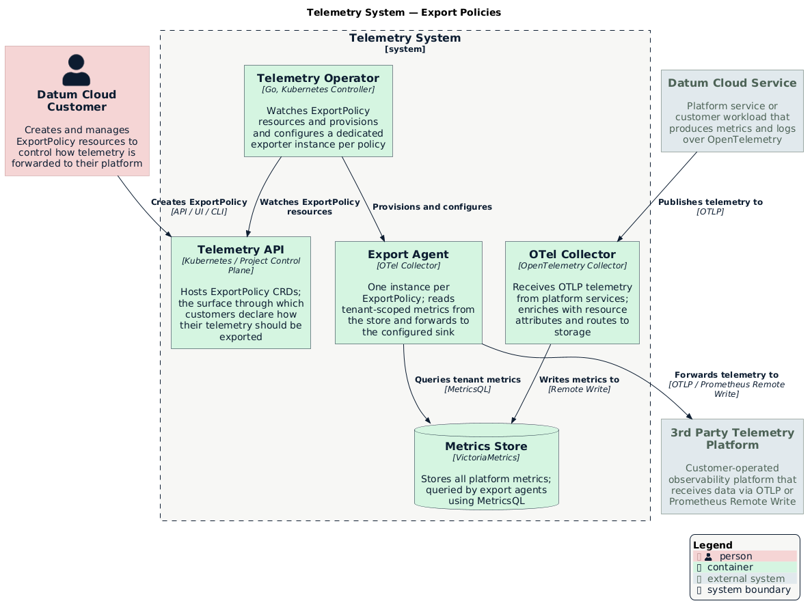

# Telemetry Export Policies

- [Summary](#summary)
- [Motivation](#motivation)
  - [Goals](#goals)
  - [Non-Goals](#non-goals)
- [Proposal](#proposal)
  - [Telemetry Data](#telemetry-data)
  - [Supported Sink Protocols](#supported-sink-protocols)
  - [Delivery Guarantees](#delivery-guarantees)
- [Design Details](#design-details)
  - [Configuring Sources](#configuring-sources)
    - [MVP Metric Source Configuration](#mvp-metric-source-configuration)
    - [Target Metric Source Configuration](#target-metric-source-configuration)
    - [Log Source Configuration](#log-source-configuration)
  - [Configuring Sinks](#configuring-sinks)
    - [Prometheus Remote Write](#prometheus-remote-write)
    - [OpenTelemetry](#opentelemetry)
- [Alternatives](#alternatives)
- [Implementation History](#implementation-history)

## Summary

Users will be able to create Export Policies on Datum Cloud to configure how
telemetry from resources they create in Datum Cloud (Gateways, Workloads,
Networks, etc) are exported to third-party telemetry platforms allowing users to
continue using their existing telemetry stack.

Export policies can be used to send to any telemetry platform that supports
receiving data through through one of our supported sink protocols. The
telemetry system will provide at-least once delivery guarantees over all
telemetry data that is received from Datum Cloud resources.

[Grafana Cloud]: https://grafana.com/products/cloud/
[Datadog]: https://www.datadoghq.com

## Motivation

Datum Cloud users want visibility into the resources they create on Datum Cloud
so they can understand the health of their infrastructure. For example, users
that configure L7 Gateways in our networking services will want metrics around
the HTTP traffic our gateways are processing. Users will also want CPU / Memory
metrics for any instances that are created for the compute service.

Some users may have an existing telemetry stack they want to use to explore and
analyze the telemetry data available from Datum Cloud. By introducing
configurable export policies, we empower consumers to control how telemetry data
is exported to their existing telemetry platform.

### Goals

- Provide a mechanism for consumers to configure how telemetry for resources
  they've created is exported to their existing telemetry system
- Support standard protocols for shipping telemetry data (e.g. [Prometheus
  Remote Write][remote-write], [OpenTelemetry][OTLP]) that's in use across the
  industry and supported by major telemetry platforms (e.g. [Grafana Cloud],
  [Datadog]).
- Enable fine-grained control over what telemetry data is exported.
- Provide a self-service experience via API and UI for easy configuration.

[OTLP]: https://opentelemetry.io/docs/specs/otel/protocol/
[remote-write]: https://prometheus.io/docs/specs/prw/remote_write_spec/

### Non-Goals

- Mandating a specific third-party provider.
- Managing consumer-side ingestion costs or quotas.

## Proposal

Users will be able to configure one or more **ExportPolicy** within Datum Cloud
projects to control how telemetry data published by resources in their projects
are exported to third-party telemetry systems.

> [!NOTE]
>
> **Org/hierarchy on the export path.** The platform stores telemetry against
> only its origin project; org and folder relationships are resolved at read
> time and are absent from stored records. ExportPolicy is where hierarchy
> re-enters: an org-scoped export policy can route logs from all descendant
> projects to a single sink, using the hierarchy to make the routing decision.
> The records themselves are not annotated with org metadata — hierarchy governs
> which ExportPolicy applies, not what gets written into the exported record.
> This mirrors Google Cloud Logging's [aggregated sinks][agg-sinks] model.

[agg-sinks]: https://docs.cloud.google.com/logging/docs/export/aggregated_sinks_overview

ExportPolicies will support configuring a single sink to control how telemetry
data is exported. Users will be able to choose from
[multiple sink protocols](#supported-sink-protocols) to choose the one that
works best for their platform or use-case.

An export policy will allow users to exporting data to any [OpenTelemetry
protocol (OTLP)][OTLP] compatible endpoint.

> [!NOTE]
>
> In the future, we will plan to support organization-level export policies to
> make it easier to export telemetry across multiple projects.



Export policies will also allow users to leverage telemetry filters to provide
fine-grained control over which telemetry data is exported so they only export
telemetry data they care about.

### Telemetry Data

- **Metrics** - Resources will publish metrics that can be used by consumers to
  understand the health and performance of the resource. E.g. Our L7 Gateway
  will publish HTTP traffic stats to provide visibility about traffic being
  processed at all of our edge locations.
- **Logs** - Resources will publish log and event data to provide users with
  visibility on behavior and actions taken against the resource. E.g. Audit logs
  will be produced for all resources to capture what change was made, who
  changed it, and when it was changed.
- **Traces** - In the future, users will be able to enable tracing functionality
  to be able to visualize traffic flows through our network.

The [Design Details](#design-details) section goes into more detail on how the
user may be expected to configure an export policy to publish various types of
telemetry and filter it to their needs.

### Supported Sink Protocols

Below are a list of the protocols we plan to support for exporting telemetry
data through export policies. Additional sink protocols may be added in the
future. If there's a sink protocol you would like to see supported, please open
a new enhancement issue.

- **[OpenTelemetry][OTLP]**
- **[Prometheus Remote Write][remote-write]**

### Delivery Guarantees

An export policy will provide at-least once delivery guarantee over telemetry
data that's received from resources. Users can configure retry and backoff
policies to control how telemetry data is handled when configured sinks aren't
accepting telemetry data.

> [!IMPORTANT]
>
> We will have limits in place to control how long we will store telemetry data
> that’s failing to export to configured sink endpoints. After those limits are
> reached, we will no longer be able to guarantee at-least once delivery.

## Design Details

Users will be able to manage one or more **ExportPolicy** resources in Datum
Cloud Projects to configure how they would like telemetry from resources they
create to be exported to a third-party telemetry platform.

Export Policies are constructed of multiple sources to select telemetry data
that should be exported and multiple sink configurations to control where
telemetry data is sent.

### Configuring Sources

Users can configure multiple telemetry sources so they can include metrics,
logs, and traces from multiple resources to export. Telemetry sources will
support filtering by namespace, resource labels, and resource kinds so users
only export telemetry they care about.

#### MVP Metric Source Configuration

To start, export policies will only support exporting **Metric** data from
resources created on Datum Cloud. Users will be able to leverage a [metricsql]
query to filter which metrics they'd like to receive. An empty query means all
metrics will be exported.

> [!WARNING]
>
> **MetricsQL coupling:** The `metricsql` source field ties the ExportPolicy
> API to a VictoriaMetrics-specific query language. If the metrics backend changes
> (e.g. to Prometheus or Thanos), this field would require a breaking API change.
> The backend-agnostic `resourceSelectors` approach is the intended long-term
> direction but is not yet implemented.

[metricsql]: https://docs.victoriametrics.com/metricsql/

```yaml
apiVersion: telemetry.datumapis.com/v1alpha1
kind: ExportPolicy
metadata:
  name: gateway-export-policy  # Unique name for the export policy
spec:
  # Defines the telemetry sources that should be exported. An export policy can
  # define multiple telemetry sources. Telemetry data will **not** be de-duped
  # if its selected from multiple sources.
  sources:
    - name: "gateway-metrics"  # Descriptive name for the source
      # Source metrics from the Datum Cloud platform
      metrics:
        # The options in this section are expected to be mutually exclusive. Users
        # can either leverage metricsql or resource selectors.
        #
        # This option allows user to supply a metricsql query if they're already
        # familiar with using metricsql queries to select metric data from
        # Victoria Metrics.
        metricsql: |
          {service_name="networking.datumapis.com", resource_kind="Gateway", __name__=~"network_bytes_.*"}
```

#### Target Metric Source Configuration

The export policy below is meant to highlight the configuration options we
expect to offer in the future, that provides filtering options for those less
comfortable with [metricsql].

> [!NOTE]
>
> This configuration only specifies how to source Metric data right now. We will
> also expand this to add Log and Trace configuration examples in the future.

```yaml
apiVersion: telemetry.datumapis.com/v1alpha1
kind: ExportPolicy
metadata:
  name: example-export-policy  # Unique name for the export policy
spec:
  # Defines the telemetry sources that should be exported. An export policy can
  # define multiple telemetry sources. Telemetry data will **not** be de-duped
  # if its selected from multiple sources.
  sources:
    - name: "application-metrics"  # Descriptive name for the source
      # Source metrics from the Datum Cloud platform
      metrics:
        # The options in this section are expected to be mutually exclusive. Users
        # can either leverage metricsql or resource selectors.
        #
        # This option allows user to supply a metricsql query if they're already
        # familiar with using metricsql queries to select metric data from
        # Victoria Metrics.
        metricsql: |
          {service_name=“networking.datumapis.com”, resource_kind="Gateway", __name__=~”network_bytes_.*”}

        # This gives the user a way of selecting resources using namespace
        # selectors, group/kind info, and label selectors. This is a more k8s
        # experience to selecting metric data.
        resourceSelectors:
          # By default, a resource selector will only select resources from the
          # same namespace the export policy is created in. This can be
          # overridden so users can create a project wide collector if they wish
          # to.
          - namespaceSelector:
              # Only match resources in namespaces used for the production
              # environment.
              matchLabels:
                environment: production
            # Filter which metrics should be selected based on label values that
            # may be on the resource the metrics were sourced from.
            labelSelectors:
              matchLabels:
                app: "my-gateway"
            kinds:
              - apiGroups: ["gateway.networking.k8s.io"]
                resources: ["gateways"]
              - apiGroups: ["compute.datumapis.com"]
                kind: ["workloads"]
              - apiGroups: ["networking.datumapis.com"]
                kind: ["*"]
```

#### Log Source Configuration

> [!NOTE]
>
> Log sources require the log collection CRDs (LogDefinition, LogCollectionPolicy)
> described in [definition-policy](../definition-policy/) and the ingest pipeline
> described in [logs](../logs/). Log source support in ExportPolicy is planned for
> Phase 1 sub-issue 4.

Customers can export log data by declaring a `logs` source. Log sources select
by resource kind and log category, using the same `resourceSelectors` model as
the metric source target configuration.

```yaml
apiVersion: telemetry.datumapis.com/v1alpha1
kind: ExportPolicy
metadata:
  name: gateway-logs-export
spec:
  sources:
    - name: gateway-access-logs
      logs:
        resourceSelectors:
          - group: networking.datumapis.com
            kind: HTTPProxy
        # allLogs selects all log types declared by matching LogDefinitions.
        # Individual log names can also be listed explicitly.
        categories:
          - allLogs
  sinks:
    - name: my-loki
      sources:
        - gateway-access-logs
      target:
        openTelemetry:
          http:
            endpoint: "https://logs.example.com/otlp"
          authentication:
            bearer:
              secretRef:
                name: loki-credentials
```

Log export respects `LogRedactionPolicy` rules — attributes marked `drop` or
`hash` in a redaction policy are transformed before the record leaves the
platform, including before it reaches the export agent.

### Configuring Sinks

Users can configure multiple sinks to control how telemetry data is exported to
their telemetry systems. Some sink protocols may only support one type of
telemetry data so multiple sinks can be used to support exporting all telemetry
data to the correct sink.

#### Prometheus Remote Write

Users can also configure a sink to use the [Prometheus Remote Write
protocol][remote-write] to export metric data to their telemetry platform. This
sink supports using Basic and Bearer token authentication.

```yaml
apiVersion: telemetry.datumapis.com/v1alpha1
kind: ExportPolicy
metadata:
  name: example-export-policy
spec:
  sources:
    - name: metrics
      ...

  sinks:
    - name: grafana-cloud
      # Configure which sources should be sent to this sink.
      sources:
      - metrics
      target:
        prometheusRemoteWrite:
          endpoint: https://prometheus-prod-56-prod-us-east-2.grafana.net/api/prom/push
          authentication:
            basic:
              # A reference to a `kubernetes.io/basic-auth` secret type. Must
              # contain `username` and `password` keys.
              secretRef:
                name: "grafana-cloud-credentials"
          batch:
            timeout: 5s           # Batch timeout before sending telemetry
            maxSize: 500          # Maximum number of telemetry entries per batch
          retry:
            maxAttempts: 3        # Maximum retry attempts
            backoffDuration: 2s   # Delay between retry attempts
```

#### OpenTelemetry

This example demonstrates how to configure an export policy to send telemetry
data to an OpenTelemetry compatible endpoint. This sink supports using Basic and
Bearer token authentication.

> [!NOTE]
>
> This example demonstrates how we will support the OpenTelemetry protocol in
> the future.

```yaml
apiVersion: telemetry.datumapis.com/v1alpha1
kind: ExportPolicy
metadata:
  name: example-export-policy
spec:
  sources:
    ...

  sinks:
    - name: grafana-cloud-otel
      target:
        openTelemetry:
          http:
            endpoint: "https://otlp-gateway-prod-eu-west-0.grafana.net/otlp"
          authentication:
            basic:
              # A reference to a `kubernetes.io/basic-auth` secret type. Must
              # contain `username` and `password` keys.
              secretRef:
                name: "grafana-cloud-credentials"
          batch:
            timeout: 5s           # Batch timeout before sending telemetry
            maxSize: 500          # Maximum number of telemetry entries per batch
          retry:
            maxAttempts: 3        # Maximum retry attempts
            backoffDuration: 2s   # Delay between retry attempts
```

## Alternatives

**Push directly from the platform OTel Collector to tenant sinks** — the OTel
Collector gateway already receives all telemetry. It could be configured to fan
out directly to tenant-configured endpoints. Rejected: the gateway Collector sees
all tenants; per-tenant routing without strong isolation is a security risk.
The intended export model is a NATS consumer push, not a Collector push: a
durable consumer per ExportPolicy is scoped to `telemetry.<signal>.<project_id>`
by NATS ACL, so isolation is enforced at the subject layer rather than in
application routing code.

**MetricsQL pull as the permanent export model for metrics** — the current
VictoriaMetrics pipeline uses export agents that query VictoriaMetrics via
MetricsQL and push results to the customer sink. This is the implemented
approach for the v0.3 launch and is reflected in the MVP source configuration
above. It is not the intended long-term model. Once metrics move to the NATS +
ClickHouse pipeline (see [metrics](../metrics/)), the export path becomes the
same NATS consumer push used for logs — a durable consumer on
`telemetry.metrics.<project_id>` streams records directly to the sink. The
MetricsQL dependency is a transitional artifact of the current scrape-based
pipeline, not a design goal.

**Shared export agent per cluster** — a single export agent serving all
ExportPolicies, with internal tenant routing, rather than one agent per policy.
Rejected: a shared agent is a higher blast-radius component. A misconfiguration
in tenant isolation logic could expose cross-tenant data. Dedicated agents limit
the scope of any failure to a single policy.

**Self-managed collection with platform credentials** — provide tenants with
direct credentials to query VictoriaMetrics or ClickHouse and let them run their
own OTel Collectors. Rejected: requires granting tenants database-level access,
which expands the trust boundary significantly. It also provides no self-service
UX, no delivery guarantees, and no Datum control plane visibility into what is
being exported.

## Implementation History

- 2025-03-11 - Define initial enhancement goals, system architecture, and API
  design
- 2025-04-22 - Initial implementation of the Export Policy API ([v0.1.0])
- 2026-06-26 - ExportPolicy v0.3.0 shipped in [milo-os/telemetry]; log source
  configuration and alternatives documented; MetricsQL coupling callout added

[v0.1.0]: https://github.com/milo-os/telemetry/releases/tag/v0.1.0
[milo-os/telemetry]: https://github.com/milo-os/telemetry
