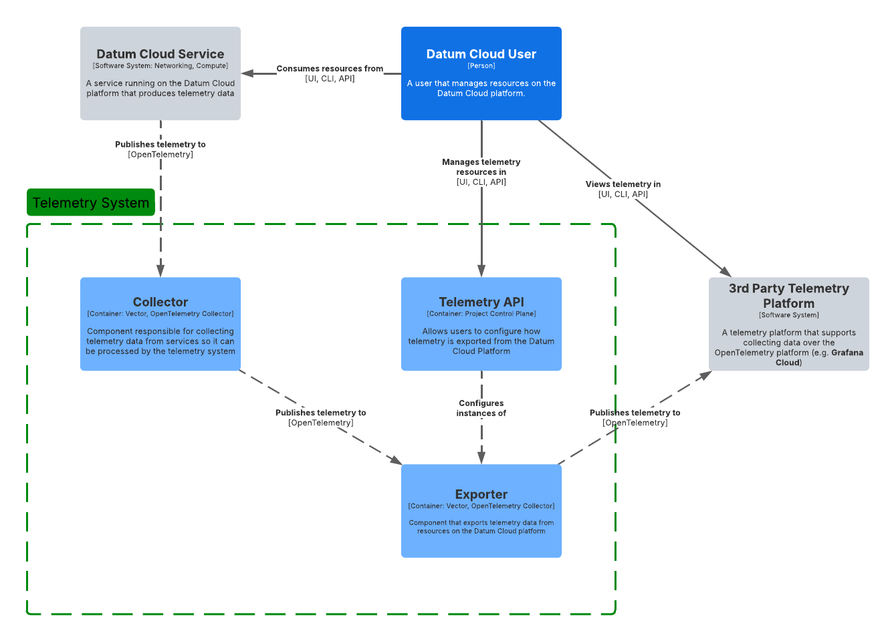

<!--
Inspired by https://github.com/kubernetes/enhancements/tree/master/keps/NNNN-kep-template

Goals are aligned in principle with those described at https://github.com/kubernetes/enhancements/blob/master/keps/sig-architecture/0000-kep-process/README.md

Recommended reading:
  - https://developers.google.com/tech-writing
-->

<!--
**Note:** When your Enhancement is complete, all of these comment blocks should be removed.

To get started with this template:

- [ ] **Make a copy of this template directory.**
  Copy this template into the desired path and name it `short-descriptive-title`.
- [ ] **Fill out this file as best you can.**
  At minimum, you should fill in the "Summary" and "Motivation" sections.
  These should be easy if you've preflighted the idea of the Enhancement with the
  appropriate stakeholders.
- [ ] **Create a PR for this Enhancement.**
  Assign it to stakeholders who are sponsoring this process.
- [ ] **Merge early and iterate.**
  Avoid getting hung up on specific details and instead aim to get the goals of
  the Enhancement clarified and merged quickly. The best way to do this is to just
  start with the high-level sections and fill out details incrementally in
  subsequent PRs.

Just because a Enhancement is merged does not mean it is complete or approved. Any Enhancement
marked as `provisional` is a working document and subject to change. You can
denote sections that are under active debate as follows:

```
<<[UNRESOLVED optional short context or usernames ]>>
Stuff that is being argued.
<<[/UNRESOLVED]>>
```

When editing RFCs, aim for tightly-scoped, single-topic PRs to keep discussions
focused. If you disagree with what is already in a document, open a new PR
with suggested changes.

One Enhancement corresponds to one "feature" or "enhancement" for its whole lifecycle.
You do not need a new Enhancement to move from beta to GA, for example. If
new details emerge that belong in the Enhancement, edit the Enhancement. Once a feature has
become "implemented", major changes should get new RFCs.

The canonical place for the latest set of instructions (and the likely source
of this file) is [here](/docs/rfcs/template/README.md).

**Note:** Any PRs to move a Enhancement to `implementable`, or significant changes once
it is marked `implementable`, must be approved by each of the Enhancement approvers.
If none of those approvers are still appropriate, then changes to that list
should be approved by the remaining approvers and/or the owning SIG (or
SIG Architecture for cross-cutting RFCs).
-->

<!-- omit from toc -->
# Telemetry Exporters

<!--
This is the title of your Enhancement. Keep it short, simple, and descriptive. A good
title can help communicate what the Enhancement is and should be considered as part of
any review.
-->

<!--
A table of contents is helpful for quickly jumping to sections of a Enhancement and for
highlighting any additional information provided beyond the standard Enhancement
template.
-->

- [Summary](#summary)
- [Motivation](#motivation)
  - [Goals](#goals)
  - [Non-Goals](#non-goals)
- [Proposal](#proposal)
  - [Telemetry Data](#telemetry-data)
- [Design Details](#design-details)
  - [MVP Exporter Configuration](#mvp-exporter-configuration)
  - [Target Exporter Configuration](#target-exporter-configuration)
- [Implementation History](#implementation-history)

## Summary

<!--
This section is incredibly important for producing high-quality, user-focused
documentation such as release notes or a development roadmap. It should be
possible to collect this information before implementation begins, in order to
avoid requiring implementors to split their attention between writing release
notes and implementing the feature itself. Enhancement editors should help to ensure
that the tone and content of the `Summary` section is useful for a wide audience.

A good summary is probably at least a paragraph in length.

Both in this section and below, follow the guidelines of the [documentation
style guide]. In particular, wrap lines to a reasonable length, to make it
easier for reviewers to cite specific portions, and to minimize diff churn on
updates.

[documentation style guide]: https://github.com/kubernetes/community/blob/master/contributors/guide/style-guide.md
-->

Users expect to be able to have full visibility into services they utilize on
Datum Cloud, but they may already be using other telemetry systems like [Grafana
Cloud], [Datadog], etc and don't want to introduce another telemetry stack into
their organization's workflow.

Datum Cloud will allow consumers to configure telemetry exporters to export
telemetry created by Datum Cloud services to the telemetry platform of their
choosing. Users will be able to configure which types of telemetry they'd like
to export (Metrics, Logs, Traces) and use resource selectors to filter which
resources should have their telemetry data exported.

[Grafana Cloud]: https://grafana.com/products/cloud/
[Datadog]: https://www.datadoghq.com

## Motivation

<!--
This section is for explicitly listing the motivation, goals, and non-goals of
this Enhancement.  Describe why the change is important and the benefits to users.
-->

Datum Cloud users want visibility into the resources they create on Datum Cloud
so they can understand the health of their infrastructure. For example, users
that configure L7 Gateways in our networking services will want metrics around
the HTTP traffic our gateways are processing.

Some users may have an existing telemetry stack they want to use to explore and
analyze the telemetry data available from Datum Cloud. By introducing
configurable telemetry exporters, we empower consumers to control which
telemetry data they want sent to third-party monitoring services.

### Goals

<!--
List the specific goals of the Enhancement. What is it trying to achieve? How will we
know that this has succeeded?
-->

- Provide a mechanism for consumers to configure telemetry exporters for their
  resources.
- Support OpenTelemetry-compatible endpoints such as [Grafana Cloud], [Datadog],
  and custom [OpenTelemetry protocol][OTLP] receivers.
- Enable fine-grained control over what telemetry data is exported.
- Provide a self-service experience via API or UI for easy configuration.

[OTLP]: https://opentelemetry.io/docs/specs/otel/protocol/

### Non-Goals

<!--
What is out of scope for this Enhancement? Listing non-goals helps to focus discussion
and make progress.
-->

- Mandating a specific third-party provider.
- Managing consumer-side ingestion costs or quotas.

## Proposal

<!--
This is where we get down to the specifics of what the proposal actually is.
This should have enough detail that reviewers can understand exactly what
you're proposing, but should not include things like API designs or
implementation. What is the desired outcome and how do we measure success?.
The "Design Details" section below is for the real
nitty-gritty.
-->

Users will be able to configure one or more telemetry exporters within their
Datum Cloud projects to control how telemetry data from resources in their
project are exported to third-party systems. The telemetry exporter will support
exporting data to any [OpenTelemetry protocol (OTLP)][OTLP] compatible endpoint.



Datum Cloud will use exporter configurations created by users to configure how
telemetry collected from services is exported to consumers. Multiple telemetry
exporters may be configured to route telemetry data from Datum Cloud locations
to the user's third-party telemetry service.

Users will be able to filter the telemetry data that's exported to third-parties
so they don't have to pay for telemetry data they don't care about.

### Telemetry Data

- **Metrics** - Resources will publish metrics that can be used by consumers to
  understand the health and performance of the resource. E.g. Our L7 Gateway
  will publish HTTP traffic stats to provide visibility about traffic being
  processed at all of our edge locations.
- **Logs** - Resources will publish log and event data to provide users with
  visibility on behavior and actions taken against the resource. E.g. Audit logs
  will be produced for all resources to capture what change was made, who
  changed it, and when it was changed.
- **Traces** - In the future, users will be able to enable tracing functionality
  to be able to visualize traffic flows through our network.

The [Design Details](#design-details) section goes into more detail on how the
user may be expected to configure an exporter to publish various types of
telemetry and filter it to their needs.

<!-- ### User Stories (Optional) -->

<!--
Detail the things that people will be able to do if this Enhancement is implemented.
Include as much detail as possible so that people can understand the "how" of
the system. The goal here is to make this feel real for users without getting
bogged down.
-->

<!-- #### Story 1 -->

<!-- #### Story 2 -->

<!-- ### Notes/Constraints/Caveats (Optional) -->

<!--
What are the caveats to the proposal?
What are some important details that didn't come across above?
Go in to as much detail as necessary here.
This might be a good place to talk about core concepts and how they relate.
-->

<!-- ### Risks and Mitigations -->

<!--
What are the risks of this proposal, and how do we mitigate? Think broadly.
For example, consider both security and how this will impact the larger
software ecosystem.

How will security be reviewed, and by whom?

How will UX be reviewed, and by whom?

Consider including folks who also work outside of your immediate team.
-->

## Design Details

<!--
This section should contain enough information that the specifics of your
change are understandable. This may include API specs (though not always
required) or even code snippets. If there's any ambiguity about HOW your
proposal will be implemented, this is the place to discuss them.
-->

Users will be able to manage one or more **Exporter** resources in Datum Cloud
Project to configure how they would like telemetry from resources they create to
be exported to a third-party telemetry platform.

Users can configure multiple telemetry sources so they can include metrics,
logs, and traces from multiple resources to export. Telemetry sources will
support filtering by namespace, resource labels, and resource kinds so users
only export telemetry they care about.

An exporter will support multiple sink configurations allowing an exporter to be
used to send the same telemetry to multiple third-party telemetry platforms. A
sink will support exporting data to an OpenTelemetry protocol compatible
endpoint and will support authentication. Additional sink configurations may be
considered in the future.

### MVP Exporter Configuration

To start, our Exporter resource will only support exporting Metric data from
resources created on Datum Cloud. Users will be able to leverage a [metricsql]
query to filter which metrics they'd like to receive. An empty query means
they'd like all metrics.

[metricsql]: https://docs.victoriametrics.com/metricsql/

```yaml
apiVersion: telemetry.datumapis.com/v1alpha1
kind: Exporter
metadata:
  name: gateway-exporter  # Unique name for the telemetry exporter
spec:
  # Defines the telemetry sources that should be exported. An exporter can
  # define multiple telemetry sources. The exporter will **not** de-duplicate
  # telemetry data that matches multiple sources.
  sources:
    - name: "gateway-metrics"  # Descriptive name for the source
      # Source metrics from the Datum Cloud platform
      metrics:
        # The options in this section are expected to be mutually exclusive. Users
        # can either leverage metricsql or resource selectors.
        #
        # This option allows user to supply a metricsql query if they're already
        # familiar with using metricsql queries to select metric data from
        # Victoria Metrics.
        metricsql: |
          {service_name=“networking.datumapis.com”, resource_kind="Gateway", __name__=~”network_bytes_.*”}

  # Multiple sinks can be configured to export telemetry data to multiple
  # third-party telemetry platforms.
  sinks:
    - name: "grafana-cloud-exporter"  # Unique name for the exporter
      otlp_http:
        endpoint: "https://otlp-gateway-prod-eu-west-0.grafana.net/otlp"
        authentication:
          type: "bearerToken"
          secretRef:
            name: "grafana-api-key"
            key: "token"
      batch:
        enabled: true   # Enables batching for performance optimization
        timeout: 5s     # Batch timeout before sending telemetry
        maxSize: 500    # Maximum number of telemetry entries per batch
      retry:
        enabled: true   # Enables retry logic on failed requests
        maxAttempts: 3  # Maximum retry attempts
        backoff: 2s     # Delay between retry attempts
```

### Target Exporter Configuration

The exporter configuration below is meant to highlight the configuration options
we expect to offer in the future that provides filtering options for those less
comfortable with [metricsql].

> [!NOTE]
>
> This configuration only specifies how to source Metric data right now. We will
> add Log and Trace configuration examples in the future.

```yaml
apiVersion: telemetry.datumapis.com/v1alpha1
kind: Exporter
metadata:
  name: example-exporter  # Unique name for the telemetry exporter
spec:
  # Defines the telemetry sources that should be exported. An exporter can
  # define multiple telemetry sources. The exporter will **not** de-duplicate
  # telemetry data that matches multiple sources.
  sources:
    - name: "application-metrics"  # Descriptive name for the source
      # Source metrics from the Datum Cloud platform
      metrics:
        # The options in this section are expected to be mutually exclusive. Users
        # can either leverage metricsql or resource selectors.
        #
        # This option allows user to supply a metricsql query if they're already
        # familiar with using metricsql queries to select metric data from
        # Victoria Metrics.
        metricsql: |
          {service_name=“networking.datumapis.com”, resource_kind="Gateway", __name__=~”network_bytes_.*”}

        # This gives the user a way of selecting resources using namespace
        # selectors, group/kind info, and label selectors. This is a more k8s
        # experience to selecting metric data.
        resourceSelectors:
          # By default, a resource selector will only select resources from the
          # same namespace the exporter is created in. This can be overridden so
          # users can create a project wide collector if they wish to.
          - namespaceSelector:
              # Only match resources in namespaces used for the production
              # environment.
              matchLabels:
                environment: production
            # Filter which metrics should be selected based on label values that
            # may be on the resource the metrics were sourced from.
            labelSelectors:
              matchLabels:
                app: "my-gateway"
            kinds:
              - apiGroups: ["gateway.networking.k8s.io"]
                resources: ["gateways"]
              - apiGroups: ["compute.datumapis.com"]
                kind: ["workloads"]
              - apiGroups: ["networking.datumapis.com"]
                kind: ["*"]

  # Multiple sinks can be configured to export telemetry data to multiple
  # third-party telemetry platforms.
  sinks:
    - name: "grafana-cloud-exporter"  # Unique name for the exporter
      otlp_http:
        endpoint: "https://otlp-gateway-prod-eu-west-0.grafana.net/otlp"
        authentication:
          type: "bearerToken"
          secretRef:
            name: "grafana-api-key"
            key: "token"
      batch:
        enabled: true   # Enables batching for performance optimization
        timeout: 5s     # Batch timeout before sending telemetry
        maxSize: 500    # Maximum number of telemetry entries per batch
      retry:
        enabled: true   # Enables retry logic on failed requests
        maxAttempts: 3  # Maximum retry attempts
        backoff: 2s     # Delay between retry attempts
```

<!-- ## Production Readiness Review Questionnaire -->

<!--

Production readiness reviews are intended to ensure that features are observable,
scalable and supportable; can be safely operated in production environments, and
can be disabled or rolled back in the event they cause increased failures in
production.

See more in the PRR Enhancement at https://git.k8s.io/enhancements/keps/sig-architecture/1194-prod-readiness.

The production readiness review questionnaire must be completed and approved
for the Enhancement to move to `implementable` status and be included in the release.
-->

<!-- ### Feature Enablement and Rollback -->

<!--
This section must be completed when targeting alpha to a release.
-->

<!-- #### How can this feature be enabled / disabled in a live cluster? -->

<!--
Pick one of these and delete the rest.
-->
<!--
- [ ] Feature gate
  - Feature gate name:
  - Components depending on the feature gate:
- [ ] Other
  - Describe the mechanism:
  - Will enabling / disabling the feature require downtime of the control plane?
  - Will enabling / disabling the feature require downtime or reprovisioning of a node? -->

<!-- #### Does enabling the feature change any default behavior? -->

<!--
Any change of default behavior may be surprising to users or break existing
automations, so be extremely careful here.
-->

<!-- #### Can the feature be disabled once it has been enabled (i.e. can we roll back the enablement)? -->

<!--
Describe the consequences on existing workloads (e.g., if this is a runtime
feature, can it break the existing applications?).

Feature gates are typically disabled by setting the flag to `false` and
restarting the component. No other changes should be necessary to disable the
feature.
-->

<!-- #### What happens if we reenable the feature if it was previously rolled back? -->

<!-- #### Are there any tests for feature enablement/disablement? -->

<!-- ### Rollout, Upgrade and Rollback Planning -->

<!--
This section must be completed when targeting beta to a release.
-->

<!-- #### How can a rollout or rollback fail? Can it impact already running workloads? -->

<!--
Try to be as paranoid as possible - e.g., what if some components will restart
mid-rollout?

Be sure to consider highly-available clusters, where, for example,
feature flags will be enabled on some servers and not others during the
rollout. Similarly, consider large clusters and how enablement/disablement
will rollout across nodes.
-->

<!-- #### What specific metrics should inform a rollback? -->

<!--
What signals should users be paying attention to when the feature is young
that might indicate a serious problem?
-->

<!-- #### Were upgrade and rollback tested? Was the upgrade->downgrade->upgrade path tested? -->

<!--
Describe manual testing that was done and the outcomes.
Longer term, we may want to require automated upgrade/rollback tests, but we
are missing a bunch of machinery and tooling and can't do that now.
-->

<!-- #### Is the rollout accompanied by any deprecations and/or removals of features, APIs, fields of API types, flags, etc.? -->

<!--
Even if applying deprecation policies, they may still surprise some users.
-->

<!-- ### Monitoring Requirements -->

<!--
This section must be completed when targeting beta to a release.

For GA, this section is required: approvers should be able to confirm the
previous answers based on experience in the field.
-->

<!-- #### How can an operator determine if the feature is in use by workloads? -->

<!--
Ideally, this should be a metric. Operations against the API (e.g., checking if
there are objects with field X set) may be a last resort. Avoid logs or events
for this purpose.
-->

<!-- #### How can someone using this feature know that it is working for their instance? -->

<!--
For instance, if this is an instance-related feature, it should be possible to
determine if the feature is functioning properly for each individual instance.
Pick one more of these and delete the rest.
Please describe all items visible to end users below with sufficient detail so
that they can verify correct enablement and operation of this feature.
Recall that end users cannot usually observe component logs or access metrics.
-->
<!--
- [ ] Events
  - Event Reason:
- [ ] API .status
  - Condition name:
  - Other field:
- [ ] Other (treat as last resort)
  - Details: -->

<!-- #### What are the reasonable SLOs (Service Level Objectives) for the enhancement? -->

<!--
This is your opportunity to define what "normal" quality of service looks like
for a feature.

It's impossible to provide comprehensive guidance, but at the very
high level (needs more precise definitions) those may be things like:
  - per-day percentage of API calls finishing with 5XX errors <= 1%
  - 99% percentile over day of absolute value from (job creation time minus expected
    job creation time) for cron job <= 10%
  - 99.9% of /health requests per day finish with 200 code

These goals will help you determine what you need to measure (SLIs) in the next
question.
-->

<!-- #### What are the SLIs (Service Level Indicators) an operator can use to determine the health of the service? -->

<!--
Pick one more of these and delete the rest.
-->

<!-- - [ ] Metrics
  - Metric name:
  - [Optional] Aggregation method:
  - Components exposing the metric:
- [ ] Other (treat as last resort)
  - Details: -->

<!-- #### Are there any missing metrics that would be useful to have to improve observability of this feature? -->

<!--
Describe the metrics themselves and the reasons why they weren't added (e.g., cost,
implementation difficulties, etc.).
-->

<!-- ### Dependencies -->

<!--
This section must be completed when targeting beta to a release.
-->

<!-- #### Does this feature depend on any specific services running in the cluster? -->

<!--
Think about both cluster-level services (e.g. metrics-server) as well
as node-level agents (e.g. specific version of CRI). Focus on external or
optional services that are needed. For example, if this feature depends on
a cloud provider API, or upon an external software-defined storage or network
control plane.

For each of these, fill in the following—thinking about running existing user workloads
and creating new ones, as well as about cluster-level services (e.g. DNS):
  - [Dependency name]
    - Usage description:
      - Impact of its outage on the feature:
      - Impact of its degraded performance or high-error rates on the feature:
-->

<!-- ### Scalability -->

<!--
For alpha, this section is encouraged: reviewers should consider these questions
and attempt to answer them.

For beta, this section is required: reviewers must answer these questions.

For GA, this section is required: approvers should be able to confirm the
previous answers based on experience in the field.
-->

<!-- #### Will enabling / using this feature result in any new API calls? -->

<!--
Describe them, providing:
  - API call type (e.g. PATCH workloads)
  - estimated throughput
  - originating component(s) (e.g. Workload, Network, Controllers)
Focusing mostly on:
  - components listing and/or watching resources they didn't before
  - API calls that may be triggered by changes of some resources
    (e.g. update of object X triggers new updates of object Y)
  - periodic API calls to reconcile state (e.g. periodic fetching state,
    heartbeats, leader election, etc.)
-->

<!-- #### Will enabling / using this feature result in introducing new API types? -->

<!--
Describe them, providing:
  - API type
  - Supported number of objects per cluster
  - Supported number of objects per namespace (for namespace-scoped objects)
-->

<!-- #### Will enabling / using this feature result in any new calls to the cloud provider? -->

<!--
Describe them, providing:
  - Which API(s):
  - Estimated increase:
-->

<!-- #### Will enabling / using this feature result in increasing size or count of the existing API objects? -->

<!--
Describe them, providing:
  - API type(s):
  - Estimated increase in size: (e.g., new annotation of size 32B)
  - Estimated amount of new objects: (e.g., new Object X for every existing Pod)
-->

<!-- #### Will enabling / using this feature result in increasing time taken by any operations covered by existing SLIs/SLOs? -->

<!--
Look at the [existing SLIs/SLOs].

Think about adding additional work or introducing new steps in between
(e.g. need to do X to start a container), etc. Please describe the details.

[existing SLIs/SLOs]: https://git.k8s.io/community/sig-scalability/slos/slos.md#kubernetes-slisslos
-->

<!-- #### Will enabling / using this feature result in non-negligible increase of resource usage in any components? -->

<!--
Things to keep in mind include: additional in-memory state, additional
non-trivial computations, excessive access to disks (including increased log
volume), significant amount of data sent and/or received over network, etc.
This through this both in small and large cases, again with respect to the
[supported limits].

[supported limits]: https://git.k8s.io/community//sig-scalability/configs-and-limits/thresholds.md
-->

<!-- #### Can enabling / using this feature result in resource exhaustion of some node resources (PIDs, sockets, inodes, etc.)? -->

<!--
Focus not just on happy cases, but primarily on more pathological cases.

Are there any tests that were run/should be run to understand performance
characteristics better and validate the declared limits?
-->

<!-- ### Troubleshooting -->

<!--
This section must be completed when targeting beta to a release.

For GA, this section is required: approvers should be able to confirm the
previous answers based on experience in the field.

The Troubleshooting section currently serves the `Playbook` role. We may consider
splitting it into a dedicated `Playbook` document (potentially with some monitoring
details). For now, we leave it here.
-->

<!-- #### How does this feature react if the API server is unavailable? -->

<!-- #### What are other known failure modes? -->

<!--
For each of them, fill in the following information by copying the below template:
  - [Failure mode brief description]
    - Detection: How can it be detected via metrics? Stated another way:
      how can an operator troubleshoot without logging into a master or worker node?
    - Mitigations: What can be done to stop the bleeding, especially for already
      running user workloads?
    - Diagnostics: What are the useful log messages and their required logging
      levels that could help debug the issue?
      Not required until feature graduated to beta.
    - Testing: Are there any tests for failure mode? If not, describe why.
-->

<!-- #### What steps should be taken if SLOs are not being met to determine the problem? -->

## Implementation History

<!--
Major milestones in the lifecycle of a Enhancement should be tracked in this section.
Major milestones might include:
- the `Summary` and `Motivation` sections being merged, signaling acceptance
- the `Proposal` section being merged, signaling agreement on a proposed design
- the date implementation started
- the first release where an initial version of the Enhancement was available
- the version where the Enhancement graduated to general availability
- when the Enhancement was retired or superseded
-->

- 2025-03-11 - Define initial enhancement goals, system architecture, and API design

<!-- ## Drawbacks -->

<!--
Why should this Enhancement _not_ be implemented?
-->

<!-- ## Alternatives -->

<!--
What other approaches did you consider, and why did you rule them out? These do
not need to be as detailed as the proposal, but should include enough
information to express the idea and why it was not acceptable.
-->

<!-- ## Infrastructure Needed (Optional) -->

<!--
Use this section if you need things from another party. Examples include a
new repos, external services, compute infrastructure.
-->
