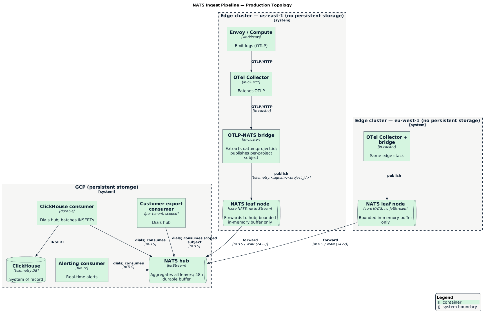
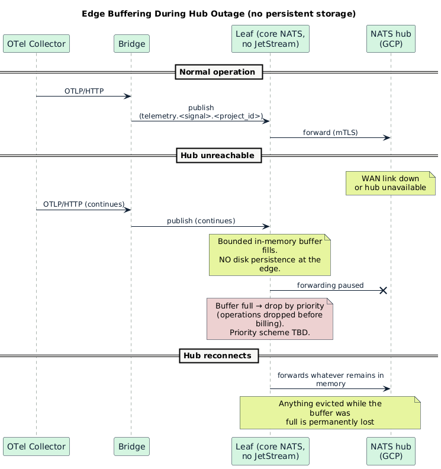
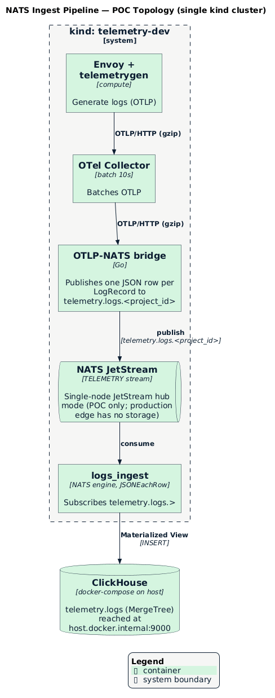

# Telemetry Ingest Pipeline — NATS JetStream

- [Summary](#summary)
- [Motivation](#motivation)
  - [Goals](#goals)
  - [Non-Goals](#non-goals)
- [Design Details](#design-details)
  - [Topology](#topology)
  - [Edge NATS — leaf nodes](#edge-nats--leaf-nodes)
  - [Hub NATS — centralized fan-out](#hub-nats--centralized-fan-out)
  - [Subject structure](#subject-structure)
  - [JetStream stream design](#jetstream-stream-design)
  - [The OTLP-NATS bridge](#the-otlp-nats-bridge)
  - [ClickHouse consumer](#clickhouse-consumer)
  - [Customer export consumer](#customer-export-consumer)
  - [mTLS](#mtls)
  - [POC topology](#poc-topology)
- [Alternatives](#alternatives)

## Summary

NATS JetStream is inserted between the OTel Collector and ClickHouse as the
durable ingest hub. Telemetry from edge clusters flows to a local NATS leaf
node, which forwards to a centralized JetStream hub in GCP. Edge clusters have
no persistent storage, so the leaf is core NATS with a bounded in-memory buffer;
durability begins at the hub. The hub fans out to multiple consumers: a
ClickHouse writer, customer export pipelines, and future real-time alerting —
all reading from the same stream without coupling to each other or to the
storage write path.

## Motivation

The current write path is a direct OTel Collector → ClickHouse INSERT. This is
simple and works at low scale, but has two structural weaknesses:

**Durability.** The OTel Collector has an in-memory queue. If ClickHouse is
slow (compaction, schema migration, maintenance window) or the WAN link between
an edge cluster and GCP is interrupted, the queue fills and logs are dropped.
There is no replay.

**Fan-out.** Adding a second destination (customer export, alerting) requires
the Collector to write to multiple targets simultaneously. Each new consumer
adds direct coupling to the ingest path. A processing failure in one consumer
can stall the pipeline for others.

NATS JetStream addresses both **at the hub**: the stream is the durable record
of what arrived, and consumers are independently positioned within it. ClickHouse
and customer export each advance their own cursor; neither can block the other.
The hub fully covers the ClickHouse-outage and consumer-stall cases. The WAN-outage
case is only partially covered: edge clusters have no persistent storage, so a
prolonged WAN outage is still bounded by the edge's in-memory buffer (see
[Edge NATS](#edge-nats--leaf-nodes)).

This also directly enables the customer export story. Datum's position is that
it is not an observability company — customers who want long-term retention,
custom dashboards, or integration with existing tooling should be able to export
their telemetry. NATS makes that a separate consumer, not a separate write path.

### Goals

- Durable ingest with replay **from the GCP hub onward**: once data reaches the
  hub, JetStream provides a 48h durable buffer that survives transient ClickHouse
  outages and consumer restarts
- Fan-out to multiple consumers (ClickHouse, customer export, alerting) without
  coupling between them
- Per-project subject isolation: consumer ACLs enforce that a customer export
  consumer can only read that project's data
- Tolerate transient WAN outages up to a bounded in-memory buffer at the edge.
  Edge clusters have **no persistent storage**, so durability across a buffer
  overflow or a leaf restart is explicitly not a goal in this phase — see
  [Edge NATS](#edge-nats--leaf-nodes) and the buffer-priority open question
- Leaf-to-hub forwarding over mTLS

### Non-Goals

- Real-time alerting implementation — the pipeline enables it; the alerting
  consumer is a separate concern
- Replacing the OTel Collector — it remains the collection and batching layer
- Long-term retention in NATS — JetStream is a buffer (hours to days), not the
  system of record; ClickHouse remains that
- Custom OTel Collector NATS exporter — a first-class `natsexporter` for
  otelcol-contrib does not yet exist and is tracked in
  [open-telemetry/opentelemetry-collector-contrib#39540](https://github.com/open-telemetry/opentelemetry-collector-contrib/issues/39540).
  Until it lands, a thin bridge service (see [below](#the-otlp-nats-bridge))
  fills the gap and is the intended replacement point.

## Design Details

### Topology



### Edge NATS — leaf nodes

> [!IMPORTANT]
>
> **Edge clusters have no persistent storage.** This rules out running JetStream
> (which requires a file or memory store sized for the workload) at the edge. The
> edge therefore runs **core NATS** leaf nodes — routing only, no on-disk stream.
> Durability begins at the GCP hub, where JetStream and persistent storage exist.

Each edge cluster runs a NATS leaf node that dials the hub and forwards locally
published telemetry to it. The leaf still earns its place even without disk:

**Retry and buffering live in a battle-tested component.** This is the decisive
reason to keep the leaf rather than have the bridge publish to the hub directly.
Reconnection, the in-flight buffer, and forwarding are handled by NATS — a mature,
widely-operated component — instead of being reimplemented in the thin,
purpose-built bridge. The bridge stays simple: publish to localhost and move on.

**It dials out.** Leaf nodes initiate an outbound TCP connection to the hub on
port 7422. Edge clusters need no inbound firewall rules and work behind NAT and
on cellular or variable-quality networks.

**It decouples the bridge from the WAN.** The bridge publishes to the local leaf
and is never blocked on hub round-trips; the leaf owns reconnection and
forwarding to the hub.

**Buffering is in-memory and bounded.** When the leaf-to-hub link drops, the
leaf can only hold messages in a bounded in-memory buffer (RAM on the edge node).
The bridge and Collector keep running and keep publishing, but once the buffer is
full, messages must be dropped — there is no disk to spill to, and nothing
survives a leaf restart. This is a deliberate trade against the no-storage
constraint, not a durable store-and-forward guarantee. The buffer sizing
(memory budget, NATS pending limits) is TBD and must be set against measured edge
throughput.

> [!WARNING]
>
> **Open question — buffer priority.** When the in-memory buffer fills during a
> hub outage, not all telemetry is equally valuable: billing-relevant data
> matters more than operational logs and metrics. We need to investigate a
> prioritization scheme so that lower-value operations telemetry is dropped (or
> sampled) before billing-relevant data, rather than dropping indiscriminately.
> Whether core NATS can express this (e.g. via separate subjects/connections with
> different buffer budgets) or whether it needs to be enforced upstream in the
> bridge is TBD.



### Hub NATS — centralized fan-out

The hub cluster (GCP) is where all consumer logic lives. Its responsibilities:

- **Aggregate** telemetry forwarded from all regional leaf nodes into a single
  hub JetStream stream (the leaves forward over core NATS; the hub stream
  captures by subject)
- **Fan out** to independently positioned consumers (ClickHouse writer,
  customer export, future alerting)
- **Enforce per-project ACLs** — customer export consumers are authorized to
  subscribe only to the project-scoped subject for each signal type,
  `telemetry.<signal>.<their_project_id>` (e.g. `telemetry.logs.acme-prod`,
  `telemetry.metrics.acme-prod`)

Separating the hub from the edge keeps consumer complexity out of edge clusters,
which are intentionally lightweight. Adding a new consumer (e.g., a streaming
alerts service) requires no changes at the edge.

### Subject structure

All log records are published to a per-project subject:

```
telemetry.logs.<project_id>
```

The bridge extracts `datum.project.id` from the OTLP resource attributes of
each `ResourceLogs` entry and routes to the corresponding subject. A single
OTLP batch may contain records from multiple projects; the bridge splits by
project before publishing. Org ID is not used for routing — it is materialized
at query time from Milo.

Future signal types follow the same pattern:

```
telemetry.metrics.<project_id>     (Phase 2)
telemetry.network.<device_id>      (Phase 3)
```

### JetStream stream design

JetStream runs **only at the hub**, where persistent storage exists. The edge
has no JetStream stream — its leaf is core NATS, forwarding to the hub with a
bounded in-memory buffer (see [Edge NATS](#edge-nats--leaf-nodes)).

**Hub — aggregate stream**

| Property | Value |
|---|---|
| Name | `TELEMETRY` |
| Subjects | `telemetry.>` |
| Storage | File |
| Retention | Limits: 48h max age, 100 GiB max size |
| Sources | Telemetry forwarded from each edge leaf |
| Purpose | Durable buffer and fan-out point for consumers |

The stream uses `telemetry.>` to capture all signal types under the
`telemetry.*` hierarchy. Phase 1 publishes only `telemetry.logs.*`; Phase 2
adds `telemetry.metrics.*`; Phase 3 adds `telemetry.network.*`. The stream
config does not need to change as new signal types are introduced.

48 hours of retention at the hub gives time to recover from a ClickHouse outage
without data loss. It is not the system of record; ClickHouse is.

**Consumers (Phase 1 — logs)**

All consumers on the hub stream are durable, with explicit ack policy. A
consumer that fails to ack causes redelivery, not a pipeline stall for others.

| Consumer | Subject filter | Ack | Notes |
|---|---|---|---|
| `clickhouse-logs-writer` | `telemetry.logs.>` | After successful INSERT | Batches records for throughput |
| `export-<project_id>` | `telemetry.logs.<project_id>` | After confirmed delivery to sink | One per customer export destination |

**Consumers (Phase 2 — metrics)**

| Consumer | Subject filter | Ack | Notes |
|---|---|---|---|
| `clickhouse-metrics-writer` | `telemetry.metrics.>` | After successful INSERT | Batches data points for throughput |
| metrics export consumer | `telemetry.metrics.<project_id>` | TBD | Design TBD — ExportPolicy currently exports metrics via MetricsQL pull, not NATS push; Phase 2 may not need a per-tenant metrics export consumer |

**Consumers (Phase 3 — network)**

| Consumer | Subject filter | Ack | Notes |
|---|---|---|---|
| `clickhouse-network-writer` | `telemetry.network.>` | After successful INSERT | gNMIc event format; one consumer for all devices |

Each signal type gets its own ClickHouse writer consumer with its own cursor,
allowing independent replay and backpressure.

### The OTLP-NATS bridge

The bridge is a small service (single binary) that lives on each edge cluster
alongside the OTel Collector and NATS leaf node.

**What it does:**

1. Listens on OTLP/HTTP. Phase 1 handles `/v1/logs`; `/v1/metrics` is added in
   Phase 2 when the metrics pipeline lands.
2. Parses the OTLP protobuf payload
3. For each `ResourceLogs` (Phase 1) or `ResourceMetrics` (Phase 2) entry,
   extracts `datum.project.id` from the resource attributes. The project applies
   to every child record under that resource.
4. If `datum.project.id` is missing: increments
   `bridge_log_records_dropped_total{reason="missing_project_id"}` (logs) or
   `bridge_metric_datapoints_dropped_total{reason="missing_project_id"}` (metrics, Phase 2),
   counting each child record under the resource, excludes those records from the
   NATS publish, and reports them in the OTLP partial success response. The
   Collector receives HTTP 200 and does not retry — dropped records are gone.
5. Publishes (as `JSONEachRow`) to the local NATS leaf, with `ProjectId` as a
   top-level field for ClickHouse NATS engine ingestion:
   - Phase 1: one JSON message per `LogRecord` to `telemetry.logs.<project_id>`
   - Phase 2: one JSON message per metric data point to
     `telemetry.metrics.<project_id>`
6. Returns HTTP 200 with a partial success body if any records were dropped;
   HTTP 200 with an empty success body if all records were routed

The OTel Collector's `otlphttp` exporter points at the bridge endpoint. No
custom Collector build or feature gate is required.

The bridge is the intended replacement point for a future `natsexporter` in
otelcol-contrib. When that lands, the Collector config changes an endpoint and
the bridge is removed.

**What it does not do:**

- It does not buffer, aggregate, or transform records
- It does not validate project_id against a registry
- It does not authenticate the Collector (in-cluster — Collector identity is
  enforced by Kubernetes network policy)

### ClickHouse consumer

ClickHouse has a native NATS table engine (`ENGINE = NATS`) that subscribes to
NATS subjects and ingests messages directly — no separate consumer service
required. `telemetry.logs_ingest` uses this engine to subscribe to
`telemetry.logs.>` and read messages as `JSONEachRow`. A Materialized View
extracts `ProjectId` and routes rows into `telemetry.logs`.

Because the bridge publishes `ProjectId` as a top-level field in the JSON payload
(not inside `ResourceAttributes`), the MV reads it as a plain string column.
The three attribute columns (`ResourceAttributes`, `ScopeAttributes`,
`LogAttributes`) are stored as `String` in the ingest table — the NATS engine
does not support the `JSON` column type — and cast to `JSON` in the MV.

Loading a nested JSON object from the message into a `String` column via
`JSONEachRow` depends on a ClickHouse input-format setting that serializes the
nested object back to a string (rather than erroring) — likely
`input_format_json_read_objects_as_strings`, but the exact setting the POC
relied on must be recorded from the POC config and verified before staging, as
this behavior is version-sensitive.

**JetStream durability caveat.** Binding the NATS engine to a JetStream durable
consumer requires the `nats_stream` and `nats_consumer_name` settings. Without
them the engine uses a core NATS subscription — messages published while
ClickHouse is down are not replayed. The POC runs ClickHouse
(`clickhouse/clickhouse-server:26.5.1-alpine`) but these settings were never
enabled or tested.

> [!WARNING]
>
> **Must verify before staging.** The `nats_stream` and `nats_consumer_name`
> setting names and the minimum ClickHouse version that supports them must be
> confirmed against the ClickHouse NATS engine documentation before the staging
> deployment. See the [ClickHouse NATS engine reference](https://clickhouse.com/docs/en/engines/table-engines/integrations/nats).
>
> If these settings do not exist as described, the fallback is a separate
> consumer service (a small Go binary) that reads from the JetStream durable
> consumer and bulk-inserts into ClickHouse via the HTTP interface. This adds
> one component but restores the durability guarantee without changing the
> bridge, NATS topology, or ClickHouse schema. It should be treated as the
> backup plan, not a surprise.

### Customer export consumer

Each export destination is a separate durable consumer scoped to
`telemetry.logs.<project_id>`. The consumer reads batches and forwards to the
customer's sink (S3 bucket, Datadog ingest endpoint, etc.). Credentials for
external sinks are the consumer's concern, not the hub's.

NATS authorization ensures that a consumer authorized for
`telemetry.logs.acme-prod` cannot subscribe to `telemetry.logs.other-project`.
This is enforced at the NATS account layer, not in application code.

Customer export is a follow-on. The pipeline design here accommodates it without
requiring it at launch.

### mTLS

All inter-cluster NATS connections use mTLS. In-cluster connections (Collector
→ bridge, bridge → leaf, consumers → hub) use mTLS as defense-in-depth.
Certificates are managed by cert-manager.

| Hop | Auth | Notes |
|---|---|---|
| OTel Collector → bridge | None (in-cluster network policy) | Bridge is not externally reachable |
| Bridge → NATS leaf | mTLS | cert-manager issues leaf client cert |
| NATS leaf → NATS hub | **mTLS required** | Leaf `tls` block: `cert_file`, `key_file`, `ca_file`. Hub verifies leaf identity. |
| ClickHouse consumer → Hub | mTLS | Consumer dials hub; presents client cert |
| Export consumer → Hub | mTLS | Consumer dials hub; per-consumer cert scoped to tenant subject |

Leaf-to-hub mTLS is configured in the NATS leaf server config:

```conf
leafnodes {
  remotes [
    {
      url: "tls://nats-hub.telemetry.datum.net:7422"
      tls {
        cert_file: "/certs/leaf-client.crt"
        key_file:  "/certs/leaf-client.key"
        ca_file:   "/certs/ca.crt"
      }
    }
  ]
}
```

### POC topology

The POC ran in two stages. The initial setup ran all components co-located in a
single kind cluster (`telemetry-dev`); the diagram below reflects that layout. A
second iteration extended to a two-cluster setup (hub + edge kind clusters) to
exercise leaf-to-hub forwarding. The POC ran JetStream at the edge for
convenience; production edge clusters have no persistent storage and run core
NATS instead (see [Edge NATS](#edge-nats--leaf-nodes)). NATS runs as a single
node in JetStream hub mode. ClickHouse runs in docker-compose on the host and is
reached from the cluster at `host.docker.internal:9000`.



**Validated:**
- Per-project subject routing (both `gateway-tenant-001` and `compute-tenant-001` as project_id values in the POC)
- gzip body decoding in the bridge
- One JSON message per LogRecord with `ProjectId` as a top-level field
- ClickHouse NATS engine (`ENGINE = NATS`) consuming from `telemetry.logs.>` with `JSONEachRow`
- Materialized View casting `String`→`JSON` for attribute columns
- Row policy enforcement on a per-project reader user
- No separate consumer service — ClickHouse reads from NATS directly

**Known limitations in the POC (`clickhouse/clickhouse-server:26.5.1-alpine`):**
- JetStream durable consumer binding (`nats_stream` / `nats_consumer_name`) was
  not enabled or tested. The engine uses a core NATS subscription; messages
  published while ClickHouse is unavailable are not replayed. These settings
  must be verified against the ClickHouse NATS engine docs before staging —
  see the warning in the [ClickHouse consumer](#clickhouse-consumer) section.
- `JSON` column type is not supported in NATS engine tables. Attribute columns
  are stored as `String` and cast to `JSON` in the MV.

**Not yet validated:** mTLS, leaf-to-hub WAN forwarding over core NATS, the
bounded in-memory edge buffer (sizing and overflow behavior), file-backed
JetStream storage at the hub, customer export consumer, JetStream durable
consumer binding. These are deferred to an integration environment with a real
leaf→hub topology.

## Production Readiness

The POC validates the core design. The following items are required before
the pipeline can carry production traffic.

### What remains

**Hub and edge staging/production overlays (#2 — NATS ingest pipeline staging and production deployment)**

The POC uses dev overlays with plaintext passwords and `NodePort` services.
Production overlays must:
- Reference ExternalSecrets for ClickHouse and NATS credentials
- Patch services to `LoadBalancer` type with stable external IPs
- Use the production GCS cold-storage bucket name in the CHI storage policy

**mTLS for leaf-to-hub connections (#3 — NATS mTLS cert-manager integration)**

All leaf-to-hub NATS connections must use mTLS. The leaf node config needs
cert-manager `Certificate` resources that issue:
- A CA cert for the hub cluster, trusted by all leaves
- A per-leaf client certificate for the hub to verify leaf identity

Hub NATS config must require TLS on the leafnode listener port (7422):

```conf
leafnodes {
  port: 7422
  tls {
    cert_file: "/certs/hub-server.crt"
    key_file:  "/certs/hub-server.key"
    ca_file:   "/certs/ca.crt"
    verify: true  # require and verify leaf client cert
  }
}
```

**JetStream durable consumers for ClickHouse**

The POC runs ClickHouse (`clickhouse/clickhouse-server:26.5.1-alpine`) but
`nats_stream` and `nats_consumer_name` were never enabled or tested. Verify
these settings work against the ClickHouse NATS
engine docs before staging — see the WARNING in the
[ClickHouse consumer](#clickhouse-consumer) section. If they are confirmed,
enable them in the staging and production NATS engine table definition to bind
to a JetStream durable consumer and ensure messages published during a
ClickHouse outage are replayed on restart.

**Edge staging/production overlays (#2 — NATS ingest pipeline staging and production deployment)**

Edge overlays need the real hub NATS endpoint (not `host.docker.internal`) and
the production bridge image from the container registry.

**OTel Collector config changes (#6 — OTLP-NATS bridge implementation and deployment)**

The OTel Collector gateway config is part of the `milo-os/telemetry` codebase
— the edge-logs-system Collector in `datum-cloud/infra` is deprecated in favour
of what we're building. Required changes for the new Collector config:

- **Switch exporter**: replace the existing ClickHouse exporter with
  `otlphttp` pointing at the bridge (`http://otlp-nats-bridge.telemetry.svc:4318`)
- **Add resource processor**: configure the `k8sattributes` processor to
  derive `datum.project.id` from the namespace label
  `meta.datumapis.com/upstream-cluster-name` (strip `cluster-` prefix), and
  inject `datum.project.id = 'datum-internal'` for platform namespaces

Without these changes the bridge receives records with no `datum.project.id`
and drops everything.

**Query layer API user (#4 — query layer service initial implementation)**

Create the `api_reader` ClickHouse user with the tenant row policy. The current
schema has the user and policy defined as a placeholder in `schema.sql`; it
must be wired to the query layer service's connection credentials.

---

## Open Questions

### JetStream consumer fan-out at high project cardinality

The `TELEMETRY` hub stream captures `telemetry.logs.>` across all projects.
The ClickHouse writer is one consumer on `telemetry.logs.>`. ExportPolicy
export destinations are durable consumers filtered to
`telemetry.logs.<project_id>` — one per customer export destination.

JetStream filtered consumers are routed server-side by subject index: the
server does not scan the full stream for each consumer on every message. A
filtered consumer on `telemetry.logs.acme-prod` receives only messages
published to that subject; the routing is O(1) at the server. This is
materially different from a naive sequential scan and means per-message
overhead does not grow with consumer count.

The real cost is per-consumer state: each durable consumer holds a cursor,
an ack-pending set, and associated goroutines on the NATS server. At low
ExportPolicy counts (tens to hundreds) this is negligible. At thousands of
active ExportPolicy consumers on a single stream, the aggregate memory and
CPU overhead is unknown and must be benchmarked before assuming the current
design scales to that point.

Note that consumer count is bounded by ExportPolicy usage, not project count.
A project with no ExportPolicy configured creates no consumer. Early
deployments (Compute private alpha) are unlikely to stress this limit; it
becomes relevant as ExportPolicy adoption grows.

**Mitigations to evaluate if benchmarking shows a limit:**

- **Per-project streams**: create a dedicated JetStream stream per project
  (`TELEMETRY-<project_id>`) sourced from the hub. ExportPolicy consumers
  attach to the project stream directly with no filtering overhead. Trades
  consumer-count overhead for stream-count overhead; NATS supports large
  numbers of streams but adds management complexity.
- **Stream sharding**: shard the hub stream into N streams by
  `project_id` hash (e.g., 16 shards). Each shard has a proportionally
  smaller consumer set, capping per-shard consumer count without per-project
  streams.

**What needs to be validated before ExportPolicy scales:**

- Maximum durable consumer count on the hub stream at production message
  rates without degrading ClickHouse writer throughput or delivery latency
- Memory and CPU overhead per consumer at idle vs. active delivery
- Whether the NATS server's per-account consumer limit needs tuning

## Alternatives

**No NATS — OTel Collector writes directly to ClickHouse.** The current state.
Sufficient for early operation but provides no replay on ClickHouse outage, no
fan-out without Collector-level dual-write, and in-memory-only buffering against
WAN outages at the edge. Retained as the starting point; this enhancement is the
planned follow-on.

**Edge JetStream — file-backed local stream at the edge.** The original intent
of this design: run a file-backed JetStream stream on each edge leaf so that a
prolonged WAN outage is buffered durably on local disk and replayed on
reconnect. **Rejected because edge clusters have no persistent storage.** Without
a disk to spill to, JetStream's file store is not an option and its memory store
offers no durability advantage over plain core NATS. This is the constraint that
forced the core-NATS-only design below; revisit if persistent storage becomes
available at the edge.

**Core NATS leaf, no edge JetStream — the chosen design.** The edge leaf
forwards to the hub over core NATS with a bounded in-memory buffer. It provides
no durability across a buffer overflow or a leaf restart. Chosen because, with
edge durability off the table either way, the leaf keeps reconnection and
in-flight buffering inside a mature, widely-operated component (NATS) rather than
in the thin, from-scratch bridge, and gives a single point at which to enforce
[buffer prioritization](#edge-nats--leaf-nodes). Durability begins at the hub.

**Bridge publishes to the hub directly — no edge NATS.** The bridge becomes a
JetStream client and publishes straight to the hub stream over the WAN (with
PubAck), dropping the edge leaf entirely. Simpler topology (one fewer edge
component) and preserves the end-to-end durability signal. Rejected for now
because it pushes reconnection, in-flight buffering, and prioritized-drop logic
into the bridge — a thin, purpose-built service — rather than relying on NATS for
it. Revisit if per-edge NATS proves too costly relative to that benefit, or if
the bridge needs acknowledged publishing for other reasons.

**Kafka.** Stronger ordering guarantees, larger ecosystem, more operational
tooling. Rejected at this stage: Kafka clusters are significantly heavier to
operate than NATS, particularly at the edge where a full Kafka broker is
impractical. NATS leaf nodes are designed for exactly this edge-to-hub topology.
Revisit if NATS proves insufficient at scale.
